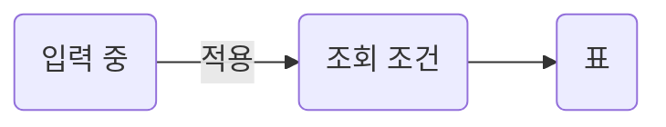

```mermaid
flowchart LR
    draft("입력 중") -->|적용| applied("조회 조건") --> table("표")
```

```mermaid
treeView-beta
page/orders/
├── pg-orders.tsx
├── _pg-condition-panel.tsx
└── _pg-orders-table.tsx
```

- `pg-orders.tsx` 화면. 조건과 표를 조립
- `_pg-orders-table.tsx` 표. ★ 이번에 바뀜
