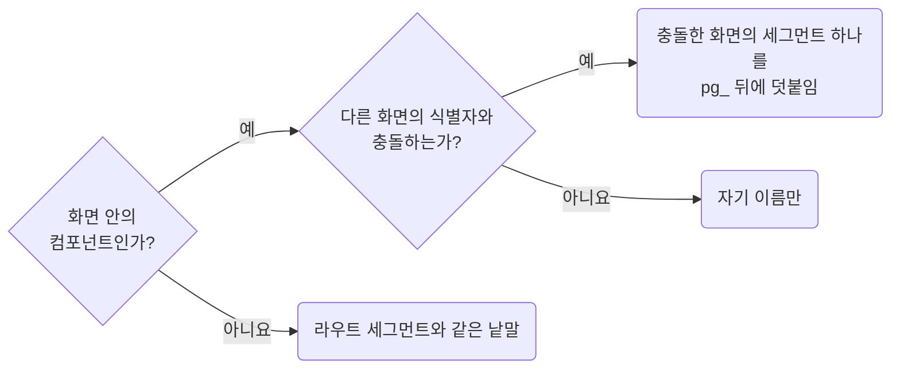
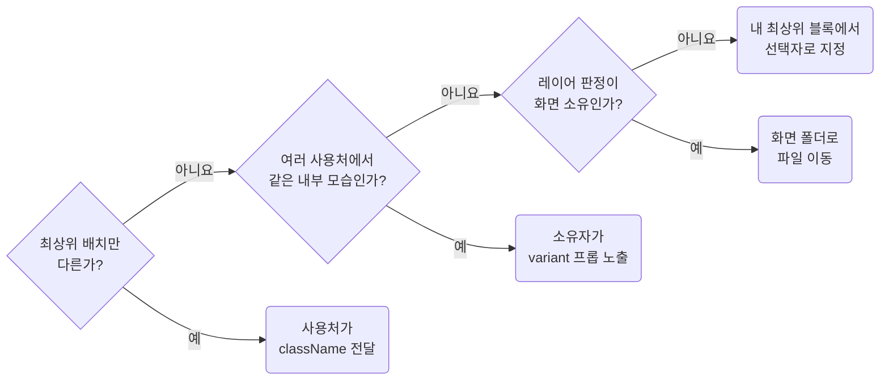
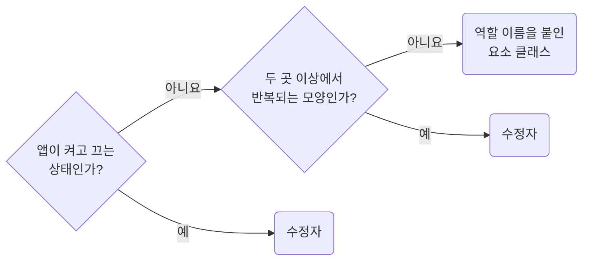
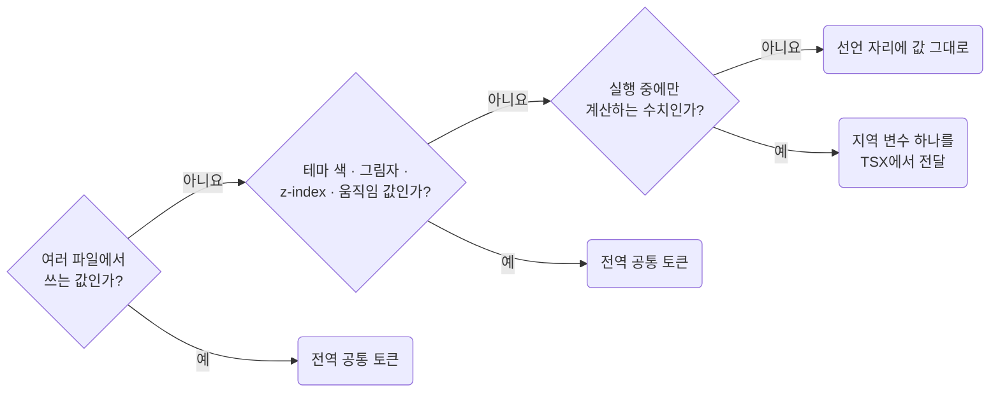
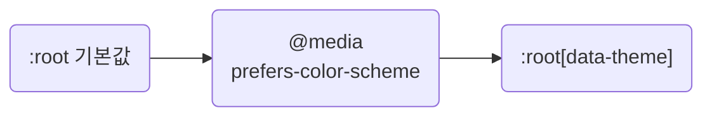
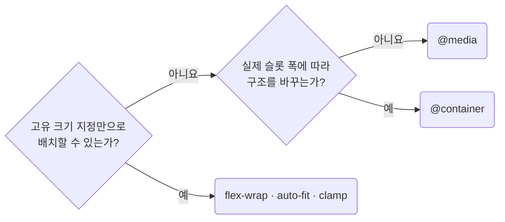

# CSS 컨벤션

- 버전: 1.0.0
- 조직: Agent Conventions
- 날짜: 2026년 4월

> **생성된 문서입니다. 직접 수정하지 마세요.**
>
> 현재 skill의 `rules/*.md`, `metadata.json`, `metadata.json.companions`를 수정한 뒤 `npm --prefix ../../package run build -- --skill=css`로 다시 생성하세요.

---

## 개요

에이전트 협업 팀을 위한 CSS 코딩 컨벤션입니다. plain CSS를 기본으로 한 전역 고유 네이밍, `pg_/wg_/ui_` 소유 범위, 예측 가능한 TSX 클래스 조합, 평평한 선택자, 남의 클래스는 자기 root 아래에서만 겨냥하는 경계, 토큰화된 값, 눈에 보이는 포커스 표시, stylelint 설정을 강조합니다. TSX의 클래스 계약을 함께 바꿀 때는 React와 TypeScript 규칙도 함께 봅니다. `rules/` 아래 rule 파일이 source of truth입니다.

이 문서에는 CSS 컨벤션 규칙만 담겨 있습니다. 아래 규칙도 함께 따릅니다.

---

## 함께 따르는 규칙

- [TypeScript Convention](../typescript/HANDBOOK.md) — 다음 조건에서 함께 적용합니다. TS/TSX 클래스 계약, 래퍼 Props 또는 style import를 함께 변경한다.

---

## 목차

1. [Class Naming and Syntax](#1-class-naming-and-syntax) — **MEDIUM**
    - 1.1 [Default to Plain CSS Unless the Project Explicitly Standardizes on CSS Modules](#11-default-to-plain-css-unless-the-project-explicitly-standardizes-on-css-modules)
    - 1.2 [Use Scope, Slug, Element, and Modifier Syntax](#12-use-scope-slug-element-and-modifier-syntax)
    - 1.3 [Name Elements and Modifiers by Role](#13-name-elements-and-modifiers-by-role)
    - 1.4 [Keep Page Slugs Traceable to Their Screen](#14-keep-page-slugs-traceable-to-their-screen)
2. [Ownership and Boundaries](#2-ownership-and-boundaries) — **CRITICAL**
    - 2.1 [Give Each CSS File Its Own `scope_slug`](#21-give-each-css-file-its-own-scope-slug)
    - 2.2 [Choose the Scope Prefix by Owner Layer](#22-choose-the-scope-prefix-by-owner-layer)
    - 2.3 [Use Foreign Classes Only Under Your Own Root](#23-use-foreign-classes-only-under-your-own-root)
    - 2.4 [Change Other Owners Through Their API](#24-change-other-owners-through-their-api)
3. [Class Composition in TSX](#3-class-composition-in-tsx) — **HIGH**
    - 3.1 [Compose Classes With `clsx()`](#31-compose-classes-with-clsx)
    - 3.2 [Do Not Build Structural Variants With Modifiers](#32-do-not-build-structural-variants-with-modifiers)
    - 3.3 [Keep Classes Single-purpose](#33-keep-classes-single-purpose)
    - 3.4 [Inject Classes Only at the Component Entry Point](#34-inject-classes-only-at-the-component-entry-point)
    - 3.5 [Do Not Add Wrapper Elements for Styling](#35-do-not-add-wrapper-elements-for-styling)
    - 3.6 [Do Not Style Through the `style` Attribute](#36-do-not-style-through-the-style-attribute)
    - 3.7 [Write Modifiers as Conditions Instead of Assembling Class Names](#37-write-modifiers-as-conditions-instead-of-assembling-class-names)
4. [Selectors and Declaration Placement](#4-selectors-and-declaration-placement) — **HIGH**
    - 4.1 [Limit Nesting to One Level and Write the Rest Inline](#41-limit-nesting-to-one-level-and-write-the-rest-inline)
    - 4.2 [Use Classes Instead of Element Selectors](#42-use-classes-instead-of-element-selectors)
    - 4.3 [Do Not Group Classes With Commas to Share Declarations](#43-do-not-group-classes-with-commas-to-share-declarations)
    - 4.4 [Declare Each Class in One Block](#44-declare-each-class-in-one-block)
    - 4.5 [Use Pseudo-classes for DOM-owned States](#45-use-pseudo-classes-for-dom-owned-states)
    - 4.6 [Nest DOM State Pseudo-classes in the Owning Block](#46-nest-dom-state-pseudo-classes-in-the-owning-block)
    - 4.7 [Do Not Negate With `:not()`](#47-do-not-negate-with-not)
5. [Design Tokens](#5-design-tokens) — **HIGH**
    - 5.1 [Declare Core Tokens Once and Fall Back Everywhere Else](#51-declare-core-tokens-once-and-fall-back-everywhere-else)
    - 5.2 [Use Global Tokens and Do Not Create Local Ones](#52-use-global-tokens-and-do-not-create-local-ones)
    - 5.3 [Declare Stacking Layers as Tokens in One Place](#53-declare-stacking-layers-as-tokens-in-one-place)
    - 5.4 [Switch Themes by Changing Token Values](#54-switch-themes-by-changing-token-values)
    - 5.5 [Name Tokens by Purpose, Not by Value](#55-name-tokens-by-purpose-not-by-value)
6. [Layout and Responsiveness](#6-layout-and-responsiveness) — **MEDIUM**
    - 6.1 [Group Breakpoints at the Bottom of the File](#61-group-breakpoints-at-the-bottom-of-the-file)
    - 6.2 [Write Breakpoints Desktop First](#62-write-breakpoints-desktop-first)
    - 6.3 [Keep Layout Intent Explicit](#63-keep-layout-intent-explicit)
    - 6.4 [Reach for Intrinsic Sizing Before Breakpoints](#64-reach-for-intrinsic-sizing-before-breakpoints)
7. [Accessibility and Motion](#7-accessibility-and-motion) — **CRITICAL**
    - 7.1 [Always Provide a Visible Focus Indicator](#71-always-provide-a-visible-focus-indicator)
    - 7.2 [Namespace Keyframes and Respect Reduced Motion](#72-namespace-keyframes-and-respect-reduced-motion)
8. [Tooling](#8-tooling) — **MEDIUM**
    - 8.1 [Configure Stylelint to Enforce These Rules](#81-configure-stylelint-to-enforce-these-rules)

---

## 1. Class Naming and Syntax

**Impact: MEDIUM**

일반 `*.css`를 사용하고 전역에서 고유한 클래스명을 붙입니다. 클래스 이름은 소유자와 역할을 드러내고, 요소와 수정자는 정해진 문법으로 구분합니다.

### 1.1 Default to Plain CSS Unless the Project Explicitly Standardizes on CSS Modules

**Rule:** `C01-01` · `naming-default-to-plain-css-when-no-module-convention`

**Applies when:** 표준이 정해지지 않은 상태에서 스타일시트 방식\(일반 CSS, CSS Modules\)을 고르거나 `.module.css`나 `styles.*`로 옮길 때. 제외: 기존 일반 CSS 클래스 이름만 바꾸는 경우.

**Impact: MEDIUM (클래스명이 전역에서 고유해야 범위_식별자로 소유자를 되짚을 수 있습니다)**

이 스킬은 일반 `*.css`와 전역에서 고유한 클래스명을 기본으로 합니다.
클래스 문법, 소유 경계, 선택자 규칙은 모두 이 전제를 따르며 `pg_*`, `wg_*`, `ui_*`로 소유자를 구분합니다.

별도 합의가 없으면 일반 CSS를 씁니다.
`.module.css`를 새로 만들거나 클래스를 `styles.foo`처럼 객체 속성으로 참조하지 않습니다.
CSS Modules가 공식 표준이고 별도의 이름 규칙과 실행 규칙이 있으면 그 프로젝트 규칙을 따릅니다.

**Incorrect 1 (프로젝트 표준이 없는데도 CSS Modules를 기본처럼 씁니다):**

```tsx
import styles from "./products.module.css";

<section className={styles.hero}>
	<span className={styles.eyebrow}>Products</span>
</section>
```

```css
.hero {
	display: grid;
}

.eyebrow {
	letter-spacing: 0.08em;
}
```

**Correct 1 (기본으로 일반 CSS와 전역 고유 클래스 이름을 씁니다):**

```tsx
import {clsx} from "clsx";
import "./pg-products.css";

<section className={clsx("pg_products__hero")}>
	<span className={clsx("pg_products__eyebrow")}>Products</span>
</section>
```

```css
.pg_products__hero {
	display: grid;
}

.pg_products__eyebrow {
	letter-spacing: 0.08em;
}
```

### 1.2 Use Scope, Slug, Element, and Modifier Syntax

**Rule:** `C01-02` · `naming-use-scope-slug-element-modifier-syntax`

**Applies when:** 일반 CSS에서 프로젝트가 소유한 클래스를 새로 만들 때. 이름, 범위, 식별자, 요소, 수정자의 구분자나 대소문자 표기를 바꿀 때.

**Impact: HIGH (클래스명에서 소유자와 역할을 확인할 수 있습니다)**

클래스명은 `<scope>_<slug>__<element>[--<modifier>]` 문법을 씁니다.
구분자 `_`, `__`, `--`를 고정하고 각 자리의 역할을 구분합니다.
다른 규칙에서도 아래 한국어 이름을 씁니다.

| 자리 | 읽는 이름 | 담는 것 |
| --- | --- | --- |
| `scope` | 범위 | `pg`, `wg`, `ui` 중 하나. 소문자로 씁니다 |
| `slug` | 식별자 | CSS 파일 소유자의 이름. camelCase로 씁니다 |
| `element` | 요소 | 소유자 안의 UI 역할. `listButton`, `emptyState`처럼 camelCase로 씁니다 |
| `modifier` | 수정자 | 클래스 뒤에 `--`로 붙는 이름. camelCase로 씁니다 |

수정자의 허용 범위는 `composition-do-not-build-structural-variants-with-modifiers`가 정합니다.
수정자는 클래스의 `--이름`이고, 변형은 컴포넌트가 받는 `variant` 프롭입니다.
식별자에는 접두사가 이미 드러낸 낱말을 반복하지 않습니다.
`UiButton`은 `ui_button`으로 쓰고 `ui_uiButton`으로 쓰지 않습니다.
기계 검증은 이 문법을 정규식으로 등록한 `selector-class-pattern`이 담당합니다.

**Incorrect 1 (식별자, 요소, 수정자에 snake_case와 kebab-case가 섞입니다):**

```txt
ui_uiButton__root
ui_tag_list__root
ui_tagList__list-item
wg_site_header__root
wg_siteHeader__brand-link
pg_product_detail__root
pg_productDetail__main-content
pg_productDetail__main--route_active
```

**Correct 1 (범위는 소문자로 쓰고 식별자, 요소, 수정자는 camelCase로 씁니다):**

```txt
ui_tagList__root
ui_tagList__listItem
wg_siteHeader__root
wg_siteHeader__brandLink
pg_productDetail__root
pg_productDetail__mainContent
pg_productDetail__main--routeActive
```

### 1.3 Name Elements and Modifiers by Role

**Rule:** `C01-03` · `naming-name-elements-and-modifiers-by-role`

**Applies when:** 요소나 수정자 클래스 이름을 새로 지을 때. `container`, `wrapper`, `box`, 치수나 간격 중심 이름을 변경할 때.

**Impact: MEDIUM (구조나 치수 대신 역할을 이름에 담아 UI의 어느 부분인지 구분합니다)**

요소와 수정자는 구조나 치수 대신 UI 역할로 이름을 짓습니다.
요소는 무엇을 하는 자리인지, 수정자는 어떤 상태인지 드러내야 합니다.
`container`, `wrapper`, `box`는 합성어로도 쓰지 않고 `gap12`처럼 숫자에 뜻을 담지 않습니다.

수정자를 붙일 수 있는지는 `composition-do-not-build-structural-variants-with-modifiers` 규칙이 정합니다.
이 규칙은 붙이기로 한 이름이 역할을 드러내는지 판단합니다.

**Incorrect 1 (역할 대신 구조나 치수로 이름을 짓습니다):**

```txt
ui_card__wrapper
ui_card__box
ui_card__body--gap12
```

**Correct 1 (역할과 상태를 기준으로 이름을 붙입니다):**

```txt
ui_card__toolbar
ui_card__body
ui_card__body--dense
```

### 1.4 Keep Page Slugs Traceable to Their Screen

**Rule:** `C01-04` · `naming-keep-page-slug-traceable`

**Applies when:** `pg_*` 소유자의 클래스 식별자를 새로 만들거나 이름을 바꿀 때. 같은 이름 컴포넌트가 여러 화면에 생겨 식별자를 구분해야 할 때.

**Impact: MEDIUM (클래스명에서 해당 화면을 추적할 수 있습니다)**

`pg_*` 식별자에는 어느 화면인지 추적할 수 있는 이름을 씁니다.
화면 소유 여부는 활성화된 프레임워크 규약이 판단하고 CSS는 그 이름을 따릅니다.

식별자를 고르는 차례입니다.



| 대상 | 식별자 |
| --- | --- |
| 라우트 진입 파일 | 라우트 세그먼트나 폴더 이름과 같은 낱말. 어느 화면에나 붙는 `shell`, `page`, `content`는 쓰지 않습니다 |
| `[id]`처럼 값이 런타임에 정해지는 동적 세그먼트 | 화면의 역할로 바꿉니다. `orders/[id]`라면 `[id]`를 `detail`로 바꿔 `pg_ordersDetail`로 씁니다 |
| 화면 안의 컴포넌트 | 자기 이름만 씁니다 |

라우트 경로나 폴더 이름에 없는 줄임말은 쓰지 않습니다.
`pg_prd__root` 대신 `pg_products__root`로 씁니다.
부모 식별자는 실제 충돌이 생겼을 때만 최소한으로 덧붙입니다.
덧붙이는 낱말은 충돌한 화면의 라우트 세그먼트 하나이고 `pg_` 바로 뒤에 둡니다.
중간 컴포넌트 이름은 넣지 않습니다.
미리 붙이면 폴더가 깊어질수록 이름도 길어집니다.

**Incorrect 1 (화면 이름이 아닌 식별자를 씁니다):**

```txt
pg_shell__body    <- 역할 낱말이라 어느 화면인지 안 나옴
pg_doc__content   <- 라우트에 없는 줄임말
pg_x__root        <- 되짚을 이름이 없음
```

**Correct 1 (뼈대에는 라우트 세그먼트를 그대로 씁니다):**

```txt
pg_ordersIndex__root    <- orders index 화면
pg_ordersDetail__body   <- orders/[id] 화면
pg_document__body      <- document 화면
```

**Incorrect 2 (충돌이 없는데도 부모 식별자를 미리 붙입니다):**

```txt
pg_detailProductTableOverviewSection__root
pg_detailProductTableSummaryBand__root
```

**Correct 2 (화면 안의 컴포넌트는 자기 식별자만 씁니다):**

```txt
pg_overviewSection__root
pg_summaryBand__root
```

**Incorrect 3 (충돌을 피하려고 상위 경로 전체를 식별자에 붙입니다):**

```txt
pg_detailProductTableOverviewSection__root
pg_indexProductTableOverviewSection__root
```

**Correct 3 (충돌한 화면 이름만 최소로 덧붙입니다):**

```txt
pg_detailOverviewSection__root
pg_indexOverviewSection__root
```

## 2. Ownership and Boundaries

**Impact: CRITICAL**

CSS 파일마다 소유자를 정하고, 다른 소유자의 스타일을 사용할 때 지킬 범위를 명시합니다. 외부 라이브러리 DOM은 소유한 루트 아래에서만 선택해 다른 화면에 영향을 주지 않습니다.

### 2.1 Give Each CSS File Its Own `scope_slug`

**Rule:** `C02-01` · `ownership-give-each-file-one-scope-slug`

**Applies when:** 새 식별자를 만들거나 기존 식별자를 복사 · 이름 변경할 때. 부품에 CSS 파일을 새로 만들면서 부모 식별자를 그대로 쓸 때.

**Impact: CRITICAL (파일마다 네임스페이스를 구분해 전역 클래스 충돌을 막습니다)**

CSS 파일마다 고유한 범위_식별자를 하나씩 씁니다. 같은 범위_식별자를 여러 파일에서 나누어 쓰지 않습니다.

| 상황 | 처리 |
| --- | --- |
| 새 스타일을 추가함 | 같은 범위_식별자를 쓰는 파일이 있는지 먼저 확인합니다 |
| 의미가 같아도 CSS 파일이 다름 | 식별자를 따로 만듭니다. 부품끼리 부모 식별자를 나누어 쓰는 것도 금지합니다 |
| 부모 식별자를 계속 씀 | 스타일도 부모 CSS 파일에 둡니다 |

**Incorrect 1 (이미 다른 소유자가 쓰는 `scope_slug`를 재사용합니다):**

```txt
/* products route */
pg_products__header

/* order/index route */
pg_products__header
```

**Correct 1 (소유자가 다르면 별도 식별자를 부여합니다):**

```txt
/* products route */
pg_products__header

/* order/index route */
pg_orderIndex__header
```

**Incorrect 2 (부품의 CSS 파일이 부모 식별자를 그대로 씁니다):**

```txt
/* page/detail/_pg-chart-card.css */
pg_detail__chartCard
```

**Correct 2 (자기 CSS 파일을 가진 컴포넌트는 자기 식별자를 씁니다):**

```txt
/* page/detail/_pg-chart-card.css */
pg_chartCard__root
```

### 2.2 Choose the Scope Prefix by Owner Layer

**Rule:** `C02-02` · `ownership-choose-scope-prefix-by-owner-layer`

**Applies when:** 새 CSS 파일을 만들면서 `pg_`, `wg_`, `ui_` 중 하나를 고를 때. 소유자의 레이어가 바뀌어 접두사를 옮길 때.

**Review with:** `ownership-give-each-file-one-scope-slug`, `ownership-use-foreign-classes-only-under-your-own-root`

**Impact: MEDIUM (클래스 접두사로 소유 레이어를 구분합니다)**

범위 접두사는 CSS 파일 소유자의 **레이어**를 나타냅니다. 폴더 깊이가 아니라 최상위 폴더로 정합니다.

| 접두사 | 최상위 폴더 | 소유 레이어 |
| --- | --- | --- |
| `pg_` | `src/page` | 화면을 아는 라우트 진입 파일과 컴포넌트 |
| `wg_` | `src/component/widget` | 도메인은 알고 화면은 모르는 컴포넌트 |
| `ui_` | `src/component/ui` | 도메인도 화면도 모르는 컴포넌트 |

라우트 진입 파일과 부품은 모두 `pg_`를 씁니다.
진입 파일은 라우트와 같은 식별자로 구분합니다.
`widget` 내부 부품도 최상위 폴더가 `src/component/widget`이면 `wg_`입니다.

사용 횟수로 레이어를 바꾸지 않습니다.
재사용을 예상해 미리 `wg_`로 올리거나 한 화면만 쓴다고 `pg_`로 내리지 않습니다.
소유자의 레이어가 바뀌면 접두사도 함께 바꿉니다.
최상위 폴더의 선택과 파일 이름의 `_` 표식은 활성화된 프레임워크 규약이 정합니다.

**Incorrect 1 (최상위 폴더 대신 사용 횟수와 재사용 예상을 보고 접두사를 고릅니다):**

```txt
page/detail/_pg-product-table-section.css
  wg_productTable__root

component/widget/chart/_wg-chart-header.css
  pg_chartHeader__root
```

**Correct 1 (소유 레이어대로 접두사를 붙입니다):**

```txt
page/detail/pg-detail.css
  pg_detail__root

page/detail/_pg-product-table-section.css
  pg_productTableSection__root

component/widget/chart/_wg-chart-header.css
  wg_chartHeader__root

component/ui/button/ui-button.css
  ui_button__root
```

### 2.3 Use Foreign Classes Only Under Your Own Root

**Rule:** `C02-03` · `ownership-use-foreign-classes-only-under-your-own-root`

**Applies when:** `.ant-*`, `.rc-*`, `.Mui-*` 같은 외부 라이브러리 클래스를 쓸 때. 다른 `scope_slug`의 클래스를 선택자로 잡을 때.

**Review with:** `ownership-change-other-owners-through-their-api`, `ownership-give-each-file-one-scope-slug`, `selector-limit-nesting-block-depth`

**Impact: CRITICAL (다른 소유자의 스타일을 덮어써도 해당 인스턴스에만 적용되도록 제한합니다)**

### 선택자 판정

다른 소유자의 클래스는 **내 최상위 클래스 블록 안에서 `&`로 시작하는 선택자**로만 씁니다.
내 `scope_slug`와 다르면 외부 라이브러리, 다른 화면, `widget` 모두 같은 기준을 적용합니다.

| 선택자 | 판정 |
| --- | --- |
| `.MuiTreeItem-label { }` | 금지. 그 라이브러리를 쓰는 앱 전체에 적용됩니다 |
| `.wg_chartCard__caption { }` | 금지. 그 `widget`을 쓰는 모든 화면에 적용됩니다 |
| `.pg_products__sidebar { & .MuiTreeItem-label { } }` | 허용. 해당 인스턴스에만 적용됩니다 |
| `.pg_detail__root { & .wg_chartCard__caption { } }` | 허용 |
| `.pg_products__sidebar .MuiTreeItem-label { }` | 금지. 최상위 블록 안에서 `&`로 시작해야 합니다 |
| `.pg_products__sidebarToolbar .pg_products__sidebarTitle { }` | 같은 소유자의 클래스끼리라 이 규칙의 대상이 아닙니다 |

판정할 때 별도의 소유 관계를 조사하지 않고 `scope_slug`와 블록 위치를 대조합니다.
이렇게 덮어쓰기를 한 블록에 모으면 라이브러리 버전을 올릴 때 확인할 곳도 한 군데로 정해집니다.

다른 소유자의 DOM 경로는 우리가 정하지 않으므로 결합자 개수를 제한하지 않습니다.
블록 중첩 깊이는 `selector-limit-nesting-block-depth` 규칙을 따릅니다.
직접 수정할 수 있는 클래스라면 `ownership-change-other-owners-through-their-api`의 세 방법을 먼저 확인하고,
모두 맞지 않을 때 이 규칙을 적용합니다.

### 기계 검증 범위

`selector-disallowed-list`는 등록된 외부 접두사와 다른 레이어의 최상위 클래스를 검사합니다.
같은 레이어의 다른 식별자와 미등록 라이브러리 클래스는 파일별 소유자를 대조해야 합니다.
전체 설정은 `tooling-configure-stylelint-to-enforce-these-rules` 규칙에 있습니다.

**Incorrect 1 (최상위 블록 없이 라이브러리 클래스를 바로 씁니다):**

```css
.MuiTreeItem-content {
	border-radius: 4px;
}

.MuiTreeItem-label {
	color: #8c8c8c;
}
```

**Correct 1 (내 최상위 블록 안에서 외부 라이브러리 DOM을 선택자로 잡습니다):**

```css
.pg_products__sidebar {
	& .MuiTreeItem-content {
		border-radius: 4px;
	}

	& .MuiTreeItem-label {
		color: #8c8c8c;
	}
}
```

**Incorrect 2 (최상위 블록 없이 다른 `scope_slug`의 클래스를 바로 씁니다):**

```css
/* page/detail/pg-detail.css */
.wg_chartCard__caption {
	letter-spacing: 0.02em;
}

.ui_card__title {
	font-size: 13px;
}
```

**Correct 2 (다른 `scope_slug`의 클래스도 내 최상위 블록 안에서 선택자로 잡습니다):**

```css
/* page/detail/pg-detail.css */
.pg_detail__chartSlot {
	min-height: 240px;

	& .wg_chartCard__caption {
		letter-spacing: 0.02em;
	}

	& .ui_card__title {
		font-size: 13px;
	}
}
```

**Incorrect 3 (최상위 블록을 열지 않고 바깥에서 이어 씁니다):**

```css
.pg_products__sidebarToolbar > .MuiButton-root > .MuiButton-startIcon {
	color: #8c8c8c;
}
```

**Correct 3 (소유자 API로 해결할 수 없으면 내 최상위 블록 안에서 선택합니다):**

```css
.pg_products__sidebarToolbar {
	& > .MuiButton-root > .MuiButton-startIcon {
		color: #8c8c8c;
	}
}
```

### 2.4 Change Other Owners Through Their API

**Rule:** `C02-04` · `ownership-change-other-owners-through-their-api`

**Applies when:** 다른 컴포넌트의 배치나 내부 모습을 바꿔야 할 때. 컴포넌트에 클래스 관련 프롭을 추가할 때.

**Review with:** `composition-inject-classes-only-at-the-entry-point`, `ownership-use-foreign-classes-only-under-your-own-root`

**Impact: HIGH (다른 소유자의 모습을 바꿀 때 배치 조정, 변형 노출, 레이어 이동을 순서대로 판단합니다)**

다른 소유자의 모습을 바꿀 때는 아래 세 방법을 순서대로 확인합니다.

방법을 고르는 차례입니다.



| 상황 | 방법 | 수정 위치 |
| --- | --- | --- |
| 최상위 배치만 다름 | 사용처가 `className`을 넘겨 자기 클래스로 스타일을 줍니다 | 사용처 TSX와 CSS |
| 내부 모습이 여러 사용처에서 같게 반복됨 | 소유자가 `variant` 프롭으로 수정자를 노출합니다 | 소유자 TSX와 CSS, 사용처 TSX |
| 레이어 판정 결과가 화면 소유임 | 프롭을 추가하지 않고 화면 폴더로 파일을 옮깁니다 | 파일 위치와 접두사 |

화면 소유 여부는 사용 횟수가 아니라 활성화된 프레임워크 규약으로 판단합니다.
세 방법이 모두 맞지 않으면 `ownership-use-foreign-classes-only-under-your-own-root`에 따라 내 최상위 블록 안에서
선택자로 지정합니다.

`className`을 최상위까지만 전달하는 경계는 `composition-inject-classes-only-at-the-entry-point` 규칙이 정합니다.
이 규칙은 사용처가 어떤 방법을 고를지 판단합니다.

**Incorrect 1 (최상위 배치를 `className`으로 바꿀 수 있는데도 다른 소유자의 클래스를 선택합니다):**

```tsx
<WgChartCard />
```

```css
/* page/detail/pg-detail.css */
.pg_detail__root {
	& .wg_chartCard__root {
		grid-area: chart;
		margin-block-end: 16px;
	}
}
```

**Correct 1 (최상위 배치는 사용처가 자기 클래스로 잡습니다):**

```tsx
<WgChartCard className={clsx("pg_detail__chartCard")} />
```

```css
/* page/detail/pg-detail.css */
.pg_detail__chartCard {
	grid-area: chart;
	margin-block-end: 16px;
}
```

**Correct (여러 화면이 쓰는 모양은 소유자가 `variant` 프롭으로 노출합니다):**

```tsx
<WgChartCard variant="muted" />
```

```css
/* component/widget/chart-card/wg-chart-card.css */
.wg_chartCard__caption--muted {
	color: #8c8c8c;
}
```

**Correct (화면 소유로 판정한 컴포넌트를 화면 폴더로 옮깁니다):**

```txt
before
  component/widget/chart-card/wg-chart-card.tsx      detail 화면의 뷰모델 타입을 받음
  component/widget/chart-card/wg-chart-card.css      pg_detail 만 내부를 덮어쓰고 있었음

after
  page/detail/_pg-chart-card.tsx
  page/detail/_pg-chart-card.css  pg_chartCard__* 로 소유자 하나
```

## 3. Class Composition in TSX

**Impact: HIGH**

TSX에서 클래스를 조합하는 방법과 UI 래퍼가 허용하는 스타일 범위를 정합니다. 클래스의 책임과 수정자로 표현할 변형을 구분하고, 시각적 표현은 인라인 `style` 대신 클래스로 지정합니다.

### 3.1 Compose Classes With `clsx()`

**Rule:** `C03-01` · `composition-compose-classes-with-clsx`

**Applies when:** TSX의 `className`을 추가 · 수정할 때. 기본 클래스, 수정자, 선택 클래스를 함께 엮을 때.

**Review with:** `composition-write-modifiers-as-conditions`, `typescript/values-avoid-lookup-tables-for-simple-choices`

**Impact: MEDIUM (기본 클래스와 상태 수정자의 조합을 TSX에서 한눈에 읽을 수 있습니다)**

TSX의 `className`은 클래스가 하나여도 `clsx()`로 조합합니다.
인자는 **기본 클래스 → 수정자 → 받은 `className`** 순서로 적습니다.

`+`, `join()`, 삼항 연산자로 클래스를 조합하거나 고르지 않습니다.
형식을 통일하면 검색과 리뷰에서 한 패턴만 확인하면 됩니다.
클래스 이름에 값을 끼워 넣지 않는 규칙은 `composition-write-modifiers-as-conditions`가 정합니다.

**Incorrect 1 (문자열 연결로 클래스 조합을 숨깁니다):**

```tsx
<button className={"pg_products__listButton " + (isActive ? "pg_products__listButton--active" : "")}>
	목록
</button>
```

**Correct 1 (기본 클래스와 수정자를 `clsx()`로 조합합니다):**

```tsx
<button
	className={clsx(
		"pg_products__listButton",
		isActive && "pg_products__listButton--active",
	)}
>
	목록
</button>
```

### 3.2 Do Not Build Structural Variants With Modifiers

**Rule:** `C03-02` · `composition-do-not-build-structural-variants-with-modifiers`

**Applies when:** 수정자를 추가 · 변경할 때. 여러 곳에서 반복되는 모양인지 한 곳만의 보정인지 가릴 때.

**Review with:** `naming-name-elements-and-modifiers-by-role`

**Impact: MEDIUM (일회성 배치 보정이 수정자로 늘어나지 않게 합니다)**

수정자는 앱 상태나 여러 곳에서 반복되는 모양에만 씁니다.
한 곳의 여백이나 배치를 보정할 때는 기본 요소 클래스 대신 **역할 이름을 붙인 별도 요소 클래스**를 씁니다.

수정자와 요소 클래스를 고르는 차례입니다.



| 표현하려는 것 | 판정 |
| --- | --- |
| 앱이 켜고 끄는 상태 | 항상 수정자로 씁니다. `--active`, `--selected`, `--error`, `--expanded`, `--current` |
| 브라우저가 부여하는 `:disabled`, `:checked` | 수정자로 만들지 않습니다. `selector-use-pseudo-classes-for-dom-owned-states`를 따릅니다 |
| 같은 수정자 이름이 두 개 이상의 `scope_slug`에 이미 있음 | 반복되는 모양이므로 허용합니다. `--dense`, `--compact`, `--horizontal` |
| `variant` 프롭이 고르는 모양을 두 곳 이상에서 사용함 | `scope_slug` 수와 무관하게 수정자로 씁니다 |
| 위 조건에 맞지 않는 한 곳의 보정 | 요소 클래스로 씁니다. `--compactTop`, `--marginLeft0`, `--alignRight` 같은 수정자는 만들지 않습니다 |

두 번째 소유자가 같은 이름을 쓰기 전까지는 요소 클래스로 두고, 쓰게 되는 시점에 수정자로 바꿉니다.
앱이 켜고 끄는 상태에는 이 반복 횟수 기준을 적용하지 않습니다.

**Incorrect 1 (그 화면 하나를 고치려고 수정자를 붙입니다):**

```tsx
<div className={clsx("pg_productDetail__section", "pg_productDetail__section--compactTop")} />
```

```tsx
<div className={clsx("pg_productDetail__aside", "pg_productDetail__aside--marginLeft0")} />
```

**Correct 1 (한 곳의 보정은 역할 이름을 붙인 요소 클래스로 분리합니다):**

```tsx
<div className={clsx("pg_productDetail__specSection")} />
```

```tsx
<div className={clsx("pg_productDetail__metaAside")} />
```

**Correct (상태와 반복되는 모양만 수정자로 씁니다):**

```tsx
<div className={clsx("ui_table__root", isDense && "ui_table__root--dense")} />
```

```tsx
<div className={clsx("pg_products__row", isSelected && "pg_products__row--selected")} />
```

### 3.3 Keep Classes Single-purpose

**Rule:** `C03-03` · `composition-keep-classes-single-purpose`

**Applies when:** 상태를 나타내는 낱말이 들어간 요소 클래스 이름을 추가 · 변경할 때. 제외: 처음부터 기본 클래스와 수정자를 나눠 만드는 경우. 제외: 책임이 그대로인 이름 변경만 하는 경우.

**Impact: MEDIUM (기본 스타일과 상태를 분리해 상태만 켜고 끌 수 있습니다)**

기본 스타일과 상태는 기본 클래스와 `--수정자`로 나눕니다.
`listButtonActive`처럼 상태를 기본 이름에 넣으면 기본 스타일만 재사용하거나 상태만 끌 수 없습니다.

수정자로 표현할 수 있는 상태인지는 `composition-do-not-build-structural-variants-with-modifiers` 규칙이 판단합니다.

**Incorrect 1 (기본 클래스 이름에 상태를 포함합니다):**

```tsx
<div className={clsx("pg_products__listButtonActive")} />
```

**Correct 1 (기본 클래스와 상태 수정자를 분리합니다):**

```tsx
<div className={clsx("pg_products__listButton", isActive && "pg_products__listButton--active")} />
```

### 3.4 Inject Classes Only at the Component Entry Point

**Rule:** `C03-04` · `composition-inject-classes-only-at-the-entry-point`

**Applies when:** 우리가 만든 컴포넌트에 `className`이나 클래스 관련 프롭을 추가할 때. 그 컴포넌트 내부 노드의 모양을 화면마다 다르게 해야 할 때. 제외: 기존 CSS 최상위 블록 아래 외부 라이브러리 선택자만 고치는 경우.

**Review with:** `composition-do-not-add-wrapper-elements-for-styling`, `ownership-change-other-owners-through-their-api`, `ownership-use-foreign-classes-only-under-your-own-root`

**Impact: HIGH (클래스 주입을 한 곳으로 제한해 사용처가 내부 구조에 의존하지 않게 합니다)**

우리가 만든 컴포넌트는 레이어와 무관하게 **최상위 진입점 한 곳**에서만 외부 클래스를 받습니다.
내부 노드의 클래스 주입 지점을 늘리면 사용처가 컴포넌트 구조에 의존하게 됩니다.

### 사용처가 바꾸는 자리

| 사용처가 바꾸려는 것 | 방법 |
| --- | --- |
| 최상위의 배치, 여백, 크기 | 받은 `className`을 자기 최상위 클래스와 `clsx()`로 합칩니다 |
| 화면마다 달라지는 내부 모양 | `variant` 프롭을 받고 헤더나 본문 등 필요한 노드마다 수정자를 붙입니다 |

### 금지하는 형태

| 금지하는 형태 | 이유 또는 예외 |
| --- | --- |
| `headerClassName`, `itemClassName` 같은 내부 클래스 프롭 | 내부 구조가 바뀌면 사용처도 함께 깨집니다 |
| 받은 `className`을 내부 노드에 전달함 | 클래스 주입은 최상위까지만 허용합니다 |
| 최상위 수정자로 내부를 결합해 선택함 | 자손이 조상 구조에 의존합니다. 조상의 DOM 상태를 전달할 때만 `selector-nest-dom-state-in-the-owning-block`에 따라 결합자 하나를 씁니다 |

사용처의 선택은 `ownership-change-other-owners-through-their-api` 규칙이 정합니다.
`className`을 받지 않는 컴포넌트는 `composition-do-not-add-wrapper-elements-for-styling` 규칙을 따릅니다.

**Incorrect 1 (내부 노드마다 클래스 프롭을 열어 주입 지점을 늘립니다):**

```tsx
export interface UiCollapseProps {
	className?: string;
	headerClassName?: string;
	titleClassName?: string;
	contentClassName?: string;
}
```

**Correct 1 (클래스 프롭은 최상위 `className` 하나로 두고 내부는 `variant`로 엽니다):**

```tsx
export interface UiCollapseProps {
	className?: string;
	variant?: "default" | "compact";
	title: ReactNode;
	children: ReactNode;
}
```

**Incorrect 2 (받은 `className`을 내부 노드로 넘깁니다):**

```tsx
export const UiCollapse = (props: UiCollapseProps) => {
	return (
		<div className={clsx("ui_collapse__root")}>
			<button className={clsx("ui_collapse__header", props.className)} type="button">
				{props.title}
			</button>
			<div className={clsx("ui_collapse__content")}>{props.children}</div>
		</div>
	);
};
```

**Correct 2 (`className`은 최상위 클래스와 합치고, 변형은 필요한 노드마다 수정자로 붙입니다):**

```tsx
export const UiCollapse = (props: UiCollapseProps) => {
	const isCompact = props.variant === "compact";

	return (
		<div className={clsx("ui_collapse__root", props.className)}>
			<button className={clsx("ui_collapse__header", isCompact && "ui_collapse__header--compact")} type="button">
				<span className={clsx("ui_collapse__title", isCompact && "ui_collapse__title--compact")}>{props.title}</span>
			</button>
			<div className={clsx("ui_collapse__content")}>{props.children}</div>
		</div>
	);
};
```

**Correct (수정자의 선언은 소유자 CSS에 둡니다):**

```css
.ui_collapse__header {
	padding: 12px 16px;
}

.ui_collapse__header--compact {
	padding: 6px 8px;
}

.ui_collapse__title--compact {
	font-size: 13px;
}
```

**Correct (사용처는 최상위 스타일만 주고 내부 의도는 프롭으로 넘깁니다):**

```tsx
<UiCollapse className={clsx("pg_orderFilterDialog__collapse")} variant="compact" title="필터">
	<PgOrderFilterFields />
</UiCollapse>
```

```css
.pg_orderFilterDialog__collapse {
	margin-block-start: 16px;
	width: 100%;
}
```

### 3.5 Do Not Add Wrapper Elements for Styling

**Rule:** `C03-05` · `composition-do-not-add-wrapper-elements-for-styling`

**Applies when:** 스타일을 주려고 `div`나 `span`을 새로 감쌀 때. `className`을 받지 않는 컴포넌트에 여백이나 크기를 줘야 할 때.

**Review with:** `composition-inject-classes-only-at-the-entry-point`, `naming-name-elements-and-modifiers-by-role`

**Impact: HIGH (래퍼 요소는 부모 레이아웃 계산을 바꾸고 역할 없는 클래스를 늘립니다)**

스타일을 주기 위해 래퍼 요소를 추가하지 않습니다.
래퍼를 넣으면 부모의 `flex`나 `grid` 아이템이 바뀌어 내부의 `flex`, `grid-area`,
정렬이 부모 레이아웃에 적용되지 않을 수 있습니다.

| 컴포넌트 | 처리 |
| --- | --- |
| 우리가 만든 컴포넌트 | 먼저 `className`을 받도록 고칩니다 |
| `className`을 받지 않는 외부 라이브러리 컴포넌트 | 마지막 수단으로만 래퍼를 허용합니다. 역할 이름을 붙이고 감싼 이유를 주석으로 남깁니다 |

역할 없는 래퍼는 `naming-name-elements-and-modifiers-by-role`이 요구하는 이름도 지을 수 없습니다.

**Incorrect 1 (역할 없는 이름의 래퍼를 늘립니다):**

```tsx
<div className={clsx("pg_orders__box")}>
	<div className={clsx("pg_orders__inner")}>
		<LegacyDatePicker value={value} onChange={handleChange} />
	</div>
</div>
```

**Correct 1 (외부 라이브러리가 `className`을 받지 않으면 역할 이름을 붙여 감쌉니다):**

```tsx
{/**
 * LegacyDatePicker는 className을 받지 않아 배치용 래퍼가 필요하다
 */}
<div className={clsx("pg_orders__dateField")}>
	<LegacyDatePicker value={value} onChange={handleChange} />
</div>
```

**Incorrect 2 (래퍼 `div`로 최상위 스타일을 우회합니다):**

```tsx
<div className={clsx("pg_orders__collapseWrap")}>
	<UiCollapse>
		<PgOrderFilterFields />
	</UiCollapse>
</div>
```

```css
.pg_orders__collapseWrap {
	margin-block-end: 16px;
}
```

**Correct 2 (래퍼를 걷고 컴포넌트에 자기 클래스를 넘깁니다):**

```tsx
<UiCollapse className={clsx("pg_orders__collapse")}>
	<PgOrderFilterFields />
</UiCollapse>
```

```css
.pg_orders__collapse {
	margin-block-end: 16px;
}
```

**Correct (`className`을 받지 않던 우리 컴포넌트에 계약을 더합니다):**

```tsx
export interface UiCollapseProps {
	className?: string;
	children: ReactNode;
}

export const UiCollapse = (props: UiCollapseProps) => {
	return (
		<div className={clsx("ui_collapse__root", props.className)}>{props.children}</div>
	);
};
```

### 3.6 Do Not Style Through the `style` Attribute

**Rule:** `C03-06` · `composition-do-not-style-through-the-style-attribute`

**Applies when:** TSX의 `style` 속성을 추가하거나 그 안의 선언을 바꿀 때. 컴포넌트 프롭으로 `style`을 받아 넘길 때.

**Review with:** `composition-inject-classes-only-at-the-entry-point`, `values-fall-back-only-outside-core-tokens`, `values-tokenize-repeated-visual-values`

**Impact: HIGH (모든 시각 결정이 스타일시트에 남아 검색과 덮어쓰기가 예측대로 동작합니다)**

시각 속성은 스타일시트에 선언하고 `style={{ … }}`로 직접 지정하지 않습니다.
인라인 선언은 클래스보다 우선순위가 높고 CSS 검색에 나타나지 않으며 `:hover`, `@media`, `@container`도 쓸 수 없습니다.

| 값 | 전달 방법 |
| --- | --- |
| 화면마다 달라지는 값 | 수정자 클래스로 전달합니다. 주입 위치는 `composition-inject-classes-only-at-the-entry-point`를 따릅니다 |
| 실행 중 계산해야 알 수 있는 수치 하나 | CSS 변수 한 개만 `style`로 넘기고 실제 속성 선언은 스타일시트에 둡니다 |

두 번째 행만 예외입니다.
가상 스크롤 위치, 드래그 좌표, 측정한 높이처럼 스타일시트에 미리 적을 수 없는 수치가 해당합니다.
변수가 없을 때의 대체값은 `values-fall-back-only-outside-core-tokens` 규칙을 따릅니다.

래퍼가 `HTMLAttributes`를 `extends`하면 `style`도 열립니다.
`Omit`으로 뺄 수 있지만 DOM 속성을 허용하려고 그대로 두므로 사용 여부는 리뷰에서 확인합니다.
클래스에서 인라인 선언을 덮으려면 `!important`가 필요합니다.

**Incorrect 1 (인라인으로 꾸밉니다):**

```tsx
<section className={clsx("pg_orders__summary")} style={{marginTop: 16, color: isCritical ? "#c00" : undefined}}>
	{summary}
</section>
```

**Correct 1 (스타일시트에 두고 수정자로 가릅니다):**

```tsx
<section className={clsx("pg_orders__summary", isCritical && "pg_orders__summary--critical")}>
	{summary}
</section>
```

**Correct (인라인으로 적던 선언을 스타일시트에 둡니다):**

```css
.pg_orders__summary {
	margin-block-start: 16px;
}

.pg_orders__summary--critical {
	color: var(--app-color-text-danger);
}
```

**Correct (실행 중에만 아는 수치를 CSS 변수 하나로 넘깁니다):**

```tsx
<div
	className={clsx("pg_orders__virtualRow")}
	style={{ "--pg-orders-row-offset": `${rowOffset}px` } as CSSProperties}
/>
```

```css
.pg_orders__virtualRow {
	position: absolute;
	transform: translateY(var(--pg-orders-row-offset, 0));
}
```

### 3.7 Write Modifiers as Conditions Instead of Assembling Class Names

**Rule:** `C03-07` · `composition-write-modifiers-as-conditions`

**Applies when:** 값이나 `variant` 프롭으로 수정자를 고르는 `className`을 추가 · 변경할 때. 클래스 이름에 값을 끼워 넣는 템플릿 리터럴을 추가 · 변경할 때. 제외: 불리언 하나로 수정자가 붙거나 빠지는 경우.

**Review with:** `composition-compose-classes-with-clsx`, `typescript/values-avoid-lookup-tables-for-simple-choices`

**Impact: HIGH (클래스 이름이 코드에 문자열로 남아 CSS와 사용처를 한 번의 검색으로 함께 고칩니다)**

수정자는 조건과 완성된 클래스 문자열로 적습니다.
값을 끼워 이름을 조립하면 CSS와 사용처를 같은 문자열로 검색할 수 없습니다.

| 상황 | 작성 방법 |
| --- | --- |
| 값 하나에 수정자를 붙임 | `tone === "positive" && "pg_products__changeRate--positive"`처럼 씁니다 |
| 값이 여럿임 | 값마다 한 줄씩 적습니다. 여러 요소에 같은 값을 적용해도 요소마다 나열합니다 |
| 일부 값에만 CSS 수정자가 있음 | 해당 값만 나열하고 나머지는 기본 모습으로 둡니다. 값이 다섯이고 수정자가 둘이면 둘만 적습니다 |
| `ButtonProps["variant"]`처럼 라이브러리 타입을 그대로 받음 | 수정자를 만들지 않고 라이브러리에 넘깁니다. 라이브러리가 추가한 값을 우리 목록이 놓칠 수 있습니다 |
| 라이브러리와 별개인 우리 모습이 필요함 | 우리 어휘로 정의한 프롭을 따로 받습니다 |

어느 자리에서도 템플릿 리터럴로 이름을 조립하지 않습니다.
수정자를 붙일 수 있는지는 `composition-do-not-build-structural-variants-with-modifiers` 규칙이 판단합니다.
이 규칙은 허용한 수정자의 작성 형식을 정합니다.

**Incorrect 1 (클래스 이름을 값으로 조립합니다):**

```tsx
export interface UiTooltipProps {
	variant?: "fit" | "plain";
	children: ReactNode;
}

export const UiTooltip = (props: UiTooltipProps) => {
	return (
		<div className={clsx("ui_tooltip__body", props.variant && `ui_tooltip__body--${props.variant}`)}>
			{props.children}
		</div>
	);
};
```

**Correct 1 (값마다 한 줄로 나열합니다):**

```tsx
export interface UiTooltipProps {
	variant?: "fit" | "plain";
	children: ReactNode;
}

export const UiTooltip = (props: UiTooltipProps) => {
	return (
		<div
			className={clsx(
				"ui_tooltip__body",
				props.variant === "fit" && "ui_tooltip__body--fit",
				props.variant === "plain" && "ui_tooltip__body--plain",
			)}
		>
			{props.children}
		</div>
	);
};
```

**Incorrect 2 (라이브러리가 정하는 값으로 수정자를 만듭니다):**

```tsx
export interface UiButtonProps {
	variant?: ButtonProps["variant"];
	className?: string;
}

export const UiButton = (props: UiButtonProps) => {
	return <Button className={clsx("ui_button__root", `ui_button__root--${props.variant}`, props.className)} />;
};
```

**Correct 2 (라이브러리가 정하는 값은 수정자로 만들지 않고 그대로 넘깁니다):**

```tsx
export interface UiButtonProps {
	variant?: ButtonProps["variant"];
	className?: string;
}

export const UiButton = (props: UiButtonProps) => {
	return <Button className={clsx("ui_button__root", props.className)} variant={props.variant} />;
};
```

**Incorrect 3 (수정자가 없는 값까지 조립해 CSS에 없는 클래스를 붙입니다):**

```tsx
type Tone = "positive" | "negative" | "neutral" | "unknown";

<span className={clsx("pg_products__changeRate", `pg_products__changeRate--${tone}`)}>{amount}</span>;
```

```css
.pg_products__changeRate--positive {
	color: var(--app-color-rise);
}

.pg_products__changeRate--negative {
	color: var(--app-color-fall);
}
```

**Correct 3 (CSS에 수정자가 있는 두 값만 적고 나머지는 기본 모습을 씁니다):**

```tsx
<span
	className={clsx(
		"pg_products__changeRate",
		tone === "positive" && "pg_products__changeRate--positive",
		tone === "negative" && "pg_products__changeRate--negative",
	)}
>
	{amount}
</span>;
```

```css
.pg_products__changeRate--positive {
	color: var(--app-color-rise);
}

.pg_products__changeRate--negative {
	color: var(--app-color-fall);
}
```

**Correct (같은 값이 요소 셋의 수정자를 정하면 요소마다 나열을 반복합니다):**

```tsx
export interface WgUserCardProps {
	role: "owner" | "member";
	label: string;
	description: string;
}

export const WgUserCard = (props: WgUserCardProps) => {
	return (
		<div
			className={clsx(
				"wg_userCard__root",
				props.role === "owner" && "wg_userCard__root--owner",
				props.role === "member" && "wg_userCard__root--member",
			)}
		>
			<span
				className={clsx(
					"wg_userCard__title",
					props.role === "owner" && "wg_userCard__title--owner",
					props.role === "member" && "wg_userCard__title--member",
				)}
			>
				{props.label}
			</span>
			<p
				className={clsx(
					"wg_userCard__description",
					props.role === "owner" && "wg_userCard__description--owner",
					props.role === "member" && "wg_userCard__description--member",
				)}
			>
				{props.description}
			</p>
		</div>
	);
};
```

## 4. Selectors and Declaration Placement

**Impact: HIGH**

선택 대상은 클래스명으로 명시하고, 각 클래스의 선언은 한 블록에 모읍니다. 브라우저가 제공하는 DOM 상태는 가상 클래스로, 앱이 정의한 상태는 수정자 클래스로 표현합니다.

### 4.1 Limit Nesting to One Level and Write the Rest Inline

**Rule:** `C04-01` · `selector-limit-nesting-block-depth`

**Applies when:** 중첩 `{}` 블록을 추가하거나 기존 블록을 펼치거나 합칠 때. `&`로 조건이나 가상 요소를 붙일 때.

**Review with:** `selector-declare-each-class-in-one-block`, `selector-use-classes-instead-of-element-selectors`

**Impact: MEDIUM (선택자 경로가 여러 중첩 블록에 흩어지지 않습니다)**

선택자 블록 중첩은 **한 겹**, `&`는 **한 선택자에 한 번**만 씁니다.
중첩 깊이는 `{}`로 세되 `@media`, `@supports`, `@container` 같은 at-rule 블록은 제외합니다.

| 작성 위치 | 방법 |
| --- | --- |
| 중첩 블록의 선택자 | 항상 `&`로 시작합니다 |
| 그 블록이 소유한 요소의 조건이나 가상 요소 | `&:hover`, `&::before`처럼 씁니다 |
| 다른 요소로 이어지는 경로 | `&`를 다시 열지 않고 같은 선택자 줄에 이어 씁니다 |
| `.box` 자신의 `::before` | `.box { &::before { } }`로 씁니다 |
| `.button`의 hover에 반응하는 `.box::before` | `.button { &:hover .box::before { } }`로 씁니다 |

`&`가 가리키는 요소가 작성 위치를 결정합니다.
두 겹 이상 중첩하면 `.pg_a .pg_b .pg_c` 같은 전체 경로가 여러 블록에 흩어지고 기계 검사도 각 블록만 봅니다.
`&` 없이 시작하면 자손 선택자가 별도 겹처럼 읽혀 표기에 따라 검사 결과가 달라집니다.
기계 검증은 `max-nesting-depth: 1`이며 최상위는 0겹입니다.

**Incorrect 1 (다른 요소의 가상 요소를 `&`로 다시 엽니다):**

```css
.pg_products__sortButton {
	&:hover .pg_products__sortBox {
		&::before {
			border-color: #9fadc7;
		}
	}
}
```

**Correct 1 (`&`는 한 번, 그다음 경로는 같은 줄에 이어 씁니다):**

```css
.pg_products__sortBox {
	&::before {
		border: 2px solid #ced4da;
	}
}

.pg_products__sortButton {
	&.MuiButtonBase-root {
		display: inline-flex;
	}

	&:hover .pg_products__sortBox::before {
		border-color: #9fadc7;
	}
}
```

**Incorrect 2 (중첩을 두 겹 이상 열어 실제 선택자를 숨깁니다):**

```css
.pg_products__sortButton {
	&.MuiButtonBase-root {
		&:hover {
			.pg_products__sortBox {
				border-color: #9fadc7;
			}
		}
	}
}
```

**Correct 2 (외부 라이브러리 경로도 깊이와 무관하게 한 줄로 씁니다):**

```css
.pg_orderTable__root {
	& .MuiTableHead-root > tr > th {
		border-bottom: 2px solid #d9d9d9;
	}
}
```

### 4.2 Use Classes Instead of Element Selectors

**Rule:** `C04-02` · `selector-use-classes-instead-of-element-selectors`

**Applies when:** `p`, `h2`, `span`, `button` 같은 요소 선택자를 쓰려 할 때. `dangerouslySetInnerHTML`이나 Markdown 렌더러 출력을 스타일링할 때.

**Review with:** `naming-name-elements-and-modifiers-by-role`

**Impact: MEDIUM (태그를 바꿔도 스타일이 유지되도록 마크업을 클래스로 선택합니다)**

### 선택 방법

우리가 렌더하는 마크업은 요소 선택자 대신 클래스로 선택합니다.
태그를 `div`에서 `section`으로 바꿔도 스타일이 사라지지 않아야 합니다.

| 마크업 | 선택 방법 |
| --- | --- |
| 우리가 렌더함 | 클래스를 붙입니다. `:first-child` 같은 구조 선택자도 쓰지 않습니다 |
| Markdown 렌더러나 에디터가 클래스 지정 API를 제공함 | 렌더 함수 등 해당 API를 먼저 씁니다 |
| `dangerouslySetInnerHTML`이나 클래스 지정 API가 없는 렌더러 출력 | 감싼 클래스 블록 안에서만 요소 선택자를 허용합니다. 구조 선택자도 같은 기준을 따릅니다 |

최상위에 `h2 { }`를 선언하면 해당 스타일시트를 읽은 문서 전체에 적용되므로 예외에서도 금지합니다.

### 예외 주석 형태

`selector-disallowed-list`가 `&` 바로 뒤의 요소 선택자를 막으므로 예외에는 다음 주석을 남깁니다.

예외 선택자가 하나면 `stylelint-disable-next-line`을 씁니다.
둘 이상이면 블록을 `stylelint-disable`과 `stylelint-enable` 주석 쌍으로 감쌉니다.

규칙 이름 뒤에 `-- <마크업 출처>`처럼 직접 작성하지 않는 마크업이라는 근거를 함께 적습니다.

**Incorrect 1 (우리가 렌더하는 마크업을 요소 선택자로 잡습니다):**

```tsx
<div className={clsx("pg_products__toolbar")}>
	<div>
		<UiSearchInput />
	</div>
	<button type="button">초기화</button>
</div>
```

```css
.pg_products__toolbar {
	& button {
		height: 32px;
	}

	& > div {
		flex: 1;
	}

	& > :first-child {
		margin-inline-start: 0;
	}
}
```

**Correct 1 (우리가 렌더하면 클래스를 붙입니다):**

```tsx
<div className={clsx("pg_products__toolbar")}>
	<div className={clsx("pg_products__toolbarField")}>
		<UiSearchInput />
	</div>
	<button type="button" className={clsx("pg_products__toolbarButton")}>
		초기화
	</button>
</div>
```

```css
.pg_products__toolbarField {
	flex: 1;
	margin-inline-start: 0;
}

.pg_products__toolbarButton {
	height: 32px;
}
```

**Incorrect 2 (요소 선택자를 최상위에 둡니다):**

```tsx
<div
	className={clsx("wg_productDetail__prose")}
	dangerouslySetInnerHTML={{__html: product.bodyHtml}}
/>
```

```css
/* 블록 밖에 홀로 둔 요소 선택자. 이 스타일시트를 읽은 문서의 모든 h2에 걸린다 */
h2 {
	margin: 24px 0 12px;
}
```

**Correct 2 (마크업을 우리가 쓰지 않으면 래퍼 블록 안에서 요소 선택자를 씁니다):**

```tsx
<div
	className={clsx("wg_productDetail__prose")}
	dangerouslySetInnerHTML={{__html: product.bodyHtml}}
/>
```

```css
/* stylelint-disable selector-disallowed-list -- dangerouslySetInnerHTML로 들어온 마크업 */
.wg_productDetail__prose {
	& h2 {
		margin: 24px 0 12px;
		font-size: 18px;
	}

	& p {
		margin: 0 0 12px;
		line-height: 1.7;
	}

	& > :first-child {
		margin-top: 0;
	}
}
/* stylelint-enable selector-disallowed-list */
```

### 4.3 Do Not Group Classes With Commas to Share Declarations

**Rule:** `C04-03` · `selector-do-not-group-classes-with-commas`

**Applies when:** 여러 클래스가 같은 선언을 반복해 `,`로 묶으려 할 때. 한 대상에 진입 조건을 둘 이상 추가할 때.

**Review with:** `selector-declare-each-class-in-one-block`, `values-tokenize-repeated-visual-values`

**Impact: MEDIUM (공통 선언도 각 클래스에 두어 전체 스타일을 한 곳에서 읽습니다)**

### 공통 선언 처리

공통 선언을 공유하려고 여러 클래스를 `,`로 묶지 않습니다.
중복되더라도 각 클래스 블록에 선언을 모두 적어 한 클래스의 스타일을 한 곳에서 읽게 합니다.

| 형태 | 처리 |
| --- | --- |
| 여러 클래스가 같은 선언을 씀 | 각 블록에 반복합니다. 목록을 따로 관리하지 않습니다 |
| 한 대상에 진입 조건이 여럿임 | 조건마다 블록을 엽니다. `,`나 `:is()`로 묶지 않습니다 |
| 값을 지역 변수로 빼서 공유함 | `values-tokenize-repeated-visual-values` 규칙에 따라 금지합니다 |
| `@media`나 `@supports` 안에서 같은 클래스를 재선언함 | 이 규칙의 대상이 아닙니다 |

### 기계 검증 범위

| 검사 대상 | 담당 |
| --- | --- |
| 쉼표 목록의 선택자를 아래에서 단독으로 다시 선언함 | `no-duplicate-selectors`의 `disallowInList` 옵션 |
| 중복 없이 쉼표로 묶기만 함 | 리뷰. 기계 검사는 묶음 자체를 막지 않습니다 |

**Incorrect 1 (`,`로 공통 선언을 묶고 아래에서 일부만 다시 엽니다):**

```css
.pg_products__badge--draft,
.pg_products__badge--published,
.pg_products__badge--archived,
.pg_products__badge--deleted {
	width: 24px;
	height: 24px;
}

.pg_products__badge--deleted {
	background: rgb(140 152 160 / 12%);
}
```

**Correct 1 (각 클래스가 자기 선언을 전부 가집니다):**

```css
.pg_products__badge--draft {
	width: 24px;
	height: 24px;
}

.pg_products__badge--published {
	width: 24px;
	height: 24px;
}

.pg_products__badge--archived {
	width: 24px;
	height: 24px;
}

.pg_products__badge--deleted {
	width: 24px;
	height: 24px;
	background: rgb(140 152 160 / 12%);
}
```

**Incorrect 2 (한 대상의 진입 조건을 `,`로 나열합니다):**

```css
.pg_products__sortButton {
	&:hover .pg_products__sortBox,
	&.Mui-focusVisible .pg_products__sortBox {
		border-color: #9fadc7;
	}
}
```

**Correct 2 (진입 조건마다 블록을 따로 열고 선언을 그대로 씁니다):**

```css
.pg_products__sortButton {
	&:hover .pg_products__sortBox {
		border-color: #9fadc7;
	}

	&.Mui-focusVisible .pg_products__sortBox {
		border-color: #9fadc7;
	}
}
```

### 4.4 Declare Each Class in One Block

**Rule:** `C04-04` · `selector-declare-each-class-in-one-block`

**Applies when:** 이미 선언한 클래스에 스타일을 더 추가할 때. 파일 아래쪽에서 위쪽 선언을 덮어쓰려 할 때.

**Review with:** `layout-group-breakpoints-at-the-file-bottom`, `selector-do-not-group-classes-with-commas`

**Impact: MEDIUM (한 클래스의 선언을 한 블록에서 확인하고 수정합니다)**

한 클래스의 선언은 파일 안 한 블록에 모읍니다. 같은 클래스를 여러 곳에서 다시 열어 선언 순서로 덮어쓰지 않습니다.

| 형태 | 판정 |
| --- | --- |
| 기본 클래스와 수정자 | 서로 다른 클래스이므로 각자 블록을 둡니다. 한 요소에 함께 붙으면 명시도와 선언 순서를 확인합니다 |
| 쉼표로 묶어 선언을 나눔 | `selector-do-not-group-classes-with-commas` 규칙이 금지합니다 |
| `@media`, `@supports`, `@container` 안의 재선언 | 조건이 다른 별개 블록이므로 허용합니다 |

기본 블록 아래에 같은 선택자의 덮어쓰기가 있는지 다시 찾지 않도록 최종 선언을 한 곳에 둡니다.
조건 블록의 위치는 `layout-group-breakpoints-at-the-file-bottom` 규칙을 따릅니다.
기계 검증은 `no-duplicate-selectors`가 담당합니다.

**Incorrect 1 (같은 클래스를 파일 두 곳에서 열어 선언 순서에 의존합니다):**

```css
.pg_products__toolbar {
	display: flex;
	gap: 12px;
	padding: 8px;
}

.pg_products__row {
	background: #f5f5f5;
}

.pg_products__toolbar {
	padding: 12px 16px;
}
```

**Correct 1 (한 블록에 모으고 최종 값만 남깁니다):**

```css
.pg_products__toolbar {
	display: flex;
	gap: 12px;
	padding: 12px 16px;
}

.pg_products__row {
	background: #f5f5f5;
}
```

**Correct (조건이 다르면 별개 블록으로 둡니다):**

```css
.pg_products__toolbar {
	display: flex;
	gap: 12px;
	padding: 12px 16px;
}

@media (width < 1024px) {
	.pg_products__toolbar {
		padding: 8px;
	}
}
```

### 4.5 Use Pseudo-classes for DOM-owned States

**Rule:** `C04-05` · `selector-use-pseudo-classes-for-dom-owned-states`

**Applies when:** `:hover`, `:visited`, `:focus*`, `:disabled`, `:checked`를 추가 · 수정할 때. 조상의 DOM 상태가 자손 스타일에 영향을 줄 때.

**Requires selected:** `selector-nest-dom-state-in-the-owning-block` · 함께 적용

**Impact: HIGH (DOM 상태와 앱 상태를 구분해 같은 상태를 중복 표현하지 않습니다)**

네이티브 DOM 기능이 표현하는 상태는 가상 클래스로, 앱이 정하는 상태는 수정자 클래스로 씁니다.
앱이 `disabled`나 `checked`를 제어해도 같은 상태의 수정자를 추가하지 않습니다.

| 상태 | 스타일 표현 | 주의점 |
| --- | --- | --- |
| `hover`, `visited`, `focus-visible`, 네이티브 `disabled`와 `checked` | 해당 가상 클래스 | `--disabled`, `--checked`로 복제하지 않습니다 |
| 앱의 `selected`, `active`, `error`, `expanded`, `current` | `--수정자` 클래스 | `aria-*`, `data-*` 속성 선택자로 지정하지 않습니다 |
| 네이티브 `disabled`를 지원하지 않는 요소의 비활성 상태 | 접근성 속성과 앱 수정자 | `aria-disabled="true"`만으로 `:disabled`가 적용되지 않습니다. 실제 동작은 마크업과 이벤트 처리에서 막습니다 |
| 사용자가 요소를 누르는 동안의 상태 | `:active` | 앱의 `--active`와 뜻이 다르므로 서로 바꾸지 않습니다 |

`aria-*`는 접근성 계약이므로 마크업에 유지합니다.
같은 스타일 상태를 속성 선택자와 수정자로 중복 선언하지 않습니다.
접근성 속성과 수정자가 함께 필요하면 같은 값에서 계산합니다.
가상 클래스의 위치는 `selector-nest-dom-state-in-the-owning-block`,
`:not()` 금지는 `selector-do-not-negate-with-not` 규칙을 따릅니다.

**Incorrect 1 (앱이 정하는 상태를 `data-*` 속성 선택자로 잡습니다):**

```css
.pg_products__row {
	&[data-pg-expanded="true"] {
		background: #f5f5f5;
	}
}
```

**Correct 1 (앱이 정하는 상태는 수정자 클래스로 씁니다):**

```css
.pg_products__row--expanded {
	background: #f5f5f5;
}
```

**Incorrect 2 (같은 상태를 속성과 수정자 두 표기로 씁니다):**

```css
.pg_products__card--selected {
	border-color: #1677ff;
}

.pg_products__card[aria-pressed="true"] {
	box-shadow: 0 0 0 1px #1677ff;
}
```

**Correct 2 (두 표기를 수정자 하나로 모읍니다):**

```css
.pg_products__card--selected {
	border-color: #1677ff;
	box-shadow: 0 0 0 1px #1677ff;
}
```

**Incorrect 3 (앱 상태를 속성 선택자로 잡고 DOM 상태를 수정자로 만듭니다):**

```tsx
<button
	type="button"
	aria-pressed={isSelected}
	className={clsx("pg_products__card", isDisabled && "pg_products__card--disabled")}
>
	{product.name}
</button>
```

```css
.pg_products__card {
	border: 1px solid #d9d9d9;

	&[aria-pressed="true"] {
		border-color: #1677ff;
	}
}

.pg_products__card--disabled {
	opacity: 0.5;
}
```

**Correct 3 (`aria-*`는 마크업에 두고 앱 상태는 수정자로, DOM 상태는 가상 클래스로 씁니다):**

```tsx
<button
	type="button"
	aria-pressed={isSelected}
	disabled={isDisabled}
	className={clsx("pg_products__card", isSelected && "pg_products__card--selected")}
>
	{product.name}
</button>
```

```css
.pg_products__card {
	border: 1px solid #d9d9d9;

	&:disabled {
		opacity: 0.5;
	}
}

.pg_products__card--selected {
	border-color: #1677ff;
}
```

### 4.6 Nest DOM State Pseudo-classes in the Owning Block

**Rule:** `C04-06` · `selector-nest-dom-state-in-the-owning-block`

**Applies when:** `:hover`, `:focus-visible`, `:disabled`, `:checked` 스타일을 추가 · 수정할 때. 조상의 DOM 상태가 자손 스타일을 바꿔야 할 때. 상태 가상 클래스를 수정자 블록 안팎으로 옮길 때.

**Review with:** `a11y-always-provide-a-visible-focus-indicator`, `selector-do-not-group-classes-with-commas`, `selector-limit-nesting-block-depth`, `selector-use-pseudo-classes-for-dom-owned-states`

**Impact: MEDIUM (기본 모습과 상태 변화를 함께 읽고 수정자가 꺼져도 상호작용 표시를 유지합니다)**

### 상태 가상 클래스 자리

DOM 상태 가상 클래스는 해당 요소의 **조건 없는 기본 클래스 블록** 안에 `&:`로 씁니다.
기본 모습과 상태 변화를 함께 읽도록 블록 바깥이나 수정자 블록에서 다시 열지 않습니다.

| 상황 | 작성 방법 |
| --- | --- |
| 도메인 상태와 무관한 `:hover`, `:focus-visible`, `:disabled` | 기본 블록에 둡니다. 수정자가 꺼졌을 때 상호작용 표시가 사라지지 않게 합니다 |
| 수정자가 켜졌을 때만 상호작용이 달라져야 한다는 제품 요구가 있음 | 수정자 안에 둘 수 있으며 그 예외를 적습니다 |
| 여러 상태가 같은 선언을 씀 | 상태마다 블록을 엽니다. `selector-do-not-group-classes-with-commas`에 따라 묶지 않습니다 |
| 조상의 DOM 상태가 자손을 바꿈 | 조상 블록에서 식별자가 같은 자손을 결합자 하나로 선택합니다 |
| 조상 상태를 자손 블록에서 읽거나 지역 변수로 전달함 | `:has()`도 쓰지 않습니다. 지역 변수는 `values-tokenize-repeated-visual-values` 규칙이 금지합니다 |

포커스 표시 자체는 `a11y-always-provide-a-visible-focus-indicator`를 따릅니다.
자손의 `:hover`는 포인터가 자손 위에 있을 때만 적용되므로 조상의 hover를 대신하지 못합니다.
자손 블록에서 조상 조건을 읽으면 조상을 옮길 때 스타일이 깨질 수 있습니다.
자손 기본 블록은 조상 규칙보다 **앞에** 둡니다.
뒤에 두면 낮은 명시도의 규칙이 나중에 나와 `no-descending-specificity`에 걸립니다.

### 기계 검증 범위

| 기계 검증 | 검사 대상 |
| --- | --- |
| `selector-disallowed-list` | 최상위에 다시 선언한 상태 가상 클래스 |
| `property-disallowed-list` | 지역 변수 선언 |

**Incorrect 1 (가상 클래스를 최상위 선택자로 다시 엽니다):**

```css
.wg_siteHeader__brandLink {
	color: #1677ff;
}

.wg_siteHeader__brandLink:hover {
	color: #0958d9;
}

.wg_siteHeader__brandLink:focus-visible {
	color: #0958d9;
	outline: 2px solid #1677ff;
}
```

**Correct 1 (기본 블록 안에서 각 상태를 별도의 `&:` 블록으로 선언합니다):**

```css
.wg_siteHeader__brandLink {
	color: #1677ff;

	&:hover {
		color: #0958d9;
	}

	&:focus-visible {
		color: #0958d9;
		outline: 2px solid #1677ff;
	}
}
```

**Incorrect 2 (조상이 hover일 때 바뀌는 모습을 자손 블록의 `&:hover`로 씁니다):**

```css
.wg_siteHeader__brandMark {
	transform: rotate(0deg);

	/* 링크 전체에 hover 하면 로고가 기울어야 하는데 로고 자기 위에서만 걸린다 */
	&:hover {
		transform: rotate(-2deg);
	}
}

.wg_siteHeader__brandLink {
	color: #1677ff;
}
```

**Correct 2 (조상 상태가 자손을 바꾸면 같은 소유자 안에서 결합자 하나만 씁니다):**

```css
.wg_siteHeader__brandMark {
	transform: rotate(0deg);
}

.wg_siteHeader__brandLink {
	color: #1677ff;

	&:hover .wg_siteHeader__brandMark {
		transform: rotate(-2deg);
	}
}
```

**Incorrect 3 (상호작용 상태를 수정자 아래로 옮겨 적용 대상을 좁힙니다):**

```css
.ui_button__root--active {
	background: var(--app-color-accent);

	&:hover {
		background: var(--app-color-accent-strong);
	}

	&:focus-visible {
		outline: 2px solid var(--app-color-focus);
	}
}
```

**Correct 3 (상호작용 상태를 조건 없는 기본 블록으로 되돌립니다):**

```css
.ui_button__root {
	&:hover {
		background: var(--app-color-accent-strong);
	}

	&:focus-visible {
		outline: 2px solid var(--app-color-focus);
	}
}

.ui_button__root--active {
	background: var(--app-color-accent);
}
```

### 4.7 Do Not Negate With `:not()`

**Rule:** `C04-07` · `selector-do-not-negate-with-not`

**Applies when:** 선택자에 `:not()`을 넣으려 할 때. 기존 `:not()` 조건을 없애거나 긍정 조건으로 바꿀 때.

**Review with:** `selector-use-pseudo-classes-for-dom-owned-states`

**Impact: MEDIUM (기본 모습을 기본 블록에 두어 부정 조건을 따로 해석하지 않게 합니다)**

`:not()`을 쓰지 않고 기본 모습은 기본 블록에, 상태가 켜진 모습은 상태 블록에 둡니다.
부정 조건을 없앨 때도 **상태별 결과를 보존합니다.**

| 기존 형태 | 변경 방법 |
| --- | --- |
| `&:not(:disabled)` | 해당 선언을 기본 블록으로 옮기고 `&:disabled`에서 필요한 속성을 덮습니다 |
| `:not(:disabled):hover` | 부정 조건만 지우지 않습니다. 기본 상태와 비활성 상태의 조합을 확인하고 해당 속성을 명시적으로 되돌립니다 |
| 네이티브 폼 컨트롤의 활성 상태만 선택함 | `:enabled:hover` 같은 긍정 조건을 쓸 수 있습니다 |
| 조상 수정자가 자손의 모습을 바꿈 | 자손 수정자로 옮깁니다. 선택 여부 각각에서 hover와 포커스 결과도 확인합니다 |

앱 상태는 각 요소의 수정자로 표현하고 조상에서 다시 읽지 않습니다.
각 수정자가 해당 요소의 모습을 모두 정의합니다.
DOM 상태와 앱 상태의 구분은 `selector-use-pseudo-classes-for-dom-owned-states` 규칙을 따릅니다.

**Incorrect 1 (활성 버튼의 hover를 부정 조건으로 표현합니다):**

```css
.pg_products__cardButton {
	&:not(:disabled):hover {
		background: #f5f5f5;
	}
}
```

**Correct 1 (네이티브 버튼의 활성 상태를 긍정 조건으로 표현합니다):**

```css
.pg_products__cardButton {
	&:enabled:hover {
		background: #f5f5f5;
	}
}
```

**Incorrect 2 (DOM 상태를 `:not()`으로 뒤집어 기본 모습을 상태 블록에 넣습니다):**

```css
.pg_products__cardButton {
	&:not(:disabled) {
		cursor: pointer;
	}

	&:disabled {
		cursor: default;
	}
}
```

**Correct 2 (DOM 상태도 기본을 먼저 두고 그 상태만 덮습니다):**

```css
.pg_products__cardButton {
	cursor: pointer;

	&:disabled {
		cursor: default;
	}
}
```

## 5. Design Tokens

**Impact: HIGH**

여러 파일이 공유하는 값은 전역 토큰으로 정의하고 사용처에서는 토큰 이름을 참조합니다. `z-index` 순서와 테마 값도 토큰으로 관리해 변경할 곳을 한곳에 모읍니다.

### 5.1 Declare Core Tokens Once and Fall Back Everywhere Else

**Rule:** `C05-01` · `values-fall-back-only-outside-core-tokens`

**Applies when:** `var(--*)`를 새로 쓰거나 변수 이름이나 대체값을 바꿀 때. 공통 토큰 목록에 항목을 넣거나 뺄 때.

**Review with:** `values-tokenize-repeated-visual-values`

**Impact: HIGH (공통 토큰의 수정 위치를 하나로 유지하고 대체값의 중복을 막습니다)**

### 대체값을 붙이는 자리

항상 주입되는 **공통 토큰 목록**을 `:root`나 전역 테마 스타일시트 한 곳에 선언합니다.
`var()`의 대체값 여부는 그 목록과 대조해 정합니다.

| 변수 | 대체값 |
| --- | --- |
| 공통 토큰 목록에 있음 | 쓰지 않습니다. 모든 테마에서 선언을 보장하고 이름을 목록과 확인합니다 |
| 그 밖의 변수 | 씁니다. 외부 라이브러리 변수나 실행 중 주입되는 수치처럼 값이 없을 수 있습니다 |
| 목록 밖의 같은 변수를 두 곳 이상에서 씀 | 대체값을 우리 토큰에 한 번만 적고 사용처는 그 토큰을 가리킵니다 |

공통 토큰에 대체값을 반복하면 누락을 놓치기 쉽고 누락 시 동작과 예전 값을 여러 곳에서 관리하게 됩니다.
이 규칙을 적용하려고 요청에 없는 CSS 변수를 만들지는 않습니다.

### 대체값이 쓰이는 때

대체값은 변수의 **계산값을 사용할 수 없을 때** 적용됩니다.

| 상황 | 결과 |
| --- | --- |
| 미등록 변수가 없거나 `initial`로 초기화됨, 순환 참조로 무효가 됨 | 대체값을 사용합니다 |
| `--color: 12px`처럼 값은 있지만 소비 속성 문법에 맞지 않음 | 대체값을 사용하지 않습니다 |
| `@property`로 등록한 변수 | 등록 문법과 초기값이 먼저 적용되므로 그 계약을 확인합니다 |
| 대체값 없이 변수가 무효이거나 소비 속성 문법에 맞지 않음 | 앞선 선언으로 돌아가지 않습니다. 상속 속성은 상속값, 나머지는 초기값이 됩니다. `color`는 부모 색, `z-index`는 `auto`가 됩니다 |

정상 주입된 토큰 값은 대체값보다 우선합니다.

**Incorrect 1 (공통 토큰에 대체값을 붙여 값을 두 곳에 둡니다):**

```css
/* src/page/orders/_pg-order-filter-dialog.css */
.pg_orderFilterDialog__panel {
	gap: var(--app-space-inline, 12px);
	color: var(--app-color-text-primary, #212529);
}
```

**Correct 1 (공통 토큰 목록에 있는 변수는 대체값 없이 씁니다):**

```css
/* src/style/token.css — 공통 토큰 목록의 단일 출처 */
:root {
	--app-space-inline: 12px;
	--app-color-text-primary: #212529;
}

/* src/page/orders/_pg-order-filter-dialog.css */
.pg_orderFilterDialog__panel {
	gap: var(--app-space-inline);
	color: var(--app-color-text-primary);
}
```

**Incorrect 2 (주입이 보장되지 않는 변수를 대체값 없이 씁니다):**

```css
.pg_orderFilterDialog__collapse {
	& .MuiAccordion-root {
		border-radius: var(--mui-shape-borderRadius);
	}
}
```

**Correct 2 (목록에 없는 변수에는 대체값을 붙입니다):**

```css
.pg_orderFilterDialog__collapse {
	& .MuiAccordion-root {
		border-radius: var(--mui-shape-borderRadius, 10px);
	}
}
```

### 5.2 Use Global Tokens and Do Not Create Local Ones

**Rule:** `C05-02` · `values-tokenize-repeated-visual-values`

**Applies when:** 여러 파일이 같은 색, 간격, 모서리 반경, 타이포그래피, 그림자 값을 쓸 때. 새 변수를 선언할 때.

**Review with:** `composition-do-not-style-through-the-style-attribute`, `values-fall-back-only-outside-core-tokens`

**Impact: MEDIUM (여러 파일이 쓰는 값은 전역 토큰으로 모으고 나머지는 선언 자리에 그대로 둡니다)**

여러 파일에서 쓰는 값은 전역 공통 토큰으로 모으고 한 파일 안의 값은 선언 위치에 둡니다.
판정 기준은 **파일 경계**이며 다음 예외를 함께 확인합니다.

값을 어디에 둘지 고르는 차례입니다.



| 값의 범위나 역할 | 처리 |
| --- | --- |
| 여러 파일에서 사용함 | 기존 공통 토큰을 씁니다. 없으면 토큰 파일에 선언합니다 |
| 한 파일 안에서만 사용함 | 값을 그대로 둡니다 |
| 테마를 켠 프로젝트의 색과 그림자 | 한 파일에서만 써도 `values-switch-themes-by-changing-token-values`에 따라 토큰으로 둡니다 |
| `z-index` 층, 움직임 지속 시간과 이징 | 한 번만 써도 토큰으로 둡니다. 앱 전체의 쌓임 순서와 움직임 리듬을 맞춥니다 |
| 실행 중에만 계산할 수 있는 수치 하나 | 유일한 지역 변수 예외입니다. `composition-do-not-style-through-the-style-attribute`에 따라 TSX에서 전달합니다 |

그 밖의 **지역 변수는 만들지 않습니다.** 공통 토큰이 아니면 대체값이 필요해 사용처의 값은 남고 참조만 늘어납니다.
조상 상태는 변수 대신 결합자 하나로 자손에 전달합니다.
결합자 범위는 `ownership-use-foreign-classes-only-under-your-own-root` 규칙을 따릅니다.
`selector-do-not-group-classes-with-commas`에 따라 여러 클래스의 공통 선언도 묶지 않고 각 블록에 반복합니다.
층 목록은 `values-declare-stacking-layers-as-tokens`, 새 토큰 이름은 `values-name-tokens-by-purpose` 규칙이 정합니다.

**Incorrect 1 (한 파일 안 반복을 조상에 선언한 지역 변수로 감쌉니다):**

```css
.pg_products__root {
	--pg-products-gap: 12px;
}

.pg_products__toolbar {
	gap: var(--pg-products-gap, 12px);
}

.pg_products__footer {
	gap: var(--pg-products-gap, 12px);
}
```

**Correct 1 (한 파일 안 반복은 값을 그대로 둡니다):**

```css
.pg_products__toolbar {
	gap: 12px;
}

.pg_products__footer {
	gap: 12px;
}
```

**Incorrect 2 (상태를 전달하려고 지역 변수를 만듭니다):**

```css
.pg_products__rowBadge {
	border-color: var(--pg-products-row-accent);
}

.pg_products__row {
	--pg-products-row-accent: transparent;

	&:hover {
		--pg-products-row-accent: #1677ff;
	}
}
```

**Correct 2 (상태 전달은 지역 변수 없이 결합자 하나로 풉니다):**

```css
.pg_products__rowBadge {
	border: 1px solid transparent;
}

.pg_products__row {
	&:hover .pg_products__rowBadge {
		border-color: #1677ff;
	}
}
```

**Incorrect 3 (여러 파일이 쓰는 값을 각 파일에 하드코딩합니다):**

```css
/* pg-products.css */
.pg_products__row {
	background: #f5f5f5;
}

/* pg-product-detail.css */
.pg_productDetail__row {
	background: #f5f5f5;
}
```

**Correct 3 (여러 파일이 쓰는 값은 전역 공통 토큰으로 둡니다):**

```css
/* src/style/token.css */
:root {
	--app-color-fill-muted: #f5f5f5;
}

/* pg-products.css */
.pg_products__row {
	background: var(--app-color-fill-muted);
}

/* pg-product-detail.css */
.pg_productDetail__row {
	background: var(--app-color-fill-muted);
}
```

### 5.3 Declare Stacking Layers as Tokens in One Place

**Rule:** `C05-03` · `values-declare-stacking-layers-as-tokens`

**Applies when:** `z-index`를 새로 넣거나 값을 바꿀 때. 겹쳐 뜨는 요소를 추가할 때.

**Review with:** `layout-keep-layout-intent-explicit`, `values-tokenize-repeated-visual-values`

**Impact: MEDIUM (층 순서를 한 파일에서 확인하고 `z-index` 숫자를 임의로 늘리지 않습니다)**

### 층 토큰

층은 전역 토큰 파일에 한 번 선언하고 `z-index`에서는 토큰 이름만 씁니다.
`layout-keep-layout-intent-explicit`에 따라 숫자를 직접 쓰거나 사용처에서 층 사이 값을 만들지 않습니다.

| 토큰 | 값 | 용도 |
| --- | --- | --- |
| `--app-z-index-base` | `0` | 일반 흐름 |
| `--app-z-index-sticky` | `100` | `sticky` 헤더, 툴바 |
| `--app-z-index-overlay` | `200` | 모달, 드로어, 백드롭 |
| `--app-z-index-popper` | `300` | 툴팁, 드롭다운, 알림 |

새 용도가 네 층에 모두 맞지 않을 때만 토큰 파일에 층을 추가하고 100 간격을 유지합니다.

### 쌓임 맥락

**층 순서는 같은 쌓임 맥락 안에서만 성립합니다.**
조상의 맥락이 바깥 `sticky`보다 아래면 내부 `popper`의 숫자를 올려도 그 위로 나오지 못합니다.

| 새 쌓임 맥락을 만드는 대표 속성 | 조건 |
| --- | --- |
| `position` | `relative` 또는 `absolute`이면서 `z-index`가 `auto`가 아님 |
| `transform`, `filter`, `backdrop-filter` | `none`이 아님 |
| `will-change` | 쌓임 맥락을 만드는 속성을 지정함 |
| `opacity`, `isolation`, `contain` | `opacity`는 1 미만, `isolation`은 `isolate`, `contain`은 `layout`, `paint`, `content`, `strict` 중 하나 |

`fixed`와 `sticky`는 그 자체로 새 쌓임 맥락을 만듭니다.

### 가려졌을 때 확인 순서

요소가 가려졌으면 숫자를 올리기 전에 아래 순서로 확인합니다.

1. `z-index`가 적용되는지 봅니다. 일반 요소는 `static`이면 적용되지 않고 `relative`부터 적용됩니다.
2. `flex`와 `grid` 아이템인지 봅니다. `static`이어도 `auto`가 아닌 값이 적용되고 쌓임 맥락도 만듭니다.
3. 같은 층 안에서 순서가 충돌하면 층 분류를 다시 봅니다. 값을 `+1` 하지 않습니다.
4. 조상의 쌓임 맥락이나 잘림이 원인이면 해당 조상 밖의 포털 대상으로 옮깁니다.
5. 포털도 실제 부착 위치의 DOM 맥락을 따르므로 대상 위치를 확인합니다.
6. `showModal()`로 연 `dialog`나 열린 popover는 최상위 레이어입니다.
   일반 문서의 `z-index` 토큰으로 그 위에 올라가려 하지 않습니다.

**Incorrect 1 (숫자를 직접 쓰고 경쟁으로 올립니다):**

```css
/* src/page/products/pg-products.css */
.pg_products__toolbar {
	position: sticky;
	z-index: 10;
}

/* src/component/widget/product-filter/wg-product-filter.css */
.wg_productFilter__dropdown {
	position: absolute;
	z-index: 11;
}
```

**Correct 1 (층 토큰만 씁니다):**

```css
/* src/style/token.css */
:root {
	--app-z-index-base: 0;
	--app-z-index-sticky: 100;
	--app-z-index-overlay: 200;
	--app-z-index-popper: 300;
}

/* src/page/products/pg-products.css */
.pg_products__toolbar {
	/* 페이지 스크롤 컨테이너에 붙는다. 드롭다운이 이 쌓임 맥락을 벗어나야 하면 포털 대상을 밖에 둔다 */
	position: sticky;
	z-index: var(--app-z-index-sticky);
}

/* src/component/widget/product-filter/wg-product-filter.css */
.wg_productFilter__dropdown {
	position: absolute;
	z-index: var(--app-z-index-popper);
}
```

### 5.4 Switch Themes by Changing Token Values

**Rule:** `C05-04` · `values-switch-themes-by-changing-token-values`

**Applies when:** 다크 모드나 테마 전환을 넣을 때. 컴포넌트 CSS에 `prefers-color-scheme`이나 `[data-theme]`를 쓰려 할 때. 그림자나 `color-scheme`처럼 테마마다 달라지는 값을 추가 · 변경할 때.

**Review with:** `values-fall-back-only-outside-core-tokens`, `values-name-tokens-by-purpose`, `values-tokenize-repeated-visual-values`

**Impact: HIGH (테마 분기가 한 파일에만 있어 색을 하나 더할 때 파일 여러 개를 열지 않습니다)**

테마는 **토큰 파일에서 값만** 바꿉니다. 컴포넌트 CSS에는 `prefers-color-scheme`이나 `[data-theme]` 분기를 두지 않습니다.

토큰 파일 안에서 테마 값을 덮어쓰는 차례입니다.



| 테마 조건이나 값 | 처리 |
| --- | --- |
| 시스템 테마 | 토큰 파일의 `@media (prefers-color-scheme)`에서 `:root` 값을 바꿉니다 |
| 사용자가 고른 테마 | `[data-theme]` 블록을 시스템 조건 뒤에 둡니다. 뒤에 오고 명시도도 높은 선택자가 시스템 설정을 덮습니다 |
| 같은 팔레트를 두 번 선언함 | 토큰 파일 안에서는 허용합니다. 값의 출처가 그 파일 하나입니다 |
| 스크롤바, 폼 컨트롤, 기본 배경 | 브라우저 UI도 따르도록 `color-scheme`을 선언합니다 |
| 색과 `box-shadow` | 테마마다 토큰 값을 정합니다. 한 파일에서만 써도 토큰으로 둡니다 |
| 다크 모드를 지원하지 않기로 함 | `prefers-color-scheme`을 쓰지 않습니다. 일부 화면에만 적용하지 않습니다 |

테마 분기를 흩어 놓으면 색을 추가할 때마다 사용 파일을 모두 수정해야 하고 누락은 테마를 바꿔야 드러납니다.
어두운 배경에서는 검은 그림자가 보이지 않으므로 그림자도 테마별로 조정합니다.
색과 그림자의 토큰화는 `values-tokenize-repeated-visual-values`의 한 파일 예외보다 우선합니다.
토큰 이름은 `values-name-tokens-by-purpose` 규칙을 따릅니다.
`layout-group-breakpoints-at-the-file-bottom`의 폭 조건은 클래스를 바꾸는 규칙이므로 테마 조건과 섞지 않습니다.

**Incorrect 1 (컴포넌트 파일에서 테마를 분기합니다):**

```css
/* src/page/products/pg-products.css */
.pg_products__panel {
	background-color: var(--app-color-surface);

	@media (prefers-color-scheme: dark) {
		background-color: #1f2225;
	}
}
```

**Correct 1 (컴포넌트는 토큰만 씁니다):**

```css
/* src/page/products/pg-products.css */
.pg_products__panel {
	background-color: var(--app-color-surface);
	color: var(--app-color-text-primary);
	border: 1px solid var(--app-color-border);
	box-shadow: var(--app-shadow-panel);
}
```

**Incorrect 2 (그림자를 직접 적어 어두운 배경에서 사라집니다):**

```css
/* src/page/products/pg-products.css */
.pg_products__panel {
	box-shadow: 0 1px 3px rgb(0 0 0 / 12%);
}
```

**Correct 2 (토큰 파일에서 값을 바꾸고 사용자 테마를 시스템 설정보다 우선합니다):**

```css
/* src/style/token.css */
:root {
	color-scheme: light;

	--app-color-surface: #fff;
	--app-color-text-primary: #212529;
	--app-color-border: #dee2e6;
	--app-shadow-panel: 0 1px 3px rgb(0 0 0 / 12%);
}

@media (prefers-color-scheme: dark) {
	:root {
		color-scheme: dark;

		--app-color-surface: #1f2225;
		--app-color-text-primary: #e9ecef;
		--app-color-border: #3a3f44;
		--app-shadow-panel: 0 1px 3px rgb(0 0 0 / 60%);
	}
}

/* [data-theme] 는 뒤에 오고 명시도도 높아 위 @media 블록을 이긴다 */
:root[data-theme="light"] {
	color-scheme: light;

	--app-color-surface: #fff;
	--app-color-text-primary: #212529;
	--app-color-border: #dee2e6;
	--app-shadow-panel: 0 1px 3px rgb(0 0 0 / 12%);
}

:root[data-theme="dark"] {
	color-scheme: dark;

	--app-color-surface: #1f2225;
	--app-color-text-primary: #e9ecef;
	--app-color-border: #3a3f44;
	--app-shadow-panel: 0 1px 3px rgb(0 0 0 / 60%);
}
```

### 5.5 Name Tokens by Purpose, Not by Value

**Rule:** `C05-05` · `values-name-tokens-by-purpose`

**Applies when:** 색 · 그림자 · 간격 · 층 같은 디자인 토큰을 새로 만들거나 이름을 바꿀 때. 토큰 파일에 `white`, `gray-100`처럼 값을 말하는 이름을 넣거나 뺄 때.

**Review with:** `values-switch-themes-by-changing-token-values`, `values-tokenize-repeated-visual-values`

**Impact: MEDIUM (값이 바뀌어도 토큰 이름이 쓰임을 나타내고 일관된 형식을 유지합니다)**

토큰 이름은 값이 아니라 쓰임을 나타내는 `--app-<종류>-<쓰임>` 형태로 짓습니다.
값이 바뀌어도 이름이 뜻을 유지해야 하므로 `--app-color-white`, `--app-color-gray-100`,
`--app-space-16`처럼 짓지 않습니다.

| 종류 | 예 |
| --- | --- |
| `color` | `--app-color-surface`, `--app-color-text-primary`, `--app-color-border` |
| `shadow` | `--app-shadow-panel` |
| `space` | `--app-space-inline`, `--app-space-section` |
| `radius` | `--app-radius-control` |
| `z-index` | `--app-z-index-sticky`. 층 이름은 `values-declare-stacking-layers-as-tokens`를 따릅니다 |

`app-` 접두사는 `tooling-configure-stylelint-to-enforce-these-rules`의 `custom-property-pattern`이 검사합니다.
토큰화 대상은 `values-tokenize-repeated-visual-values`,
테마별 값은 `values-switch-themes-by-changing-token-values` 규칙이 정합니다.

**Incorrect 1 (값으로 이름을 짓습니다):**

```css
/* src/style/token.css */
:root {
	--app-color-white: #fff;
	--app-color-gray-100: #f1f3f5;
	--app-space-16: 16px;
}

/* src/page/products/pg-products.css */
.pg_products__panel {
	background-color: var(--app-color-white);
	padding: var(--app-space-16);
}
```

**Correct 1 (쓰임으로 이름을 짓습니다):**

```css
/* src/style/token.css */
:root {
	--app-color-surface: #fff;
	--app-color-surface-muted: #f1f3f5;
	--app-space-section: 16px;
}

/* src/page/products/pg-products.css */
.pg_products__panel {
	background-color: var(--app-color-surface);
	padding: var(--app-space-section);
}
```

## 6. Layout and Responsiveness

**Impact: MEDIUM**

클래스명과 선언에 배치 의도를 드러내고, 폭에 따른 변경은 한곳에 모읍니다. 브레이크포인트를 추가하기 전에 고유 크기 지정으로 해결할 수 있는지 확인합니다. 뷰포트 브레이크포인트는 파일 아래 한 곳에 모으고 데스크톱 퍼스트로 정한 세 값만 씁니다. 컴포넌트가 받은 폭에 따라 구조를 바꿔야 하면 컨테이너 쿼리를 씁니다.

### 6.1 Group Breakpoints at the Bottom of the File

**Rule:** `C06-01` · `layout-group-breakpoints-at-the-file-bottom`

**Applies when:** `@media` 브레이크포인트를 추가하거나 옮길 때. 화면 폭에 따라 값이 달라지는 선언을 넣을 때.

**Review with:** `layout-reach-for-intrinsic-sizing-before-breakpoints`, `layout-write-breakpoints-desktop-first`, `selector-declare-each-class-in-one-block`, `values-switch-themes-by-changing-token-values`

**Impact: MEDIUM (각 브레이크포인트에서 달라지는 스타일을 한 블록에서 확인합니다)**

브레이크포인트 재선언은 파일 맨 아래 `@media` 블록에 모으고 클래스 블록 안에 중첩하지 않습니다.
같은 폭에서 툴바, 패널, 사이드바가 어떻게 달라지는지 한 블록에서 읽도록 합니다.

기본 선언과 조건 선언이 나뉘지만 화면 전체의 폭별 변화를 함께 확인하기 위해 이 배치를 택합니다.
`selector-declare-each-class-in-one-block`이 `@media` 재선언을 허용하는 이유이며,
조건 방향과 값은 `layout-write-breakpoints-desktop-first`를 따릅니다.

| 반복되거나 별도로 판단할 것 | 처리 |
| --- | --- |
| 같은 역할에서 값만 파일마다 다름 | 토큰 파일에서 값을 나눕니다 |
| 선택자와 선언까지 같은 배치 책임이 여러 파일에 반복됨 | 배치를 컴포넌트 하나로 모을지 검토하고 브레이크포인트를 그 파일에만 둡니다 |
| 조건 숫자만 같고 역할은 다름 | 컴포넌트를 합치지 않습니다 |
| 브레이크포인트 없이 배치할 수 있음 | `layout-reach-for-intrinsic-sizing-before-breakpoints` 규칙을 먼저 적용합니다 |
| `prefers-color-scheme` 테마 조건 | 이 규칙의 대상이 아닙니다 |

테마 조건은 `values-switch-themes-by-changing-token-values`에 따라 토큰 파일의 최상위 `@media`에 둡니다.

**Incorrect 1 (클래스 블록 안에 중첩해서 브레이크포인트가 흩어집니다):**

```css
.pg_products__toolbar {
	display: flex;
	gap: 24px;

	@media (width < 1024px) {
		flex-direction: column;
	}
}

.pg_products__layout {
	display: grid;
	grid-template-columns: 280px 1fr;

	@media (width < 1024px) {
		grid-template-columns: 1fr;
	}
}
```

**Correct 1 (선언은 위에 두고 브레이크포인트는 파일 아래 한 곳에 모읍니다):**

```css
.pg_products__toolbar {
	display: flex;
	gap: 24px;
}

.pg_products__layout {
	display: grid;
	grid-template-columns: 280px 1fr;
}

@media (width < 1024px) {
	.pg_products__toolbar {
		flex-direction: column;
	}

	.pg_products__layout {
		grid-template-columns: 1fr;
	}
}
```

**Incorrect 2 (같은 `@media` 블록을 파일마다 복사합니다):**

```css
/* src/page/products/pg-products.css */
@media (width < 1024px) {
	.pg_products__filterBar {
		flex-direction: column;
	}
}

/* src/page/orders/pg-orders.css */
@media (width < 1024px) {
	.pg_orders__filterBar {
		flex-direction: column;
	}
}
```

**Correct 2 (반복되는 배치를 컴포넌트 하나로 만들고 브레이크포인트는 그 파일에만 둡니다):**

```css
/* src/component/ui/filter-bar/ui-filter-bar.css */
@media (width < 1024px) {
	.ui_filterBar__root {
		flex-direction: column;
	}
}
```

### 6.2 Write Breakpoints Desktop First

**Rule:** `C06-02` · `layout-write-breakpoints-desktop-first`

**Applies when:** `@media` 조건을 쓰거나 브레이크포인트 숫자를 고를 때. `@media` 조건에 `min-width`나 `max-width` 표기를 쓸 때. 제외: `prefers-color-scheme` 같은 폭이 아닌 조건을 쓰는 경우.

**Review with:** `layout-group-breakpoints-at-the-file-bottom`, `tooling-configure-stylelint-to-enforce-these-rules`

**Impact: MEDIUM (넓은 화면부터 좁은 화면 순서로 덮어쓰고 프로젝트 전체에서 세 기준 폭을 공유합니다)**

### 기준 폭 세 값

기본 선언은 `1440px` 이상인 가장 넓은 화면을 기준으로 하고, 좁아질 때만 덮어씁니다.
브레이크포인트는 아래 순서로 쓰며 `(width >= ...)` 방향과 섞지 않습니다.

| 조건 | 구간 이름 | 대상 |
| --- | --- | --- |
| `(width < 1440px)` | `~lg` | 좁은 데스크톱 |
| `(width < 1024px)` | `~md` | 가로 태블릿, 좁은 노트북 |
| `(width < 640px)` | `~sm` | 세로 태블릿 아래 |

숫자는 이 셋만 쓰며 이름은 경계 아래의 구간을 가리킵니다.
좁은 화면에서 여러 조건이 함께 맞는 것은 의도한 동작입니다.
선택자와 속성이 같으면 뒤의 좁은 조건이 앞의 넓은 조건을 덮습니다.

`@media` 조건에는 `var()`를 쓸 수 없으므로 이 숫자를 토큰으로 만들지 않습니다.

### 범위 표기

**조건은 범위 표기**로 씁니다. `(max-width: 1023.98px)` 대신 `(width < 1024px)`로 적습니다.
`max-width: 1024px`과 `min-width: 1024px`은 경계를 함께 포함하지만 `<`와 `>=`는 같은 경계를 소수 보정 없이 나눕니다.
표기 검사는 `tooling-configure-stylelint-to-enforce-these-rules` 규칙이 담당합니다.

블록 위치는 `layout-group-breakpoints-at-the-file-bottom` 규칙을 따릅니다.

**Incorrect 1 (기본 선언을 중간 폭에 맞추고 넓고 좁은 방향을 함께 씁니다):**

```css
.pg_products__layout {
	display: grid;
	grid-template-columns: 220px 1fr;
}

@media (width >= 1440px) {
	.pg_products__layout {
		grid-template-columns: 280px 1fr;
	}
}

@media (width < 1024px) {
	.pg_products__layout {
		grid-template-columns: 1fr;
	}
}
```

**Correct 1 (기본 선언은 가장 넓은 화면에 맞추고 좁아질 때만 덮어씁니다):**

```css
.pg_products__layout {
	display: grid;
	grid-template-columns: 280px 1fr;
}

@media (width < 1440px) {
	.pg_products__layout {
		grid-template-columns: 220px 1fr;
	}
}

@media (width < 1024px) {
	.pg_products__layout {
		grid-template-columns: 1fr;
	}
}
```

**Incorrect 2 (`max-width`를 소수로 보정하고 좁은 쪽부터 씁니다):**

```css
@media (max-width: 639.98px) {
	.pg_products__layout {
		padding: 12px;
	}
}

@media (max-width: 1023.98px) {
	.pg_products__layout {
		padding: 20px;
	}
}
```

**Correct 2 (범위 표기로 적고 넓은 쪽부터 좁혀 갑니다):**

```css
@media (width < 1024px) {
	.pg_products__layout {
		padding: 20px;
	}
}

@media (width < 640px) {
	.pg_products__layout {
		padding: 12px;
	}
}
```

### 6.3 Keep Layout Intent Explicit

**Rule:** `C06-03` · `layout-keep-layout-intent-explicit`

**Applies when:** `sticky` · `fixed`, `z-index`, 부모 · 자식 레이아웃 책임을 추가 · 변경할 때. 로딩 대체 화면의 컨테이너나 높이를 정할 때. 제외: 같은 요소를 기본과 수정자로 나누면서 기존 `display` · 여백 선언을 값 그대로 옮기는 경우.

**Review with:** `values-declare-stacking-layers-as-tokens`

**Impact: MEDIUM (조상 DOM을 찾아보지 않고 `sticky`, `fixed`의 기준과 각 요소의 배치 역할을 파악합니다)**

레이아웃의 기준과 역할은 클래스명과 선언에서 드러나야 합니다.
크기 고정 여부는 `layout-reach-for-intrinsic-sizing-before-breakpoints` 규칙을 따릅니다.

| 선언이나 요소 | 요구 사항 | 이유 |
| --- | --- | --- |
| `z-index` | 숫자 대신 층 토큰을 씁니다. 목록과 쌓임 맥락은 `values-declare-stacking-layers-as-tokens`를 따릅니다 | 토큰 이름으로 쌓임 순서를 읽습니다 |
| `sticky`, `fixed` | 기준 컨테이너를 주석 한 줄로 남깁니다 | 조상 조건은 해당 선언만으로 알 수 없습니다 |
| 로딩 대체 화면 | 실제 내용과 같은 컨테이너 클래스 안에 넣습니다 | 대체 화면에만 높이를 주면 교체 시 그 높이가 사라져 레이아웃이 튈 수 있습니다 |

`fixed`는 `transform`이 적용된 조상 아래에서 뷰포트 기준을 잃습니다.
`sticky`는 중간 조상에 `overflow: hidden`이나 `auto`가 있으면 그 조상이 기준이 되어 뷰포트에 붙지 않습니다.

**Incorrect 1 (층 숫자를 직접 적고 기준 컨테이너 설명이 없습니다):**

```css
.pg_productDetail__toolbar {
	position: sticky;
	top: 0;
	z-index: 9999;
}
```

**Correct 1 (기준 컨테이너와 의도를 드러냅니다):**

```css
.pg_productDetail__toolbar {
	/* .pg_productDetail__content가 스크롤 컨테이너다 */
	position: sticky;
	top: 0;
	z-index: var(--app-z-index-sticky);
}

.pg_productDetail__content {
	display: grid;
	min-height: 0;
	overflow-y: auto;
}
```

**Incorrect 2 (로딩 대체 화면에만 높이를 따로 적습니다):**

```tsx
<Suspense fallback={<UiChartSkeleton className={clsx("pg_productDetail__chartSkeleton")} />}>
	<PgProductDetailChartSection />
</Suspense>
```

```css
.pg_productDetail__chartSkeleton {
	height: 320px;
}
```

**Correct 2 (대체 화면을 실제 내용과 같은 컨테이너 클래스 안에 넣습니다):**

```tsx
<div className={clsx("pg_productDetail__chart")}>
	<Suspense fallback={<UiChartSkeleton />}>
		<PgProductDetailChartSection />
	</Suspense>
</div>
```

```css
.pg_productDetail__chart {
	/* 로딩 중과 실제 차트에 같은 최소 높이를 확보한다 */
	min-height: 320px;
}
```

### 6.4 Reach for Intrinsic Sizing Before Breakpoints

**Rule:** `C06-04` · `layout-reach-for-intrinsic-sizing-before-breakpoints`

**Applies when:** `@media` 브레이크포인트를 새로 넣으려 할 때. 폭에 따라 줄바꿈, 열 개수, 크기가 달라져야 할 때. 컨테이너 폭에 따른 `@container` 배치 조건을 추가 · 변경할 때.

**Review with:** `layout-group-breakpoints-at-the-file-bottom`, `layout-keep-layout-intent-explicit`

**Impact: MEDIUM (컴포넌트가 배치된 폭에 맞춰 크기를 조정해 위치가 바뀌어도 CSS 수정을 줄입니다)**

### 고유 크기 먼저 보기

브레이크포인트를 추가하기 전에 **고유 크기 지정만으로 배치할 수 있는지** 확인합니다.
`@media`는 뷰포트 폭을 보므로 같은 컴포넌트를 본문에서 좁은 사이드바로 옮겨도 실제 슬롯 폭을 반영하지 못합니다.

배치 방법을 고르는 차례입니다.



| 필요한 변화 | 사용할 방법 |
| --- | --- |
| 한 줄에 안 들어가 줄을 바꿈 | `flex-wrap: wrap` + `flex: 1 1 <기준폭>` |
| 폭에 따라 열 개수가 달라짐 | `repeat(auto-fit, minmax(min(100%, <기준폭>), 1fr))` |
| 슬롯을 채우되 최대 폭에서 멈춤 | `flex: 1 1 <기준폭>` + `max-width` |
| 여백이나 글자 크기가 조금씩 달라짐 | `clamp(<최소>, <선호>, <최대>)` |
| 뷰포트 폭에 따라 사이드바를 숨기거나 표를 카드 목록으로 바꿈 | `@media`. 위치는 `layout-group-breakpoints-at-the-file-bottom`을 따릅니다 |
| 실제 슬롯 폭에 따라 구조를 바꿈 | `@container` |

앞의 네 경우에는 `@media`를 쓰지 않습니다.
두 열을 한 열로 줄이는 것만으로는 브레이크포인트가 필요하지 않습니다.
`minmax(240px, 1fr)`의 고정 최솟값도 슬롯보다 크면 넘칩니다.
`min(100%, 240px)`로 제한하고 긴 텍스트와 자손의 최소 크기도 확인합니다.

### 컨테이너 쿼리 자리

| `@container` 작성 위치 | 기준 |
| --- | --- |
| 크기를 제공하는 조상 | `container-type: inline-size`를 선언합니다 |
| 크기 조건으로 바꿀 요소 | 해당 조상의 자손입니다. 자기 크기를 조건으로 자신을 바꾸지 않습니다 |
| 조건 숫자와 블록 위치 | 내용이 깨지는 컨테이너 폭으로 정합니다. 뷰포트용 세 값을 강제로 재사용하지 않고 소유자 파일의 기본 선언 뒤에 모읍니다 |

### 폭의 소유

버튼과 입력은 자기 폭을 정하지 않습니다.
`padding`, `min-height`, 글자 크기까지만 소유하고 폭은 사용처가 정합니다.
폭을 고정한 이유가 클래스명과 선언에서 드러나는지는 `layout-keep-layout-intent-explicit` 규칙을 따릅니다.

**Incorrect 1 (열 개수를 브레이크포인트마다 직접 지정합니다):**

```css
.pg_products__grid {
	display: grid;
	grid-template-columns: repeat(4, 1fr);
	gap: 16px;
}

@media (width < 1440px) {
	.pg_products__grid {
		grid-template-columns: repeat(3, 1fr);
	}
}

@media (width < 1024px) {
	.pg_products__grid {
		grid-template-columns: repeat(2, 1fr);
	}
}

@media (width < 640px) {
	.pg_products__grid {
		grid-template-columns: 1fr;
	}
}
```

**Correct 1 (사용 가능한 폭에 따라 열 개수를 조정합니다):**

```css
.pg_products__grid {
	display: grid;
	grid-template-columns: repeat(auto-fit, minmax(min(100%, 240px), 1fr));
	gap: 16px;
}
```

**Incorrect 2 (버튼이 자기 폭을 뷰포트로 정합니다):**

```css
.ui_button__root {
	display: inline-flex;
	min-height: 40px;
	padding: 0 var(--app-space-control-inline);
	width: 300px;
}

@media (width < 1024px) {
	.ui_button__root {
		width: 200px;
	}
}

@media (width < 640px) {
	.ui_button__root {
		width: 100%;
	}
}
```

**Correct 2 (버튼은 폭을 정하지 않고 모양만 소유합니다):**

```css
/* ui-button.css — 폭 얘기가 없다 */
.ui_button__root {
	display: inline-flex;
	align-items: center;
	justify-content: center;
	min-height: 40px;
	padding: 0 var(--app-space-control-inline);
}
```

**Correct (폭은 사용처가 자기 배치 안에서 정합니다):**

```css
/* ui-form-footer.css — 한 번 쓰고 여러 화면에서 그대로 쓴다 */
.ui_formFooter__root {
	display: flex;
	flex-wrap: wrap;
	justify-content: flex-end;
	gap: var(--app-space-inline);
}

.ui_formFooter__action {
	flex: 1 1 200px;
	max-width: 300px;
}
```

**Correct (값이 매끄럽게 변하면 `clamp`를 씁니다):**

```css
.pg_products__hero {
	padding-block: clamp(24px, 4vw, 64px);
	font-size: clamp(1.5rem, 1rem + 2vw, 2.5rem);
}
```

## 7. Accessibility and Motion

**Impact: CRITICAL**

키보드 포커스를 눈으로 확인할 수 있고, 움직임에 민감한 사용자도 이용할 수 있어야 합니다. 포커스 표시는 없애지 않고 형태로 구분하며, 애니메이션은 전역 이름을 겹치지 않게 두고 사용자 설정을 따릅니다.

### 7.1 Always Provide a Visible Focus Indicator

**Rule:** `C07-01` · `a11y-always-provide-a-visible-focus-indicator`

**Applies when:** `outline`, `:focus`, `:focus-visible` 스타일을 추가 · 수정할 때. 상호작용 요소의 기본 포커스 링을 덮어쓸 때. 강제 색상 모드에서 포커스 표시가 사라져 스타일을 보완할 때.

**Review with:** `selector-nest-dom-state-in-the-owning-block`

**Impact: HIGH (포커스 위치를 형태로 구분해 키보드 사용자가 현재 위치를 알 수 있습니다)**

포커스 표시를 유지하고 `outline: none`을 쓸 때는 대체 스타일을 함께 제공합니다.
표시는 수정자 안에만 두지 않고 **기본 블록의 `:focus-visible`**로 선언합니다.

| 확인 항목 | 기준 |
| --- | --- |
| 표시 시점 | `:focus`보다 `:focus-visible`을 씁니다 |
| 표시 형태 | 색만 바꾸지 않고 `outline`, `box-shadow` 링, `border` 두께처럼 형태도 바꿉니다. 색각 이상에서도 구분할 수 있어야 합니다 |
| 컨벤션 기본값 | 인접 배경과 대비가 3:1 이상인 2 CSS px 이상의 외곽선을 씁니다 |
| 앱 상태 | `--focused` 같은 수정자로 대체하지 않습니다. 앱의 입력 방식 추적이 브라우저 판단이나 사용자 설정과 어긋날 수 있습니다 |
| 강제 색상 모드 | `forced-colors: active`에서는 `box-shadow`가 없어집니다. 투명한 `outline`을 함께 두거나 조건 안에서 시스템 색 외곽선을 제공합니다 |
| 사용자 색상 설정 | `forced-color-adjust: none`으로 끄지 않습니다 |

`:focus-visible`의 적용은 브라우저가 입력 방식과 사용자 설정으로 판단합니다.
버튼 클릭에서 숨고 키보드 이동이나 텍스트 입력에서 보이는 경향을 고정 규칙으로 가정하지 않습니다.

WCAG 2.2 SC 1.4.11(AA)은 인접 색 대비를 다룹니다.
SC 2.4.13(AAA)은 2 CSS px 둘레에 해당하는 최소 면적과 포커스 전후 같은 픽셀의 3:1 대비를 요구합니다.
AAA 기준을 모든 표시의 두께가 반드시 2px이어야 한다는 뜻으로 읽지 않습니다.

**Incorrect 1 (포커스 링을 제거하고 대체를 두지 않습니다):**

```css
.ui_button__root {
	border: 1px solid #d9d9d9;

	&:focus {
		outline: none;
	}
}
```

**Correct 1 (`:focus-visible`에 형태가 바뀌는 표시를 기본 블록에 둡니다):**

```css
.ui_button__root {
	border: 1px solid #d9d9d9;

	&:focus-visible {
		outline: 2px solid #1677ff;
		outline-offset: 2px;
	}
}
```

**Incorrect 2 (색만 바꾸고 수정자 안에만 둡니다):**

```css
.ui_input__field--invalid {
	&:focus-visible {
		outline: none;
		color: #1677ff;
	}
}
```

**Correct 2 (그림자 링에 투명한 외곽선을 함께 두어 강제 색상 모드에서도 표시를 남깁니다):**

```css
.ui_input__field {
	border: 1px solid #d9d9d9;

	&:focus-visible {
		outline: 2px solid transparent;
		outline-offset: 2px;
		border-color: #1677ff;
		box-shadow: 0 0 0 3px #1677ff;
	}
}
```

### 7.2 Namespace Keyframes and Respect Reduced Motion

**Rule:** `C07-02` · `a11y-namespace-keyframes-and-respect-reduced-motion`

**Applies when:** `@keyframes` 이름이나 애니메이션 지속 시간, 지연 시간, 이징을 선언하거나 바꿀 때. `animation`, `transition`, `prefers-reduced-motion` 동작을 추가 · 변경할 때.

**Review with:** `tooling-configure-stylelint-to-enforce-these-rules`, `values-tokenize-repeated-visual-values`

**Impact: CRITICAL (전역 애니메이션 이름의 충돌을 막고 움직임에 민감한 사용자의 설정을 따릅니다)**

`@keyframes`에는 소유자 이름을 붙이고 움직임 감소 설정은 전역 스타일시트 한 곳에서 처리합니다.

### 이름과 토큰

일반 CSS의 클래스와 `@keyframes`는 파일로 격리되지 않으며,
같은 캐스케이드 계층의 동일한 키프레임 이름은 문서 순서상 뒤의 정의가 적용됩니다.

| 이름과 토큰 | 작성 기준 |
| --- | --- |
| `@keyframes` 이름 | `<범위>_<식별자>__<동작>`으로 씁니다. 예: `pg_products__fadeIn` |
| 지속 시간과 이징 | 한 파일에서 한 번만 써도 토큰으로 둡니다. 예: `var(--app-motion-duration-fast)` |

소유자 접두사는 `naming-use-scope-slug-element-modifier-syntax`와 같습니다.
지속 시간과 이징 토큰은 `values-tokenize-repeated-visual-values`의 예외입니다.

### 도구 설정과 속성

| 도구 설정과 속성 선택 | 기준 |
| --- | --- |
| 이름 검사 | `stylelint-config-standard`의 kebab-case 기본값을 `keyframes-name-pattern`으로 바꿉니다 |
| 애니메이션 속성 | `transform`과 `opacity`를 씁니다. `width`나 `top`은 매 프레임 레이아웃을 다시 계산합니다 |

`keyframes-name-pattern` 값은 `tooling-configure-stylelint-to-enforce-these-rules`가 정합니다.

### 움직임 감소 처리

움직임은 어지럼증이나 전정 장애가 있는 사용자에게 접근성 문제입니다.
**움직임 감소 요청에는 전역에서 `animation`과 `transition`을 함께 차단하는 것을 기본으로 합니다.**

| 전역 처리 | 기준과 예외 |
| --- | --- |
| 차단 범위 | 위치 이동만 골라 끄지 않습니다. 색이나 투명도 전환이 필요하면 전역 블록에서 해당 클래스를 예외로 적습니다 |
| 컴포넌트 파일 | 움직임을 되살리지 않습니다. `!important`는 전역 스타일시트에서만 허용합니다 |
| 지속 시간과 지연 | 지속 시간은 `0.01ms`, 지연은 `0s`로 줄여 이전 상태에서 기다리지 않게 합니다 |
| 완료 처리 | 전환 지속 시간과 지연이 모두 `0s`이면 `transitionend`가 발생하지 않습니다 |

`0.01ms`도 발생을 보장하지 않으므로 취소되거나 제거된 요소의 완료를 이벤트에만 맡기지 않습니다.

**Incorrect 1 (전역 이름을 겹치게 쓰고 시간을 직접 적습니다):**

```css
@keyframes fadeIn {
	from {
		opacity: 0;
	}
}

.pg_products__panel {
	animation: fadeIn 200ms ease-out;
}
```

**Correct 1 (소유자를 붙인 이름과 토큰을 씁니다):**

```css
@keyframes pg_products__fadeIn {
	from {
		opacity: 0;
	}
}

.pg_products__panel {
	animation: pg_products__fadeIn var(--app-motion-duration-fast) var(--app-motion-easing-out);
}
```

**Incorrect 2 (컴포넌트 파일마다 따로 끄고 지속 시간을 `0`으로 둡니다):**

```css
/* src/page/products/pg-products.css */
@media (prefers-reduced-motion: reduce) {
	.pg_products__panel {
		animation-duration: 0s;
	}
}
```

**Correct 2 (전역 스타일시트에서 한 번 처리합니다):**

```css
/* src/style/motion.css */
@media (prefers-reduced-motion: reduce) {
	*,
	*::before,
	*::after {
		animation-duration: 0.01ms !important;
		animation-delay: 0s !important;
		animation-iteration-count: 1 !important;
		transition-duration: 0.01ms !important;
		transition-delay: 0s !important;
		scroll-behavior: auto !important;
	}
}
```

## 8. Tooling

**Impact: MEDIUM**

자동 검사할 항목은 stylelint로 설정하고, 도구가 판단하지 못하는 항목은 리뷰에서 확인합니다.

### 8.1 Configure Stylelint to Enforce These Rules

**Rule:** `C08-01` · `tooling-configure-stylelint-to-enforce-these-rules`

**Applies when:** stylelint 설정을 새로 만들거나 규칙을 추가 · 수정할 때. 이 컨벤션 중 어디까지 자동으로 잡히는지 확인할 때.

**Review with:** `naming-use-scope-slug-element-modifier-syntax`, `ownership-use-foreign-classes-only-under-your-own-root`, `selector-limit-nesting-block-depth`

**Impact: MEDIUM (자동 검사 범위를 설정으로 고정하고 의미 판단은 리뷰에 남깁니다)**

### 규칙별 담당

`stylelint-config-standard`를 확장해 아래 규칙을 적용하고 기계가 확인하지 못하는 의미는 리뷰에서 판단합니다.

| Stylelint 규칙 | 담당 컨벤션 |
| --- | --- |
| `selector-class-pattern` | `css/naming-use-scope-slug-element-modifier-syntax` |
| `max-nesting-depth` | `css/selector-limit-nesting-block-depth` |
| `keyframes-name-pattern` | `css/a11y-namespace-keyframes-and-respect-reduced-motion` |
| `property-disallowed-list`, `custom-property-pattern` | `css/values-tokenize-repeated-visual-values`. 이름 패턴은 토큰 선언 파일에서만 켭니다 |
| `selector-attribute-name-disallowed-list` | `css/selector-use-pseudo-classes-for-dom-owned-states` |
| `selector-max-id` | `css/naming-use-scope-slug-element-modifier-syntax`. 선택은 클래스로만 합니다 |
| `selector-pseudo-class-disallowed-list` | `css/selector-do-not-negate-with-not` |
| `declaration-no-important` | `css/a11y-namespace-keyframes-and-respect-reduced-motion`의 전역 처리만 예외입니다 |
| `media-feature-range-notation` | `css/layout-write-breakpoints-desktop-first`의 범위 표기. 표준 설정에 포함됩니다 |
| `no-descending-specificity` | 자손 기본 블록을 조상 규칙보다 앞에 둡니다. 표준 설정에 포함됩니다 |

`selector-disallowed-list`는 다음 세 컨벤션을 담당합니다.

- `css/ownership-use-foreign-classes-only-under-your-own-root`
- `css/selector-nest-dom-state-in-the-owning-block`
- `css/selector-use-classes-instead-of-element-selectors`

`no-duplicate-selectors`는 `css/selector-declare-each-class-in-one-block`과
`css/selector-do-not-group-classes-with-commas`의 단독 재선언을 담당합니다.

디렉터리별 접두사는 `selector-class-pattern`과 `selector-disallowed-list`의 `overrides`로 나눕니다.
예제 정규식은 `&`로 시작하는 중첩 선택자와 최상위를 구분하지만 `&`의 소유자까지 검증하지는 않습니다.
`selector-max-combinators`와 `selector-max-type`은 넣지 않습니다.
개수만으로 우리 선택자와 라이브러리 경로를 구분할 수 없습니다.

### 도구 한계와 리뷰

| 대상 | 도구 한계 | 처리 |
| --- | --- | --- |
| 쉼표 묶음 자체 | `disallowInList`는 단독 재선언만 검사합니다 | `css/selector-do-not-group-classes-with-commas`로 판단합니다 |
| 최상위 요소 선택자 | `ownMarkupPatterns`는 `&`로 시작하는 형태만 검사합니다 | `selector-max-type`은 쓰지 않고 리뷰에서 확인합니다 |
| 파일별 소유자 하나, 다른 소유자 클래스의 블록 위치 | 같은 레이어의 다른 식별자와 미등록 외부 클래스는 잡지 못합니다 | 리뷰에서 확인합니다 |
| 중첩 `@media`와 데스크톱 퍼스트 방향 | at-rule의 최상위 배치를 강제하지 못합니다 | `css/layout-group-breakpoints-at-the-file-bottom`으로 판단합니다 |
| 우리 마크업의 구조 선택자 | `:first-child`, `:nth-child()`는 클래스에도 붙습니다 | 표기만으로 구분하지 못해 리뷰에서 확인합니다 |
| 역할 이름, 승격 판단, 변형 노출, 포커스 대비 | 기계가 뜻을 판단하지 못합니다 | 리뷰에서 확인합니다 |

`@media` 방향은 `css/layout-write-breakpoints-desktop-first`가 함께 판단합니다.

**Incorrect 1 (결합자 개수로 깊이를 막으려 합니다):**

```js
export default {
	extends: ["stylelint-config-standard"],
	rules: {
		// .MuiTableHead-root > tr > th 같은 라이브러리 DOM 을 잡아 예외 주석만 늘어난다
		"selector-max-combinators": 1,
	},
};
```

**Correct 1 (공통 규칙에 디렉터리별 접두사 `overrides`를 더합니다):**

```js
/**
 * 우리 클래스만 문법을 강제한다.
 * 우리 접두사로 시작하지 않는 클래스는 남의 것이라 검사 대상이 아니다.
 */
const ownClassPattern = (scope) =>
	[
		"^(?:",
		// 우리 접두사로 시작하지 않는 클래스는 통과시킨다
		`(?!${scope}_).*`,
		"|",
		// pg_scopeSlug__element 또는 pg_scopeSlug__element--modifier만 통과시킨다
		`${scope}_[a-z][a-zA-Z0-9]*__[a-z][a-zA-Z0-9]*(?:--[a-z][a-zA-Z0-9]*)?`,
		")$",
	].join("");

/**
 * 우리가 이름을 정하지 않는 라이브러리 클래스
 */
const libraryPrefixes = [/^\.ant-/, /^\.rc-/, /^\.tippy-/, /^\.Mui/];

/**
 * 우리가 마크업을 쓰는 자리에서 금지되는 형태
 */
const ownMarkupPatterns = [
	// 상태 pseudo-class를 top-level 선택자로 다시 여는 것
	/^\.[\w-]+:(hover|focus|focus-visible|focus-within|active|enabled|disabled|checked|visited)/,
	// 중첩 안에서 element 선택자로 우리 마크업을 잡는 것.
	// 우리가 쓰지 않는 마크업은 stylelint-disable 주석으로 예외를 표시한다
	/^&\s*[>+~]?\s*[a-z]/,
];

const disallowed = (foreignScopes) => [
	[...foreignScopes, ...libraryPrefixes, ...ownMarkupPatterns],
	{splitList: true},
];

export default {
	extends: ["stylelint-config-standard"],
	rules: {
		// 최상위 @media 안의 클래스가 깊이 0 이 되게 한다. 브레이크포인트 안에서 상태를 한 겹 더 쓸 수 있다
		"max-nesting-depth": [1, {ignoreAtRules: ["media", "supports", "container"]}],
		// @keyframes 이름은 전역이라 소유자를 붙인다. 하이픈은 클래스 --수정자 표기와 섞이니 쓰지 않는다
		"keyframes-name-pattern": "^(pg|wg|ui)_[a-z][a-zA-Z0-9]*__[a-z][a-zA-Z0-9]*$",
		// 쉼표 목록에 든 선택자를 아래에서 단독으로 다시 여는 것까지 잡는다
		"no-duplicate-selectors": [true, {disallowInList: true}],
		// 움직임 줄이기 전역 처리 외에는 쓰지 않는다
		"declaration-no-important": true,
		// 지역 변수 선언을 막는다. var() 소비는 걸리지 않는다
		"property-disallowed-list": ["/^--/"],
		// 우리 마크업의 상태는 수정자로 표현한다.
		// 라이브러리가 상태를 data-* 로 내는 경우가 있어 우리 접두사만 막는다
		"selector-attribute-name-disallowed-list": [/^aria-/, /^data-(pg|wg|ui)-/],
		"selector-max-id": 0,
		// 부정 조건은 기본 블록으로 뒤집는다. 남의 마크업만 stylelint-disable 로 연다
		"selector-pseudo-class-disallowed-list": ["not"],
	},
	overrides: [
		{
			files: ["src/page/**/*.css"],
			rules: {
				"selector-class-pattern": ownClassPattern("pg"),
				"selector-disallowed-list": disallowed([/^\.(wg|ui)_/]),
			},
		},
		{
			files: ["src/component/widget/**/*.css"],
			rules: {
				"selector-class-pattern": ownClassPattern("wg"),
				"selector-disallowed-list": disallowed([/^\.(pg|ui)_/]),
			},
		},
		{
			files: ["src/component/ui/**/*.css"],
			rules: {
				"selector-class-pattern": ownClassPattern("ui"),
				"selector-disallowed-list": disallowed([/^\.(pg|wg)_/]),
			},
		},
		{
			// 전역 스타일시트는 우리 클래스 문법 대상이 아니다
			files: ["src/style/**/*.css", "src/*.css"],
			rules: {
				"selector-class-pattern": null,
				"keyframes-name-pattern": null,
				"property-disallowed-list": null,
				// 움직임 줄이기 전역 처리는 여기서만 한다
				"declaration-no-important": null,
			},
		},
		{
			// 전역 토큰 파일만 이름을 강제한다
			files: ["src/style/token.css"],
			rules: {
				"selector-class-pattern": null,
				"property-disallowed-list": null,
				// var() 사용까지 검사하므로 외부 변수를 소비하는 파일에는 쓰지 않는다
				"custom-property-pattern": "^app-[a-z0-9-]+$",
			},
		},
	],
};
```

**Incorrect (`stylelint-config-standard`의 기본 클래스 패턴을 그대로 씁니다):**

```js
export default {
	extends: ["stylelint-config-standard"],
};
```

## 참고 자료

- https://developer.mozilla.org/en-US/docs/Web/CSS
- https://developer.mozilla.org/en-US/docs/Web/CSS/Pseudo-classes
- https://github.com/lukeed/clsx
- https://developer.mozilla.org/en-US/docs/Web/CSS/Reference/Values/var
- https://developer.mozilla.org/en-US/docs/Web/CSS/Guides/Positioned_layout/Stacking_context
- https://developer.mozilla.org/en-US/docs/Web/CSS/Guides/Containment/Container_queries
- https://developer.mozilla.org/en-US/docs/Web/CSS/Reference/At-rules/@media/forced-colors
- https://www.w3.org/WAI/WCAG22/Understanding/focus-appearance.html
- https://developer.mozilla.org/en-US/docs/Web/API/Element/transitionend_event
- https://stylelint.io/user-guide/rules/selector-disallowed-list/
