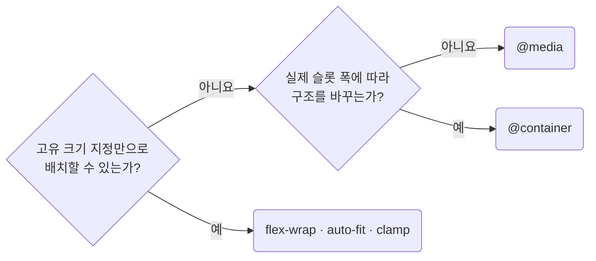

# Reach for Intrinsic Sizing Before Breakpoints

**Impact: MEDIUM (컴포넌트가 배치된 폭에 맞춰 크기를 조정해 위치가 바뀌어도 CSS 수정을 줄입니다)**

### 고유 크기 먼저 보기

브레이크포인트를 추가하기 전에 **고유 크기 지정만으로 배치할 수 있는지** 확인합니다.
`@media`는 뷰포트 폭을 보므로 같은 컴포넌트를 본문에서 좁은 사이드바로 옮겨도 실제 슬롯 폭을 반영하지 못합니다.

배치 방법을 고르는 차례입니다.



| 필요한 변화 | 사용할 방법 |
| --- | --- |
| 한 줄에 안 들어가 줄을 바꿈 | `flex-wrap: wrap` + `flex: 1 1 <기준폭>` |
| 폭에 따라 열 개수가 달라짐 | `repeat(auto-fit, minmax(min(100%, <기준폭>), 1fr))` |
| 슬롯을 채우되 최대 폭에서 멈춤 | `flex: 1 1 <기준폭>` + `max-width` |
| 여백이나 글자 크기가 조금씩 달라짐 | `clamp(<최소>, <선호>, <최대>)` |
| 뷰포트 폭에 따라 사이드바를 숨기거나 표를 카드 목록으로 바꿈 | `@media`. 위치는 `layout-group-breakpoints-at-the-file-bottom`을 따릅니다 |
| 실제 슬롯 폭에 따라 구조를 바꿈 | `@container` |

앞의 네 경우에는 `@media`를 쓰지 않습니다.
두 열을 한 열로 줄이는 것만으로는 브레이크포인트가 필요하지 않습니다.
`minmax(240px, 1fr)`의 고정 최솟값도 슬롯보다 크면 넘칩니다.
`min(100%, 240px)`로 제한하고 긴 텍스트와 자손의 최소 크기도 확인합니다.

### 컨테이너 쿼리 자리

| `@container` 작성 위치 | 기준 |
| --- | --- |
| 크기를 제공하는 조상 | `container-type: inline-size`를 선언합니다 |
| 크기 조건으로 바꿀 요소 | 해당 조상의 자손입니다. 자기 크기를 조건으로 자신을 바꾸지 않습니다 |
| 조건 숫자와 블록 위치 | 내용이 깨지는 컨테이너 폭으로 정합니다. 뷰포트용 세 값을 강제로 재사용하지 않고 소유자 파일의 기본 선언 뒤에 모읍니다 |

### 폭의 소유

버튼과 입력은 자기 폭을 정하지 않습니다.
`padding`, `min-height`, 글자 크기까지만 소유하고 폭은 사용처가 정합니다.
폭을 고정한 이유가 클래스명과 선언에서 드러나는지는 `layout-keep-layout-intent-explicit` 규칙을 따릅니다.

**Incorrect 1 (열 개수를 브레이크포인트마다 직접 지정합니다):**

```css
.pg_products__grid {
	display: grid;
	grid-template-columns: repeat(4, 1fr);
	gap: 16px;
}

@media (width < 1440px) {
	.pg_products__grid {
		grid-template-columns: repeat(3, 1fr);
	}
}

@media (width < 1024px) {
	.pg_products__grid {
		grid-template-columns: repeat(2, 1fr);
	}
}

@media (width < 640px) {
	.pg_products__grid {
		grid-template-columns: 1fr;
	}
}
```

**Correct 1 (사용 가능한 폭에 따라 열 개수를 조정합니다):**

```css
.pg_products__grid {
	display: grid;
	grid-template-columns: repeat(auto-fit, minmax(min(100%, 240px), 1fr));
	gap: 16px;
}
```

> 나머지 예시 · 예외는 [full rule](../rules/06-04-layout-reach-for-intrinsic-sizing-before-breakpoints.md)에 있습니다.
