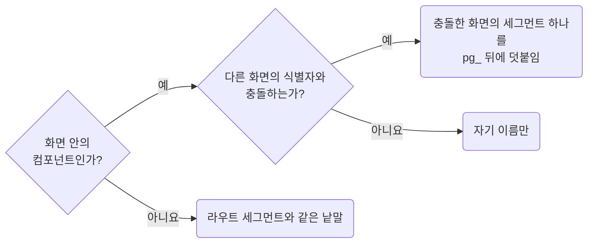

# Keep Page Slugs Traceable to Their Screen

**Impact: MEDIUM (클래스명에서 해당 화면을 추적할 수 있습니다)**

`pg_*` 식별자에는 어느 화면인지 추적할 수 있는 이름을 씁니다.
화면 소유 여부는 활성화된 프레임워크 규약이 판단하고 CSS는 그 이름을 따릅니다.

식별자를 고르는 차례입니다.



| 대상 | 식별자 |
| --- | --- |
| 라우트 진입 파일 | 라우트 세그먼트나 폴더 이름과 같은 낱말. 어느 화면에나 붙는 `shell`, `page`, `content`는 쓰지 않습니다 |
| `[id]`처럼 값이 런타임에 정해지는 동적 세그먼트 | 화면의 역할로 바꿉니다. `orders/[id]`라면 `[id]`를 `detail`로 바꿔 `pg_ordersDetail`로 씁니다 |
| 화면 안의 컴포넌트 | 자기 이름만 씁니다 |

라우트 경로나 폴더 이름에 없는 줄임말은 쓰지 않습니다.
`pg_prd__root` 대신 `pg_products__root`로 씁니다.
덧붙일 때 중간 컴포넌트 이름은 넣지 않습니다.
미리 붙이면 폴더가 깊어질수록 이름도 길어집니다.

**Incorrect 1 (화면 이름이 아닌 식별자를 씁니다):**

```txt
pg_shell__body    <- 역할 낱말이라 어느 화면인지 안 나옴
pg_doc__content   <- 라우트에 없는 줄임말
pg_x__root        <- 되짚을 이름이 없음
```

**Correct 1 (뼈대에는 라우트 세그먼트를 그대로 씁니다):**

```txt
pg_ordersIndex__root    <- orders index 화면
pg_ordersDetail__body   <- orders/[id] 화면
pg_document__body      <- document 화면
```

> 나머지 예시 · 예외는 [full rule](../rules/01-04-naming-keep-page-slug-traceable.md)에 있습니다.
