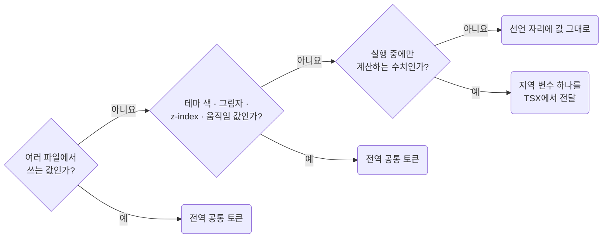

# Use Global Tokens and Do Not Create Local Ones

**Impact: MEDIUM (여러 파일이 쓰는 값은 전역 토큰으로 모으고 나머지는 선언 자리에 그대로 둡니다)**

값을 둘 자리는 **파일 경계**로 판정하고 다음 예외를 함께 확인합니다.

값을 어디에 둘지 고르는 차례입니다.



| 값의 범위나 역할 | 처리 |
| --- | --- |
| 여러 파일에서 사용함 | 기존 공통 토큰을 씁니다. 없으면 토큰 파일에 선언합니다 |
| 한 파일 안에서만 사용함 | 값을 그대로 둡니다 |
| 테마를 켠 프로젝트의 색과 그림자 | 한 파일에서만 써도 `values-switch-themes-by-changing-token-values`에 따라 토큰으로 둡니다 |
| `z-index` 층, 움직임 지속 시간과 이징 | 한 번만 써도 토큰으로 둡니다. 앱 전체의 쌓임 순서와 움직임 리듬을 맞춥니다 |
| 실행 중에만 계산할 수 있는 수치 하나 | 유일한 지역 변수 예외입니다. `composition-do-not-style-through-the-style-attribute`에 따라 TSX에서 전달합니다 |

그 밖의 **지역 변수는 만들지 않습니다.** 공통 토큰이 아니면 대체값이 필요해 사용처의 값은 남고 참조만 늘어납니다.
조상 상태는 변수 대신 결합자 하나로 자손에 전달합니다.
결합자 범위는 `ownership-use-foreign-classes-only-under-your-own-root` 규칙을 따릅니다.
`selector-do-not-group-classes-with-commas`에 따라 여러 클래스의 공통 선언도 묶지 않고 각 블록에 반복합니다.
층 목록은 `values-declare-stacking-layers-as-tokens`, 새 토큰 이름은 `values-name-tokens-by-purpose` 규칙이 정합니다.

**Incorrect 1 (한 파일 안 반복을 조상에 선언한 지역 변수로 감쌉니다):**

```css
.pg_products__root {
	--pg-products-gap: 12px;
}

.pg_products__toolbar {
	gap: var(--pg-products-gap, 12px);
}

.pg_products__footer {
	gap: var(--pg-products-gap, 12px);
}
```

**Correct 1 (한 파일 안 반복은 값을 그대로 둡니다):**

```css
.pg_products__toolbar {
	gap: 12px;
}

.pg_products__footer {
	gap: 12px;
}
```

> 나머지 예시 · 예외는 [full rule](../rules/05-02-values-tokenize-repeated-visual-values.md)에 있습니다.
