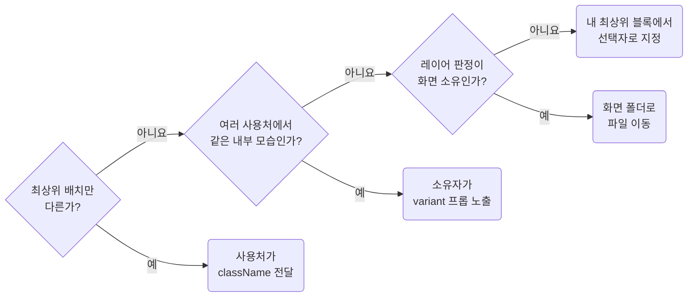

## Change Other Owners Through Their API

**Impact: HIGH (다른 소유자의 모습을 바꿀 때 배치 조정, 변형 노출, 레이어 이동을 순서대로 판단합니다)**

다른 소유자의 모습을 바꿀 때는 아래 세 방법을 순서대로 확인합니다.



| 상황 | 방법 | 수정 위치 |
| --- | --- | --- |
| 최상위 배치만 다름 | 사용처가 `className`을 넘겨 자기 클래스로 스타일을 줍니다 | 사용처 TSX와 CSS |
| 내부 모습이 여러 사용처에서 같게 반복됨 | 소유자가 `variant` 프롭으로 수정자를 노출합니다 | 소유자 TSX와 CSS, 사용처 TSX |
| 레이어 판정 결과가 화면 소유임 | 프롭을 추가하지 않고 화면 폴더로 파일을 옮깁니다 | 파일 위치와 접두사 |

화면 소유 여부는 사용 횟수가 아니라 활성화된 프레임워크 규약으로 판단합니다.
세 방법이 모두 맞지 않으면 `ownership-use-foreign-classes-only-under-your-own-root`에 따라 내 최상위 블록 안에서
선택자로 지정합니다.

`className`을 최상위까지만 전달하는 경계는 `composition-inject-classes-only-at-the-entry-point` 규칙이 정합니다.
이 규칙은 사용처가 어떤 방법을 고를지 판단합니다.

**Incorrect 1 (최상위 배치를 `className`으로 바꿀 수 있는데도 다른 소유자의 클래스를 선택합니다):**

```tsx
<WgChartCard />
```

```css
/* page/detail/pg-detail.css */
.pg_detail__root {
	& .wg_chartCard__root {
		grid-area: chart;
		margin-block-end: 16px;
	}
}
```

**Correct 1 (최상위 배치는 사용처가 자기 클래스로 잡습니다):**

```tsx
<WgChartCard className={clsx("pg_detail__chartCard")} />
```

```css
/* page/detail/pg-detail.css */
.pg_detail__chartCard {
	grid-area: chart;
	margin-block-end: 16px;
}
```

**Correct (여러 화면이 쓰는 모양은 소유자가 `variant` 프롭으로 노출합니다):**

```tsx
<WgChartCard variant="muted" />
```

```css
/* component/widget/chart-card/wg-chart-card.css */
.wg_chartCard__caption--muted {
	color: #8c8c8c;
}
```

**Correct (화면 소유로 판정한 컴포넌트를 화면 폴더로 옮깁니다):**

```txt
before
  component/widget/chart-card/wg-chart-card.tsx      detail 화면의 뷰모델 타입을 받음
  component/widget/chart-card/wg-chart-card.css      pg_detail 만 내부를 덮어쓰고 있었음

after
  page/detail/_pg-chart-card.tsx
  page/detail/_pg-chart-card.css  pg_chartCard__* 로 소유자 하나
```
