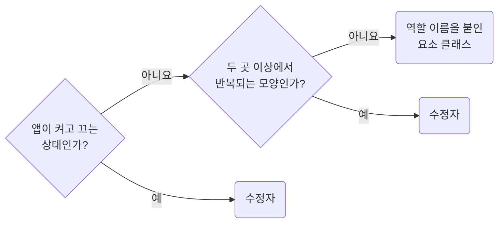

## Do Not Build Structural Variants With Modifiers

**Impact: MEDIUM (일회성 배치 보정이 수정자로 늘어나지 않게 합니다)**

수정자는 앱 상태나 여러 곳에서 반복되는 모양에만 씁니다.
한 곳의 여백이나 배치를 보정할 때는 기본 요소 클래스 대신 **역할 이름을 붙인 별도 요소 클래스**를 씁니다.

수정자와 요소 클래스를 고르는 차례입니다.



| 표현하려는 것 | 판정 |
| --- | --- |
| 앱이 켜고 끄는 상태 | 항상 수정자로 씁니다. `--active`, `--selected`, `--error`, `--expanded`, `--current` |
| 브라우저가 부여하는 `:disabled`, `:checked` | 수정자로 만들지 않습니다. `selector-use-pseudo-classes-for-dom-owned-states`를 따릅니다 |
| 같은 수정자 이름이 두 개 이상의 `scope_slug`에 이미 있음 | 반복되는 모양이므로 허용합니다. `--dense`, `--compact`, `--horizontal` |
| `variant` 프롭이 고르는 모양을 두 곳 이상에서 사용함 | `scope_slug` 수와 무관하게 수정자로 씁니다 |
| 위 조건에 맞지 않는 한 곳의 보정 | 요소 클래스로 씁니다. `--compactTop`, `--marginLeft0`, `--alignRight` 같은 수정자는 만들지 않습니다 |

두 번째 소유자가 같은 이름을 쓰기 전까지는 요소 클래스로 두고, 쓰게 되는 시점에 수정자로 바꿉니다.

**Incorrect 1 (그 화면 하나를 고치려고 수정자를 붙입니다):**

```tsx
<div className={clsx("pg_productDetail__section", "pg_productDetail__section--compactTop")} />
```

```tsx
<div className={clsx("pg_productDetail__aside", "pg_productDetail__aside--marginLeft0")} />
```

**Correct 1 (한 곳의 보정은 역할 이름을 붙인 요소 클래스로 분리합니다):**

```tsx
<div className={clsx("pg_productDetail__specSection")} />
```

```tsx
<div className={clsx("pg_productDetail__metaAside")} />
```

**Correct (상태와 반복되는 모양만 수정자로 씁니다):**

```tsx
<div className={clsx("ui_table__root", isDense && "ui_table__root--dense")} />
```

```tsx
<div className={clsx("pg_products__row", isSelected && "pg_products__row--selected")} />
```
