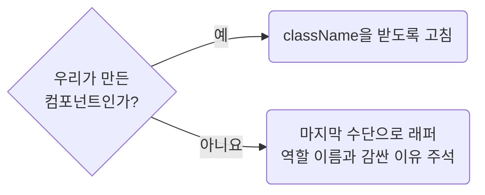

## Do Not Add Wrapper Elements for Styling

**Impact: HIGH (래퍼 요소는 부모 레이아웃 계산을 바꾸고 역할 없는 클래스를 늘립니다)**

스타일을 주기 위해 래퍼 요소를 추가하지 않습니다.
래퍼를 넣으면 부모의 `flex`나 `grid` 아이템이 바뀌어 내부의 `flex`, `grid-area`,
정렬이 부모 레이아웃에 적용되지 않을 수 있습니다.

여백이나 크기를 줄 방법을 고르는 차례입니다.



역할 없는 래퍼는 `naming-name-elements-and-modifiers-by-role`이 요구하는 이름도 지을 수 없습니다.

**Incorrect 1 (역할 없는 이름의 래퍼를 늘립니다):**

```tsx
<div className={clsx("pg_orders__box")}>
	<div className={clsx("pg_orders__inner")}>
		<LegacyDatePicker value={value} onChange={handleChange} />
	</div>
</div>
```

**Correct 1 (외부 라이브러리가 `className`을 받지 않으면 역할 이름을 붙여 감쌉니다):**

```tsx
{/**
 * LegacyDatePicker는 className을 받지 않아 배치용 래퍼가 필요하다
 */}
<div className={clsx("pg_orders__dateField")}>
	<LegacyDatePicker value={value} onChange={handleChange} />
</div>
```

**Incorrect 2 (래퍼 `div`로 최상위 스타일을 우회합니다):**

```tsx
<div className={clsx("pg_orders__collapseWrap")}>
	<UiCollapse>
		<PgOrderFilterFields />
	</UiCollapse>
</div>
```

```css
.pg_orders__collapseWrap {
	margin-block-end: 16px;
}
```

**Correct 2 (래퍼를 걷고 컴포넌트에 자기 클래스를 넘깁니다):**

```tsx
<UiCollapse className={clsx("pg_orders__collapse")}>
	<PgOrderFilterFields />
</UiCollapse>
```

```css
.pg_orders__collapse {
	margin-block-end: 16px;
}
```

**Correct (`className`을 받지 않던 우리 컴포넌트에 계약을 더합니다):**

```tsx
export interface UiCollapseProps {
	className?: string;
	children: ReactNode;
}

export const UiCollapse = (props: UiCollapseProps) => {
	return (
		<div className={clsx("ui_collapse__root", props.className)}>{props.children}</div>
	);
};
```
