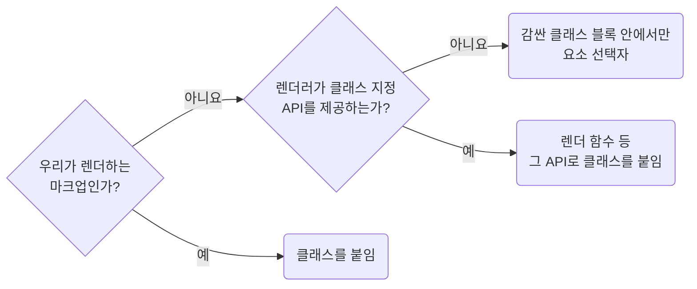

## Use Classes Instead of Element Selectors

**Impact: MEDIUM (태그를 바꿔도 스타일이 유지되도록 마크업을 클래스로 선택합니다)**

### 선택 방법

우리가 렌더하는 마크업은 요소 선택자 대신 클래스로 선택합니다.
태그를 `div`에서 `section`으로 바꿔도 스타일이 사라지지 않아야 합니다.

선택 방법을 고르는 차례입니다.



`dangerouslySetInnerHTML`이나 클래스 지정 API가 없는 Markdown 렌더러나 에디터 출력이 마지막 갈래입니다.
`:first-child` 같은 구조 선택자도 같은 기준을 따릅니다.
최상위에 `h2 { }`를 선언하면 해당 스타일시트를 읽은 문서 전체에 적용되므로 예외에서도 금지합니다.

### 예외 주석 형태

`selector-disallowed-list`가 `&` 바로 뒤의 요소 선택자를 막으므로 예외에는 다음 주석을 남깁니다.

예외 선택자가 하나면 `stylelint-disable-next-line`을 씁니다.
둘 이상이면 블록을 `stylelint-disable`과 `stylelint-enable` 주석 쌍으로 감쌉니다.

규칙 이름 뒤에 `-- <마크업 출처>`처럼 직접 작성하지 않는 마크업이라는 근거를 함께 적습니다.

**Incorrect 1 (우리가 렌더하는 마크업을 요소 선택자로 잡습니다):**

```tsx
<div className={clsx("pg_products__toolbar")}>
	<div>
		<UiSearchInput />
	</div>
	<button type="button">초기화</button>
</div>
```

```css
.pg_products__toolbar {
	& button {
		height: 32px;
	}

	& > div {
		flex: 1;
	}

	& > :first-child {
		margin-inline-start: 0;
	}
}
```

**Correct 1 (우리가 렌더하면 클래스를 붙입니다):**

```tsx
<div className={clsx("pg_products__toolbar")}>
	<div className={clsx("pg_products__toolbarField")}>
		<UiSearchInput />
	</div>
	<button type="button" className={clsx("pg_products__toolbarButton")}>
		초기화
	</button>
</div>
```

```css
.pg_products__toolbarField {
	flex: 1;
	margin-inline-start: 0;
}

.pg_products__toolbarButton {
	height: 32px;
}
```

**Incorrect 2 (요소 선택자를 최상위에 둡니다):**

```tsx
<div
	className={clsx("wg_productDetail__prose")}
	dangerouslySetInnerHTML={{__html: product.bodyHtml}}
/>
```

```css
/* 블록 밖에 홀로 둔 요소 선택자. 이 스타일시트를 읽은 문서의 모든 h2에 걸린다 */
h2 {
	margin: 24px 0 12px;
}
```

**Correct 2 (마크업을 우리가 쓰지 않으면 래퍼 블록 안에서 요소 선택자를 씁니다):**

```tsx
<div
	className={clsx("wg_productDetail__prose")}
	dangerouslySetInnerHTML={{__html: product.bodyHtml}}
/>
```

```css
/* stylelint-disable selector-disallowed-list -- dangerouslySetInnerHTML로 들어온 마크업 */
.wg_productDetail__prose {
	& h2 {
		margin: 24px 0 12px;
		font-size: 18px;
	}

	& p {
		margin: 0 0 12px;
		line-height: 1.7;
	}

	& > :first-child {
		margin-top: 0;
	}
}
/* stylelint-enable selector-disallowed-list */
```
