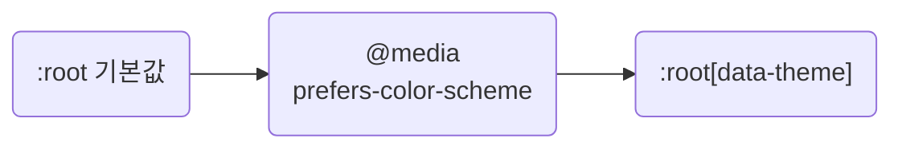

## Switch Themes by Changing Token Values

**Impact: HIGH (테마 분기가 한 파일에만 있어 색을 하나 더할 때 파일 여러 개를 열지 않습니다)**

테마는 **토큰 파일에서 값만** 바꿉니다. 컴포넌트 CSS에는 `prefers-color-scheme`이나 `[data-theme]` 분기를 두지 않습니다.

토큰 파일 안에서 테마 값을 덮어쓰는 차례입니다.



| 테마 조건이나 값 | 처리 |
| --- | --- |
| 시스템 테마 | 토큰 파일의 `@media (prefers-color-scheme)`에서 `:root` 값을 바꿉니다 |
| 사용자가 고른 테마 | `[data-theme]` 블록을 시스템 조건 뒤에 둡니다. 뒤에 오고 명시도도 높은 선택자가 시스템 설정을 덮습니다 |
| 같은 팔레트를 두 번 선언함 | 토큰 파일 안에서는 허용합니다. 값의 출처가 그 파일 하나입니다 |
| 스크롤바, 폼 컨트롤, 기본 배경 | 브라우저 UI도 따르도록 `color-scheme`을 선언합니다 |
| 색과 `box-shadow` | 테마마다 토큰 값을 정합니다. 한 파일에서만 써도 토큰으로 둡니다 |
| 다크 모드를 지원하지 않기로 함 | `prefers-color-scheme`을 쓰지 않습니다. 일부 화면에만 적용하지 않습니다 |

테마 분기를 흩어 놓으면 색을 추가할 때마다 사용 파일을 모두 수정해야 하고 누락은 테마를 바꿔야 드러납니다.
어두운 배경에서는 검은 그림자가 보이지 않으므로 그림자도 테마별로 조정합니다.
색과 그림자의 토큰화는 `values-tokenize-repeated-visual-values`의 한 파일 예외보다 우선합니다.
토큰 이름은 `values-name-tokens-by-purpose` 규칙을 따릅니다.
`layout-group-breakpoints-at-the-file-bottom`의 폭 조건은 클래스를 바꾸는 규칙이므로 테마 조건과 섞지 않습니다.

**Incorrect 1 (컴포넌트 파일에서 테마를 분기합니다):**

```css
/* src/page/products/pg-products.css */
.pg_products__panel {
	background-color: var(--app-color-surface);

	@media (prefers-color-scheme: dark) {
		background-color: #1f2225;
	}
}
```

**Correct 1 (컴포넌트는 토큰만 씁니다):**

```css
/* src/page/products/pg-products.css */
.pg_products__panel {
	background-color: var(--app-color-surface);
	color: var(--app-color-text-primary);
	border: 1px solid var(--app-color-border);
	box-shadow: var(--app-shadow-panel);
}
```

**Incorrect 2 (그림자를 직접 적어 어두운 배경에서 사라집니다):**

```css
/* src/page/products/pg-products.css */
.pg_products__panel {
	box-shadow: 0 1px 3px rgb(0 0 0 / 12%);
}
```

**Correct 2 (토큰 파일에서 값을 바꾸고 사용자 테마를 시스템 설정보다 우선합니다):**

```css
/* src/style/token.css */
:root {
	color-scheme: light;

	--app-color-surface: #fff;
	--app-color-text-primary: #212529;
	--app-color-border: #dee2e6;
	--app-shadow-panel: 0 1px 3px rgb(0 0 0 / 12%);
}

@media (prefers-color-scheme: dark) {
	:root {
		color-scheme: dark;

		--app-color-surface: #1f2225;
		--app-color-text-primary: #e9ecef;
		--app-color-border: #3a3f44;
		--app-shadow-panel: 0 1px 3px rgb(0 0 0 / 60%);
	}
}

/* [data-theme] 는 뒤에 오고 명시도도 높아 위 @media 블록을 이긴다 */
:root[data-theme="light"] {
	color-scheme: light;

	--app-color-surface: #fff;
	--app-color-text-primary: #212529;
	--app-color-border: #dee2e6;
	--app-shadow-panel: 0 1px 3px rgb(0 0 0 / 12%);
}

:root[data-theme="dark"] {
	color-scheme: dark;

	--app-color-surface: #1f2225;
	--app-color-text-primary: #e9ecef;
	--app-color-border: #3a3f44;
	--app-shadow-panel: 0 1px 3px rgb(0 0 0 / 60%);
}
```
