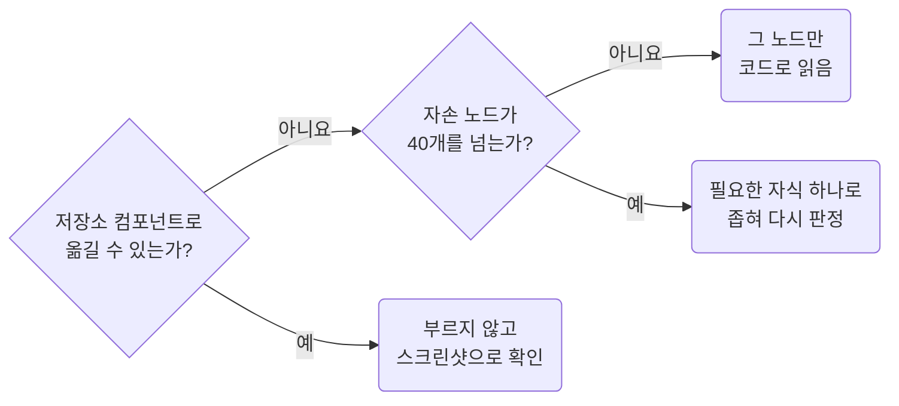

# Figma 구현 컨벤션

- 버전: 1.0.0
- 조직: Agent Conventions
- 날짜: 2026년 9월

> **생성된 문서입니다. 직접 수정하지 마세요.**
>
> 현재 skill의 `rules/*.md`, `metadata.json`, `metadata.json.companions`를 수정한 뒤 `npm --prefix ../../package run build -- --skill=figma`로 다시 생성하세요.

---

## 개요

Figma 디자인을 코드로 옮기는 팀을 위한 컨벤션입니다. Figma는 참고 자료이고 스펙은 코드입니다. 화면은 스크린샷과 메타데이터로 먼저 읽고, `get_design_context`는 저장소에 대응물이 없는 가장 작은 노드에만 불러 LLM 토큰을 아낍니다. 숨긴 레이어, UX 메모, 그려지지 않은 상태를 구현 전에 모으고, 값은 프로젝트 토큰으로, 구조는 기존 컴포넌트로 옮기며, 완료 전에 렌더 값을 실측합니다. 디자인 파일의 레이어가 정리돼 있든, Code Connect가 있든 없든 결과 품질이 크게 흔들리지 않게 합니다. TSX를 바꿀 때는 React 규칙을, 스타일을 바꿀 때는 CSS 규칙을 함께 봅니다. 규칙 본문의 정본은 `rules/*.md`입니다.

이 문서에는 Figma 구현 컨벤션 규칙만 담겨 있습니다. 아래 규칙도 함께 따릅니다.

---

## 함께 따르는 규칙

- [React Convention](../react/HANDBOOK.md) — 다음 조건에서 함께 적용합니다. TSX 화면이나 컴포넌트를 추가하거나 수정한다.
- [CSS Convention](../css/HANDBOOK.md) — 다음 조건에서 함께 적용합니다. stylesheet, className, 토큰 값을 추가하거나 수정한다.

---

## 목차

1. [Reading Figma through MCP](#1-reading-figma-through-mcp) — **CRITICAL**
    - 1.1 [Start with the Screenshot and Metadata](#11-start-with-the-screenshot-and-metadata)
    - 1.2 [Choose the Node Each Tool Reads](#12-choose-the-node-each-tool-reads)
    - 1.3 [Call get_design_context Only on Small Unmatched Nodes](#13-call-get-design-context-only-on-small-unmatched-nodes)
    - 1.4 [Take Copy from the Render, Not Layer Names](#14-take-copy-from-the-render-not-layer-names)
    - 1.5 [Collect Hidden Layers and Annotations Before Building](#15-collect-hidden-layers-and-annotations-before-building)
2. [Design Intent and Gaps](#2-design-intent-and-gaps) — **HIGH**
    - 2.1 [Ask Before Building When UX Notes and GUI Disagree](#21-ask-before-building-when-ux-notes-and-gui-disagree)
    - 2.2 [Fill Undrawn States with Existing Project Parts](#22-fill-undrawn-states-with-existing-project-parts)
    - 2.3 [Treat Frame Sizes and Sample Text as Samples](#23-treat-frame-sizes-and-sample-text-as-samples)
    - 2.4 [Implement the Interactions the Design Implies](#24-implement-the-interactions-the-design-implies)
3. [Source of Truth](#3-source-of-truth) — **HIGH**
    - 3.1 [Map Figma Values and Variables to Project Tokens](#31-map-figma-values-and-variables-to-project-tokens)
    - 3.2 [Separate Static Copy from Server Data](#32-separate-static-copy-from-server-data)
4. [Transcription](#4-transcription) — **CRITICAL**
    - 4.1 [Reuse Project Components Before Writing New Markup](#41-reuse-project-components-before-writing-new-markup)
    - 4.2 [Do Not Copy Layer Structure into the DOM](#42-do-not-copy-layer-structure-into-the-dom)
    - 4.3 [Use Existing Icons or Downloaded Assets](#43-use-existing-icons-or-downloaded-assets)
5. [Verification and Report](#5-verification-and-report) — **HIGH**
    - 5.1 [Measure Rendered Values Before Claiming Parity](#51-measure-rendered-values-before-claiming-parity)
    - 5.2 [Report What Was Read, Decided, and Left Open](#52-report-what-was-read-decided-and-left-open)

---

## 1. Reading Figma through MCP

**Impact: CRITICAL**

어떤 도구를 어느 노드에 어떤 순서로 부를지 정합니다. 스크린샷과 메타데이터는 비용을 미리 가늠할 수 있고, `get_design_context`는 레이어가 정리되지 않을수록 노드가 늘어 비싸집니다. 그래서 화면은 싼 도구로 먼저 읽고, 비싼 도구는 저장소에 대응물이 없는 가장 작은 노드에만 부릅니다. 레이어 이름과 숨긴 레이어처럼 파일 정리 상태에 따라 뜻이 달라지는 정보는 렌더 결과와 대조해서 읽습니다.

### 1.1 Start with the Screenshot and Metadata

**Rule:** `F01-01` · `read-start-with-screenshot-and-metadata`

**Applies when:** 요청에 Figma URL이나 노드 id가 있어 MCP로 디자인을 읽을 때. 같은 Figma 화면을 다시 읽거나 읽을 노드를 늘릴 때.

**Impact: CRITICAL (한 화면을 읽는 비용을 레이어 정리 상태와 무관하게 예측할 수 있는 범위로 묶습니다)**

Figma 노드는 `get_screenshot`, `get_metadata`, `get_variable_defs` 순서로 읽고 `get_design_context`는 마지막에 부릅니다.
앞의 셋은 비용이 픽셀 수나 노드 수에 비례하므로 부르기 전에 가늠할 수 있습니다.
`get_design_context`는 디자이너가 레이어를 정리하지 않았을수록 같은 화면에서도 노드가 몇 배로 늘어납니다.
반복 행이 컴포넌트가 아니면 행마다 펼쳐지고, Code Connect가 없는 인스턴스는 안쪽까지 펼쳐지기 때문입니다.

### 도구별 역할과 비용

| 도구 | 얻는 것 | 비용(LLM 토큰) |
| --- | --- | --- |
| `get_screenshot` | 시각 기준. 실제 문구, 색, 배치 | 픽셀 수에 비례합니다. 1600px 한 장이 약 3k입니다 |
| `get_metadata` | 노드 트리, 타입, 이름, 좌표, 크기, `hidden` | 노드당 약 35입니다. 노드 270개가 약 10k입니다 |
| `get_variable_defs` | 노드가 쓰는 변수 이름과 값 | 목록 항목 하나에 수백입니다. 화면 프레임은 그보다 큽니다 |
| `get_design_context` | 참고 코드, 실제 텍스트, 에셋 URL | 노드 수에 비례합니다. 같은 화면 전체가 Dev Mode 추정 약 63k입니다 |

측정값은 2026년 9월 Figma 플러그인 2.2 계열에서 화면 하나로 잰 것입니다.
버전과 화면마다 숫자는 바뀌므로 비례 관계를 기준으로 삼습니다.

### 호출 순서

1. URL에서 `fileKey`와 노드 id를 뽑습니다. 노드 고르기는 `read-choose-the-node-each-tool-reads`가 정합니다.
2. `get_screenshot`을 화면 프레임에 `maxDimension: 1600`으로 부릅니다.
3. `get_metadata`를 URL의 노드에 부릅니다. 메모와 이력이 붙은 래퍼면 그 래퍼째 부릅니다.
4. `get_variable_defs`를 화면 프레임에 부릅니다.
5. 스크린샷과 메타데이터에서 본 요소를 저장소 컴포넌트에 대응시킵니다.
6. 대응물이 없는 요소만 `get_design_context`로 읽습니다.
   대상은 `read-call-design-context-only-on-small-unmatched-nodes`가 정합니다.

`get_screenshot` 응답은 이미지가 아니라 단기 URL입니다.
바로 내려받아 파일로 읽고, 셸로 URL을 받을 수 없을 때만 `enableBase64Response`를 켭니다.
스크린샷이 시각 기준입니다. 레이어 값이 스크린샷과 다르면 스크린샷을 따릅니다.

### 예산

한 화면의 목표는 LLM 토큰 20k 안입니다. 화면 둘 이상에서 다시 재기 전까지는 잠정값입니다.
부르기 전에 스크린샷은 가로×세로÷750, 메타데이터는 노드 수×35로 어림합니다.

| 상황 | 처리 |
| --- | --- |
| 스크린샷 `original_height`가 폭의 두 배를 넘는 긴 화면 | 1600px 한 장으로는 글자가 뭉개집니다. 메타데이터에서 섹션 프레임 id를 찾아 섹션마다 찍습니다 |
| 래퍼가 페이지 전체이거나 화면이 여럿이라 메타데이터가 클 것 같음 | 래퍼 대신 화면 프레임과 메모 프레임에 따로 부릅니다 |
| 한 요청에 화면이나 기기 폭 프레임이 여럿 | 첫 화면에서 만든 컴포넌트, 토큰 대응표를 다음 화면에 그대로 쓰고 달라진 노드만 읽습니다 |
| 어림한 합계가 목표를 넘음 | 더 부르기 전에 멈추고, 이미 받은 응답으로 풀 수 있는지 다시 봅니다 |

같은 노드를 같은 도구로 두 번 부르지 않습니다. 앞 응답에 필요한 값이 있으면 그것을 씁니다.

**Incorrect 1 (화면 전체에 `get_design_context`를 먼저 부르고 성긴 응답을 코드로 강제합니다):**

```text
get_design_context  12:340 상품 목록_전체             코드 대신 메타데이터, 성김
get_design_context  12:340 상품 목록_전체  forceCode  Dev Mode 추정 약 63k
합계                                                  약 70k
```

**Correct 1 (싼 도구로 화면을 읽고 대응물이 없는 노드 하나만 코드로 읽습니다):**

```text
get_screenshot      12:341 상품 목록       maxDimension 1600  약 3k
get_metadata        12:340 상품 목록_전체                     약 10k
get_variable_defs   12:341 상품 목록                          약 1k
저장소 대응         표 UiTable, 탭 UiTabs, 상태 UiBadge
get_design_context  12:377 재고 경고 칩    excludeScreenshot  약 1.2k
합계                                                          약 15k
```

### 1.2 Choose the Node Each Tool Reads

**Rule:** `F01-02` · `read-choose-the-node-each-tool-reads`

**Applies when:** Figma URL의 노드가 화면 프레임인지 메모를 감싼 래퍼인지 가려야 할 때. URL에 `node-id`가 없거나 `/branch/` 경로가 들어 있을 때.

**Impact: HIGH (같은 비용으로 화면 글자와 메모를 놓치지 않고 읽습니다)**

공유받은 URL은 화면 하나가 아니라 화면과 메모, 변경 이력을 함께 감싼 래퍼를 가리키는 경우가 많습니다.
래퍼를 스크린샷으로 찍으면 메모까지 한 장에 줄어들어 화면의 글자가 읽히지 않습니다.
반대로 화면 프레임에 메타데이터를 부르면 옆에 붙은 UX 메모와 이력을 놓칩니다.

### 노드별 도구

| 노드 | 메타데이터에서 알아보는 법 | 부를 도구 |
| --- | --- | --- |
| 메모 래퍼 | 화면 프레임, 메모 프레임, 이력 표를 형제로 품은 바깥 `frame` | `get_metadata` |
| 화면 프레임 | 1920, 1440, 375 같은 기기 폭이고 GNB 같은 공통 인스턴스를 품은 `frame` | `get_screenshot`, `get_variable_defs` |
| 반복 단위, 컴포넌트 | 같은 `name`과 크기로 여러 번 나오는 `frame`, `instance` | 대응물이 없을 때만 `get_design_context` |

래퍼 id만 받았으면 메타데이터에서 화면 프레임 id를 찾아 스크린샷을 그 id로 부릅니다.
화면 프레임이 둘 이상이면 요청이 가리키는 상태의 프레임을 고르고, 나머지는 상태 목록에 적습니다.

### URL 읽기

| URL | 처리 |
| --- | --- |
| `node-id=1-2` | 노드 id는 `1:2`입니다 |
| `/design/:fileKey/branch/:branchKey/` | `branchKey`를 `fileKey`로 씁니다 |
| `node-id`가 없음 | 추측하지 않고 노드 URL을 요청합니다. `get_metadata`를 노드 없이 부르면 페이지 목록만 옵니다 |

**Incorrect 1 (래퍼에 스크린샷을 불러 화면이 메모와 함께 줄어듭니다):**

```text
get_screenshot  12:340 상품 목록_전체  원본 2834x2403 → 1600x1357  표 글자가 읽히지 않음
```

**Correct 1 (메타데이터로 화면 프레임을 찾아 그 프레임만 찍습니다):**

```text
get_metadata    12:340 상품 목록_전체  화면 프레임 12:341, 메모 12:395, 이력 12:401
get_screenshot  12:341 상품 목록       원본 1920x2169 → 1416x1600  표 글자가 읽힘
```

### 1.3 Call get_design_context Only on Small Unmatched Nodes

**Rule:** `F01-03` · `read-call-design-context-only-on-small-unmatched-nodes`

**Applies when:** `get_design_context`를 부르거나 그 대상 노드를 고를 때. `get_design_context` 응답이 코드 대신 메타데이터로 오거나 성기다고 알릴 때.

**Impact: CRITICAL (가장 비싼 도구의 비용이 디자인 파일의 정리 상태를 따라 불어나지 않게 막습니다)**

`get_design_context`는 저장소 컴포넌트로 옮길 수 없는 요소를 읽을 때만 부르고, 그중 가장 작은 노드를 고릅니다.
이 도구의 비용은 노드 수에 비례하고, 정리되지 않은 레이어일수록 같은 모양에 노드가 많습니다.
저장소에 대응물이 있는 요소는 코드로 읽어도 쓸 곳이 없습니다.



### 대상 판정

| 대상 | 판정 |
| --- | --- |
| 화면 전체, 섹션 전체, 메모 래퍼 | 부르지 않습니다 |
| 반복 목록 전체 | 부르지 않습니다. 대표 항목 하나만 부릅니다 |
| 저장소 컴포넌트에 대응되는 요소 | 부르지 않습니다. 모양은 스크린샷으로 확인합니다 |
| 메타데이터에서 자손 노드가 40개를 넘는 노드 | 부르지 않습니다. 필요한 자식 하나로 좁힙니다 |
| 대응물이 없고 자손 노드가 적은 노드 | 부릅니다 |

자손 노드는 메타데이터에서 그 노드 아래에 있는 모든 노드의 수입니다.
40개는 어림값입니다. 노드 하나가 약 230(Dev Mode 추정 약 63k ÷ 270)이므로 40개면 한 번에 10k 안쪽입니다.
응답이 코드 대신 메타데이터로 오면 노드가 크다는 신호이므로 `forceCode`로 억지로 받지 않고 대상을 좁힙니다.

### 호출 인자

| 인자 | 값 |
| --- | --- |
| `excludeScreenshot` | `true`입니다. 스크린샷은 `get_screenshot`으로 이미 받았습니다 |
| `forceCode` | 켜지 않습니다 |
| `skillNames` | `figma-design-to-code`입니다. 공식 스킬이 요구하는 기록용 값이고, MCP 리소스로 읽었으면 `resource:`를 붙입니다 |
| `clientFrameworks`, `clientLanguages` | 프로젝트의 프레임워크와 언어입니다 |

인스턴스 안쪽 노드의 id(`I12:34;56:78`)는 `get_design_context`만 받습니다.
`get_screenshot`, `get_variable_defs`, `download_assets`에는 그 인스턴스 자체의 id를 넘깁니다.

### 공식 스킬과의 관계

이 도구는 부르기 전에 Figma 공식 `figma-design-to-code` 스킬을 읽으라고 요구합니다.
그 스킬을 읽되 아래 항목은 이 규칙이 우선합니다.
컴포넌트 재사용, 임시 에셋 URL을 코드에 남기지 않기, 에셋 검증처럼 이 규칙과 부딪히지 않는 지시는 그대로 따릅니다.

| 공식 스킬이나 도구 설명의 지시 | 이 규칙 |
| --- | --- |
| 첫 호출에서 스크린샷을 함께 받습니다 | 스크린샷은 이미 받았으므로 뺍니다 |
| 응답이 성기면 보이는 자식 노드를 한꺼번에 병렬로 다시 부릅니다 | 대응물이 없는 자식 하나만 부릅니다 |
| `get_design_context` 응답으로만 구현합니다 | 대응된 요소는 저장소 컴포넌트와 스크린샷으로 구현합니다 |
| 에셋은 다른 도구로 내려받지 않습니다 | 에셋만 필요한 노드는 `download_assets`로 받습니다. 도구 설명이 이 경우를 허용합니다 |
| `get_metadata`보다 `get_design_context`를 먼저 씁니다 | `read-start-with-screenshot-and-metadata` 순서를 따릅니다 |

**Incorrect 1 (성긴 응답을 받고 보이는 자식을 모두 다시 부릅니다):**

```text
get_design_context  12:341 상품 목록            코드 대신 메타데이터, 성김
get_design_context  12:420~12:441 상품 행 22개  병렬                        약 26k
```

**Correct 1 (대응물이 없는 자식 하나만 골라 부릅니다):**

```text
get_design_context  12:341 상품 목록     부르지 않음, 표는 UiTable로 대응
get_design_context  12:377 재고 경고 칩  자손 노드 6개, 대응물 없음        약 1.2k
```

**Incorrect 2 (스크린샷을 다시 받고 큰 노드를 코드로 강제합니다):**

```json
{"fileKey": "Ab12Cd34Ef56Gh78Ij90Kl", "nodeId": "12:341", "forceCode": true}
```

**Correct 2 (스크린샷을 빼고 작은 노드만 읽습니다):**

```json
{"fileKey": "Ab12Cd34Ef56Gh78Ij90Kl", "nodeId": "12:377", "excludeScreenshot": true, "skillNames": "figma-design-to-code"}
```

### 1.4 Take Copy from the Render, Not Layer Names

**Rule:** `F01-04` · `read-take-copy-from-the-render-not-layer-names`

**Applies when:** Figma 메타데이터의 레이어 `name`으로 문구, 컬럼명, 컴포넌트 종류를 정할 때. 스크린샷과 레이어 이름이 서로 다른 글자를 보여 줄 때.

**Impact: HIGH (디자이너가 이름을 바꾼 레이어 때문에 화면과 다른 문구가 코드에 들어가지 않습니다)**

`get_metadata`의 `text` 노드는 내용 없이 `name`만 싣습니다.
`name`은 처음에는 내용과 같지만, 디자이너가 레이어 이름을 바꾸거나 문구만 고치면 화면과 달라집니다.
그래서 레이어 이름은 위치를 찾는 표지로만 쓰고, 글자는 렌더 결과에서 읽습니다.

| 정보 | 먼저 볼 곳 | 레이어 이름의 쓸모 |
| --- | --- | --- |
| 문구, 컬럼명, 버튼명 | 스크린샷. 글자가 작으면 그 노드만 `get_design_context`로 읽습니다 | 노드를 찾는 표지입니다 |
| 컴포넌트 종류 | 스크린샷의 모양과 동작 | `instance` 이름은 후보를 좁히는 단서입니다 |
| 역할, 구역 | 배치와 메모 | `Frame 2085673573` 같은 자동 이름은 뜻이 없습니다 |

스크린샷과 레이어 이름이 다르면 스크린샷을 따르고, 두 값을 보고의 출처 항목에 함께 적습니다.

**Incorrect 1 (메타데이터 이름으로 컬럼명을 정해 화면과 다른 글자가 들어갑니다):**

```text
<text id="12:363" name="단위 가격" />   → 컬럼명 "단위 가격"
<text id="12:364" name="thead" />       → 컬럼명 "thead"
```

**Correct 1 (스크린샷의 글자로 컬럼명을 정하고 이름은 노드를 찾는 데만 씁니다):**

```text
<text id="12:363" name="단위 가격" />   → 스크린샷 "판매가"  → 컬럼명 "판매가"
<text id="12:364" name="thead" />       → 스크린샷 "관리"    → 컬럼명 "관리"
```

### 1.5 Collect Hidden Layers and Annotations Before Building

**Rule:** `F01-05` · `read-collect-hidden-layers-and-annotations`

**Applies when:** Figma 메타데이터에 `hidden="true"` 노드가 있을 때. 화면 프레임 밖에 메모, 변경 이력, 상태 설명 프레임이 있을 때.

**Impact: HIGH (한 화면에 겹쳐 둔 상태와 요구 조건이 구현에서 빠지지 않고, 버린 초안이 화면에 올라가지도 않습니다)**

숨긴 레이어는 디자이너가 상태나 변형을 한 화면에 겹쳐 둔 흔적인 경우가 많습니다.
보이는 것만 구현하면 상태가 빠지고, 숨긴 것까지 모두 보이게 구현하면 버린 초안이 화면에 올라갑니다.
그래서 구현 전에 숨긴 레이어와 메모를 하나씩 분류해 상태 목록을 만듭니다.

| 발견한 것 | 분류 | 처리 |
| --- | --- | --- |
| 조건에 따라 나타날 요소. 선택 칩, 초기화 버튼, 툴팁 | 상태 | 조건부 렌더로 구현하고 조건은 메모에서 찾습니다 |
| 같은 자리에 겹친 다른 모양 | 변형 | 컴포넌트의 `variant`나 프롭으로 옮깁니다 |
| 조건을 알 수 없는 숨긴 요소 | 미정 | 구현하지 않고 노드 id와 함께 질문합니다 |
| 메모 본문 | 요구 조건 | 정렬 기준, 노출 기간, 제외 조건을 목록에 적습니다 |
| 변경 이력 표 | 요구 조건 | 이력 안에서는 가장 최근 항목을 따르고, 화면과 다르면 질문합니다 |

메모와 이력의 글자는 `get_metadata`에서 `text` 노드의 `name`으로만 옵니다.
이름이 `...`로 잘렸거나 내용과 달라 보이면 그 메모 프레임만 `get_design_context`로 읽습니다.
메모와 화면이 어긋날 때의 처리는 `intent-ask-when-ux-notes-and-gui-disagree`가 정합니다.

**Incorrect 1 (보이는 레이어만 구현 목록에 올립니다):**

```text
구현 목록 — 12:340 상품 목록_전체
12:343 필터 바
12:350 상품 표
```

**Correct 1 (숨긴 레이어와 메모를 분류해 상태 목록을 함께 만듭니다):**

```text
상태 목록 — 12:340 상품 목록_전체
12:343 필터 바      보임  -          -
12:350 상품 표      보임  -          -
12:358 선택 칩      숨김  상태       필터를 하나 이상 고르면 표시
12:360 초기화 버튼  숨김  상태       필터를 하나 이상 고르면 표시
12:371 안내 배너    숨김  미정       조건 없음, 질문
12:395 메모         -     요구 조건  최초 진입 시 등록일 최신순
12:401 이력 9/10    -     요구 조건  숨긴 상품은 목록 끝으로
```

## 2. Design Intent and Gaps

**Impact: HIGH**

Figma 화면은 한 시점의 표본입니다. UX 메모와 GUI 화면이 어긋나는 곳은 구현 전에 묻고, 그려지지 않은 상태는 프로젝트 기본 컴포넌트로 채웁니다. 프레임 폭과 샘플 문구는 실제 데이터와 화면 폭이 달라질 수 있는 표본으로 읽고, 아이콘과 표시가 암시하는 동작을 구현합니다.

### 2.1 Ask Before Building When UX Notes and GUI Disagree

**Rule:** `F02-01` · `intent-ask-when-ux-notes-and-gui-disagree`

**Applies when:** Figma 메모, 변경 이력, 와이어프레임이 GUI 화면과 다른 조건, 순서, 문구를 말할 때. 같은 화면이 UX 파일과 GUI 파일에 다르게 그려져 있을 때.

**Impact: HIGH (어긋난 두 디자인 중 하나를 말없이 골라 구현했다가 되돌리는 비용을 막습니다)**

UX 메모와 GUI 화면은 따로 고쳐지므로 한쪽만 최신인 일이 흔합니다.
어긋난 곳을 한쪽으로 골라 구현하면, 틀렸을 때 코드를 되돌려야 합니다.
메타데이터 한 번에 메모와 화면이 함께 오므로, 어긋난 지점을 찾아 구현 전에 묻습니다.

| 어긋남 | 처리 |
| --- | --- |
| 메모의 조건과 화면이 다름. 정렬 기준, 노출 개수, 노출 기간 | 두 노드 id와 내용을 나란히 적어 질문합니다 |
| 이력 표의 최근 요청이 화면에 반영되지 않음 | 요청을 최신으로 보고 질문에 적습니다 |
| 위계나 순서가 다름. 섹션 순서, 필드 순서, 필수 표시 | 질문합니다 |
| 문구만 다름 | GUI 화면을 따르고 보고의 출처 항목에 적습니다 |

질문은 한 번에 모아 구현 전에 합니다.
답을 기다릴 수 없으면 날짜가 적힌 가장 최근 이력 항목을 따르고, 이력이 없으면 GUI 화면을 따릅니다.
고른 쪽과 근거는 보고의 질문 목록에 남깁니다.
이 규칙은 어긋남을 찾아 드러내는 데까지입니다. 두 파일을 합친 새 디자인을 만들지 않습니다.

**Incorrect 1 (메모와 다른 화면을 말없이 따라 구현합니다):**

```text
구현 완료 — 상품 목록
정렬  상품명 가나다순. 화면 12:341의 정렬 화살표를 따름
```

**Correct 1 (두 출처를 나란히 적어 구현 전에 묻습니다):**

```text
확인 필요 — 상품 목록
정렬  메모 12:395  최초 진입 시 등록일 최신순
      화면 12:341  상품명 컬럼에 정렬 화살표가 켜져 있음
      어느 쪽을 따를까요? 답이 없으면 GUI 화면을 따릅니다(정렬 이력 없음)
```

### 2.2 Fill Undrawn States with Existing Project Parts

**Rule:** `F02-02` · `intent-fill-undrawn-states-with-project-parts`

**Applies when:** 서버 데이터 목록, 입력, 비동기 동작이 있는 Figma 화면을 구현할 때. Figma에 로딩, 빈 목록, 오류, 비활성 상태가 그려져 있지 않을 때.

**Impact: HIGH (디자인에 없는 로딩, 빈 목록, 오류 상태가 흰 화면이나 화면마다 다른 모양으로 남지 않습니다)**

Figma 화면은 대개 데이터가 가득 찬 한 순간만 그립니다.
빠진 상태를 새로 디자인하면 화면마다 모양이 달라지고, 비워 두면 흰 화면이나 깨진 표가 됩니다.
그래서 그려지지 않은 상태는 프로젝트에 이미 있는 컴포넌트로 채우고, 채웠다는 사실을 보고에 적습니다.

| 상태 | 채우는 것 |
| --- | --- |
| 로딩 | 프로젝트의 로딩 컴포넌트나 스켈레톤. 경계의 자리는 `react/runtime-place-suspense-boundaries-at-the-section-owner`가 정합니다 |
| 빈 목록 | 프로젝트의 빈 상태 표시와 고정 문구 |
| 오류 | 프로젝트의 오류 경계와 오류 표시 컴포넌트 |
| 비활성, 진행 중 | 컴포넌트가 가진 `disabled`, 진행 표시 |
| 긴 문구, 큰 숫자 | 칸 폭 처리는 `intent-treat-frame-sizes-and-sample-text-as-samples`가 정합니다 |

숨긴 레이어에 그 상태가 있으면 `read-collect-hidden-layers-and-annotations`에 따라 그 모양을 먼저 씁니다.
빈 상태 문구처럼 글자가 필요한데 디자인에 없으면 가정한 문구로 구현하고 질문 목록에 올립니다.

**Incorrect 1 (디자인에 없는 로딩 모양을 화면에서 새로 만듭니다):**

```tsx
<Suspense
	fallback={
		<div className="pg_products__loading">
			
			<p>불러오는 중</p>
		</div>
	}
>
	<PgProductTableSection />
</Suspense>
```

**Correct 1 (프로젝트의 로딩 컴포넌트를 경계의 대체 화면으로 씁니다):**

```tsx
<Suspense fallback={<UiSpinner />}>
	<PgProductTableSection />
</Suspense>
```

**Correct (채운 상태를 보고에 적습니다):**

```text
디자인 없음 — 상품 목록
로딩     UiSpinner로 채움
빈 목록  "등록된 상품이 없습니다" 가정, 확인 필요
오류     화면 오류 경계의 기본 표시
```

### 2.3 Treat Frame Sizes and Sample Text as Samples

**Rule:** `F02-03` · `intent-treat-frame-sizes-and-sample-text-as-samples`

**Applies when:** Figma 노드의 `width`, `height`, 좌표를 CSS 값으로 옮길 때. 샘플 문구 길이에 맞춰 칸 폭이나 줄 수를 정할 때.

**Review with:** `css/layout-keep-layout-intent-explicit`, `css/layout-reach-for-intrinsic-sizing-before-breakpoints`

**Impact: HIGH (한 기기 폭과 샘플 데이터로 그린 치수가 다른 폭과 실제 데이터에서 넘치거나 비어 보이지 않습니다)**

Figma 프레임은 한 기기 폭에서 샘플 데이터로 그린 한 장입니다.
치수를 그대로 옮기면 다른 폭에서는 넘치거나 비고, 실제 데이터가 샘플보다 길면 글자가 겹칩니다.
그래서 Figma 치수에서는 의도만 읽고, 크기는 내용과 부모 폭이 정하게 둡니다.

| Figma 값 | 코드에서 읽는 뜻 |
| --- | --- |
| 화면 프레임 폭. 1920, 1440 | 기준 폭 하나입니다. 레이아웃은 부모 폭을 따라갑니다 |
| auto layout 없는 고정 `width` | 최소 폭이나 비율의 후보입니다. 내용이 정하는 크기를 먼저 씁니다 |
| 고정 `height` | 대개 샘플 줄 수의 결과입니다. 내용이 높이를 정하게 둡니다 |
| 절대 좌표 `x`, `y` | 배치 순서를 읽는 단서입니다. `position: absolute`로 옮기지 않습니다 |
| 샘플 문구, 숫자 | 실제 값은 이보다 길 수 있습니다. 긴 값의 말줄임과 줄바꿈을 정합니다 |

긴 값의 처리가 Figma에 없으면 한 줄 말줄임과 전체 값 툴팁을 기본으로 하고 보고에 적습니다.
화면 폭에 따라 배치가 바뀌어야 하면 브레이크포인트보다 고유 크기와 `grid`, `flex`를 먼저 씁니다.

**Incorrect 1 (샘플 문구에 맞춘 칸 폭과 높이를 그대로 옮깁니다):**

```css
.pg_products__nameCell {
	width: 270px;
	height: 54px;
}
```

**Correct 1 (최소 폭만 두고 긴 이름은 한 줄로 줄입니다):**

```css
.pg_products__nameCell {
	min-width: 12rem;
	overflow: hidden;
	text-overflow: ellipsis;
	white-space: nowrap;
}
```

### 2.4 Implement the Interactions the Design Implies

**Rule:** `F02-04` · `intent-implement-interactions-the-design-implies`

**Applies when:** Figma에 정렬 아이콘, 펼침 화살표, 정보 아이콘, 링크 색 문구가 있을 때. 행, 카드, 탭처럼 누를 수 있어 보이는 요소를 구현할 때.

**Impact: MEDIUM (동작 표시를 그림으로만 옮겨 눌러도 반응 없는 화면을 만들지 않습니다)**

Figma 화면은 정지 화면이라 동작은 표시로만 남습니다.
아이콘을 그림으로만 옮기면 눌러도 아무 일이 없는 화면이 됩니다.
표시가 암시하는 동작은 컴포넌트가 이미 가진 프롭으로 켜고, 목적지나 조건을 모르면 질문합니다.

| 표시 | 구현 |
| --- | --- |
| 컬럼 머리의 정렬 아이콘 | 그 컬럼만 정렬합니다. 아이콘이 `hidden`인 컬럼은 정렬하지 않습니다 |
| 펼침 화살표 | 접기, 펼치기 상태입니다 |
| 정보 아이콘 | 툴팁입니다. 본문은 메모나 숨긴 툴팁 레이어에서 찾습니다 |
| 링크 색 문구, 밑줄 | 이동입니다. 목적지를 모르면 질문합니다 |
| 호버, 선택 모양이 그려진 행 | 누르면 상세로 이동하거나 선택합니다 |

누르는 요소의 이름은 `react/a11y-give-interactive-elements-an-accessible-name`을 따릅니다.

**Incorrect 1 (정렬 아이콘을 컬럼명 옆 그림으로만 옮깁니다):**

```tsx
/**
 * 상품 표의 컬럼 정의
 */
const productColumns = [
	{key: "name", label: "상품명"},
	{key: "price", label: <span>판매가 </span>},
];
```

**Correct 1 (정렬 아이콘이 있는 컬럼에 표의 정렬 프롭을 켭니다):**

```tsx
/**
 * 상품 표의 컬럼 정의
 */
const productColumns = [
	{key: "name", label: "상품명"},
	{key: "price", label: "판매가", sortable: true},
];
```

## 3. Source of Truth

**Impact: HIGH**

생김새는 Figma에서 읽고 값은 저장소에서 가져옵니다. 간격, 색, 모서리 반경, 글꼴은 프로젝트 토큰으로 옮기고, 문구는 고정 문구와 서버 데이터로 나눠 출처를 정합니다.

### 3.1 Map Figma Values and Variables to Project Tokens

**Rule:** `F03-01` · `source-map-figma-values-to-project-tokens`

**Applies when:** Figma에서 읽은 간격, 모서리 반경, 색, 글꼴 값을 스타일에 넣을 때. `get_variable_defs`나 `get_design_context`가 준 변수 이름을 코드에 옮길 때.

**Review with:** `css/values-fall-back-only-outside-core-tokens`, `css/values-tokenize-repeated-visual-values`

**Impact: HIGH (디자인 파일의 변수 이름이 코드에 새지 않고 테마와 토큰 변경이 화면에 그대로 반영됩니다)**

Figma 변수 이름은 디자인 파일의 이름이지 프로젝트의 토큰이 아닙니다.
`--content\/text\/black` 같은 이름을 옮기면 선언되지 않은 변수라 대체값만 화면에 남고, 테마를 바꿔도 따라가지 않습니다.
그래서 Figma가 준 값은 값과 용도가 같은 프로젝트 토큰으로 옮깁니다.

| Figma에서 받은 것 | 처리 |
| --- | --- |
| 변수 이름과 값 | 값과 용도가 같은 프로젝트 토큰을 씁니다 |
| 변수 없이 온 수치 | 가장 가까운 프로젝트 토큰으로 맞춥니다. 13px 간격은 12px 토큰으로 읽습니다 |
| 맞는 토큰이 없는 값 | 값을 그대로 쓰고 보고의 차이 목록에 적습니다 |
| 토큰은 있지만 값이 조금 다름 | 토큰을 쓰고, 값 차이는 검증에서 `DRIFT`로 적습니다 |
| 글꼴 이름. `font-['Pretendard:SemiBold']` | 프로젝트 전역 글꼴을 따르고 굵기와 크기만 토큰으로 옮깁니다 |
| 줄 높이, 자간 | 글꼴 크기와 짝을 이루는 타이포그래피 토큰으로 옮깁니다. 픽셀 값만 따로 옮기지 않습니다 |
| 라이트, 다크 값이 갈린 변수 | `get_variable_defs`는 현재 모드 값 하나만 줍니다. 모드별 값은 프로젝트 토큰 정의를 따릅니다 |

새 토큰을 만들지는 `css/values-tokenize-repeated-visual-values`가 정합니다.
대체값을 붙일지는 `css/values-fall-back-only-outside-core-tokens`가 정합니다.
대응표는 `get_variable_defs` 응답 하나로 만들고, 같은 값을 얻으려고 `get_design_context`를 부르지 않습니다.

**Incorrect 1 (Figma 변수 이름과 대체값을 그대로 옮깁니다):**

```css
.pg_products__row {
	padding: 16px var(--spacing-12, 12px);
	border-radius: var(--borderradius-10, 10px);
	color: var(--content\/text\/black, #212529);
}
```

**Correct 1 (값과 용도가 같은 프로젝트 토큰으로 옮깁니다):**

```css
.pg_products__row {
	padding: var(--app-space-section) var(--app-space-inline);
	border-radius: var(--app-radius-panel);
	color: var(--app-color-text-primary);
}
```

**Correct (대응표를 만들어 차이를 함께 적습니다):**

```text
Figma 변수               값        프로젝트 토큰              차이
Spacing 16               16        --app-space-section        -
Spacing 12               12        --app-space-inline         -
BorderRadius 10          10        --app-radius-panel         -
Content/Text/Black       #212529   --app-color-text-primary   -
Content/Border/Normal    #dee2e6   --app-color-border         토큰 값 #d9d9d9
```

### 3.2 Separate Static Copy from Server Data

**Rule:** `F03-02` · `source-separate-static-copy-from-server-data`

**Applies when:** Figma 텍스트 노드의 글자를 JSX나 문구 리소스에 넣을 때. 화면의 숫자, 이름, 날짜가 샘플인지 고정 문구인지 가려야 할 때.

**Impact: HIGH (Figma 샘플 값을 코드에 박지 않고, 고정 문구를 응답 필드에서 찾지도 않습니다)**

Figma 화면의 글자에는 고정 문구와 샘플 데이터가 섞여 있습니다.
샘플을 코드에 박으면 모든 사용자에게 같은 값이 보이고, 고정 문구를 데이터로 오해하면 없는 응답 필드를 찾게 됩니다.
그래서 글자마다 출처를 먼저 정하고 구현합니다.

| 글자 | 출처 |
| --- | --- |
| 컬럼명, 버튼명, 탭명, 라벨, placeholder, 빈 상태 문구 | 고정 문구입니다. 프로젝트가 문구를 두는 자리에 스크린샷 글자 그대로 적습니다 |
| 행 값, 개수, 금액, 날짜, 사용자 이름 | 서버 데이터입니다. 응답 필드에서 읽습니다 |
| 단위나 접두어가 붙은 값. `128건`, `₩12,000` | 단위는 고정 문구, 숫자는 서버 데이터로 나눕니다 |
| 어느 쪽인지 모르는 글자 | 먼저 분류해 보고에 적고, 맞는 응답 필드가 없으면 질문합니다 |

프로젝트에 문구 리소스가 있으면 고정 문구는 리소스에 둡니다.
글자 자체는 `read-take-copy-from-the-render-not-layer-names`에 따라 스크린샷에서 읽습니다.

**Incorrect 1 (샘플 행과 개수를 화면에 박습니다):**

```tsx
<Fragment>
	<UiTable rows={[{id: 1, name: "기본 티셔츠", price: 12000}]} />
	<p className={clsx("pg_products__count")}>총 128건</p>
</Fragment>
```

**Correct 1 (행과 개수는 응답에서, 단위는 고정 문구로 둡니다):**

```tsx
<Fragment>
	<UiTable rows={responseProductListSuspense.data.products} />
	<p className={clsx("pg_products__count")}>총 {responseProductListSuspense.data.total}건</p>
</Fragment>
```

## 4. Transcription

**Impact: CRITICAL**

읽은 화면을 코드로 옮길 때 저장소 컴포넌트를 먼저 씁니다. `get_design_context`가 돌려준 레이어 구조, 절대 좌표, 임시 에셋 URL은 옮기지 않고 의도만 CSS와 컴포넌트로 다시 씁니다.

### 4.1 Reuse Project Components Before Writing New Markup

**Rule:** `F04-01` · `transcription-reuse-project-components-before-new-markup`

**Applies when:** Figma 화면의 표, 탭, 페이지네이션, 입력, 버튼, 배지를 마크업으로 새로 만들 때. `get_design_context`가 준 JSX를 화면 파일에 옮길 때.

**Review with:** `css/ownership-change-other-owners-through-their-api`, `react/strategy-avoid-boolean-prop-proliferation`

**Impact: CRITICAL (디자인 파일의 컴포넌트 정리 상태와 무관하게 화면이 저장소의 동작, 상태, 접근성을 물려받습니다)**

Figma 레이어가 컴포넌트로 정리돼 있든 아니든, 화면에 보이는 표, 탭, 버튼은 대부분 저장소에 이미 있습니다.
새 마크업으로 다시 만들면 키보드 조작, 상태, 접근성을 다시 구현해야 하고 같은 컴포넌트가 두 벌이 됩니다.
그래서 요소마다 아래 차례로 대응물을 찾고, 대응된 요소는 스크린샷의 모양에 맞춰 설정만 합니다.

1. 저장소의 `ui`, `widget` 컴포넌트
2. 프로젝트가 쓰는 UI 라이브러리 컴포넌트. `@mui/material`의 `Tabs`, `Pagination`, `TextField`
3. 둘 다 없을 때만 새 마크업

### 모양이 조금 다를 때

| 차이 | 처리 |
| --- | --- |
| 간격, 색처럼 컴포넌트가 여는 값 | 프롭이나 클래스 주입 지점으로 맞춥니다 |
| 컴포넌트가 열지 않는 내부 모양 | 컴포넌트를 복제하지 않고 차이를 보고하거나 컴포넌트 쪽 변경을 제안합니다 |
| 같은 차이가 여러 화면에서 반복됨 | 컴포넌트에 변형을 추가하자고 제안합니다 |

`get_code_connect_map`을 화면 프레임에 한 번 부르면 이미 매핑된 컴포넌트를 싸게 알 수 있습니다.
매핑이 없거나 응답이 비어 있어도 이 차례는 같습니다.
대응된 요소에는 `get_design_context`를 부르지 않습니다.
새 마크업을 만들었으면 그 요소와 이유를 보고의 대응표에 적습니다.

**Incorrect 1 (`get_design_context`가 준 `div` 격자를 표로 씁니다):**

```tsx
<div className="flex flex-col">
	<div className="flex">
		<div className="w-[60px]">번호</div>
		<div className="w-[270px]">상품명</div>
	</div>
	{products.map((product) => (
		<div className="flex" key={product.id}>
			<div className="w-[60px]">{product.id}</div>
			<div className="w-[270px]">{product.name}</div>
		</div>
	))}
</div>
```

**Correct 1 (저장소 표 컴포넌트에 컬럼과 행을 넘깁니다):**

```tsx
<UiTable columns={productColumns} rows={responseProductListSuspense.data.products} />
```

### 4.2 Do Not Copy Layer Structure into the DOM

**Rule:** `F04-02` · `transcription-do-not-copy-layer-structure`

**Applies when:** `get_design_context` 출력의 JSX, `className`, 인라인 SVG를 파일에 옮길 때. Figma 좌표로 `position: absolute`, `rotate`, 고정 `width`를 쓰려 할 때.

**Review with:** `css/composition-do-not-add-wrapper-elements-for-styling`, `css/composition-do-not-style-through-the-style-attribute`

**Impact: HIGH (디자이너가 도형을 쌓은 방식이 래퍼, 절대 좌표, 임의 값 클래스로 코드에 남지 않습니다)**

`get_design_context` 코드는 레이어 트리를 그대로 펼친 결과라, 디자이너가 도형을 쌓은 방식이 DOM에 남습니다.
1px 구분선 하나가 회전한 `div` 네 겹과 `img`로 오는 식입니다.
옮기기 전에 그 묶음이 화면에서 무엇을 하는지 한 문장으로 말하고, 그 뜻을 CSS 선언이나 컴포넌트로 다시 씁니다.

| 출력에 보이는 것 | 뜻 | 옮기는 법 |
| --- | --- | --- |
| 회전한 선을 감싼 `div` 여러 겹과 `img` | 구분선 | `border`, `gap` |
| `absolute`, `inset-[…]`, 좌표 | 쌓은 배치 | `flex`, `grid` 흐름 배치 |
| `w-[270px]` 같은 임의 값 Tailwind 클래스 | 샘플 크기 | 프로젝트 CSS 클래스로 옮기고 크기는 `intent-treat-frame-sizes-and-sample-text-as-samples`를 따릅니다 |
| 인라인 `svg`의 선, 사각형 | 장식 도형 | `border`, `background` |
| 자식 하나만 감싼 래퍼 | 레이어 묶음 | 없앱니다 |
| `data-node-id`, `data-name` | Figma 추적용 속성 | 지웁니다 |

프로젝트가 Tailwind를 쓰지 않으면 출력의 클래스는 한 개도 옮기지 않습니다.
Tailwind를 쓰는 프로젝트도 임의 값 클래스는 프로젝트 토큰 클래스로 바꿉니다.

**Incorrect (회전한 선과 래퍼, 추적 속성을 그대로 옮깁니다):**

```tsx
<div className="flex gap-[4px] items-center" data-node-id="12:380">
	<p className="font-['Pretendard:SemiBold'] text-[16px]">{product.name}</p>
	<div className="flex h-[10px] items-center justify-center w-0">
		<div className="flex-none rotate-90">
			<div className="h-0 relative w-[10px]">
				<div className="absolute inset-[-1px_0_0_0]">
					
				</div>
			</div>
		</div>
	</div>
	<span className="text-[14px]">{product.stock}</span>
</div>
```

**Correct (구분선은 `border-left` 한 줄로 쓰고 래퍼를 걷습니다):**

```tsx
<div className={clsx("pg_products__nameRow")}>
	<p className={clsx("pg_products__name")}>{product.name}</p>
	<span className={clsx("pg_products__stock")}>{product.stock}</span>
</div>
```

```css
.pg_products__nameRow {
	display: flex;
	gap: var(--app-space-inline);
	align-items: center;
}

.pg_products__stock {
	padding-left: var(--app-space-inline);
	border-left: 1px solid var(--app-color-border);
}
```

### 4.3 Use Existing Icons or Downloaded Assets

**Rule:** `F04-03` · `transcription-use-existing-icons-or-downloaded-assets`

**Applies when:** Figma의 아이콘, 로고, 이미지를 코드에 넣을 때. 코드에 `figma.com/api/mcp/asset` URL이나 손으로 쓴 SVG `path`가 들어갈 때.

**Impact: MEDIUM (만료되는 에셋 URL과 손으로 그린 도형이 코드에 남지 않습니다)**

아이콘은 프로젝트 아이콘 세트에서 먼저 찾고, 없으면 Figma 에셋을 내려받아 저장소에 커밋합니다.
MCP가 주는 에셋 URL은 오래가지 않습니다. 스크린샷 URL은 단기, `get_design_context` 에셋은 7일입니다(2026년 9월 관측).
코드에 남기면 배포한 화면에서 그림이 사라집니다.

| 상황 | 처리 |
| --- | --- |
| 프로젝트 아이콘 세트에 모양이 같은 글리프가 있음 | 그 글리프를 씁니다. 이름만 같고 모양이 다르면 같은 글리프가 아닙니다 |
| 같은 글리프가 없음 | 그 노드에 `download_assets`를 불러 `svgAssets` 항목을 받아 저장소에 커밋합니다. `defaultFormat`은 넘기지 않습니다 |
| 사진, 상품 이미지처럼 데이터가 주는 그림 | 에셋으로 두지 않고 응답의 URL을 씁니다 |

아이콘 하나가 필요할 때는 `get_design_context` 대신 `download_assets`를 부릅니다. 코드 없이 에셋만 옵니다.
모양을 보고 SVG `path`를 손으로 그리지 않습니다.
내려받은 SVG의 `width`, `height`는 지우지 않습니다.

**Incorrect 1 (MCP 에셋 URL을 그대로 코드에 둡니다):**

```tsx
/**
 * 고정 상품 표시 아이콘
 */
export const UiPinIcon = () => {
	return ;
};
```

**Correct 1 (내려받아 커밋한 에셋을 가져옵니다):**

```tsx
import pinIconUrl from "@/asset/icon/pin.svg";

/**
 * 고정 상품 표시 아이콘
 */
export const UiPinIcon = () => {
	return ;
};
```

**Incorrect 2 (스크린샷의 모양을 보고 `path`를 손으로 그립니다):**

```tsx
<svg viewBox="0 0 16 16">
	<path d="M3 4h10l-4 5v4l-2-1V9z" />
</svg>
```

**Correct 2 (모양이 같은 기존 글리프를 씁니다):**

```tsx
<UiFilterIcon />
```

## 5. Verification and Report

**Impact: HIGH**

일치를 주장하기 전에 실제 화면에서 렌더 값을 재고 판정 어휘로 보고합니다. 보고에는 읽은 노드, 부른 도구, 대응시킨 컴포넌트, 남은 질문과 차이를 남겨 다음 사람이 같은 호출을 되풀이하지 않게 합니다.

### 5.1 Measure Rendered Values Before Claiming Parity

**Rule:** `F05-01` · `verify-measure-rendered-values-before-claiming-parity`

**Applies when:** Figma 기준 구현이나 수정을 마무리하거나 완료로 보고할 때.

**Required on completion:** 마무리 시 항상 적용

**Impact: HIGH (눈으로 대조해서는 놓치는 간격, 색, 빠진 상태를 수치로 확인하고 보고합니다)**

스크린샷을 눈으로 대조하면 1px 간격, 비슷한 회색, 빠진 상태를 놓칩니다.
그래서 실제 라우트에서 렌더 값을 읽어 스펙 행과 대조하고, 수치로 확인한 행만 일치로 보고합니다.

1. 스펙 행을 만듭니다. 요소, 속성, 스펙 토큰과 값을 한 행에 둡니다.
   에셋은 로컬 파일이 비어 있지 않은지, 렌더 폭과 높이가 Figma 비율과 맞는지도 행으로 둡니다.
2. 실제 라우트를 열고 `getComputedStyle`, `getBoundingClientRect`로 값을 읽습니다.
3. 행마다 판정을 붙입니다.
4. 고칠 수 있는 차이를 고치고 다시 잽니다. 세 번 돌면 멈추고 남은 행은 그대로 보고합니다.

| 판정 | 뜻 |
| --- | --- |
| `PASS` | 렌더 값이 스펙 토큰의 값과 같습니다 |
| `DRIFT` | 토큰은 맞게 썼지만 토큰 값이 Figma 값과 다릅니다 |
| `HARDCODED` | 토큰 대신 값을 직접 썼습니다 |
| `VARIANT` | 상태나 변형이 달라 비교 대상이 아닙니다. `DRIFT`보다 먼저 판정합니다 |
| `MISSING` | 요소나 상태가 화면에 없습니다 |
| `UNMEASURED` | 잴 수단이 없어 재지 못했습니다. 이 행은 일치로 보고하지 않습니다 |

값은 브라우저 자동화 도구의 페이지 평가로 읽습니다.
도구가 없으면 행을 `UNMEASURED`로 두고, 사람이 잴 수 있게 요소와 속성을 보고에 남깁니다.
브라우저 스크린샷을 Figma 스크린샷 옆에 두고 배치와 누락을 보되, 이 대조가 수치 판정을 대신하지는 않습니다.
판정 어휘는 jeltehomminga/figma-design-skills의 `design-fidelity-verify`(MIT)에서 가져왔습니다.

**Incorrect 1 (눈으로 대조한 결과를 일치로 보고합니다):**

```text
검증 — 상품 목록
Figma 스크린샷과 대조했고 동일합니다.
```

**Correct 1 (렌더 값을 행마다 재고 판정을 붙입니다):**

```text
검증 — 상품 목록, /products, 1회차
요소                     속성           스펙                               실측       판정
.pg_products__row        padding-left   --app-space-inline 12px            12px       PASS
.pg_products__stock      border-left    --app-color-border, Figma #dee2e6  #d9d9d9    DRIFT
.pg_products__name       font-size      --app-font-size-body 16px          15px 직접  HARDCODED
.pg_products__row:hover  background     --app-color-fill-muted             -          VARIANT
빈 목록 문구             -              등록된 상품이 없습니다             없음       MISSING
.pg_products__pinIcon    width, height  16x16, @/asset/icon/pin.svg        16x16      PASS
```

### 5.2 Report What Was Read, Decided, and Left Open

**Rule:** `F05-02` · `verify-report-reads-decisions-and-gaps`

**Applies when:** Figma 기준 작업의 결과를 보고하거나 넘겨줄 때.

**Required on completion:** 마무리 시 항상 적용

**Impact: MEDIUM (다음 사람이 같은 MCP 호출을 되풀이하지 않고 확인할 곳을 바로 찾습니다)**

Figma 기준 작업의 보고는 아래 항목을 이 순서로 담습니다.
"Figma대로 구현했습니다" 같은 한 줄 보고로는 무엇을 읽고 무엇을 가정했는지 다음 사람이 알 수 없습니다.

| 항목 | 내용 |
| --- | --- |
| 읽은 노드 | 도구마다 부른 노드 id와 어림 LLM 토큰 수 |
| 대응표 | Figma 요소와 저장소 컴포넌트. 새로 만든 마크업과 그 이유 |
| `get_design_context` | 부른 노드와 이유 |
| 출처 | 서버 데이터로 둔 값, 고정 문구로 둔 글자 |
| 채운 상태 | 디자인에 없어 프로젝트 기본 컴포넌트로 채운 상태 |
| 질문 | 어긋난 메모와 화면, 조건을 모르는 숨긴 레이어 |
| 차이 | `verify-measure-rendered-values-before-claiming-parity` 판정 중 `PASS`가 아닌 행. `UNMEASURED`도 여기에 둡니다 |

비어 있는 항목도 지우지 않고 "없음"으로 둡니다. 없다는 것도 확인한 결과입니다.

**Incorrect 1 (무엇을 읽고 가정했는지 남기지 않습니다):**

```text
Figma대로 상품 목록 화면을 구현했습니다.
```

**Correct 1 (읽은 것, 정한 것, 남은 것을 항목별로 남깁니다):**

```text
읽은 노드           get_screenshot 12:341 약 3k, get_metadata 12:340 약 10k, get_variable_defs 12:341 약 1k
대응표              표 UiTable, 탭 UiTabs, 상태 UiBadge, 재고 경고 칩은 새 마크업(대응물 없음)
get_design_context  12:377 재고 경고 칩, 대응물 없음
출처                행과 개수는 응답, 컬럼명과 단위는 고정 문구
채운 상태           로딩 UiSpinner, 빈 목록 문구 가정
질문                정렬 기준. 메모 12:395 등록일 최신순, 화면 12:341 상품명순
차이                2회차 기준 DRIFT 1, HARDCODED 0, MISSING 0, UNMEASURED 0
```

## 참고 자료

- https://developers.figma.com/docs/figma-mcp-server/
- https://help.figma.com/hc/en-us/articles/39166810751895-Figma-skills-for-MCP
- https://github.com/figma/mcp-server-guide
- https://github.com/jeltehomminga/figma-design-skills
