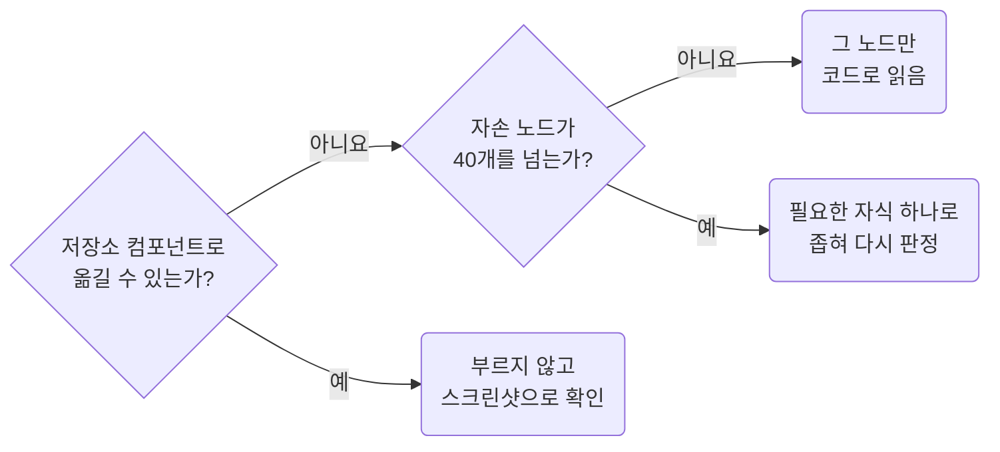

## Call get_design_context Only on Small Unmatched Nodes

**Impact: CRITICAL (가장 비싼 도구의 비용이 디자인 파일의 정리 상태를 따라 불어나지 않게 막습니다)**

`get_design_context`는 저장소 컴포넌트로 옮길 수 없는 요소를 읽을 때만 부르고, 그중 가장 작은 노드를 고릅니다.
이 도구의 비용은 노드 수에 비례하고, 정리되지 않은 레이어일수록 같은 모양에 노드가 많습니다.
저장소에 대응물이 있는 요소는 코드로 읽어도 쓸 곳이 없습니다.



### 대상 판정

| 대상 | 판정 |
| --- | --- |
| 화면 전체, 섹션 전체, 메모 래퍼 | 부르지 않습니다 |
| 반복 목록 전체 | 부르지 않습니다. 대표 항목 하나만 부릅니다 |
| 저장소 컴포넌트에 대응되는 요소 | 부르지 않습니다. 모양은 스크린샷으로 확인합니다 |
| 메타데이터에서 자손 노드가 40개를 넘는 노드 | 부르지 않습니다. 필요한 자식 하나로 좁힙니다 |
| 대응물이 없고 자손 노드가 적은 노드 | 부릅니다 |

자손 노드는 메타데이터에서 그 노드 아래에 있는 모든 노드의 수입니다.
40개는 어림값입니다. 노드 하나가 약 230(Dev Mode 추정 약 63k ÷ 270)이므로 40개면 한 번에 10k 안쪽입니다.
응답이 코드 대신 메타데이터로 오면 노드가 크다는 신호이므로 `forceCode`로 억지로 받지 않고 대상을 좁힙니다.

### 호출 인자

| 인자 | 값 |
| --- | --- |
| `excludeScreenshot` | `true`입니다. 스크린샷은 `get_screenshot`으로 이미 받았습니다 |
| `forceCode` | 켜지 않습니다 |
| `skillNames` | `figma-design-to-code`입니다. 공식 스킬이 요구하는 기록용 값이고, MCP 리소스로 읽었으면 `resource:`를 붙입니다 |
| `clientFrameworks`, `clientLanguages` | 프로젝트의 프레임워크와 언어입니다 |

인스턴스 안쪽 노드의 id(`I12:34;56:78`)는 `get_design_context`만 받습니다.
`get_screenshot`, `get_variable_defs`, `download_assets`에는 그 인스턴스 자체의 id를 넘깁니다.

### 공식 스킬과의 관계

이 도구는 부르기 전에 Figma 공식 `figma-design-to-code` 스킬을 읽으라고 요구합니다.
그 스킬을 읽되 아래 항목은 이 규칙이 우선합니다.
컴포넌트 재사용, 임시 에셋 URL을 코드에 남기지 않기, 에셋 검증처럼 이 규칙과 부딪히지 않는 지시는 그대로 따릅니다.

| 공식 스킬이나 도구 설명의 지시 | 이 규칙 |
| --- | --- |
| 첫 호출에서 스크린샷을 함께 받습니다 | 스크린샷은 이미 받았으므로 뺍니다 |
| 응답이 성기면 보이는 자식 노드를 한꺼번에 병렬로 다시 부릅니다 | 대응물이 없는 자식 하나만 부릅니다 |
| `get_design_context` 응답으로만 구현합니다 | 대응된 요소는 저장소 컴포넌트와 스크린샷으로 구현합니다 |
| 에셋은 다른 도구로 내려받지 않습니다 | 에셋만 필요한 노드는 `download_assets`로 받습니다. 도구 설명이 이 경우를 허용합니다 |
| `get_metadata`보다 `get_design_context`를 먼저 씁니다 | `read-start-with-screenshot-and-metadata` 순서를 따릅니다 |

**Incorrect 1 (성긴 응답을 받고 보이는 자식을 모두 다시 부릅니다):**

```text
get_design_context  12:341 상품 목록            코드 대신 메타데이터, 성김
get_design_context  12:420~12:441 상품 행 22개  병렬                        약 26k
```

**Correct 1 (대응물이 없는 자식 하나만 골라 부릅니다):**

```text
get_design_context  12:341 상품 목록     부르지 않음, 표는 UiTable로 대응
get_design_context  12:377 재고 경고 칩  자손 노드 6개, 대응물 없음        약 1.2k
```

**Incorrect 2 (스크린샷을 다시 받고 큰 노드를 코드로 강제합니다):**

```json
{"fileKey": "Ab12Cd34Ef56Gh78Ij90Kl", "nodeId": "12:341", "forceCode": true}
```

**Correct 2 (스크린샷을 빼고 작은 노드만 읽습니다):**

```json
{"fileKey": "Ab12Cd34Ef56Gh78Ij90Kl", "nodeId": "12:377", "excludeScreenshot": true, "skillNames": "figma-design-to-code"}
```
