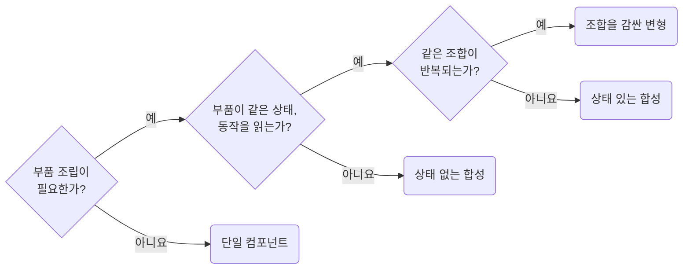

# Choose Single Components, Compound Components, and Variants Deliberately

**Impact: MEDIUM (필요한 확장 범위에 맞춰 단순한 컴포넌트 구조를 선택합니다)**

공용 컴포넌트는 프롭스보다 구조를 먼저 고릅니다.
현재 필요한 단계까지만 적용합니다.

필요한 구조를 고르는 차례입니다.



부품 조립이 필요 없는 고정 UI를 화면 지역 JSX로 둘지는
`screen-extract-local-section-components-for-runtime-boundaries`를 따릅니다.

아래 예제는 같은 대화상자를 필요에 따라 확장합니다.
합성에 상태를 추가해도 사용처의 공개 이름은 유지하고, 반복되는 조합은 변형으로 감쌉니다.
합성 진입 파일은 부품을 `{Root, Header, Body} as const` 객체 하나로 내보냅니다.
상태 있는 합성은 `Root`가 상태를 소유해 부품에 컨텍스트로 내립니다.
렌더 프롭은 `strategy-prefer-children-over-render-props`를,
공개 부품의 범위는 `strategy-expose-only-assembled-compound-parts`를 따릅니다.

**Incorrect 1 (단일, 합성, 변형을 구분하지 않고 한 컴포넌트에 모두 구현합니다):**

```tsx
export interface WgProfileDialogProps {
	isCompact?: boolean;
	showActivity?: boolean;
	showFocus?: boolean;
	dialogTitle?: string;
	renderFooter?: () => ReactNode;
}

export const WgProfileDialog = (props: WgProfileDialogProps) => {
	return (
		<section className={props.isCompact ? "dialog dialog--compact" : "dialog"}>
			<header>
				<h3>{props.dialogTitle}</h3>
			</header>
			<WgProfileSummary />
			{props.showActivity && <WgProfileActivityPanel />}
			{props.showFocus && <WgProfileFocusPanel />}
			<footer>{props.renderFooter?.()}</footer>
		</section>
	);
};
```

**Correct 1 (1단계 — 확장이 필요 없으면 단일 컴포넌트로 둡니다):**

```tsx
/**
 * 프로필 요약만 보여 주는 고정 구조 대화상자
 *
 * 사용처가 끼워 넣을 자리가 없어 부품으로 쪼개지 않는다.
 */
export interface WgProfileDialogProps {
	/**
	 * 헤더에 그릴 제목
	 */
	title: string;
	/**
	 * 요약 영역에 그릴 프로필
	 */
	profile: Profile;
}

export const WgProfileDialog = (props: WgProfileDialogProps) => {
	return (
		<section className={clsx("wg_profileDialog__root")}>
			<header className={clsx("wg_profileDialog__header")}>
				<h3>{props.title}</h3>
			</header>
			<WgProfileSummary profile={props.profile} />
		</section>
	);
};
```

> 나머지 예시와 예외는 [full rule](../rules/04-01-strategy-choose-single-composition-compound-and-variants.md)에 있습니다.
