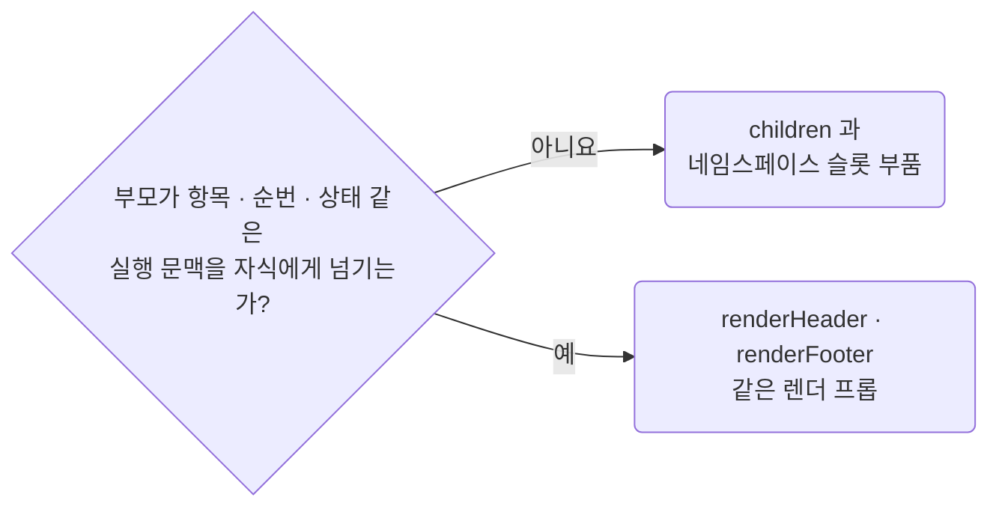

# Prefer Children Over Render Props for Static Composition

**Impact: MEDIUM (실행 문맥이 필요 없는 조립을 JSX 구조로 바로 읽을 수 있습니다)**

상태 없는 합성으로 충분한 공용 컴포넌트는 렌더 프롭보다 `children`을 우선합니다.

### 슬롯 고르기

슬롯을 고르는 차례입니다.



### 슬롯 계약 이름

| 별도 이름이 필요한 계약 | 이름 |
| --- | --- |
| `ReactNode` 값 | `<Owner>Slot` |
| 실행 문맥을 받아 `ReactNode`를 만드는 함수 | `<Owner>Renderer` |

한 번만 쓰는 익명 형태에 접미사를 붙이려고 새 타입을 만들지는 않습니다.

**Incorrect 1 (정적인 구조를 렌더 프롭으로 조립합니다):**

```tsx
// component/ui/panel/ui-panel.tsx
export interface UiPanelProps {
	renderHeader?: () => ReactNode;
	renderFooter?: () => ReactNode;
}

export const UiPanel = (props: UiPanelProps) => {
	return (
		<section className={clsx("ui_panel__root")}>
			{props.renderHeader?.()}
			<UiItemList />
			{props.renderFooter?.()}
		</section>
	);
};
```

**Correct 1 (부품이 `children`으로 사용처가 넣을 자리를 엽니다):**

```tsx
// component/ui/panel/_ui-panel-root.tsx
import {clsx} from "clsx";

import type {UiPanelPartProps} from "@/component/ui/panel/_type/panel-part";

/**
 * 패널 틀. 나머지 부품은 이 안에서만 그린다
 */
export const UiPanelRoot = (props: UiPanelPartProps) => {
	return <section className={clsx("ui_panel__root")}>{props.children}</section>;
};
```

> 나머지 예시 · 예외는 [full rule](../rules/04-04-strategy-prefer-children-over-render-props.md)에 있습니다.
