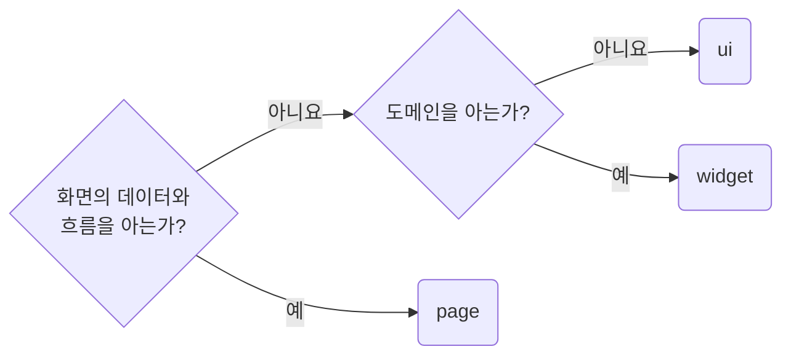

## Keep UI, Widget, and Page Ownership Separate

**Impact: CRITICAL (공용 책임과 화면 전용 책임이 같은 레이어에 섞이지 않습니다)**

컴포넌트의 레이어는 사용 횟수나 조립 규모가 아니라 **무엇을 아는지**로 나눕니다.

### 판정 차례

무엇을 아는지 확인하는 차례입니다.



아래 조건 중 하나라도 걸리면 `page`입니다.

| 조건 | 레이어 |
| --- | --- |
| 화면의 응답, 뷰모델 타입이나 라우트 search 파라미터를 프롭스 타입에서 참조함 | `page` |
| 쿼리, 뮤테이션, 라우터 훅, 화면 스토어를 직접 호출함 | `page` |
| 해당 화면의 `Suspense` 경계, 폼 프로바이더, 모달을 여는 조건을 소유함 | `page` |

하나도 걸리지 않으면 도메인을 아는 쪽이 `widget`, 모르는 쪽이 `ui`입니다.
`widget`은 이름에 도메인 단어가 남아도 됩니다.

### 근거가 되지 않는 조건

`children`과 공용 계약만 받아 경계를 제공하는 범용 셸, 대화상자는 그 이유만으로 `page`가 되지 않습니다.
특정 화면의 데이터나 흐름을 아는지 확인합니다.

한 화면에서만 쓴다는 사실은 `page` 조건이 아니므로 사용 횟수만으로 레이어를 바꾸지 않습니다.
여러 `ui` 부품을 조립해도 도메인을 모르면 `ui`입니다. 조립 규모로 `widget`을 고르지 않습니다.

레이어를 정한 뒤 파일명과 심볼에는 `ownership-prefix-layer-names-on-files-and-symbols`를 적용합니다.

**Incorrect 1 (라우터 훅을 부르는 화면 전용 로직이 `widget`에 남아 있습니다):**

```tsx
// component/widget/product-toolbar/_wg-product-toolbar-delete-button.tsx
export const WgProductToolbarDeleteButton = () => {
	const navigate = useNavigate();

	/**
	 * 삭제 후 목록으로 이동
	 */
	const handleDeleteButtonClick: MouseEventHandler<HTMLButtonElement> = () => {
		void navigate("/products");
	};

	return <UiButton onClick={handleDeleteButtonClick}>삭제</UiButton>;
};
```

**Correct 1 (라우터 훅을 호출하는 코드는 화면 레이어에 둡니다):**

```tsx
// page/products/_pg-delete-product-button.tsx
export const PgDeleteProductButton = () => {
	const navigate = useNavigate();

	/**
	 * 삭제 후 목록으로 이동
	 */
	const handleDeleteButtonClick: MouseEventHandler<HTMLButtonElement> = () => {
		void navigate("/products");
	};

	return <UiButton onClick={handleDeleteButtonClick}>삭제</UiButton>;
};
```

**Incorrect 2 (화면 타입, 훅과 무관한 부품을 사용 횟수만으로 화면 레이어에 둡니다):**

```tsx
// page/product-detail/_pg-product-status-badge.tsx
// 프롭스가 도메인 타입 하나만 받고 훅도 부르지 않는다. 이 화면에서만 쓴다는 이유로 남아 있다.
export const PgProductStatusBadge = (props: PgProductStatusBadgeProps) => {
	return <svg className={clsx("pg_productStatusBadge__root")}>{props.children}</svg>;
};
```

**Correct 2 (화면 타입, 훅과 무관한 도메인 부품은 `widget`에 둡니다):**

```tsx
// component/widget/product-table/_wg-product-status-badge.tsx
export const WgProductStatusBadge = (props: WgProductStatusBadgeProps) => {
	return <svg className={clsx("wg_productTable__statusBadge")}>{props.children}</svg>;
};
```

**Incorrect 3 (도메인을 모르는 그래프 그리기를 조립 규모만 보고 `widget`에 둡니다):**

```tsx
// component/widget/chart-card/wg-chart-card.tsx
// 프롭스가 좌표 배열만 받고 도메인 타입을 모른다. widget 폴더에 있다는 이유로 남아 있다.
export const WgChartCard = (props: WgChartCardProps) => {
	return <svg className={clsx("wg_chartCard__root")}>{props.children}</svg>;
};
```

**Correct 3 (도메인 지식이 없는 조합은 `ui`에 둡니다):**

```tsx
// component/ui/line-chart/ui-line-chart.tsx
export const UiLineChart = (props: UiLineChartProps) => {
	return <svg className={clsx("ui_lineChart__root")}>{props.children}</svg>;
};
```

**Correct (도메인을 아는 조립은 `widget`이 맡아 `ui` 부품을 씁니다):**

```tsx
// component/widget/chart-card/wg-chart-card.tsx
import {UiLineChart} from "@/component/ui/line-chart/ui-line-chart";

export const WgChartCard = (props: WgChartCardProps) => {
	return <UiLineChart points={toChartPoints(props.dailyCounts)} />;
};
```
