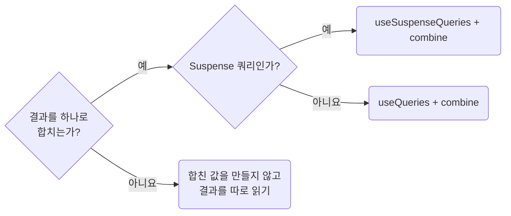

## Combine Multiple Queries With `combine`

**Impact: MEDIUM (여러 응답의 가공 위치를 통일하고 화면 본문의 별칭을 줄입니다)**

둘 이상의 쿼리 결과를 하나로 합칠 때는 값을 렌더하는 섹션에서 `combine`을 인라인으로 씁니다.
결과를 합칠 필요와 요청을 병렬로 시작할 필요는 따로 판단합니다.

### 합치는 방법 고르기

합칠 방법을 고르는 차례입니다.



| 상황 | 선택 |
| --- | --- |
| Suspense 쿼리 결과를 합침 | `useSuspenseQueries` + `combine`. `isPending`을 만들어 내보내지 않습니다 |
| 일반 쿼리 결과를 합침 | `useQueries` + `combine`. 실제 대기 · 실패 상태도 함께 다룹니다 |
| 결과를 각각 렌더함 | 합친 값을 만들지 않습니다. Suspense 병렬 실행이 필요하면 `useSuspenseQueries`에서 결과를 따로 읽습니다 |
| 일반 쿼리의 뒤 요청이 앞 결과를 입력으로 받음 | `enabled`로 입력이 준비된 뒤 실행합니다 |
| Suspense 쿼리의 뒤 요청이 앞 결과를 입력으로 받음 | 같은 컴포넌트에서 `useSuspenseQuery`를 순서대로 호출합니다 |

### 실행 차례와 재계산

`useSuspenseQuery`, `useSuspenseQueries`는 `enabled`를 받지 않습니다.
필수 입력이 없으면 쿼리를 호출하는 자식의 렌더를 보류합니다.
독립적인 Suspense 쿼리도 같은 컴포넌트에서 따로 호출하면 앞 요청부터 순서대로 진행됩니다.
Suspense의 불필요한 대기 분기는 `runtime-avoid-ad-hoc-loading-branches`를 따릅니다.

| 함께 판단할 내용 | 기준 |
| --- | --- |
| 한 쿼리만 가공함 | 자기 쿼리 데이터만 받는 `select`를 씁니다. `data-shape-query-data-with-select`를 따릅니다 |
| 화면 본문에서 두 `data`를 꺼내 합침 | 출처를 잃는 상단 별칭을 만들지 않습니다. `screen-keep-derived-values-close`를 따릅니다 |
| 라우트 진입이 데이터 소유자를 겸함 | `screen-keep-route-flow-visible`의 작은 화면 예외를 따릅니다 |
| 조합을 커스텀 훅으로 추출함 | 여러 소유자가 같은 조합을 호출할 때만 `_hook`으로 옮깁니다. 파일 분량은 근거가 아닙니다 |

구조 공유는 합친 결과에서 바뀌지 않은 부분의 참조를 유지하지만 계산을 생략하지는 않습니다.
인라인 함수는 렌더마다 참조가 달라져 다시 계산될 수 있습니다.
재실행만을 이유로 `useCallback`, `useMemo`를 더하지 않고,
실측 병목이 있을 때만 `perf-avoid-defensive-memoization`의 예외 기준을 따릅니다.
반복 조회 인덱스는 `typescript/values-use-set-and-map-for-repeated-lookups`를 따릅니다.

**Incorrect 1 (화면 본문에서 두 응답을 꺼내 합칩니다):**

```tsx
const responseProductListSuspense = useProductListSuspense();
const responseCategoryListSuspense = useCategoryListSuspense();

const rows = responseProductListSuspense.data.products.map((product) => ({
	id: product.id,
	categoryName: responseCategoryListSuspense.data.categories.find(
		(category) => category.id === product.categoryId,
	)?.name,
}));
```

**Correct 1 (값을 렌더하는 섹션이 인라인 `combine`으로 합칩니다):**

```tsx
export const PgProductTableSection = () => {
	/**
 * 분류 이름이 목록 응답에 없어서 표 한 행에 두 응답을 함께 담는다
	 */
	const responseProductRowsSuspense = useSuspenseQueries({
		queries: [productListQueryOptions(), categoryListQueryOptions()],
		combine: ([productResult, categoryResult]) => {
			// 분류 응답의 id는 유일하다. 모든 행이 같은 분류 목록을 찾아 Map을 한 번 만든다
			const categoryById = new Map(categoryResult.data.categories.map((category) => [category.id, category]));

			return {
				rows: productResult.data.products.map((product) => ({
					id: product.id,
					categoryName: categoryById.get(product.categoryId)?.name,
				})),
			};
		},
	});

	return <UiTable rows={responseProductRowsSuspense.rows} />;
};
```
