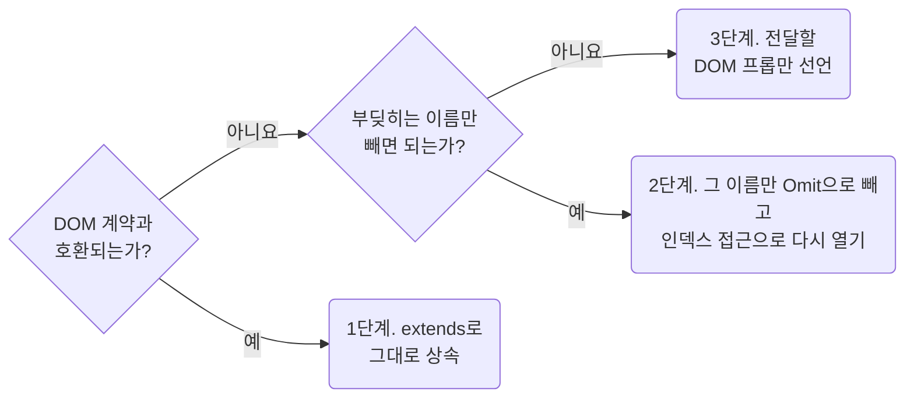

## Open DOM Props in Three Steps

**Impact: HIGH (프롭 타입 충돌을 해결하면서 필요한 DOM 속성과 이벤트를 유지합니다)**

공개할 계약은 `typing-narrow-library-wrapper-contracts`로 정합니다.
그다음 DOM 속성은 아래 순서로 엽니다.
같은 요소로 `{...props}`를 전달하는 래퍼는 1 · 2단계 중 컴파일되는 형태를 씁니다.

### 여는 차례

DOM 속성을 어느 단계로 열지 고르는 차례입니다.



1. DOM 계약과 호환되면 `extends <요소>HTMLAttributes<T>`로 씁니다.
2. 같은 이름 프롭의 타입이 호환되지 않으면 `extends Omit<<요소>HTMLAttributes<T>, "size">`처럼
   충돌하는 이름만 빼고, 그 프롭을 인덱스 접근으로 다시 엽니다.
3. 감싸는 요소와 이벤트 대상이 다르거나 자기 프롭을 하나씩 전달하면
   `extends` 없이 전달할 DOM 프롭만 선언합니다.

| 함께 판단할 내용 | 기준 |
| --- | --- |
| 요소 전용 타입 | 버튼은 `ButtonHTMLAttributes`, 입력은 `InputHTMLAttributes`, 셀은 `TdHTMLAttributes`를 씁니다 |
| 전용 타입이 없는 요소 | `tr`처럼 전용 타입이 없을 때만 `HTMLAttributes`를 씁니다 |
| 호환되는 좁히기 | `string`을 문자열 리터럴 유니언으로 좁히면 1단계가 컴파일됩니다. 숫자 `size`를 문자열 크기 이름으로 바꾸는 경우에는 2단계가 필요합니다 |
| 요소 타입이 다름 | 겉은 `div`, 이벤트 대상은 `input`이면 `Omit`만으로 해결하지 않습니다 |

요소 타입이 다르면 필요한 DOM 프롭을 `string`, `ChangeEventHandler<HTMLInputElement>` 같은 플랫폼 타입으로 적습니다.

### 상속으로 열리는 범위

`HTMLAttributes`만 쓰면 `disabled`, `type`, `colSpan` 같은 전용 속성을 잃습니다.
`value` · `onChange`처럼 DOM이 정한 이름은 라이브러리 고유 계약이 아닙니다.
자기 프롭과 전달 방식은 `typing-choose-wrapper-shape-and-forwarding`을 따릅니다.
DOM 속성은 리액트가 추가한 속성도 받아야 하는 열린 집합이므로, 충돌한 이름만 `Omit`으로 뺍니다.
나머지를 직접 나열하지 않는 이 방식은 `typescript/types-reuse-existing-contracts-before-new-types`가 허용합니다.

선언되지 않은 `aria-*` · `data-*`는 JSX의 하이픈 이름이라 오류 없이 통과할 수 있지만,
이미 선언된 속성의 값은 타입 검사를 받습니다. 컴파일 결과뿐 아니라 실제 DOM 전달 코드도 확인합니다.
`HTMLAttributes`를 상속하면 `style`도 열리므로,
사용 여부는 `css/composition-do-not-style-through-the-style-attribute`를 따릅니다.

**Incorrect 1 (프롭 타입 하나의 충돌 때문에 DOM 속성 전체를 제외합니다):**

```tsx
// id · role · tabIndex · aria-* · 이벤트를 전부 잃고 다섯 개만 남았다
export interface UiButtonProps {
	className?: string;
	children?: ReactNode;
	color?: ButtonProps["color"];
	disabled?: ButtonProps["disabled"];
	onClick?: MouseEventHandler<HTMLButtonElement>;
}
```

**Correct 1 (1단계 — 같은 이름의 프롭도 호환되면 그대로 상속합니다):**

```tsx
import {Button} from "@mui/material";
import type {ButtonProps} from "@mui/material";
import {clsx} from "clsx";
import type {ButtonHTMLAttributes} from "react";

/**
 * 라이브러리 버튼의 강조 단계를 여는 계약
 *
 * color의 문자열 리터럴들은 DOM의 string에 할당할 수 있어 Omit이 필요 없다.
 */
export interface UiButtonProps extends ButtonHTMLAttributes<HTMLButtonElement> {
	/**
	 * 강조 단계
	 */
	color?: ButtonProps["color"];
}

export const UiButton = (props: UiButtonProps) => {
	return <Button {...props} className={clsx("ui_button__root", props.className)} />;
};
```

**Correct (2단계 — 호환되지 않는 정렬 프롭만 빼고 다시 엽니다):**

```tsx
import {TableCell} from "@mui/material";
import type {TableCellProps} from "@mui/material";
import {clsx} from "clsx";
import type {TdHTMLAttributes} from "react";

/**
 * 라이브러리 셀의 정렬과 여백을 여는 계약
 *
 * align의 inherit은 DOM td 타입에 없어 그 이름만 빼고 다시 연다.
 */
export interface UiTableCellProps extends Omit<TdHTMLAttributes<HTMLTableCellElement>, "align"> {
	/**
	 * 내용 가로 정렬
	 */
	align?: TableCellProps["align"];
	/**
	 * 셀 여백
	 */
	padding?: TableCellProps["padding"];
}

export const UiTableCell = (props: UiTableCellProps) => {
	return <TableCell {...props} className={clsx("ui_tableCell__root", props.className)} />;
};
```

**Correct (3단계 — 요소 타입이 달라 필요한 프롭만 선언합니다):**

```tsx
import {TextField} from "@mui/material";
import type {TextFieldProps} from "@mui/material";
import {clsx} from "clsx";
import type {ChangeEventHandler} from "react";

/**
 * 라벨과 값을 받는 한 줄 입력 계약
 *
 * 겉은 `div`인데 이벤트는 안쪽 `input`이 받아 요소 전용 인터페이스를 그대로 못 쓴다.
 * 입력 이름을 반드시 보여 주려고 label은 선택적인 ReactNode 대신 필수 문자열로 좁힌다.
 */
export interface UiTextFieldProps {
	/**
	 * 입력 위에 보이는 이름
	 */
	label: string;
	/**
	 * 최상위에 얹을 클래스
	 */
	className?: string;
	/**
	 * 입력 식별자
	 */
	id?: string;
	/**
	 * 입력값
	 */
	value: string;
	/**
	 * 입력이 바뀔 때
	 */
	onChange: ChangeEventHandler<HTMLInputElement>;
	/**
	 * 오류 표시 여부
	 */
	error?: TextFieldProps["error"];
}

export const UiTextField = (props: UiTextFieldProps) => {
	return (
		<TextField
			className={clsx("ui_textField__root", props.className)}
			id={props.id}
			label={props.label}
			value={props.value}
			onChange={props.onChange}
			error={props.error}
		/>
	);
};
```
