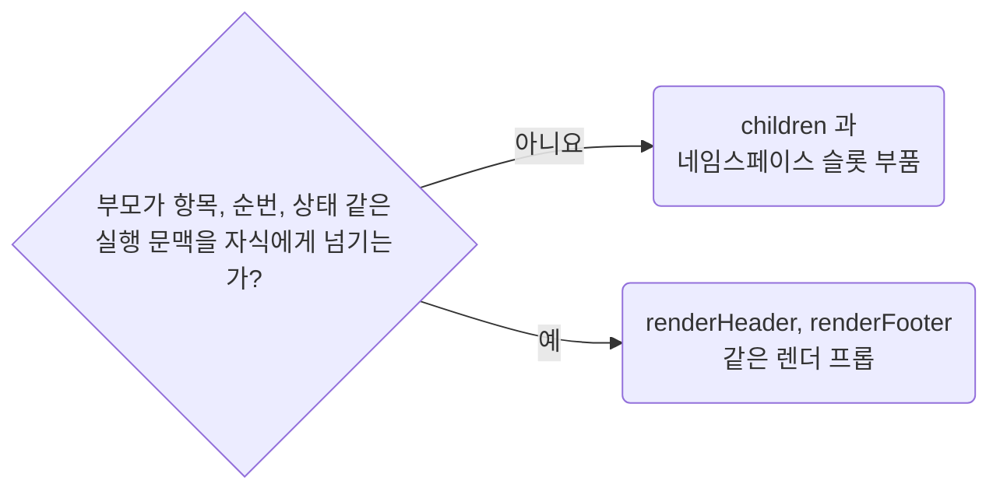

## Prefer Children Over Render Props for Static Composition

**Impact: MEDIUM (실행 문맥이 필요 없는 조립을 JSX 구조로 바로 읽을 수 있습니다)**

상태 없는 합성으로 충분한 공용 컴포넌트는 렌더 프롭보다 `children`을 우선합니다.

### 슬롯 고르기

슬롯을 고르는 차례입니다.



### 슬롯 계약 이름

| 별도 이름이 필요한 계약 | 이름 |
| --- | --- |
| `ReactNode` 값 | `<Owner>Slot` |
| 실행 문맥을 받아 `ReactNode`를 만드는 함수 | `<Owner>Renderer` |

한 번만 쓰는 익명 형태에 접미사를 붙이려고 새 타입을 만들지는 않습니다.

**Incorrect 1 (정적인 구조를 렌더 프롭으로 조립합니다):**

```tsx
// component/ui/panel/ui-panel.tsx
export interface UiPanelProps {
	renderHeader?: () => ReactNode;
	renderFooter?: () => ReactNode;
}

export const UiPanel = (props: UiPanelProps) => {
	return (
		<section className={clsx("ui_panel__root")}>
			{props.renderHeader?.()}
			<UiItemList />
			{props.renderFooter?.()}
		</section>
	);
};
```

**Correct 1 (부품이 `children`으로 사용처가 넣을 자리를 엽니다):**

```tsx
// component/ui/panel/_ui-panel-root.tsx
import {clsx} from "clsx";

import type {UiPanelPartProps} from "@/component/ui/panel/_type/panel-part";

/**
 * 패널 틀. 나머지 부품은 이 안에서만 그린다
 */
export const UiPanelRoot = (props: UiPanelPartProps) => {
	return <section className={clsx("ui_panel__root")}>{props.children}</section>;
};
```

**Correct (부품 계약, 진입 파일, 화면 조립을 파일마다 나눕니다):**

```ts
// component/ui/panel/_type/panel-part.ts
/**
 * 패널 부품 셋이 나눠 쓰는 계약
 *
 * 세 부품 모두 받는 것이 `children` 하나뿐이라 형태를 하나로 둔다.
 */
export interface UiPanelPartProps {
	/**
	 * 그 부품 자리에 사용처가 넣을 내용
	 */
	children: ReactNode;
}
```

```tsx
// component/ui/panel/ui-panel.tsx
import {UiPanelFooter} from "@/component/ui/panel/_ui-panel-footer";
import {UiPanelHeader} from "@/component/ui/panel/_ui-panel-header";
import {UiPanelRoot} from "@/component/ui/panel/_ui-panel-root";

// Header 와 Footer 도 Root 와 같은 형태로 children 만 받는다
export const UiPanel = {
	Root: UiPanelRoot,
	Header: UiPanelHeader,
	Footer: UiPanelFooter,
} as const;
```

```tsx
// page/products/pg-products.tsx
import {Fragment} from "react";

import {UiPanel} from "@/component/ui/panel/ui-panel";

export const PgProducts = () => {
	return (
		<Fragment>
			<UiPanel.Root>
				<UiPanel.Header>
					<h2>제품</h2>
					<PgProductSearchField />
				</UiPanel.Header>
				<PgProductList />
				<UiPanel.Footer>
					<UiPagination />
				</UiPanel.Footer>
			</UiPanel.Root>

			<UiPanel.Root>
				<UiPanel.Header>
					<h2>제품 등록</h2>
				</UiPanel.Header>
				<PgProductCreateForm />
			</UiPanel.Root>
		</Fragment>
	);
};
```
