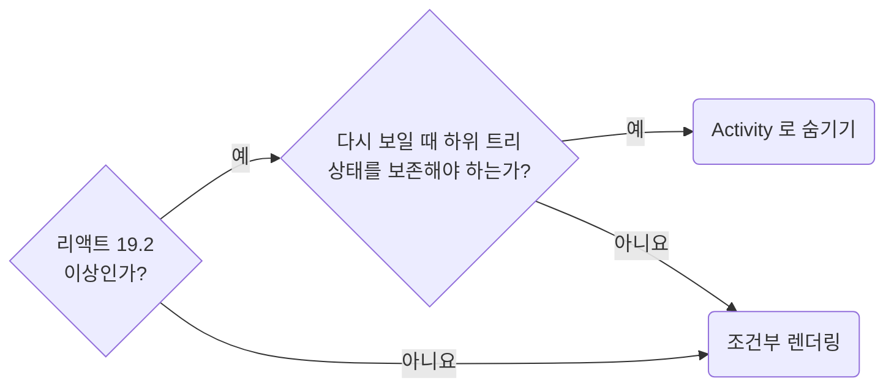

## Use Activity Only to Preserve Mounted Subtrees

**Impact: HIGH (상태 보존과 초기화 요구에 맞는 렌더 방식을 선택합니다)**

기본은 조건부 렌더링입니다.

### 렌더 방식 고르기

렌더 방식을 고르는 차례입니다.



### 두 방식의 차이

| 비교 항목 | 조건부 렌더링으로 제거 | `<Activity mode="hidden">` |
| --- | --- | --- |
| 상태와 DOM | 버립니다 | 보존합니다 |
| 이펙트 | 정리하고 다시 마운트할 때 설치합니다 | 숨길 때 정리하고 다시 보일 때 설치합니다 |
| 숨긴 동안 렌더 | 없습니다 | 업데이트가 생기면 낮은 우선순위로 렌더합니다 |
| 접근성 트리 | 빠집니다 | `display: none`이 적용되어 빠집니다 |

### 확인할 조건

| 확인할 조건 | 처리 |
| --- | --- |
| 편집 취소 뒤 폼처럼 상태와 DOM을 초기화해야 함 | 조건부 렌더링을 유지합니다 |
| 구독 해제나 접근성이 목적임 | 두 방식의 차이가 아니므로 `<Activity>`를 고르는 근거로 삼지 않습니다 |
| 이펙트 정리와 재설치가 반복됨 | 상태가 남아 있어도 정상 동작하도록 작성합니다 |
| 동영상 재생 등 DOM 자체 동작을 멈춰야 함 | DOM 보존으로 계속될 수 있으므로 이펙트 정리에서 명시적으로 멈춥니다 |
| 하위 트리가 무거움 | 숨겨도 업데이트 시 렌더되므로 습관적으로 보존하지 않습니다 |

**Incorrect 1 (초기화해야 할 폼을 숨겨 상태를 보존합니다):**

```tsx
// 편집을 취소했다가 다시 들어가면 지난 입력이 그대로 남는다
return (
	<Fragment>
		<Activity mode={isEditing ? "visible" : "hidden"}>
			<PgProductEditorForm />
		</Activity>
		<Activity mode={isEditing ? "hidden" : "visible"}>
			<PgProductPreviewPane />
		</Activity>
	</Fragment>
);
```

**Correct 1 (폼 초기화가 필요하면 조건부 렌더링을 유지합니다):**

```tsx
// 편집을 취소하면 폼이 해제돼서 다시 들어갈 때 빈 입력으로 시작한다
return (
	<Fragment>
		{isEditing && <PgProductEditorForm />}
		{!isEditing && <PgProductPreviewPane />}
	</Fragment>
);
```

**Incorrect 2 (다시 보여 줄 때 필요한 상태를 조건부 렌더링으로 잃습니다):**

```tsx
// page/products/_pg-product-sidebar.tsx: 접어 둔 노드와 스크롤 위치를 자기 상태로 갖는다
export const PgProductSidebar = () => {
	const [expandedItems, setExpandedItems] = useState<string[]>([]);

	return <UiTree expandedItems={expandedItems} onExpandedItemsChange={setExpandedItems} />;
};
```

```tsx
// page/products/pg-products.tsx: 닫으면 해제돼서 접어 둔 노드와 스크롤 위치가 사라진다
return isSidebarOpen && <PgProductSidebar />;
```

**Correct 2 (다시 보여 줄 때 하위 트리 상태를 보존해야 하는 경우에만 씁니다):**

```tsx
// page/products/_pg-product-sidebar.tsx: 접어 둔 노드와 스크롤 위치를 자기 상태로 갖는다
export const PgProductSidebar = () => {
	const [expandedItems, setExpandedItems] = useState<string[]>([]);

	return <UiTree expandedItems={expandedItems} onExpandedItemsChange={setExpandedItems} />;
};
```

```tsx
// page/products/pg-products.tsx: 닫아도 상태와 DOM을 보존하고 이펙트는 정리한다
return (
	<Activity mode={isSidebarOpen ? "visible" : "hidden"}>
		<PgProductSidebar />
	</Activity>
);
```
