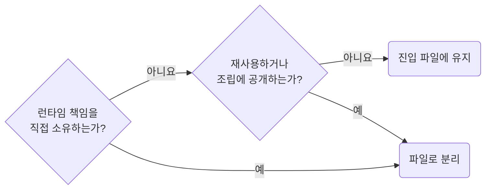

## Split Owner Parts Only for Runtime Boundaries

**Impact: HIGH (자체 책임이 있는 부품만 분리해 소유자 안 파일 수와 구조를 읽기 쉽게 유지합니다)**

`widget`과 `ui` 컴포넌트 안의 부품은 아래 책임 중 하나를 직접 소유할 때만 파일로 뗍니다.
단순 래퍼, `className` 묶음, 들여쓰기 감소, 긴 파일은 분리 근거가 아닙니다.

### 분리 근거가 되는 책임

부품을 파일로 뗄지 정하는 차례입니다.



| 책임 | 예 |
| --- | --- |
| 비동기 | `Suspense` · 스켈레톤 · 로딩 · 오류 · 빈 상태 |
| 상태와 프로바이더 | 지역 상태 · 이펙트 동기화 · 폼 프로바이더 · 컨텍스트 · 범위를 좁힌 스토어 |
| 상호작용 | 팝오버 · 모달 · 선택 · 인라인 편집 · 드래그 · 펼치는 트리 |
| 라이브러리와 성능 | 외부 라이브러리 생명주기 어댑터 · 가상 스크롤 · 전환 · 지연 값 |

책임 표는 `screen-extract-local-section-components-for-runtime-boundaries`와 같습니다.

### `widget` · `ui` 전용 책임

아래 두 책임은 `widget`, `ui`에만 적용합니다.

| 책임 | 예 |
| --- | --- |
| 재사용 | 같은 소유자 안 두 곳 이상이 같은 부품을 렌더 |
| 조립 | 사용처가 넣고 빼거나 스타일을 바꾸도록 공개하는 합성 부품 |

컨텍스트를 읽어 분기만 하는 부품은 진입 파일에 남깁니다.
라우트 진입 파일의 섹션은 `screen-extract-local-section-components-for-runtime-boundaries`가 같은 기준으로 판단합니다.
뗀 파일의 이름은 `ownership-prefix-layer-names-on-files-and-symbols`를 따릅니다.
자리는 `ownership-place-owner-files-in-role-folders`를 따릅니다.

**Incorrect 1 (컨텍스트를 읽어 분기만 하는 래퍼를 파일로 뗍니다):**

```tsx
// component/widget/chatbot/_wg-chat-content.tsx: 어느 화면을 그릴지 고르기만 하고 상태를 소유하지 않는다
export const WgChatContent = () => {
	const chat = useChatContext();

	return (
		<Fragment>
			{chat.isEmpty && <p className={clsx("wg_chatbot__empty")}>{chat.emptyMessage}</p>}
			{!chat.isEmpty && <WgChatMessages messages={chat.messages} />}
		</Fragment>
	);
};
```

**Correct 1 (분기는 진입 파일에 남기고 상태를 소유한 부품만 뗍니다):**

```tsx
// component/widget/chatbot/wg-chatbot.tsx
/**
 * 챗봇 위젯 진입. 대화 목록과 입력 폼을 조립한다
 */
export const WgChatbot = () => {
	const chat = useChatContext();

	return (
		<section className={clsx("wg_chatbot__root")}>
			{/**
			 * 대화 목록. 비어 있으면 안내 문구를 그린다
			 */}
			{chat.isEmpty && <p className={clsx("wg_chatbot__empty")}>{chat.emptyMessage}</p>}
			{!chat.isEmpty && <WgChatMessages messages={chat.messages} />}
			{/**
			 * 입력 폼. 전송 중 상태와 폼 프로바이더를 소유해 _wg-chat-composer.tsx 로 뗐다
			 */}
			<WgChatComposer onSubmit={chat.send} />
		</section>
	);
};
```
