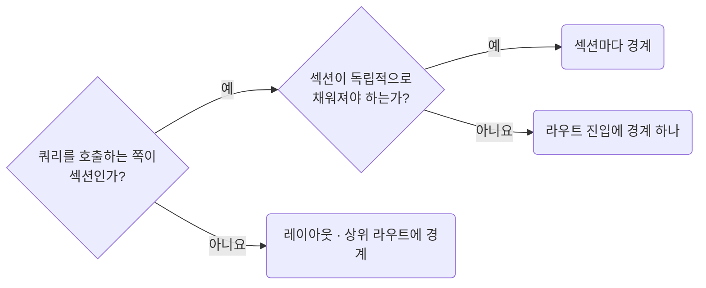

## Place Suspense Boundaries at the Section Owner

**Impact: HIGH (초기 로딩을 섹션 소유자의 경계에서 처리합니다)**

`Suspense` 쿼리를 쓰는 컴포넌트의 바로 위 섹션 소유자에 경계와 대체 화면을 둡니다.
쿼리를 호출하는 컴포넌트는 자기 자신을 경계로 감쌀 수 없습니다.

경계 자리를 고르는 차례입니다.



| 상황 | 경계 위치 |
| --- | --- |
| 섹션이 따로 없음 | 라우트 진입 |
| 라우트 진입이 직접 쿼리를 호출함 | 해당 라우트의 레이아웃 또는 상위 라우트 |
| 섹션이 독립적으로 채워져야 함 | 이때만 경계를 나눕니다. 한 화면에 불필요하게 여러 겹 쌓지 않습니다 |

대체 화면의 컨테이너, 높이는 `css/layout-keep-layout-intent-explicit`을 따릅니다.
본문에 남은 로딩 분기는 `runtime-avoid-ad-hoc-loading-branches`로 판단합니다.

**Incorrect 1 (진입에 경계가 없어 화면 전체가 함께 멈춥니다):**

```tsx
// page/products/pg-products.tsx: PgProductTreeSection이 Suspense 쿼리를 부르는데 감싸는 경계가 없다
return <PgProductTreeSection />;
```

**Correct 1 (섹션 소유자가 경계와 대체 화면을 가집니다):**

```tsx
// page/products/pg-products.tsx: 쿼리를 부르는 섹션을 경계로 감싼다
return (
	<Suspense fallback={<PgProductTreeSkeleton />}>
		<PgProductTreeSection />
	</Suspense>
);
```

**Incorrect 2 (한 화면에 경계를 여러 겹 쌓습니다):**

```tsx
// page/products/_pg-product-tree-section.tsx: 진입 파일이 이미 경계를 갖는데 같은 쿼리를 다시 감싼다
export const PgProductTreeSection = () => {
	return (
		<Suspense fallback={<PgProductTreeSkeleton />}>
			<PgProductTreeInner />
		</Suspense>
	);
};
```

**Correct 2 (라우트 진입이 직접 쿼리를 부르면 진입을 감싸는 레이아웃이 경계를 가집니다):**

```tsx
// page/products/pg-products.tsx: 섹션이 따로 없어 진입이 쿼리를 부른다. 경계는 이 진입을 그리는 셸이 갖는다
export const PgProducts = () => {
	const responseProductListSuspense = useProductListSuspense();

	return <UiTable rows={responseProductListSuspense.data.products} />;
};
```

**Correct (쿼리를 부르는 섹션은 자기 자신을 감싸지 않습니다):**

```tsx
// page/products/_pg-product-tree-section.tsx
export const PgProductTreeSection = () => {
	/**
	 * 사이드바 분류 트리를 읽는다. 이 쿼리가 멈추는 동안은 진입 파일의 경계가 받는다
	 */
	const responseProductTreeSuspense = useProductTreeSuspense();

	return <UiTree items={responseProductTreeSuspense.data.categoryNodes} />;
};
```
