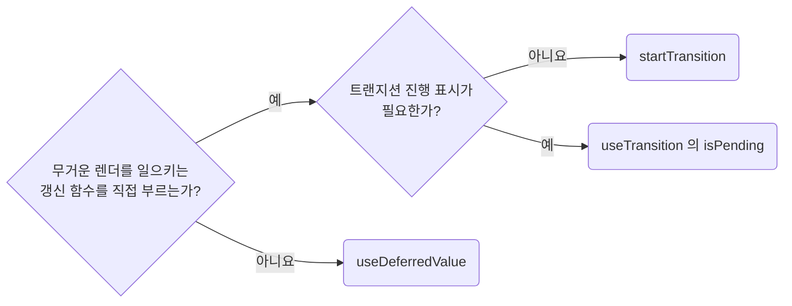

## Defer Heavy Renders Only With Measured Evidence

**Impact: MEDIUM (측정한 렌더 병목에만 트랜지션과 지연 값을 적용합니다)**

`startTransition`, `useTransition`, `useDeferredValue`는 렌더 비용을 측정한 뒤 사용합니다.
목록 행 수와 조작별 소요 시간을 확인하고, `perf-avoid-defensive-memoization`의 예외나 예상 규모만 근거로 삼지 않습니다.

### 지연 도구 고르기

지연 도구를 고르는 차례입니다.



| 상황 | 선택 |
| --- | --- |
| 직접 호출하는 상태 갱신이 무거운 렌더를 일으킴 | `startTransition`으로 호출을 감쌉니다. 프롭으로 받은 갱신 함수도 같습니다 |
| 값은 즉시 반응해야 하지만 파생 렌더는 미룰 수 있음 | `useDeferredValue`로 지연 값을 만듭니다 |
| 갱신 함수를 호출할 수 없고 프롭 · 훅 반환값만 받음 | `useDeferredValue`를 씁니다 |
| 트랜지션 진행 표시가 필요함 | 대기 상태를 주지 않는 `startTransition` 대신 `useTransition`의 `isPending`을 씁니다 |

입력값 자체, 폼 오류, 즉시 비활성화 같은 급한 반응은 트랜지션에 넣지 않습니다.
`await` 뒤에는 리액트가 트랜지션 문맥을 이어가지 못하므로 상태 갱신을 다시 `startTransition`으로 감쌉니다.

### 최적화 조건

| 무거운 작업 | 최적화 조건 |
| --- | --- |
| 하위 트리 렌더 | 같은 프롭이면 렌더를 건너뛸 수 있어야 합니다. 컴파일러가 이를 제공하지 않으면 지연 값을 받는 컴포넌트를 `memo`로 감쌉니다 |
| 함께 전달하는 객체 · 콜백 | 매번 달라지면 `memo`가 있어도 다시 렌더되므로 참조를 확인합니다 |
| 지연 값에서 파생되는 계산 | 컴포넌트 `memo` 대신 `useMemo`로 지연 값이 바뀔 때만 재계산합니다. 측정 근거를 주석으로 남깁니다 |

지연 값 기준 재계산은 `perf-avoid-defensive-memoization`의 허용 사유에 해당합니다.
`startTransition`의 콜백은 즉시 실행되며, 안쪽의 무거운 동기 계산이나 네트워크 요청 자체를 미루지 않습니다.
`useDeferredValue`는 고정 지연 시간이 없고 요청 횟수를 줄이는 디바운스도 아닙니다.
긴 동기 계산 하나는 실행 도중 중단되지 않으므로 렌더 지연만으로 입력 지연이 사라진다고 가정하지 않습니다.

**Incorrect 1 (행 20개 목록을 다시 렌더하는 갱신까지 트랜지션으로 감쌉니다):**

```tsx
const [selectedTagId, setSelectedTagId] = useState("all");
const tagRows = responseTagListSuspense.data.tags.slice(0, 20);

const handleTagClick = (nextTagId: string) => {
	startTransition(() => {
		setSelectedTagId(nextTagId);
	});
};

return <UiTagRows rows={tagRows} selectedTagId={selectedTagId} />;
```

**Correct 1 (측정 근거가 있는 갱신만 트랜지션으로 감싸고 행 20개 목록은 그대로 둡니다):**

```tsx
const handleTagClick = (nextTagId: string) => {
	setSelectedTagId(nextTagId);
};

const handleStatusFilterChange = (nextStatus: ProductStatusFilter) => {
	// 행 12,000개에서 필터 전환에 320ms가 걸려 클릭이 밀렸다.
	startTransition(() => {
		setStatusFilter(nextStatus);
	});
};
```

**Incorrect 2 (입력과 무거운 파생 렌더를 같은 값에 묶습니다):**

```tsx
const [keyword, setKeyword] = useState("");
const filteredRows = rows.filter((row) => fuzzyMatchRow(row, keyword));
```

**Correct 2 (입력은 즉시 반응하고 무거운 파생 계산만 늦춥니다):**

```tsx
const [keyword, setKeyword] = useState("");
const deferredKeyword = useDeferredValue(keyword);

// 행 12,000개에서 매 렌더 필터링이 180ms로 측정됐다. 늦춘 검색어에만 다시 계산한다.
const filteredRows = useMemo(() => {
	return rows.filter((row) => fuzzyMatchRow(row, deferredKeyword));
}, [deferredKeyword, rows]);

return <PgProductRows rows={filteredRows} />;
```

**Correct (진행 표시가 필요하면 `useTransition`의 `isPending`을 씁니다):**

```tsx
const [isPending, startTransition] = useTransition();

const handleStatusFilterChange = (nextStatus: ProductStatusFilter) => {
	// 행 12,000개에서 필터 전환에 320ms가 걸려 클릭이 밀렸다.
	startTransition(() => {
		setStatusFilter(nextStatus);
	});
};

return <UiFilterBar isBusy={isPending} onStatusChange={handleStatusFilterChange} />;
```

**Correct (`await` 뒤의 상태 갱신은 다시 `startTransition`으로 감쌉니다):**

```tsx
const handleStatusFilterChange = (nextStatus: ProductStatusFilter) => {
	startTransition(async () => {
		const nextRows = await fetchFilteredRows(nextStatus);

		// await 뒤에는 트랜지션 범위가 끊겨 다시 감싸야 급하지 않은 갱신으로 남는다
		startTransition(() => {
			setRows(nextRows);
		});
	});
};
```

**Correct (지연 값을 받는 무거운 하위 트리는 `memo`로 감쌉니다):**

```tsx
// 행 12,000개 표. 부모가 입력값으로 다시 렌더할 때 이 트리까지 따라 그리지 않도록 memo 로 감싼다
export const PgProductRows = memo((props: PgProductRowsProps) => {
	return <UiTable rows={props.rows} />;
});
```
