# TypeScript 컨벤션

- 버전: 1.0.0
- 조직: Agent Conventions
- 날짜: 2026년 4월

> **생성된 문서입니다. 직접 수정하지 마세요.**
>
> 현재 skill의 `rules/*.md`, `metadata.json`를 수정한 뒤 `npm --prefix ../../package run build -- --skill=typescript`로 다시 생성하세요.

---

## 개요

에이전트 협업 팀을 위한 TypeScript 코딩 컨벤션입니다. 역할에 맞는 이름과 직접 가져오기, 기존 타입 계약의 재사용, 외부 입력 검증, 절제된 보조 함수 추출을 다룹니다. 배열 정렬과 반복 조회의 동작을 보존하고 날짜 단위와 타임존, 선택 값과 기본값, JSDoc의 경계를 정합니다. React와 CSS 같은 위 계층 스킬이 함께 따르는 공통 규칙이며 `rules/` 아래 규칙 파일이 정본입니다.

---

## 목차

1. [Types and Contracts](#1-types-and-contracts) — **HIGH**
    - 1.1 [Reuse Existing Contracts Before Declaring New Types](#11-reuse-existing-contracts-before-declaring-new-types)
    - 1.2 [Derive Subsets With Indexed Access Instead of `Pick`](#12-derive-subsets-with-indexed-access-instead-of-pick)
    - 1.3 [Prefer Function Variable Types Over Parameter Annotations](#13-prefer-function-variable-types-over-parameter-annotations)
    - 1.4 [Document Custom Types and Declarative Shapes](#14-document-custom-types-and-declarative-shapes)
    - 1.5 [Mark Unused Parameters With an Underscore Prefix](#15-mark-unused-parameters-with-an-underscore-prefix)
    - 1.6 [Narrow `unknown` Instead of Asserting](#16-narrow-unknown-instead-of-asserting)
    - 1.7 [Replace `enum` With `as const` Objects](#17-replace-enum-with-as-const-objects)
    - 1.8 [Choose Interface for Object Contracts and Type for Type Composition](#18-choose-interface-for-object-contracts-and-type-for-type-composition)
2. [Naming and Module Boundaries](#2-naming-and-module-boundaries) — **HIGH**
    - 2.1 [Place Project-wide Constants in the Root `constant` Folder](#21-place-project-wide-constants-in-the-root-constant-folder)
    - 2.2 [Place Owner-only Constants in the Owner `_constant` Folder](#22-place-owner-only-constants-in-the-owner-constant-folder)
    - 2.3 [Use Role-Based File, Symbol, and Constant Naming](#23-use-role-based-file-symbol-and-constant-naming)
    - 2.4 [Use Direct Imports and Dedicated Public Entry Points](#24-use-direct-imports-and-dedicated-public-entry-points)
    - 2.5 [Import by Absolute Path](#25-import-by-absolute-path)
    - 2.6 [Read Environment Values Through `config/env.ts`](#26-read-environment-values-through-config-env-ts)
    - 2.7 [Name Types by Role and Lifetime](#27-name-types-by-role-and-lifetime)
3. [Functions and Helper Boundaries](#3-functions-and-helper-boundaries) — **MEDIUM**
    - 3.1 [Declare Functions as Arrow Consts](#31-declare-functions-as-arrow-consts)
    - 3.2 [Use Named Object Params for Complex Signatures](#32-use-named-object-params-for-complex-signatures)
    - 3.3 [Extract Support Functions Only When the Boundary Is Real](#33-extract-support-functions-only-when-the-boundary-is-real)
    - 3.4 [Give Each Support Function Its Own File](#34-give-each-support-function-its-own-file)
    - 3.5 [Order Declarations Top Down](#35-order-declarations-top-down)
    - 3.6 [Promote Owner-Free Functions to the Root util Folder](#36-promote-owner-free-functions-to-the-root-util-folder)
    - 3.7 [Avoid Imperative Assembly in Wide Scopes](#37-avoid-imperative-assembly-in-wide-scopes)
    - 3.8 [Name a Value Only to Prevent Recompute or Explain a Judgment](#38-name-a-value-only-to-prevent-recompute-or-explain-a-judgment)
    - 3.9 [Name Functions by What Comes Out](#39-name-functions-by-what-comes-out)
4. [Values and Data Structures](#4-values-and-data-structures) — **HIGH**
    - 4.1 [Prefer Immutable Array Sorting](#41-prefer-immutable-array-sorting)
    - 4.2 [Use Set and Map for Repeated Lookups](#42-use-set-and-map-for-repeated-lookups)
    - 4.3 [Read Object Fields Through Chains, Not Destructuring](#43-read-object-fields-through-chains-not-destructuring)
    - 4.4 [Declare Meaningful Numbers Instead of Writing Them Inline](#44-declare-meaningful-numbers-instead-of-writing-them-inline)
    - 4.5 [Avoid Lookup Tables for Simple Value Choices](#45-avoid-lookup-tables-for-simple-value-choices)
    - 4.6 [Use es-toolkit for Value Helpers](#46-use-es-toolkit-for-value-helpers)
    - 4.7 [Handle Dates With dayjs](#47-handle-dates-with-dayjs)
    - 4.8 [Decide Once and Carry the Result](#48-decide-once-and-carry-the-result)
5. [Absence and Fallback Handling](#5-absence-and-fallback-handling) — **HIGH**
    - 5.1 [Expose Optional Values Instead of Silent Fallbacks](#51-expose-optional-values-instead-of-silent-fallbacks)
    - 5.2 [Resolve Defaults Once at the Boundary](#52-resolve-defaults-once-at-the-boundary)
    - 5.3 [Do Not Guard What the Types Already Guarantee](#53-do-not-guard-what-the-types-already-guarantee)
    - 5.4 [Check Absence Once at the Boundary](#54-check-absence-once-at-the-boundary)
6. [JSDoc and Comment Conventions](#6-jsdoc-and-comment-conventions) — **MEDIUM**
    - 6.1 [Keep Body Comments for Intent and Steps](#61-keep-body-comments-for-intent-and-steps)
    - 6.2 [Require Header Doc Comments on Key Declarations](#62-require-header-doc-comments-on-key-declarations)
    - 6.3 [Write Korean Comments About Purpose and Constraints](#63-write-korean-comments-about-purpose-and-constraints)
    - 6.4 [Write Doc Comments as Multiline Blocks](#64-write-doc-comments-as-multiline-blocks)
    - 6.5 [Justify Convention Exceptions With a Checkable Reason Comment](#65-justify-convention-exceptions-with-a-checkable-reason-comment)
7. [Tooling](#7-tooling) — **MEDIUM**
    - 7.1 [Configure Biome to Enforce the Mechanical Rules](#71-configure-biome-to-enforce-the-mechanical-rules)

---

## 1. Types and Contracts

**Impact: HIGH**

함수 시그니처와 사용자 정의 타입에 계약을 명시하고, 기존 콜백과 타입을 재사용합니다. 독립된 객체 계약은 `interface`, 타입 계산과 조합은 `type`으로 선언합니다. `as const` 객체로 값과 타입을 함께 정의하고, 타입 단언 대신 `unknown`의 범위를 좁힙니다.

### 1.1 Reuse Existing Contracts Before Declaring New Types

**Rule:** `T01-01` · `types-reuse-existing-contracts-before-new-types`

**Applies when:** 뜻이 같은 기존 타입, 스키마가 있는데 형태를 새로 선언, 변경, 파생할 때. 같은 형태를 두 번 선언했다가 넣거나 뺄 때. 제외: 맞는 후보가 없거나 소유자만 옮긴 경우. 제외: 그대로인 계약을 새 자리에서 쓰는 경우. 제외: 고칠 수 없는 형태를 그대로 쓰는 경우.

**Review with:** `types-derive-subsets-with-indexed-access`, `types-document-custom-types-and-shapes`

**Impact: HIGH (뜻이 그대로면 기존 타입이나 스키마를 그대로 참조해 같은 형태를 두 번 선언하지 않습니다)**

### 기존 계약 찾기

새 타입을 적기 전에 뜻과 수명이 같은 기존 타입이나 스키마를 먼저 찾습니다.
필드 이름, 타입, 선택 여부, 읽기 전용 여부까지 같으면 그 계약을 그대로 참조합니다.
구조가 같아도 단위나 도메인 역할이 다르면 합치지 않습니다.

기존 계약을 확인하는 차례입니다.

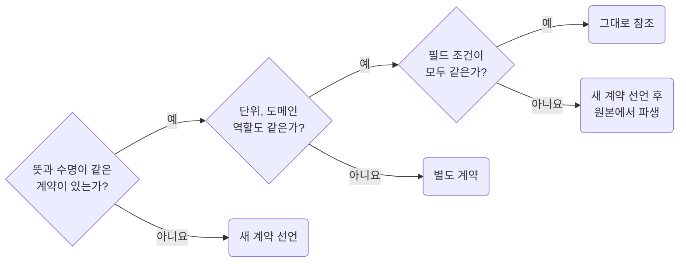

| 찾은 기존 계약 | 처리 |
| --- | --- |
| 뜻이 같고 필드 조건도 모두 같음 | 그대로 참조합니다 |
| 뜻은 같지만 필드 일부만 필요하거나 타입, 선택 여부, 읽기 전용 여부가 다름 | 새 계약을 선언하고 필드는 `types-derive-subsets-with-indexed-access`에 따라 원본에서 파생합니다 |
| 원본 입력과 정규화 결과처럼 역할이 다름 | 필드가 같아도 별도 계약을 둡니다 |

### 적용하지 않는 변경

다음은 이 규칙을 적용하지 않는 경우입니다.

| 변경 | 처리 |
| --- | --- |
| 소유자 이동, 이름, 주석 변경, 그대로인 계약의 새 사용처 | 타입을 새로 만들지 않습니다. 기존 선언의 주석에 새 역할을 적을지만 `types-document-custom-types-and-shapes`로 판단합니다 |
| 여러 위치 인자를 우리가 고칠 수 있는 기존 객체 계약 하나로 묶음 | 그 계약을 그대로 받고 `types-document-custom-types-and-shapes`만 적용합니다 |
| 맞는 기존 형태가 없는 새 도메인 계약 | 새로 선언하고 `types-document-custom-types-and-shapes`만 적용합니다 |
| 외부, 생성된, 읽기 전용, 공용 형태를 그대로 사용 | 이 규칙과 `types-derive-subsets-with-indexed-access` 모두 대상이 아닙니다 |

함수 헤더 주석은 `docs-require-header-jsdoc-on-key-declarations`가 판단합니다.
규칙을 적용하려고 요청에 없는 `*Params`나 `*Input`을 만들지 않습니다.

**Incorrect 1 (기존 계약과 같은 구조를 다시 선언합니다):**

```ts
// 이미 있는 계약: UserRecord { id: string; name: string; email: string }
// 필드 이름, 타입, 선택 여부가 그대로인데 새로 선언했다
interface InviteRecipient {
	id: string;
	name: string;
	email: string;
}

export const sendInvites = (recipients: InviteRecipient[]): Promise<void> => { /* … */ };
```

**Correct 1 (형태가 같으면 기존 계약을 그대로 참조합니다):**

```ts
// 이미 있는 계약: UserRecord { id: string; name: string; email: string }
/**
 * 초대 대상은 사용자 레코드 그대로다. 필드가 같아 따로 선언하지 않는다
 */
export const sendInvites = (recipients: UserRecord[]): Promise<void> => { /* … */ };
```

**Incorrect 2 (선택 여부가 다른데 기존 계약을 그대로 써서 없는 값을 빈 문자열로 채웁니다):**

```ts
// 이미 있는 계약: UserRecord { id: string; name: string; email: string }
export const sendInvite = (draft: UserRecord): Promise<void> => { /* … */ };

// 폼은 이름을 비울 수 있고 id 가 아직 없어 빈 문자열을 채워야 타입이 맞는다
sendInvite({ id: "", name: "", email });
```

**Correct 2 (선택 여부가 하나라도 다르면 새로 선언하되 필드는 원본에서 파생합니다):**

```ts
// 이미 있는 계약: UserRecord { id: string; name: string; email: string }
/**
 * 초대 폼 입력. 이름을 비울 수 있고 id 가 아직 없어 UserRecord 와 필드 조건이 다르다
 */
interface InviteDraft {
	/**
	 * 받는 사람 이메일
	 */
	email: UserRecord["email"];
	/**
	 * 표시 이름. 비우면 이메일을 그대로 보여 준다
	 */
	name?: UserRecord["name"];
}

/**
 * 초대 한 건을 보낸다
 */
export const sendInvite = (draft: InviteDraft): Promise<void> => { /* … */ };
```

### 1.2 Derive Subsets With Indexed Access Instead of `Pick`

**Rule:** `T01-02` · `types-derive-subsets-with-indexed-access`

**Applies when:** 기존 타입의 일부 필드만 담는 형태를 선언, 변경할 때. `Pick`, `Omit`, `Partial`, `Required`, `Extract`, `NonNullable`을 쓸 때. 제외: 필드 이름, 타입, 선택 여부가 모두 같아 기존 타입을 그대로 참조하는 경우.

**Review with:** `types-document-custom-types-and-shapes`, `types-reuse-existing-contracts-before-new-types`

**Impact: HIGH (고른 필드의 이름과 출처를 드러내고 선택 여부와 읽기 전용 속성을 보존합니다)**

### 필드를 고르는 방식

기존 계약의 일부 필드는 `interface`에 `원본["필드"]`로 적고, `Pick`은 쓰지 않습니다.
계약 전체를 재사용할지는 `types-reuse-existing-contracts-before-new-types`가 정합니다.

| 원본에 필드가 추가될 때 | 선언 방식 | 예 |
| --- | --- | --- |
| 따라 늘면 안 됨 | `interface` + 인덱스 접근 | `UserPreview`에는 새 `ssn` 필드가 들어오지 않습니다 |
| 따라 늘어야 함 | `Omit<원본, "뺄 이름">` | 외부 계약의 필드 추가를 그대로 받습니다 |
| 전체 필드를 선택 또는 필수로 바꾸면서 원본의 필드 추가도 따라야 함 | `Partial`, `Required` | 열린 집합에만 씁니다 |
| 필드 하나의 타입만 필요함 | 인덱스 접근 별칭 | `type ProductId = ProductRecord["id"]` |

`Omit`은 제외한 이름이 원본에서 사라져도 오류가 나지 않으므로 원본 변경 시 이름을 확인합니다.
`ReturnType`, `Parameters`, `Awaited`는 필드를 고르는 연산이 아니므로 대상이 아닙니다.

### 값을 좁혀 받을 때

값을 좁히거나 필수로 바꿀 때도 원시 타입을 다시 적지 않고 원본에서 파생해 출처를 남깁니다.

| 필드 값을 원본과 다르게 받을 때 | 적는 법 | 예 |
| --- | --- | --- |
| 필드 값 중 일부만 받음 | `Extract<원본["필드"], 좁힌 타입>` | `TableCellProps`의 `padding` 중 `normal`, `none`만 받습니다 |
| 원본이 비워 두는 필드를 필수로 받음 | `NonNullable<원본["필드"]>` | `align: NonNullable<TableCellProps["align"]>` |
| union 계약 중 한 갈래만 받음 | `Extract<원본, 판별 필드>` | `Extract<TextFieldProps, { variant?: "outlined" }>` |

인덱스 접근은 필드 이름과 출처를 선언에 남겨 여러 계약의 필드를 모으고 각각 문서화하기 좋습니다.
필드 주석은 `types-document-custom-types-and-shapes`를 따릅니다.
원본 필드의 타입 변경과 삭제는 인덱스 접근과 `Pick` 모두 컴파일 검사에 반영됩니다.

### 선택, 읽기 전용 보존

| 보존할 계약 | 적는 법 |
| --- | --- |
| 선택 필드의 키 생략 | `?`를 직접 붙입니다. 없으면 `string \| undefined`여도 필수 필드입니다 |
| 읽기 전용 필드 | `readonly`를 직접 붙입니다. 인덱스 접근만으로는 복사되지 않습니다 |
| `exactOptionalPropertyTypes`가 켜진 프로젝트의 선택 필드 | `name?: Required<Src>["name"]`으로 `undefined` 대입을 막습니다. 옵션이 꺼진 프로젝트는 `Src["name"]`으로 충분합니다 |

**Incorrect 1 (`Pick`으로 골라 필드 이름과 설명이 사라집니다):**

```ts
// 원본 계약
interface UserRecord {
	readonly id: string;
	name?: string;
	email: string;
}

type UserPreview = Pick<UserRecord, "id" | "name">;
```

**Correct 1 (필드마다 출처를 인덱스 접근으로 가져오고 `?`, `readonly`를 직접 적습니다):**

```ts
/**
 * 사용자 미리보기 계약
 */
interface UserPreview {
	/**
	 * 사용자 식별자
	 */
	readonly id: UserRecord["id"];
	/**
	 * 목록에 표시할 이름. 원본에서 선택 필드라 여기서도 선택으로 둔다
	 */
	name?: UserRecord["name"];
}
```

**Incorrect 2 (인덱스 접근으로 옮기면서 선택 여부와 읽기 전용 속성을 누락합니다):**

```ts
// 원본: ProductRecord.id 는 readonly, UserRecord.name 은 선택 필드다
/**
 * product 목록 한 행의 표시 계약
 */
interface ProductListRow {
	/**
	 * product 식별자
	 */
	id: ProductRecord["id"];
	/**
	 * 마지막 수정자 이름
	 */
	ownerName: UserRecord["name"];
}
```

**Correct 2 (여러 계약에서 필드를 모으고 `?`, `readonly`를 직접 적습니다):**

```ts
/**
 * product 목록 한 행의 표시 계약
 */
interface ProductListRow {
	/**
	 * product 식별자
	 */
	readonly id: ProductRecord["id"];
	/**
	 * 마지막 수정자 이름. 원본에서 선택 필드라 여기서도 선택으로 둔다
	 */
	ownerName?: UserRecord["name"];
}
```

**Incorrect 3 (원본을 따라가야 하는 열린 집합을 인덱스 접근으로 닫아 새 필드를 놓칩니다):**

```ts
/**
 * 내보내기 요청 전송 형태
 */
interface ExportRequestBody {
	/**
	 * 내보낼 문서 ID
	 */
	documentId: GeneratedExportRequest["documentId"];
	/**
	 * 내보내기 형식
	 */
	format: GeneratedExportRequest["format"];
}
```

**Correct 3 (원본을 따라가야 하는 열린 집합은 `Omit`으로 뺍니다):**

```ts
/**
 * 내보내기 요청 전송 형태. 생성된 계약이 필드를 더하면 그대로 따라가고 서버가 채우는 시각만 뺀다
 */
type ExportRequestBody = Omit<GeneratedExportRequest, "requestedAt">;
```

**Incorrect 4 (좁힌 값을 원시 타입으로 다시 적어 원본과의 연결이 사라집니다):**

```ts
// 원본: TableCellProps.align 은 선택 필드고 padding 은 normal, checkbox, none 이다
/**
 * 보고서 표 칸 표시 계약
 */
interface ReportCell {
	/**
	 * 칸 정렬
	 */
	align: "inherit" | "left" | "center" | "right" | "justify";
	/**
	 * 칸 여백. checkbox 칸은 두지 않는다
	 */
	padding?: "normal" | "none";
}
```

**Correct 4 (원본 필드를 `NonNullable`, `Extract`로 파생해 출처와 좁힘을 함께 남깁니다):**

```ts
/**
 * 보고서 표 칸 표시 계약. align, padding 은 TableCell 로 그대로 넘긴다
 */
interface ReportCell {
	/**
	 * 칸 정렬. TableCell 은 비울 수 있지만 이 표는 칸마다 정한다
	 */
	align: NonNullable<TableCellProps["align"]>;
	/**
	 * 칸 여백. checkbox 칸은 두지 않아 normal, none 만 받는다
	 */
	padding?: Extract<TableCellProps["padding"], "normal" | "none">;
}
```

### 1.3 Prefer Function Variable Types Over Parameter Annotations

**Rule:** `T01-03` · `types-prefer-function-variable-types-over-parameter-annotations`

**Applies when:** 기존 호출 계약을 이름 붙인 함수나 공용 함수 구현에 다시 쓸 때. 같은 시그니처를 여러 구현이 함께 쓰도록 바꿀 때. 제외: 타입 표기 없이 문맥으로 추론되는 일회성 인라인 콜백인 경우.

**Review with:** `types-mark-unused-parameters-with-underscore`

**Impact: MEDIUM (호출 계약을 한곳에서 읽고 같은 시그니처를 반복 선언하지 않습니다)**

기존 호출 계약이 있으면 매개변수와 반환 타입을 반복하지 않고 함수를 담는 변수에 붙입니다.
예를 들어 `const handleClick: MouseEventHandler<HTMLButtonElement> = (event) => …`로 씁니다.

| 상황 | 타입 표기 |
| --- | --- |
| `interface`, 객체 계약, 프레임워크 별칭이 있음 | 기존 호출 계약을 함수 변수에 붙입니다 |
| 계약에 콜백 필드가 있음 | `Contract["onSelect"]`로 가져옵니다 |
| 같은 시그니처를 쓰는 구현이 둘 이상임 | 함수 타입 별칭을 선언합니다 |
| 맞는 계약도 없고 구현도 하나뿐임 | 매개변수 타입을 직접 적습니다. 별칭을 새로 만들지 않습니다 |

쓰지 않는 계약 매개변수는 `types-mark-unused-parameters-with-underscore`에 따라 남깁니다.
문맥으로 추론되는 일회성 인라인 콜백은 대상이 아닙니다.
`select: (response) => ({...})`를 밖으로 빼거나 새 함수 타입으로 고정하지 않습니다.
커링 팩토리가 반환하는 리액트 핸들러는 프레임워크 컨벤션이 판단합니다.

**Incorrect 1 (계약이 있는데 시그니처를 다시 적습니다):**

```ts
// 이미 있는 계약
/**
 * 사용자 화면 표시 문자열 계약
 */
interface UserFormatters {
	/**
	 * 상태 객체를 화면 문자열로
	 */
	toStateLabel: (state: Record<string, unknown>) => string;
	/**
	 * 권한 코드를 화면 문자열로
	 */
	toRoleLabel: (role: string) => string;
}

/**
 * 상태 객체를 화면 문자열로 바꾼다
 */
const toStateLabel = (state: Record<string, unknown>): string => {
	return JSON.stringify(state);
};
```

**Correct 1 (이미 있는 계약에서 시그니처를 가져와 함수 전체에 타입을 붙입니다):**

```ts
// 이미 있는 계약
/**
 * 사용자 화면 표시 문자열 계약
 */
interface UserFormatters {
	/**
	 * 상태 객체를 화면 문자열로
	 */
	toStateLabel: (state: Record<string, unknown>) => string;
	/**
	 * 권한 코드를 화면 문자열로
	 */
	toRoleLabel: (role: string) => string;
}

/**
 * 상태 객체를 화면 문자열로 바꾼다
 */
const toStateLabel: UserFormatters["toStateLabel"] = (state) => {
	return JSON.stringify(state);
};
```

**Incorrect 2 (같은 시그니처를 쓰는 구현마다 매개변수와 반환 타입을 다시 적습니다):**

```ts
/**
 * 앞뒤 공백을 걷어낸 request 문자열
 */
const toRequest = (request: string): string => {
	return request.trim();
};

/**
 * 검색어로 쓸 수 있게 공백을 한 칸으로 줄인 request 문자열
 */
const toSearchRequest = (request: string): string => {
	return request.replaceAll(/\s+/g, " ").trim();
};
```

**Correct 2 (같은 시그니처를 쓰는 구현이 둘 이상이면 함수 타입 별칭을 선언합니다):**

```ts
/**
 * request 변환 계약
 */
type ToRequest = (request: string) => string;

/**
 * 앞뒤 공백을 걷어낸 request 문자열
 */
const toRequest: ToRequest = (request) => {
	return request.trim();
};

/**
 * 검색어로 쓸 수 있게 공백을 한 칸으로 줄인 request 문자열
 */
const toSearchRequest: ToRequest = (request) => {
	return request.replaceAll(/\s+/g, " ").trim();
};
```

### 1.4 Document Custom Types and Declarative Shapes

**Rule:** `T01-04` · `types-document-custom-types-and-shapes`

**Applies when:** 타입, `interface`, 스키마 최상단, 객체 상수, 계약 필드, 파생 별칭을 추가, 변경할 때. 이름 붙인 형태에 호출 계약 역할을 새로 얹을 때. 제외: 외부, 생성된, 읽기 전용, 공용 형태를 그대로 쓰거나 반환 타입이 익명으로 추론되는 경우.

**Requires selected:** `docs-write-doc-comments-as-multiline-blocks`, `docs-write-korean-comments-about-purpose-and-constraints` (함께 적용)

**Impact: MEDIUM (구현을 읽기 전에 도메인 전용 계약을 이해할 수 있습니다)**

### 직접 선언한 형태

직접 선언한 타입과 형태는 헤더와 필드를 구분해 문서화합니다.
주석 내용은 `docs-write-korean-comments-about-purpose-and-constraints`의 한국어 기준을 따릅니다.

아래 세 선언은 모두 헤더 주석을 씁니다.

| 선언 | 필드 주석 |
| --- | --- |
| 커스텀 `type`, `interface`, 스키마 최상단 | 원본에서 가져온 필드에도 각각 씁니다 |
| 객체형 상수 | 달지 않습니다. `constant` 폴더와 `enum` 성격 상수 객체도 같습니다 |
| 인덱스 접근 별칭, `Omit` 결과 | 선언한 필드가 없어 달지 않습니다 |

### 기존 형태를 쓸 때

| 기존 형태를 쓰는 방식 | 문서화 범위 |
| --- | --- |
| 새 입력, 출력 계약 역할을 맡음 | 필드가 그대로여도 기존 선언의 헤더와 필드 주석에 새 역할을 설명합니다 |
| 외부, 생성된, 읽기 전용, 공용 형태를 그대로 씀 | 선언을 고치거나 문서화용 지역 별칭을 만들지 않습니다 |
| 이름 없이 구현에서 추론되는 익명 객체 | 대상이 아닙니다. `select`의 익명 반환값도 그대로 둡니다 |

새 역할에도 맞는 기존 형태를 연결하며, 새 타입 선언을 요구하지 않습니다.
익명 결과에 이 규칙을 적용하려고 필드 주석이나 새 타입을 만들지 않습니다.
함수 선언의 헤더 주석은 `docs-require-header-jsdoc-on-key-declarations`가 별도로 판단합니다.

**Incorrect 1 (필드 설명을 생략하거나 예전 방식으로 헤더에 몰아씁니다):**

```ts
/**
 * 게시 결과 요약
 * 게시 대상 문서 ID
 */
interface PublishResult {
	documentId: string;
	published: boolean;
}
```

**Correct 1 (헤더와 필드별 문서 주석을 씁니다):**

```ts
/**
 * 게시 결과 요약
 */
export interface PublishResult {
	/**
	 * 게시 대상 문서 ID
	 */
	documentId: string;
	/**
	 * 게시 성공 여부
	 */
	published: boolean;
}
```

**Correct (객체형 상수는 헤더만 달고 키에는 달지 않습니다):**

```ts
/**
 * product 상태 코드. 서버 enum 과 같은 값이다
 */
export const product_status = {
	draft: "draft",
	published: "published",
} as const;
```

### 1.5 Mark Unused Parameters With an Underscore Prefix

**Rule:** `T01-05` · `types-mark-unused-parameters-with-underscore`

**Applies when:** 기존 콜백이나 프레임워크 계약을 구현하면서 매개변수를 빼거나 쓰지 않을 때. 커링한 핸들러가 마지막에 돌려주는 콜백에서 매개변수를 뺄 때.

**Impact: MEDIUM (계약에 있는 매개변수를 유지하면서 사용하지 않는 매개변수를 표시합니다)**

기존 콜백, 프레임워크 계약의 매개변수는 쓰지 않아도 생략하지 않고 `_` 접두사로 남깁니다.
계약을 유지하면서 구현이 일부러 무시한 값을 드러냅니다.

커링한 핸들러의 마지막 콜백과 매개변수를 하나도 쓰지 않는 구현도 같습니다.
`MouseEventHandler`의 이벤트를 쓰지 않으면 `() =>` 대신 `(_event) =>`로 받습니다.

**Incorrect 1 (계약의 일부인 콜백 매개변수를 생략합니다):**

```ts
/**
 * 로그 sink 콜백 계약
 */
type LogSink = (message: string, level: "info" | "error") => void;

const noopLog: LogSink = () => {
	// 아무 일도 하지 않는 sink
};
```

**Correct 1 (계약은 유지하고 쓰지 않는 매개변수만 `_`로 표시합니다):**

```ts
/**
 * 로그 sink 콜백 계약
 */
type LogSink = (message: string, level: "info" | "error") => void;

/**
 * 아무것도 남기지 않는 로그 sink. 테스트에서 출력을 끌 때 쓴다
 */
const noopLog: LogSink = (_message, _level) => {};
```

### 1.6 Narrow `unknown` Instead of Asserting

**Rule:** `T01-06` · `types-narrow-unknown-instead-of-asserting`

**Applies when:** `as` 단언, `!` `null` 아님 단언, `any`, `@ts-expect-error`를 추가, 변경, 제거할 때. 앱 밖에서 들어온 값을 타입 붙여 쓰기 시작할 때. 제외: 검증된 내부 값에 `as const`나 `satisfies`만 적용하는 경우.

**Review with:** `docs-justify-convention-exceptions-with-a-reason-comment`, `tooling-configure-biome-to-enforce-these-rules`

**Impact: HIGH (컴파일을 통과시키려고 타입 검사를 끄는 자리가 남지 않습니다)**

### 값의 출처

형태를 모르는 값은 `unknown`으로 받아 좁힙니다.
컴파일 오류를 없애려고 `as`, `!`, `any`, `@ts-expect-error`로 검사를 우회하지 않습니다.
저장소, 메시지, URL, 검증하지 않은 응답이 앱 밖의 값입니다.

값의 출처로 처리를 고르는 차례입니다.

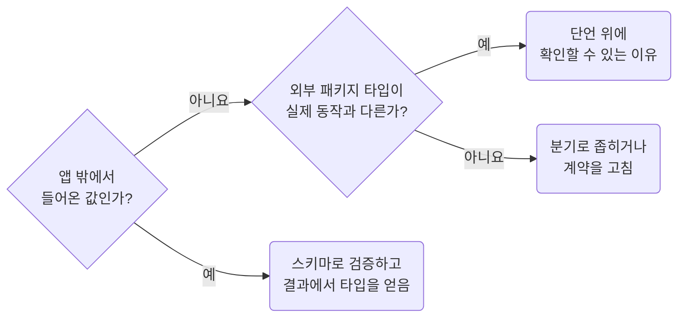

### 표기별 보장 범위

| 표기 | 보장하는 것과 한계 |
| --- | --- |
| `as`, `!` | 실행 중 값을 검증하지 않습니다 |
| `any` | 이후 타입 검사를 약화합니다 |
| `@ts-expect-error` | 다음 줄 오류를 억제하며, 해당 오류가 없어지면 오류를 보고합니다 |
| `as const` | 리터럴 추론과 읽기 전용 표기를 유지합니다. 금지 대상이 아닙니다 |
| `satisfies` | 식이 계약에 맞는지 검사합니다. 대상 타입으로 전체를 넓히지는 않지만 문맥 추론에 영향을 줄 수 있습니다 |

`as const`와 `satisfies`는 실행 중 검증이나 객체 동결을 하지 않습니다.
`any` 응답에 `satisfies`를 붙여도 검증되지 않습니다.
`JSON.parse`는 JSON 문법, 스키마는 값의 형태를 검사하며 실패 처리는 기존 호출 경계의 오류 계약을 따릅니다.

### 예외 주석

예외 주석은 `docs-justify-convention-exceptions-with-a-reason-comment`를 따릅니다.
"타입이 이상해서"는 확인할 수 있는 근거가 아닙니다.
`any`와 `!`는 `tooling-configure-biome-to-enforce-these-rules`로 막고, `as`와 `@ts-expect-error`는 리뷰합니다.

**Incorrect 1 (앱 밖에서 온 값을 단언으로 통과시킵니다):**

```ts
const storedFilter = JSON.parse(localStorage.getItem("product-filter") as string) as ProductFilter;
```

**Correct 1 (앱 밖에서 온 값은 좁히기 함수를 통과한 뒤에 씁니다):**

```ts
const storedValue = localStorage.getItem("product-filter");
const parsedFilter: unknown = storedValue === null ? undefined : JSON.parse(storedValue);

// 처음 방문이면 저장된 필터가 없고 형태가 다르면 쓰지 않는다. 없다는 사실을 그대로 둔다
const storedFilter = isProductFilter(parsedFilter) ? parsedFilter : undefined;
```

**Incorrect 2 (`!`로 없을 수 있다는 사실을 지웁니다):**

```ts
const firstProduct = products.find((product) => product.isActive)!;
```

**Correct 2 (없을 수 있으면 그대로 드러냅니다):**

```ts
const firstProduct = products.find((product) => product.isActive);

if (!firstProduct) {
	throw new NoActiveProductError();
}
```

### 1.7 Replace `enum` With `as const` Objects

**Rule:** `T01-07` · `types-replace-enum-with-as-const-objects`

**Applies when:** `enum`이나 타입과 실행 양쪽에서 함께 쓰는 값 집합을 추가, 변경할 때. 제외: 외부 패키지가 내보낸 `enum` 값을 그대로 읽어 쓰는 경우.

**Requires selected:** `naming-use-consistent-file-and-symbol-naming`, `types-document-custom-types-and-shapes` (함께 적용)

**Impact: MEDIUM (객체로 실행 값을 선언하고 같은 값에서 타입을 추출합니다)**

직접 선언하는 값 집합은 `enum` 대신 객체와 `as const`로 실행 값과 타입을 함께 둡니다.
`enum`은 타입만 지우는 번들러나 TypeScript 5.8의 `--erasableSyntaxOnly`와 호환되지 않으며,
이 컨벤션의 `biome` 설정도 `style/noEnum`으로 선언을 막습니다.

| 상황 | 처리 |
| --- | --- |
| 외부 패키지의 `enum`을 그대로 전달함 | 외부 계약을 유지합니다 |
| 기존 `enum`을 객체로 옮김 | 직렬화 값과 공개 타입을 보존하고 숫자 `enum`의 역방향 조회 소비처를 확인합니다 |
| 기존 계약에 맞는 값 집합인지도 검사함 | `as const satisfies 기존계약`을 씁니다 |
| 리터럴 추론, 읽기 전용 속성이 필요 없음 | `as const`를 불필요하게 붙이지 않습니다 |

객체에는 `Enum[value]` 역방향 조회가 자동으로 생기지 않습니다.
`as const`는 실행 중 동결이나 다른 변수에서 가져온 배열의 변경까지 보장하지 않습니다.

**Incorrect 1 (`enum`을 직접 씁니다):**

```ts
enum ProductStatus {
	pending = "pending",
	passed = "passed",
	failed = "failed",
}
```

**Correct 1 (객체 리터럴과 타입 추출을 조합합니다):**

```ts
/**
 * product 심사 상태 값 집합
 */
const product_status = {
	pending: "pending",
	passed: "passed",
	failed: "failed",
} as const;

/**
 * product 심사 상태 타입. product_status에 값을 더하면 따라 넓어진다
 */
type ProductStatus = (typeof product_status)[keyof typeof product_status];
```

### 1.8 Choose Interface for Object Contracts and Type for Type Composition

**Rule:** `T01-08` · `types-choose-interface-for-object-contracts-and-type-for-composition`

**Applies when:** `interface`와 `type` 사이에서 선언 형식을 바꿀 때. 객체 계약, union, tuple, 함수 시그니처, mapped, conditional type에 이름을 붙여 선언할 때. 제외: 외부, 생성된 계약을 그대로 참조하는 경우.

**Review with:** `types-document-custom-types-and-shapes`, `types-reuse-existing-contracts-before-new-types`

**Impact: MEDIUM (선언 형식만 보고도 필드 계약인지 타입 사이의 관계인지 구분할 수 있습니다)**

독립된 객체 필드 계약은 `interface`, 타입 계산이나 조합은 `type`으로 선언합니다.
`Draft`, `State` 같은 역할어가 아니라 선언이 나타내는 계약을 기준으로 고릅니다.

| 선언 대상 | 형식 |
| --- | --- |
| 이름이 있고 필드를 직접 읽는 독립 객체 | `interface` |
| 리터럴 유니언, 기본 타입, 튜플 별칭, 함수 시그니처 | `type` |
| 매핑, 조건부 타입, 필드가 없는 인덱스 접근 별칭 | `type` |
| `Omit`, `Record` 같은 계산, 다른 타입과의 교차 | `type` |
| 유니언, 교차 조합에서만 쓰는 객체 | `type` |

형식을 맞추려고 별칭을 만들거나 객체 형태를 전부 `interface`로 바꾸지 않습니다.
추론되는 익명 결과와 외부, 생성된 계약은 그대로 둡니다.
같은 뜻의 기존 계약은 `types-reuse-existing-contracts-before-new-types`에 따라 재사용합니다.

**Incorrect 1 (독립된 필드 계약을 객체 `type` 별칭으로 선언합니다):**

```ts
/**
 * 상품 요약
 */
type ProductSummary = {
	/**
	 * 상품 식별자
	 */
	id: string;
	/**
	 * 목록에 표시할 이름
	 */
	name: string;
};
```

**Correct 1 (필드 계약은 `interface`, 타입 조합은 `type`으로 구분합니다):**

```ts
/**
 * 상품 요약
 */
interface ProductSummary {
	/**
	 * 상품 식별자
	 */
	id: string;
	/**
	 * 목록에 표시할 이름
	 */
	name: string;
}

/**
 * 상품 목록 표시 방식
 */
type ProductMode = "list" | "grid";

/**
 * 자식 목록을 편집할 수 있는 행
 */
type MutableRow = Omit<Row, "children"> & {
	/**
	 * 편집 중인 자식 행
	 */
	children: Row[];
};
```

## 2. Naming and Module Boundaries

**Impact: HIGH**

식별자와 경로, 가져오기, 공개 진입점, 상수 위치에 소유자와 출처를 드러냅니다. 타입 이름은 값의 역할과 수명을 나타내고, 소유자 경로에 있는 정보를 반복하지 않습니다. 여기서 **소유자**는 자기 폴더가 있는 모듈 하나입니다. 그 폴더 안 파일은 그 소유자만 씁니다.

### 2.1 Place Project-wide Constants in the Root `constant` Folder

**Rule:** `T02-01` · `naming-place-project-constants-in-the-root-constant-folder`

**Applies when:** 프로젝트 전반이 쓰는 URL 경로, 페이지 크기, 표시 문구, 기준값을 추가, 이동, 중복 정의할 때. 루트 `constant` 폴더의 파일이나 상수 이름을 바꿀 때.

**Review with:** `naming-place-owner-constants-in-the-owner-constant-folder`, `naming-use-direct-imports-and-public-entry-points`

**Impact: HIGH (프로젝트 전반의 상수를 주제별로 모아 위치와 이름을 일관되게 유지합니다)**

### 상수 자리 고르기

상수 위치는 사용처 수가 아니라 소유자로 정합니다.

자리를 고르는 차례입니다.

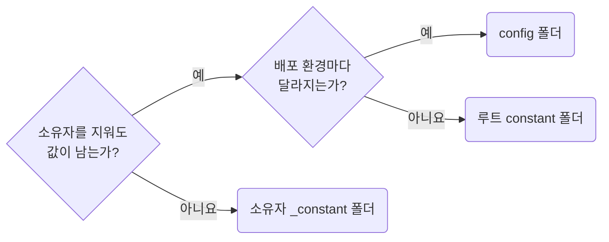

| 소유 범위 | 파일 | 이름 |
| --- | --- | --- |
| 프로젝트 전반 | `constant/<주제>.ts` | `<주제>_<이름>` |
| 한 소유자 | `<owner>/_constant/<주제>.ts` | `<주제>_<이름>` |

`chart_axis_tick_count`는 화면과 함께 사라지고, `api_request_timeout_ms`는 서버 통신에 남습니다.
사용처가 늘거나 줄어도 이 기준은 바뀌지 않습니다.
소유자 전용 배치는 `naming-place-owner-constants-in-the-owner-constant-folder`를 따릅니다.

### 선언과 내보내기

| 선언 대상 | 규범 |
| --- | --- |
| 파일, 상수 이름 | 파일마다 주제를 하나 정하고 상수에 주제 접두사를 붙입니다. 한 단어 상수는 만들지 않습니다 |
| 내보내기 | 모듈 스코프에서 상수마다 이름 붙여 내보냅니다. `config` 같은 색인 객체로 묶지 않습니다 |
| 객체, 배열 값 | 함께 읽히는 값이면 상수 하나로 둡니다. 펼치는 것은 내보낼 이름이지 값의 구조가 아닙니다 |
| 사용자에게 보이는 문장 | `copy_empty_value_text`처럼 `copy` 주제로 모아 번역 파일로 옮기기 쉽게 둡니다 |
| 환경마다 달라지는 값, 기능 플래그 | `naming-read-environment-values-through-config-env`에 따라 `config`에 둡니다 |
| 색상, 간격 등 디자인 토큰 | 스타일시트의 CSS 변수를 단일 출처로 둡니다 |

파일, 심볼 표기는 `naming-use-consistent-file-and-symbol-naming`을 따릅니다.
색인 객체는 수동 관리가 필요하고 번들러의 미사용 프로퍼티 제거도 어려워질 수 있습니다.
`constant`에는 코드와 함께 바뀌는 값만 둡니다.

**Incorrect 1 (프로젝트 전반의 값을 쓰는 자리에서 선언합니다):**

```ts
// page/products/pg-products.tsx
const default_page_size = 20;
const request_timeout_ms = 20_000;

const productClient = createClient({timeoutMs: request_timeout_ms});
const productQuery = useProductQuery({client: productClient, pageSize: default_page_size});
```

```ts
// page/orders/pg-orders.tsx
// 다른 화면이 같은 값을 다시 선언한다
const default_page_size = 20;

const orderQuery = useOrderQuery({pageSize: default_page_size});
```

**Correct 1 (루트 `constant` 폴더에 둔 이름을 쓰는 자리에서 가져옵니다):**

```ts
// page/products/pg-products.tsx
import {api_request_timeout_ms} from "@/constant/api";
import {pagination_default_page_size} from "@/constant/pagination";

const productClient = createClient({timeoutMs: api_request_timeout_ms});
const productQuery = useProductQuery({client: productClient, pageSize: pagination_default_page_size});
```

```ts
// page/orders/pg-orders.tsx
import {pagination_default_page_size} from "@/constant/pagination";

const orderQuery = useOrderQuery({pageSize: pagination_default_page_size});
```

**Incorrect 2 (객체 하나에 모아 색인을 손으로 유지합니다):**

```ts
// constant/config.ts
export const config = {
	api: {request_timeout_ms: 20_000},
	pagination: {default_page_size: 20},
} as const;
```

**Correct 2 (주제 파일에 상수를 하나씩 이름 붙여 내보냅니다):**

```ts
// constant/api.ts
/**
 * 요청 하나를 기다리는 최대 시간. 게이트웨이가 30초에 끊어 그보다 먼저 실패를 알린다
 */
export const api_request_timeout_ms = 20_000;

// constant/pagination.ts
/**
 * 목록 화면이 처음 불러오는 개수
 */
export const pagination_default_page_size = 20;
```

### 2.2 Place Owner-only Constants in the Owner `_constant` Folder

**Rule:** `T02-02` · `naming-place-owner-constants-in-the-owner-constant-folder`

**Applies when:** 한 소유자의 상수나 선언형 계약을 추가하거나 옮길 때. 루트 상수와 소유자 전용 상수 사이에서 위치를 바꿀 때.

**Requires selected:** `naming-use-consistent-file-and-symbol-naming` (함께 적용)

**Review with:** `naming-place-project-constants-in-the-root-constant-folder`

**Impact: HIGH (소유자 전용 상수를 함께 관리하고 파일명과 이름에서 소유자 표현을 반복하지 않습니다)**

한 소유자의 상수는 그 소유자 아래 `_constant`에 둡니다.
루트와 소유자를 구분하는 기준은 `naming-place-project-constants-in-the-root-constant-folder`를 따릅니다.

| 대상 | 배치, 이름 |
| --- | --- |
| 상수 | `_constant/<주제>.ts`에 `<주제>_` 접두사로 선언합니다 |
| 소유자 문맥 | 폴더가 말하므로 이름에 반복하지 않습니다. `page/detail/_constant/legend.ts`에는 `legend_hit_tolerance_px`를 둡니다 |
| 파서 묶음, 스키마 등 함수를 담은 계약 | 같은 `_constant`에 계약별 파일로 둡니다 |
| 파일이 하나뿐인 경우 | `_constant` 폴더를 유지합니다 |
| 소유자를 지워도 남는 값 | 루트 상수 규칙에 따라 옮깁니다 |

계약 파일의 이름은 계약 규칙과 `naming-use-consistent-file-and-symbol-naming`을 따릅니다.
소유자 아래에 `config`, `constants`, `common` 폴더는 만들지 않습니다.

**Incorrect 1 (한 소유자의 상수를 루트로 올립니다):**

```ts
// constant/chart.ts
// product 상세 화면만 쓰는 값이 루트에 있다
export const chart_axis_tick_count = 6;
```

**Correct 1 (소유자 아래 주제 파일에 둡니다):**

```ts
// page/product-detail/_constant/chart.ts
/**
 * product 상세 차트의 축 눈금 수. 표시 폭이 좁아 여섯을 넘기면 라벨이 겹친다
 */
export const chart_axis_tick_count = 6;
```

**Incorrect 2 (파일명에 소유자 이름을 되풀이하고 주제를 객체 하나에 모읍니다):**

```ts
// page/product-detail/_constant/product-detail.ts
export const product_detail_config = {
	chart_axis_tick_count: 6,
	table_page_size: 20,
} as const;
```

**Correct 2 (주제마다 파일을 나누고 상수를 개별 이름으로 내보냅니다):**

```ts
// page/product-detail/_constant/chart.ts
export const chart_axis_tick_count = 6;

// page/product-detail/_constant/table.ts
export const table_page_size = 20;
```

### 2.3 Use Role-Based File, Symbol, and Constant Naming

**Rule:** `T02-03` · `naming-use-consistent-file-and-symbol-naming`

**Applies when:** TypeScript 파일, 폴더, 변수, 함수, 타입, 객체, 스키마 키의 이름을 새로 만들거나 바꿀 때. 외부 계약이 정한 이름이나 키의 표기를 바꿀지 판단할 때. 제외: 별칭 없이 외부 패키지에서 그대로 가져오는 경우.

**Impact: HIGH (파일과 심볼의 표기가 역할을 드러내 읽는 사람이 종류를 바로 압니다)**

### 역할별 표기

파일과 심볼은 선언 문법이 아니라 역할에 맞게 이름 짓습니다.
`const`로 선언해도 함수, 훅, 스키마, API 결과, 요청 객체, 지역 파생값을 불변 데이터 상수로 보지 않습니다.

| 자리 | 표기 |
| --- | --- |
| 파일명 | `kebab-case` |
| 폴더명 | `kebab-case` 단수. 프레임워크가 강제하는 이름만 예외입니다 |
| 타입, `interface`, 컴포넌트 | `PascalCase` |
| 모듈 스코프 불변 데이터 상수, 값 집합과 그 소유 하위 키 | `snake_case` |
| 그 외 변수, 함수, 객체 키, 스키마 키, 타입 필드 | `camelCase` |

불변 데이터 상수는 한 번 선언해 같은 의미로 쓰는 리터럴, 기본값, 값 집합, 조회표입니다.
객체와 배열에는 `as const`나 읽기 전용 계약을 적용하고 변경하지 않습니다.

| 예 | 역할 |
| --- | --- |
| `retry_policy.max_attempts`, `product_status.waiting_review` | 불변 데이터와 소유한 상수 키입니다 |
| `fetchProducts({pageSize: pagination_default_page_size})` | 요청 필드 `pageSize`와 상수 이름을 구분합니다 |
| `productSearchSchema` | 재할당 여부와 무관하게 스키마 이름입니다 |

함수는 동사, 상수는 주제 접두사와 `snake_case`, 컴포넌트는 레이어 접두사로 종류를 드러냅니다.
한 단어 상수는 만들지 않습니다.
함수 파일명은 내보낸 이름(`format-usd.ts` → `formatUsd`), 상수 파일명은 공유하는 주제(`api.ts` → `api_*`)입니다.

### 외부 계약이 정한 이름

**외부 계약이 정한 이름과 키는 원래 표기를 유지합니다.**
API 응답, 요청, 생성 DTO, 라이브러리 인자, DOM 속성, 환경 변수와 모듈 상수에 담긴 외부 설정도 같습니다.
`user_id`를 요구하는 API에는 그대로 적습니다.
외부 이름을 별칭 없이 가져오면 대상이 아니며, 지역 별칭을 만들거나 이름을 바꿀 때 다시 판단합니다.

**Incorrect 1 (역할과 맞지 않는 표기를 씁니다):**

```ts
// userSettings.ts
// 우리가 선언한 타입은 PascalCase, 그 필드는 camelCase다
interface User_Profile {
	avatar_url: string;
}
```

**Correct 1 (파일명은 `kebab-case`, 타입 필드는 `camelCase`로 씁니다):**

```ts
// user-settings.ts
/**
 * 사용자 프로필
 */
interface UserProfile {
	/**
	 * 프로필 이미지 주소
	 */
	avatarUrl: string;
}
```

**Incorrect 2 (불변 데이터 상수와 값 집합의 이름과 키를 `camelCase`로 적습니다):**

```ts
const retryPolicy = {
	maxAttempts: 3,
} as const;

const productStatus = {
	draft: "draft",
	waitingReview: "waiting_review",
	published: "published",
} as const;
```

**Correct 2 (불변 데이터 상수와 값 집합은 이름과 상수 키를 모두 `snake_case`로 적습니다):**

```ts
/**
 * 요청 재시도 정책. 하위 키도 상수 키다
 */
const retry_policy = {
	max_attempts: 3,
} as const;

/**
 * product 게시 상태 값 집합
 */
const product_status = {
	draft: "draft",
	waiting_review: "waiting_review",
	published: "published",
} as const;
```

**Incorrect 3 (밖으로 나가는 키를 우리 표기로 바꿉니다):**

```ts
// 서버 계약은 {product_id, display_name} 인데 우리 표기로 바꿔 보낸다
/**
 * product 저장 요청 조립
 */
const toProductSaveBody = (values: ProductFormValues) => {
	return {
		productId: values.productId,
		displayName: values.displayName.trim(),
	};
};
```

**Correct 3 (밖으로 나가는 키만 받는 쪽 표기를 그대로 씁니다):**

```ts
/**
 * product 저장 요청 조립. 서버 계약이 snake_case라 그 표기를 그대로 넘긴다
 */
const toProductSaveBody = (values: ProductFormValues) => {
	return {
		product_id: values.productId,
		display_name: values.displayName.trim(),
	};
};
```

### 2.4 Use Direct Imports and Dedicated Public Entry Points

**Rule:** `T02-04` · `naming-use-direct-imports-and-public-entry-points`

**Applies when:** 가져오기, 내보내기, `index.ts` 배럴, 공개 진입점, 소유자 보조 모듈의 경계를 추가, 변경할 때. 같은 경로에서 값과 타입 중 무엇을 가져올지 추가, 삭제, 전환할 때.

**Review with:** `naming-import-by-absolute-path`

**Impact: MEDIUM (배럴이나 재노출 계층 없이 선언의 출처를 직접 확인할 수 있습니다)**

필요한 파일에서 직접 가져오고 선언 앞에 `export`를 붙여 이름으로 내보냅니다.
`index.ts` 배럴이나 파일 끝의 `export {…}` 목록은 만들지 않습니다.

| 형태 | 판정 |
| --- | --- |
| 역할 폴더나 여러 파일을 `index.ts`로 재노출 | 배럴이므로 만들지 않습니다 |
| 같은 파일이 소유한 `export const Dialog = { Root, Header } as const` | 재노출 계층이 아닌 조립 객체이므로 허용합니다 |
| `default` 내보내기 | `vite.config.ts`처럼 도구가 요구하는 계약에만 씁니다 |
| 타입만 가져오기 | `import type`으로 실행 의존과 구분합니다 |

`default`는 사용처마다 이름이 달라지고 원본의 이름 변경도 반영되지 않습니다.
경로 형식은 `naming-import-by-absolute-path`를 따릅니다.
같은 경로라도 값, 타입 가져오기를 바꾸면 이 규칙을 적용합니다.

**Incorrect 1 (배럴과 섞인 가져오기로 경계를 흐립니다):**

```ts
import {pagination_default_page_size, toDisplayDate, UserProfile} from "./index";
```

**Correct 1 (필요한 파일에서 이름으로 바로 가져옵니다):**

```ts
import type {UserProfile} from "@/type/user-profile";
import {pagination_default_page_size} from "@/constant/pagination";
import {toDisplayDate} from "@/util/date/to-display-date";
```

**Incorrect 2 (`default`로 내보내 사용처마다 다른 이름이 생깁니다):**

```tsx
// component/ui/tabs/ui-tabs.tsx
const UiTabs = (props: UiTabsProps) => {
	return <div role="tablist">{props.children}</div>;
};

export default UiTabs;
```

```tsx
// page/settings/pg-settings.tsx
// 사용처가 이름을 지어서 같은 컴포넌트가 파일마다 다른 이름으로 불린다
import Tabs from "@/component/ui/tabs/ui-tabs";
```

**Correct 2 (선언 앞에 `export`를 붙여 사용처가 그 이름으로 가져옵니다):**

```tsx
// component/ui/tabs/ui-tabs.tsx
export const UiTabs = (props: UiTabsProps) => {
	return <div role="tablist">{props.children}</div>;
};
```

```tsx
// page/settings/pg-settings.tsx
import {UiTabs} from "@/component/ui/tabs/ui-tabs";
```

### 2.5 Import by Absolute Path

**Rule:** `T02-05` · `naming-import-by-absolute-path`

**Applies when:** 다른 모듈을 가져오는 경로를 쓸 때. `./`나 `../`로 시작하는 경로를 쓰거나 별칭 경로를 상대경로로 바꾸려 할 때. `src` 바로 아래 레이어 루트 폴더나 `store` 파일을 새로 만들 때.

**Review with:** `naming-use-direct-imports-and-public-entry-points`

**Impact: CRITICAL (가져오기 경로를 통일하고 가져오는 파일의 위치로 접근 범위를 판단합니다)**

### 경로 표기

심볼은 `@/` 절대경로로 가져옵니다. 편집기 자동 가져오기가 만드는 형식입니다.
심볼 없이 같은 폴더의 파일만 불러올 때는 `./`를 허용하며, `../`는 쓰지 않습니다.

경로 표기를 고르는 차례입니다.

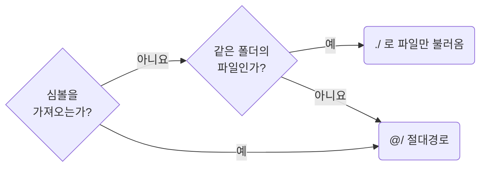

이동, 이름 변경은 편집기의 경로 갱신을 사용합니다.
접근 가능한 소유 경계는 경로 표기가 아니라 가져오는 파일의 위치로 판단합니다.
가져오기 방향은 프레임워크 규칙을 따릅니다.
소유자 밖에서 쓴다는 이유로 루트에 올리지 않습니다.
배치는 `naming-place-project-constants-in-the-root-constant-folder`와
`functions-give-each-function-its-own-file`이 정합니다.

### `src` 아래 루트 폴더

| `src` 아래 루트 | 담는 것 |
| --- | --- |
| `component` | `component/ui`, `component/widget` |
| `page` | 라우트 폴더. 내부 파일은 그 라우트만, 진입 파일은 라우터만 가져옵니다 |
| `constant` | 프로젝트 전반의 상수 |
| `config` | 환경마다 달라지는 값 |
| `util` | 프로젝트 전반의 함수. 받는 값의 종류별 폴더로 묶습니다 |
| `type` | 프로젝트 전반의 계약 |
| `hook` | 여러 소유자가 쓰는 훅 |
| `store` | 여러 화면의 공유 상태. 파일명은 `use-<name>-store.ts`입니다 |
| `service` | 서버 통신 클라이언트 |
| `asset` | 아이콘 등 정적 자원 |

루트의 소유자는 프로젝트이며 `constant`, `util`, `type`, `hook`에도 소유자 아래 역할 폴더의 규칙을 적용합니다.

**Incorrect 1 (상대경로로 심볼을 가져옵니다):**

```ts
// page/detail/product-table-section/pg-product-table-section.tsx
import {PgReviewSection} from "./_pg-review-section";
import {toSummary} from "../_function/to-summary";
```

**Correct 1 (심볼은 `@/`, 같은 폴더의 CSS 파일만 `./`로 씁니다):**

```ts
// page/detail/product-table-section/pg-product-table-section.tsx
import {toSummary} from "@/page/detail/_function/to-summary";
import {PgReviewSection} from "@/page/detail/product-table-section/_pg-review-section";

import "./pg-product-table-section.css";
```

### 2.6 Read Environment Values Through `config/env.ts`

**Rule:** `T02-06` · `naming-read-environment-values-through-config-env`

**Applies when:** `import.meta.env`나 `process.env`를 읽는 코드를 추가, 이동할 때. 환경마다 달라지는 값이나 기능 플래그를 새로 들여올 때.

**Review with:** `absence-expose-optional-values-instead-of-silent-fallbacks`, `naming-place-project-constants-in-the-root-constant-folder`

**Impact: HIGH (환경마다 달라지는 값이 쓰는 파일로 흩어지지 않고 한 파일에서 읽힙니다)**

### 값의 자리

환경 값은 루트 `config/env.ts`에서만 읽고 `env_` 상수로 내보냅니다.
다른 파일은 그 이름을 쓰며 `import.meta.env`와 `process.env`를 직접 읽지 않습니다.

값이 바뀌는 때로 자리와 이름을 고르는 차례입니다.

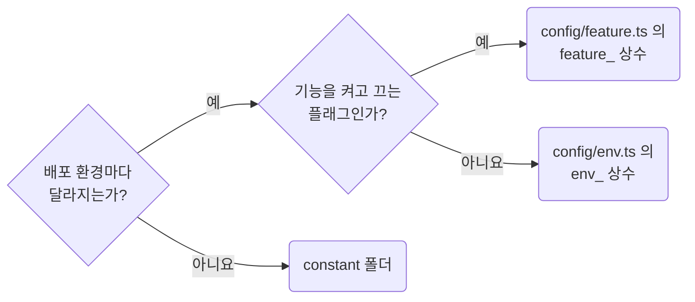

`feature_` 상수는 `env_` 값에서 파생합니다.
배포 환경은 프로젝트 단위이므로 `config`는 루트에만 둡니다.
상수 파일과 이름의 형식은 `naming-place-project-constants-in-the-root-constant-folder`를 따릅니다.

### 읽을 때 확인할 것

| 읽을 때 확인할 것 | 처리 |
| --- | --- |
| 키가 없음 | 리터럴로 덮지 않고 `absence-expose-optional-values-instead-of-silent-fallbacks`에 따라 드러냅니다 |
| `VITE_` 등 외부 접두사 | 읽는 자리에서 내부 이름으로 바꿔 앱 안에 퍼지지 않게 합니다 |
| 비밀값 | 클라이언트에 노출되는 접두사로 읽지 않습니다. 해당 값은 브라우저에서 보입니다 |

**Incorrect 1 (쓰는 파일마다 직접 읽고 없을 때 리터럴로 덮습니다):**

```ts
// service/product-client.ts
const baseUrl = import.meta.env.VITE_API_BASE_URL ?? "http://localhost:3000";
```

```ts
// service/report-client.ts
// 다른 파일이 같은 키를 다시 읽고 같은 리터럴로 덮는다
const reportBaseUrl = import.meta.env.VITE_API_BASE_URL ?? "http://localhost:3000";
```

**Correct 1 (`config/env.ts`가 한 번 읽고 없으면 드러냅니다):**

```ts
// config/env.ts
if (!import.meta.env.VITE_API_BASE_URL) {
	throw new MissingEnvironmentValueError("VITE_API_BASE_URL");
}

/**
 * API 서버 주소. 배포 환경마다 다르다
 */
export const env_api_base_url = import.meta.env.VITE_API_BASE_URL;
```

```ts
// service/product-client.ts
import {env_api_base_url} from "@/config/env";

const productClient = createClient({baseUrl: env_api_base_url});
```

### 2.7 Name Types by Role and Lifetime

**Rule:** `T02-07` · `naming-name-types-by-role-and-lifetime`

**Applies when:** 타입, `interface`나 그 파일의 이름을 새로 만들거나 바꿀 때. 타입을 소유자 폴더 안과 밖 사이에서 옮기며 이름을 바꿀 때. 제외: 외부, 생성된 계약 이름을 그대로 쓰는 경우.

**Review with:** `naming-use-consistent-file-and-symbol-naming`

**Impact: HIGH (이름만 읽고 값이 무엇이며 어느 시점에 존재하는지 구분할 수 있습니다)**

### 역할어 고르기

값의 역할과 수명을 판단한 뒤, 의미를 더하는 역할어만 붙입니다.
도메인 명사로 충분하면 `ChartPoint`, `TableRow`처럼 씁니다.

| 역할어 | 사용하는 때 |
| --- | --- |
| `Params` | 함수나 훅의 여러 입력을 객체 하나로 묶을 때 |
| `Options` | 호출자가 동작을 선택적으로 조절할 때 |
| `Payload` | 이벤트, 적용, 저장 경계를 한 번 넘어가는 메시지일 때 |
| `State` | 시간에 따라 바뀌며 소유자가 보관할 때 |
| `Draft` | 아직 적용하거나 저장하지 않은 편집 중 값일 때 |
| `Snapshot` | 한 시점의 목록, 상태, 메타데이터를 함께 고정할 때 |
| `Content` | 컴포넌트나 섹션이 바로 소비할 완성된 내용 묶음일 때 |
| `Config` | 동작이나 표시 정책을 선언할 때 |
| `Resolved*` | 원본, 기본값, 현재 조건을 합쳐 값이 확정됐을 때 |
| `Condition` | 필터나 적용 여부를 가르는 조건일 때 |
| `Criterion` | 정렬, 평가 기준 한 건일 때 |
| `Setting` | 사용자가 고르거나 조절하는 설정 한 건일 때 |
| `Row`, `Column`, `Item`, `Point`, `Series` | 컬렉션 안 한 요소의 역할이 분명할 때 |
| `Result` | 더 구체적인 결과 명사가 없을 때만 |
| `Spec` | 외부 명세나 검증할 요구사항 자체를 나타낼 때만 |
| `Model` | 식별성, 행동, 도메인 규칙을 가진 실제 모델일 때만 |

### 이름을 정하는 기준

| 이름을 정할 대상 | 기준 |
| --- | --- |
| 이미 필요한 계약 | 역할어를 고릅니다. `Params`, `Content`, `Snapshot`을 쓰려고 타입을 만들지 않으며, 맞는 기존 계약이나 추론되는 익명 결과를 유지합니다 |
| 소유자 안의 타입 | 폴더가 말하는 도메인을 반복하지 않습니다. `order-report/_type/`에서는 `ReportSnapshot`입니다 |
| 소유자 밖으로 내보내는 타입 | 문맥이 사라지거나 이름이 충돌할 때만 필요한 도메인 접두를 유지합니다 |
| 타입과 파일명 | `report-snapshot.ts`처럼 실제 명사를 씁니다 |
| 외부, 생성된 계약 | 이름과 `DTO` 같은 접미사를 보존합니다. 내부 계약에는 이를 구별용 접미사로 붙이지 않습니다 |
| `Props`, `Handle`, `Slot`, `Renderer` | 해당 프레임워크 규칙을 따릅니다 |

단순 가공, 표시 결과에는 `VM`, `ViewModel`, 막연한 `Model`과 그 대응 파일명을 쓰지 않습니다.

**Incorrect 1 (소유자와 막연한 화면 계약 접미사를 반복합니다):**

```ts
/**
 * 주문 보고서 화면 데이터
 */
interface OrderReportViewModel {
	/**
	 * 조회 시점의 행 목록
	 */
	rows: ReportRow[];
	/**
	 * 조회에 사용한 필터
	 */
	filters: ReportFilters;
}

const orderReportVM: OrderReportViewModel = response.data;
```

**Correct 1 (한 조회 시점에 고정된 값이라는 역할을 이름에 표시합니다):**

```ts
// page/order-report/_type/report-snapshot.ts: 폴더가 이미 order-report 를 말한다
/**
 * 한 조회 시점의 보고서 목록과 조건
 */
interface ReportSnapshot {
	/**
	 * 조회 시점의 행 목록
	 */
	rows: ReportRow[];
	/**
	 * 조회에 사용한 필터
	 */
	filters: ReportFilters;
}

const reportSnapshot: ReportSnapshot = response.data;
```

## 3. Functions and Helper Boundaries

**Impact: MEDIUM**

함수 선언 형태와 시그니처를 일관되게 유지합니다. 보조 함수는 재사용되거나 함수 형태가 필수일 때, 또는 렌더 파일 밖으로 요청 조립을 옮길 때 이름을 붙입니다. 보조 함수는 결과가 드러나는 이름을 붙여 정해진 위치에 둡니다. 변수는 재계산을 막거나 판단을 설명할 때만 만듭니다. 파일 안 선언 순서를 정하고, 넓은 스코프에서 `let` 재할당과 `push`로 값을 누적하지 않습니다.

### 3.1 Declare Functions as Arrow Consts

**Rule:** `T03-01` · `functions-declare-functions-as-arrow-consts`

**Applies when:** 이름을 지어 선언하는 함수를 새로 만들거나 선언 형태나 본문 형태를 바꿀 때. 객체 프로퍼티에 함수를 담거나 그 형태를 바꿀 때. 제외: 인라인 콜백이나 커링의 바깥 화살표인 경우. 제외: 클래스 메서드, 제너레이터, 오버로드 선언인 경우.

**Review with:** `functions-use-named-object-params-for-complex-signatures`

**Impact: MEDIUM (함수 선언과 본문 형식을 통일해 변경 범위를 줄이고 선언 순서를 확인하기 쉽게 합니다)**

### 선언과 본문 형식

이름 붙인 함수는 `const` 화살표로 선언하고, 객체에 담는 함수도 화살표로 씁니다.
본문은 블록으로 열고 값을 반환할 때 `return`을 적으며, 반환값이 없으면 생략합니다.

| 대상 | 선언, 본문 형식 |
| --- | --- |
| 이름 붙인 함수 | `const name = (…) => { … }` |
| 객체에 담긴 함수 | `name: (…) => { … }`. 메서드 축약형은 쓰지 않습니다 |
| 일회성 인라인 콜백 | `rows.map((row) => row.id)`처럼 표현식 본문을 허용합니다 |
| 커링의 바깥 화살표 | `(id) => (event) => { … }`처럼 안쪽 함수만 블록으로 엽니다 |
| 클래스 메서드 | 메서드 문법을 유지하고 화살표 필드로 바꾸지 않습니다 |
| 제너레이터 | `function*` 문법을 씁니다 |
| 오버로드 | `function` 선언을 허용합니다. 호출 시그니처 타입을 `const`에 붙일 수 있으면 그쪽을 씁니다 |

선언, 본문 형식을 고정하면 호이스팅 의존을 줄이고 코드가 늘 때의 diff와 주석 경계를 일정하게 유지합니다.
객체 반환에도 별도의 `({...})` 괄호가 필요하지 않습니다.

### `this`를 쓰는 함수

**`this`를 쓰는 함수는 기계적으로 치환하지 않습니다.**
축약 메서드의 `this`는 호출 방식에 따라 달라지고, 화살표는 선언된 바깥 스코프의 `this`를 사용합니다.
메서드를 떼어 내거나 화살표로 바꾸기 전에 동작을 확인합니다.
외부 콜백이 호출 시점의 `this`를 요구하면 계약을 유지하고 이유 주석을 남깁니다.

`useConsistentArrowReturn`은 인라인 콜백과 커링까지 강제하므로 켜지 않습니다.
도구 설정은 `tooling-configure-biome-to-enforce-these-rules`를 따릅니다.

**Incorrect 1 (이름 붙인 함수를 `function`으로 선언합니다):**

```ts
/**
 * 검색어 비교에서 공백 차이를 무시하도록 제목의 공백을 정리한다
 */
export function toTrimmedTitle(rawTitle: string): string {
	return rawTitle.trim().replace(/\s+/g, " ");
}
```

**Correct 1 (같은 함수를 `const` 화살표와 블록 본문으로 선언합니다):**

```ts
/**
 * 검색어 비교에서 공백 차이를 무시하도록 제목의 공백을 정리한다
 */
export const toTrimmedTitle = (rawTitle: string): string => {
	return rawTitle.trim().replace(/\s+/g, " ");
};
```

**Incorrect 2 (객체 프로퍼티의 함수를 메서드 축약형으로 씁니다):**

```ts
export const cellFormatterByValueType = {
	text(value: string): string {
		return value.trim();
	},
} as const;
```

**Correct 2 (객체 프로퍼티의 함수는 화살표, 인라인 콜백은 한 줄로 씁니다):**

```ts
/**
 * 값 종류별 표 셀 표시 함수. 문자열은 앞뒤 공백을 지워 보여 준다
 */
export const cellFormatterByValueType = {
	text: (value: string): string => {
		return value.trim();
	},
} as const;

/**
 * product 식별자 목록
 */
export const toProductIds = (products: Product[]): string[] => {
	return products.map((product) => product.id);
};
```

**Correct (클래스 메서드와 제너레이터는 그대로 둡니다):**

```ts
export class ProductCursor {
	private buffer: Product[] = [];

	*pages(): Generator<Product[]> {
		yield this.buffer;
	}

	reset(): void {
		this.buffer = [];
	}
}
```

### 3.2 Use Named Object Params for Complex Signatures

**Rule:** `T03-02` · `functions-use-named-object-params-for-complex-signatures`

**Applies when:** 매개변수가 셋을 넘거나 같은 계열 인자를 받는 함수를 추가, 변경할 때. 객체 매개변수의 필드를 읽는 방식을 바꿀 때. 제외: 리액트 함수 컴포넌트가 프롭스를 받는 방식만 바꾸는 경우.

**Review with:** `types-reuse-existing-contracts-before-new-types`, `values-read-objects-through-chains`

**Impact: MEDIUM (긴 시그니처를 읽을 수 있게 두고 위치를 헷갈리지 않으면서 입력을 늘립니다)**

### 객체로 묶는 기준

매개변수가 셋을 넘거나 같은 계열 값이 함께 넘어오면 위치 인자를 객체 하나로 묶습니다.
객체 매개변수 타입은 파일 위쪽에 이름을 붙여 선언합니다.

### 다른 규칙이 정하는 것

받은 객체는 시그니처에서도 본문에서도 구조분해하지 않고 `target.baseUrl`처럼 체인으로 읽습니다.
그 규범은 `values-read-objects-through-chains` 규칙이 모든 객체에 정합니다.
여기서는 매개변수를 언제 객체로 묶고 그 타입을 어디에 선언할지만 봅니다.

리액트 컴포넌트의 프롭스는 이 규칙 대상이 아닙니다.
프롭스를 읽는 방식과 타입 선언 위치는 프레임워크 컨벤션이 담당합니다.

뜻이 같은 계약이 이미 있으면 그대로 씁니다.
그 판정은 `types-reuse-existing-contracts-before-new-types`가 합니다.
이 규칙을 지키려고 `*Params`나 `*Args`를 새로 만들지 않습니다.

**Incorrect 1 (위치 인자가 넷이라 호출부에서 순서를 외워야 합니다):**

```ts
const fetchProductPage = (baseUrl: string, page: number, pageSize: number, keyword?: string): Promise<ProductPage> => {
	/* … */
};

fetchProductPage(api_base_url, urlParams.page, pagination_default_page_size, undefined);
```

**Correct 1 (매개변수를 객체로 묶고 그 타입을 파일 위쪽에 이름 붙여 선언합니다):**

```ts
/**
 * product 목록 한 페이지 요청 조건
 */
interface ProductPageRequest {
	/**
	 * 요청 기준 주소
	 */
	baseUrl: string;
	/**
	 * 1부터 세는 페이지 번호
	 */
	page: number;
	/**
	 * 한 페이지에 담을 개수
	 */
	pageSize: number;
	/**
	 * 검색어. 비우면 전체 목록이다
	 */
	keyword?: string;
}

const fetchProductPage = (request: ProductPageRequest): Promise<ProductPage> => {
	/* … */
};

fetchProductPage({baseUrl: api_base_url, page: urlParams.page, pageSize: pagination_default_page_size});
```

### 3.3 Extract Support Functions Only When the Boundary Is Real

**Rule:** `T03-03` · `functions-extract-helpers-only-when-the-boundary-is-real`

**Applies when:** 보조 함수를 빼내거나 옮기거나 내보내거나 공유할 때. 범용 보조 파일, 소유자 하나만 쓰는 변환 함수, 자잘한 정리 단계의 경계를 바꿀 때.

**Review with:** `docs-require-header-jsdoc-on-key-declarations`, `functions-give-each-function-its-own-file`, `values-decide-once-and-carry-the-result`

**Impact: HIGH (불필요한 함수 분리를 줄여 호출부에서 처리 흐름을 읽을 수 있습니다)**

### 이름을 붙이는 사유

한 곳에서만 쓰는 단계는 호출부에 둡니다.
다음 사유가 있을 때만 보조 함수에 이름을 붙입니다.
추출한 함수는 바깥 변수, 훅, 컴포넌트 상태 없이도 뜻이 통해야 합니다.

이름을 붙일지 정하는 차례입니다.

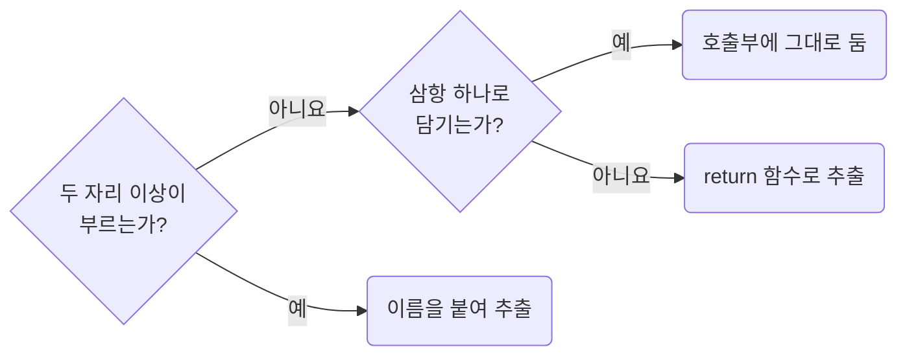

| 허용 사유 | 조건 |
| --- | --- |
| 실제 재사용 | 변경 후 코드에서 두 자리 이상이 부름. 한 줄 함수도 같음 |
| 함수 형태가 필수 | 삼항 하나로 표현할 수 없는 판정, `value is T` 타입 가드, 재귀 |


### 추출을 검토할 때

| 추출을 검토하는 이유 | 처리 |
| --- | --- |
| `.map()` 콜백 하나에서만 쓰는 변환 | 그 콜백에 둡니다 |
| 값이 두 분기로 갈림 | 호출부에서 삼항 하나로 씁니다 |
| 값이 세 분기 이상으로 갈림 | 함수로 추출하고 분기마다 `return`으로 끝냅니다 |

추출 전에 값 검사를 `absence-check-once-at-the-boundary`의 경계로 보내 분기를 줄일 수 있는지 확인합니다.
같은 판정이 반복되면 `values-decide-once-and-carry-the-result`에 따라 결과를 전달할지도 먼저 봅니다.
함수 배치는 `functions-give-each-function-its-own-file`,
루트 승격은 `functions-promote-owner-free-functions-to-root-util`이 정합니다.

**Incorrect 1 (한 자리에서만 쓰는 단계를 함수로 떼어 내 흐름이 파일 안에서 흩어집니다):**

```txt
page/report/_function/to-report-content.ts
  toReportContent    내보낸 함수. 본문은 세 줄이고 나머지는 아래 함수로 갔다
  toComparisonRows   toReportContent 만 부름
  toStatusGroups     toReportContent 만 부름
  toStockCard        toReportContent 만 부름
  formatAmount       toComparisonRows 와 toStatusGroups 가 부름
```

```ts
// page/report/_function/to-report-content.ts
/**
 * 상품 보고서 영역의 표시 데이터. 상품 상세에서만 재고 카드가 온다
 */
export const toReportContent = (params: ToReportContentParams): ReportContent => {
	return {
		metrics: toComparisonRows(params),
		statusGroups: toStatusGroups(params),
		stockCount: toStockCard(params),
	};
};
```

**Correct 1 (한 번 쓰는 단계는 호출부에 두고 재사용하는 계산은 함수로 추출합니다):**

```txt
page/report/_function/to-report-content/
├── to-report-content.ts   본문 안에 // 1. 비교 행  // 2. 상태 그룹  // 3. 재고 카드
└── _format-amount.ts      비교 행과 상태 그룹 두 자리가 부름
```

```ts
// page/report/_function/to-report-content/to-report-content.ts
/**
 * 상품 보고서 영역의 표시 데이터. 상품 상세에서만 재고 카드가 온다
 */
export const toReportContent = (params: ToReportContentParams): ReportContent => {
	// 1. 고른 기간 기준으로 갱신되는 비교 수치 행
	const metrics = [
		{id: "orderAmount", label: "주문 금액", value: formatAmount(params.productSummary.orderAmount)},
		{id: "orderCount", label: "주문 건수", value: params.productSummary.orderCount},
	];

	// 2. 상품 상태 그룹. 설명이 비면 그룹 제목만 남긴다
	const statusGroups = [
		{
			id: "product-status",
			title: "상품 상태",
			description: params.productSummary.statusDescription,
			total: formatAmount(params.productSummary.totalAmount),
			rows: metrics,
		},
	];

	// 3. 재고 카드. 상품 상세에서만 온다
	return {metrics, statusGroups, stockCount: params.stockCount};
};
```

**Incorrect 2 (한 번만 쓰는 한 줄 계산을 파일로 떼어 내 호출부가 가져옵니다):**

```tsx
// page/profile/pg-profile.tsx
// (previous + 1) % pageCount 한 줄을 page/profile/_function/get-next-page.ts 로 옮겼다
import {getNextPage} from "@/page/profile/_function/get-next-page";

const handleNextClick = () => {
	setPage((previous) => getNextPage(previous, pageCount));
};
```

**Correct 2 (작은 계산은 쓰는 자리에 그대로 둡니다):**

```tsx
// page/profile/pg-profile.tsx
const handleNextClick = () => {
	setPage((previous) => (previous + 1) % pageCount);
};
```

**Correct (서로 다른 파일 둘이 이미 부르는 순수 함수를 뺍니다):**

```ts
// page/profile/_function/to-profile-save-request.ts
/**
 * profile 저장 payload 조립. 서버가 앞뒤 공백이 붙은 displayName을 거부한다
 */
export const toProfileSaveRequest = (formValues: ProfileFormValues) => {
	return {
		displayName: formValues.displayName.trim(),
	};
};
```

```tsx
// page/profile/_pg-profile-form.tsx와 page/profile/_pg-profile-drawer.tsx가 함께 부른다
import {toProfileSaveRequest} from "@/page/profile/_function/to-profile-save-request";
```

**Correct (삼항 하나에 담기지 않는 판정은 사용처가 하나여도 함수로 추출하고 분기마다 `return`으로 끝냅니다):**

```ts
// page/detail/_function/to-status-tone.ts
/**
 * 상태 문자열의 강조 tone. API가 상태를 자유 문자열로 주어 값 포함으로 판정한다
 */
export const toStatusTone = (status: string): Tone => {
	const normalizedStatus = status.trim().toLowerCase();
	if (status_positive_values.some((value) => normalizedStatus.includes(value))) {
		return "positive";
	}
	if (status_negative_values.some((value) => normalizedStatus.includes(value))) {
		return "negative";
	}
	return "neutral";
};
```

### 3.4 Give Each Support Function Its Own File

**Rule:** `T03-04` · `functions-give-each-function-its-own-file`

**Applies when:** 떼어 낸 보조 함수를 어느 파일이나 폴더에 둘지 정할 때. `helper.ts`, `helpers.ts`, `utils.ts` 같은 파일을 만들거나 거기에 함수를 더할 때. 대표 함수가 자기만 쓰는 보조를 처음 갖게 될 때. 보조를 부르는 대표 함수나 소유자가 늘어날 때.

**Requires selected:** `functions-extract-helpers-only-when-the-boundary-is-real` (함께 적용)

**Review with:** `functions-order-declarations-top-down`, `functions-promote-owner-free-functions-to-root-util`

**Impact: HIGH (보조 함수를 개별 파일로 관리하고 폴더로 소유 관계를 드러냅니다)**

### 호출부에 따른 자리

보조 함수에 이름을 붙일지는 `functions-extract-helpers-only-when-the-boundary-is-real`이 판단합니다.
이름을 붙였다면 함수마다 파일을 하나 두고, 부르는 대표 함수에 따라 배치합니다.

보조 함수의 자리를 고르는 차례입니다.

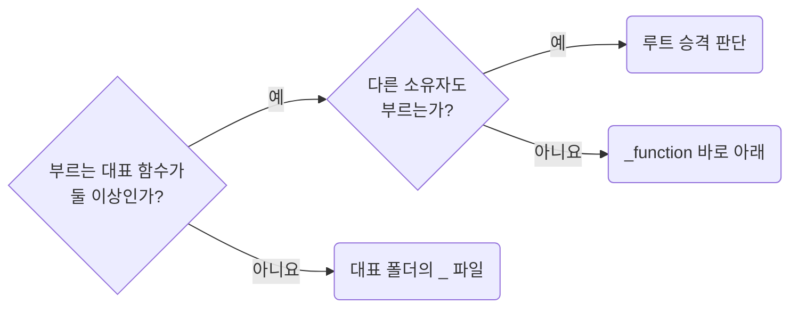

| 호출부 | 위치 |
| --- | --- |
| 대표 함수 하나 | `_function/<대표>/<대표>.ts`와 같은 폴더의 `_<보조>.ts` |
| 같은 소유자의 대표 함수 둘 이상 | `_function/<보조>.ts`. 기존 `_` 접두사를 뗍니다 |
| 다른 소유자 | `functions-promote-owner-free-functions-to-root-util`로 루트 승격 여부를 판단합니다 |

### 파일 배치 규범

| 배치 대상 | 규범 |
| --- | --- |
| 대표 함수 | 내보낸 함수 하나당 파일 하나이며 파일명은 함수 이름입니다 |
| 대표만 쓰는 보조 | 대표 파일 아래 비공개 `const`로 쌓지 않고 같은 이름 폴더의 `_` 파일로 둡니다 |
| 보조의 보조 | 같은 폴더의 `_` 파일로 둡니다. 하위 폴더를 더 만들지 않습니다 |
| 타입, 상수 | 이 폴더에 두지 않고 프레임워크 규칙이 정한 소유자의 역할 폴더에 둡니다 |
| `helper.ts`, `helpers.ts`, `utils.ts` | 여러 보조를 모으는 파일로 만들지 않습니다 |

`_` 파일은 같은 폴더에서만 가져옵니다.
대표와 `_` 파일, `_` 파일끼리의 호출은 대표의 내부이며 재노출 사슬이 아닙니다.
루트 `util`끼리의 직접 가져오기도 각 공개 진입점의 출처가 드러나므로 허용합니다.
부르는 대표 함수나 소유자가 늘면 표의 다음 배치를 검토합니다.

**Incorrect 1 (여러 보조를 모은 파일에서 내보낸 함수가 세 단계로 이어집니다):**

```ts
// utils.ts
export const toTrimmedTitle = (title: string) => {
	return title.trim();
};

export const toProductPayload = (values: ProductFormValues) => {
	return {title: toTrimmedTitle(values.title)};
};

export const toProductSaveRequest = (values: ProductFormValues) => {
	return {body: toProductPayload(values)};
};
```

**Correct 1 (소유자 아래 대표 함수 하나에 파일 하나를 둡니다):**

```ts
// page/product-form/_function/to-product-save-request.ts
/**
 * product 저장 요청 조립. 서버가 앞뒤 공백이 붙은 title을 거부한다
 */
export const toProductSaveRequest = (values: ProductFormValues) => {
	return {body: {title: values.title.trim()}};
};
```

**Incorrect 2 (대표 함수 하나만 부르는 보조를 대표 파일 아래 비공개 `const`로 쌓습니다):**

```txt
page/report/_function/
├── to-product-overview.ts
│     toProductOverview      내보낸 함수
│     toTrendChart           toProductOverview 가 차트 둘에서 부름
│     toTrendPoints          toTrendChart 가 두 자리에서 부름
└── to-product-filter-request.ts
```

**Correct 2 (자기만 쓰는 보조가 생긴 대표 함수는 자기 이름 폴더를 갖고 보조는 `_` 파일입니다):**

```txt
page/report/_function/
├── to-product-overview/           자기만 쓰는 보조가 있어 폴더
│   ├── to-product-overview.ts     대표. 폴더와 같은 이름
│   ├── _to-trend-chart.ts         toProductOverview 만 부름
│   └── _to-trend-points.ts        _to-trend-chart 만 부름. 폴더 안은 평평
└── to-product-filter-request.ts   보조가 없어 파일 하나
```

**Incorrect 3 (한 대표만 부르는 보조를 `_function` 바로 아래에 내보내 둡니다):**

```txt
page/report/_function/
├── to-product-overview.ts
├── to-product-digest.ts
└── to-trend-chart.ts            toProductOverview 만 부르는데 소유자의 공개 면에 놓임
```

**Correct 3 (두 대표가 부르게 된 뒤에 `_function` 바로 아래로 올리고 `_`를 뗍니다):**

```txt
page/report/_function/
├── to-product-overview/
│   └── to-product-overview.ts
├── to-product-digest.ts           toTrendChart 를 함께 부르기 시작함
└── to-trend-chart.ts              대표 둘이 불러 공개 면으로 올라옴
```

### 3.5 Order Declarations Top Down

**Rule:** `T03-05` · `functions-order-declarations-top-down`

**Applies when:** `.ts` 파일에 선언을 추가하거나 선언 자리를 옮길 때. 내보낸 계약 타입이나 모듈 상수를 내보낸 함수보다 아래에 두려 할 때. 제외: 리액트 컴포넌트 본문 안 선언 자리를 바꾸는 경우.

**Impact: HIGH (파일을 열면 내보낸 함수가 먼저 보이고 호출부에서 호출 대상으로 이어집니다)**

내보낸 계약과 대표 함수를 먼저 보여 주되, 모듈 초기화 시 필요한 선언 순서를 지킵니다.

파일 위에서 아래로 놓는 차례입니다.

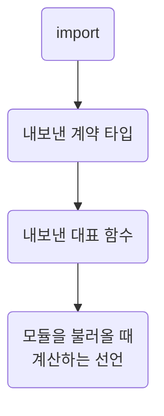

함수 본문 참조는 호출 시점에 읽으므로 모듈 초기화가 끝난 뒤 부르면 참조 대상이 아래에 있어도 됩니다.
즉시 계산하는 선언은 자기가 부르는 선언 뒤에 둡니다.
컴포넌트 본문의 훅, 핸들러, 이펙트 순서는 프레임워크 컨벤션이 정합니다.

**Incorrect 1 (내보낸 계약 타입이 함수 아래에 있어 시그니처를 읽으려면 파일을 끝까지 내려가야 합니다):**

```ts
// page/report/_function/to-summary-rows.ts
export const toSummaryRows = (params: ToSummaryRowsParams): SummaryRow[] => {
	return params.response.items.map((item) => ({id: item.id, label: item.name.trim() || item.code}));
};

/**
 * 요약 표 행을 만들 때 필요한 입력
 */
export interface ToSummaryRowsParams {
	/**
	 * 요약 조회 응답
	 */
	response: OrderSummaryResponse;
}
```

**Correct 1 (내보낸 계약 타입이 먼저, 그 계약을 받는 함수가 바로 아래에 옵니다):**

```ts
// page/report/_function/to-summary-rows.ts
/**
 * 요약 표 행을 만들 때 필요한 입력
 */
export interface ToSummaryRowsParams {
	/**
	 * 요약 조회 응답
	 */
	response: OrderSummaryResponse;
}

/**
 * 요약 표가 그리는 행 목록. 이름이 비면 코드로 표시한다
 */
export const toSummaryRows = (params: ToSummaryRowsParams): SummaryRow[] => {
	return params.response.items.map((item) => ({id: item.id, label: item.name.trim() || item.code}));
};
```

**Incorrect 2 (모듈을 불러올 때 계산되는 선언이 자기가 부르는 선언보다 위에 있습니다):**

```ts
const selectedLocaleSupported = isSupportedLocale(selectedLocale);

/**
 * 짧고 고정된 지원 로케일 목록을 기준으로 판정한다
 */
export const isSupportedLocale = (locale: string): boolean => {
	return locale_supported_values.includes(locale);
};
```

**Correct 2 (모듈을 불러올 때 계산되는 선언은 자기가 부르는 선언 뒤에 둡니다):**

```ts
/**
 * 짧고 고정된 지원 로케일 목록을 기준으로 판정한다
 */
export const isSupportedLocale = (locale: string): boolean => {
	return locale_supported_values.includes(locale);
};

const selectedLocaleSupported = isSupportedLocale(selectedLocale);
```

### 3.6 Promote Owner-Free Functions to the Root util Folder

**Rule:** `T03-06` · `functions-promote-owner-free-functions-to-root-util`

**Applies when:** 함수를 루트 `util` 폴더로 옮기거나 종류 폴더를 새로 만들 때. 두 소유자가 같은 함수를 쓰게 될 때. 제외: 소유자 안에서 파일 자리만 바꾸는 경우.

**Impact: HIGH (소유자 전용 함수를 구분하고 사용처 수가 달라져도 배치 기준을 유지합니다)**

### 승격 판단

루트 `util` 승격은 사용처 수가 아니라 소유자를 지워도 계산이 남는지로 판단합니다.
사용처가 늘거나 줄어도 이 기준은 바뀌지 않습니다.

승격을 판단하는 차례입니다.

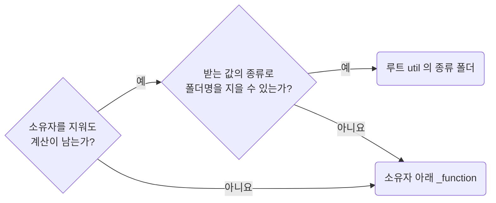

| 소유자를 지운 결과 | 배치 |
| --- | --- |
| 함수도 사라짐 | 해당 소유자의 `_function`에 둡니다. `toProfileSaveRequest`가 그 예입니다 |
| 함수가 남음 | 한 곳에서만 써도 `util/<받는 값의 종류>/`에 둡니다. `toDisplayDate`가 그 예입니다 |

### 종류 폴더

| 폴더 | 기준 |
| --- | --- |
| `date`, `money`, `string`, `array`, `dom`, `url` | 함수가 받는 값의 타입입니다 |
| `spread` 등 도메인 이름 | `Spread`처럼 실제 입력 타입이면 허용합니다. 화면, 기능 이름은 쓰지 않습니다 |
| 소유자 아래 `_function` | 종류 폴더 없이 함수 파일을 나열합니다 |

루트의 소유자는 프로젝트입니다.
함수마다 파일 하나, 자기만 쓰는 보조는 자기 이름 폴더의 `_` 파일이라는 규칙은 소유자 아래와 같습니다.

### 두 소유자가 공유할 때

| 두 소유자가 공유하는 것 | 처리 |
| --- | --- |
| 표시까지 같음 | 프레임워크의 레이어 규칙에 따라 `widget`이 소유합니다 |
| 계산만 같음 | 각 소유자가 각각 갖습니다 |
| 프로젝트 전반의 계산임 | 루트 `util`로 올립니다 |

**Incorrect 1 (소유자와 함께 사라질 함수를 루트 `util`로 올립니다):**

```ts
// util/profile/to-profile-save-request.ts
// profile은 값의 종류가 아니라 화면 이름이다. 화면이 없어지면 이 요청도 없다
/**
 * 서버가 앞뒤 공백이 붙은 displayName을 거부한다
 */
export const toProfileSaveRequest = (values: ProfileFormValues) => {
	return {body: {displayName: values.displayName.trim()}};
};
```

**Correct 1 (소유자와 함께 사라질 함수는 그 소유자의 `_function` 폴더에 둡니다):**

```ts
// page/profile/_function/to-profile-save-request.ts
/**
 * 서버가 앞뒤 공백이 붙은 displayName을 거부한다
 */
export const toProfileSaveRequest = (values: ProfileFormValues) => {
	return {body: {displayName: values.displayName.trim()}};
};
```

**Incorrect 2 (소유자를 지워도 남을 함수를 호출부가 하나라고 소유자 아래 둡니다):**

```ts
// page/orders/_function/to-display-date.ts
// 날짜 표시는 orders 화면을 지워도 남는다. 지금 이 화면만 쓴다는 이유로 여기 있다
/**
 * 형식을 고정한다. 사용자 로케일을 따라가면 목록 정렬 기준과 어긋난다
 */
export const toDisplayDate = (value: string): string => {
	return dayjs(value).format(date_format);
};
```

**Correct 2 (소유자를 지워도 남는 함수는 받는 값의 종류 폴더로 올립니다):**

```ts
// util/date/to-display-date.ts
/**
 * 형식을 고정한다. 사용자 로케일을 따라가면 목록 정렬 기준과 어긋난다
 */
export const toDisplayDate = (value: string): string => {
	return dayjs(value).format(date_format);
};
```

**Correct (종류 폴더 아래에도 함수마다 파일 하나를 둡니다):**

```txt
util/
├── date/
│   ├── to-display-date.ts
│   └── to-display-date.test.ts
└── money/
    └── to-signed-amount.ts
```

```ts
// util/money/to-signed-amount.ts
/**
 * 금액 표시는 화면마다 다르지 않다. 소수 두 자리와 부호를 고정한다
 */
export const toSignedAmount = (amount: Amount): string => {
	return `${amount.value < 0 ? "-" : "+"}$${Math.abs(amount.value).toFixed(2)}`;
};
```

### 3.7 Avoid Imperative Assembly in Wide Scopes

**Rule:** `T03-07` · `functions-avoid-imperative-assembly-in-wide-scopes`

**Applies when:** 모듈 최상위나 함수 본문 전체를 덮는 스코프에서 `let` 재할당, 배열 `push`, 조건부 누적으로 값을 만들 때. 삼항 안에 삼항을 넣을 때.

**Review with:** `functions-extract-helpers-only-when-the-boundary-is-real`

**Impact: HIGH (분기로 공유 지역 변수를 바꾸지 않아 넓은 스코프의 값 조립이 선언형으로 남습니다)**

모듈 최상위나 함수 본문 전체에 걸친 `let` 재할당, `push`, 조건부 누적으로 값을 조립하지 않습니다.
`if`나 `for` 블록 안에서만 쓰는 누적은 대상이 아닙니다.

넓은 스코프에서 조립 방법을 고르는 차례입니다.

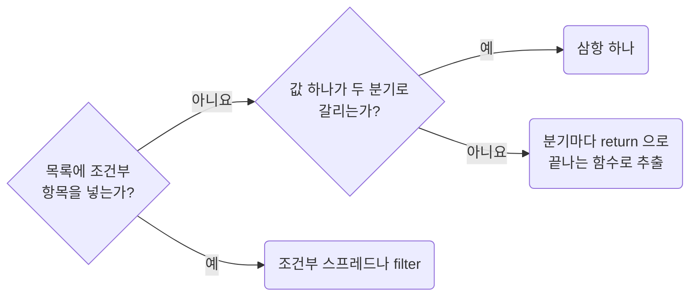

중첩 삼항과 기본값을 `let`에 넣은 뒤 덮어쓰는 방식은 사용하지 않습니다.
분기별 결과가 그 자리에서 끝나야 읽는 사람이 이후 재할당까지 확인하지 않아도 됩니다.
추출 전에 `absence-check-once-at-the-boundary`에 따라 값을 검사하면 분기가 줄어들 수 있습니다.

추출 여부는 `functions-extract-helpers-only-when-the-boundary-is-real`,
함수 이름은 `functions-name-functions-by-what-comes-out`을 따릅니다.
중간값 명명은 `functions-name-a-value-only-for-recompute-or-judgment`가 판단합니다.

**Incorrect 1 (넓은 스코프에서 명령형으로 조립을 쌓습니다):**

```ts
let visibleTabs = ["overview"];

if (canManageItems) {
	visibleTabs.push("items");
}
```

**Correct 1 (조건부 스프레드로 한 번에 계산합니다):**

```ts
const visibleTabs = ["overview", ...(canManageItems ? ["items"] : [])];
```

**Incorrect 2 (삼항 안에 삼항을 넣어 값 하나를 고릅니다):**

```ts
const statusLabel = order.isCancelled ? "취소" : order.isDueSoon ? "임박" : "진행";
```

**Correct 2 (분기가 셋이면 `return`으로 끝나는 함수로 뺍니다):**

```ts
// page/orders/_function/to-order-row/_to-status-label.ts
/**
 * 주문 행의 상태 라벨. 취소가 임박보다 우선한다
 */
export const toStatusLabel = (order: OrderRow): StatusLabel => {
	if (order.isCancelled) {
		return "취소";
	}
	if (order.isDueSoon) {
		return "임박";
	}
	return "진행";
};
```

**Incorrect 3 (목록 조립에서 조건이 셋이 되자 삼항을 겹칩니다):**

```ts
const visibleTabs = canManageItems
	? canInviteMembers
		? ["overview", "items", "members"]
		: ["overview", "items"]
	: canInviteMembers
		? ["overview", "members"]
		: ["overview"];
```

**Correct 3 (조건이 셋 이상인 목록은 표로 두고 걸러 냅니다):**

```ts
const visibleTabs = [
	{id: "overview", isVisible: true},
	{id: "items", isVisible: canManageItems},
	{id: "members", isVisible: canInviteMembers},
]
	.filter((tab) => tab.isVisible)
	.map((tab) => tab.id);
```

### 3.8 Name a Value Only to Prevent Recompute or Explain a Judgment

**Rule:** `T03-08` · `functions-name-a-value-only-for-recompute-or-judgment`

**Applies when:** 순수 계산의 결과를 지역 변수\(`const`\)로 받는 줄을 추가, 삭제할 때. 표현식을 쓰는 자리에 그대로 적을지 변수로 뺄지 정할 때.

**Review with:** `functions-avoid-imperative-assembly-in-wide-scopes`, `values-read-objects-through-chains`

**Impact: HIGH (사용 횟수보다 계산 비용과 판정의 복잡성을 기준으로 변수 선언 여부를 판단합니다)**

### 변수로 받을 사유

지역 변수는 재계산을 막거나 여러 항을 합친 판정에 이름을 붙일 때만 만듭니다.
사용처 수만으로는 만들지 않으며, 아래 사유가 없으면 표현식을 쓰는 자리에 둡니다.

| 변수로 받을 사유 | 확인할 것 |
| --- | --- |
| 콜백, 반복문으로 옮기면 비용이 반복됨 | 코드에 한 번 적혀도 원소마다 실행됩니다. 반복 조회용 `Set`도 콜백 밖에 둡니다 |
| 시각, 난수처럼 호출마다 값이 달라짐 | 여러 사용처가 같은 값을 보아야 합니다 |
| `await`, `yield`, 외부 호출 | 순서나 호출 시점을 바꾸지 않습니다. `localStorage.getItem()`도 해당합니다 |
| 훅 호출, `useState` 반환 | 정해진 호출 위치와 횟수를 유지합니다 |
| 여러 항을 합친 판정 | `isEditable`처럼 이름이 판정의 결론을 설명해야 합니다 |
| 부정이 겹친 판정 | `!row.deletedAt && !row.archivedAt`은 `isVisible`처럼 뜻을 드러냅니다 |

단일 비교인 `row.dueDate < today`는 반복해서 써도 그대로 둡니다.
사용처가 하나 늘었다고 변수 필요성까지 달라지지 않도록 표현식의 성격으로 판단합니다.

### 다른 규칙이 정하는 것

| 이 규칙과 구분할 대상 | 적용 규칙 |
| --- | --- |
| 함수 값 | 계산 결과가 아닌 계약입니다. `functions-declare-functions-as-arrow-consts`를 따릅니다 |
| 객체 필드의 별칭 | `values-read-objects-through-chains` |
| `let` 재할당, `push` 누적 | `functions-avoid-imperative-assembly-in-wide-scopes` |
| 표현식 안의 리터럴 | 지역 변수로 옮기지 않고 `types-replace-enum-with-as-const-objects`와 `naming-place-project-constants-in-the-root-constant-folder`로 선언합니다 |

반복 조회 구조의 사용 기준은 `values-use-set-and-map-for-repeated-lookups`를 따릅니다.

**Incorrect 1 (두 번 쓴다는 이유만으로 변수로 뺍니다):**

```ts
const toRowClassNames = (row: Row): string[] => {
	const isOverdue = row.dueDate < today;

	return [
		isOverdue ? "ui_row__root--overdue" : "ui_row__root",
		isOverdue ? "ui_row__badge--overdue" : "ui_row__badge",
	];
};
```

**Correct 1 (항이 하나라 두 번 적어도 그 자리에 그대로 씁니다):**

```ts
const toRowClassNames = (row: Row): string[] => {
	return [
		row.dueDate < today ? "ui_row__root--overdue" : "ui_row__root",
		row.dueDate < today ? "ui_row__badge--overdue" : "ui_row__badge",
	];
};
```

**Incorrect 2 (돌려주기만 할 값을 변수로 뺍니다):**

```ts
const toNextPage = (page: number): number => {
	const nextPage = page + 1;

	return nextPage;
};

const toRowLabel = (row: Row): string => {
	const rowLabel = `${row.title} (${row.id})`;

	return rowLabel;
};
```

**Correct 2 (이름을 붙이지 않고 그대로 돌려줍니다):**

```ts
const toNextPage = (page: number): number => {
	return page + 1;
};

const toRowLabel = (row: Row): string => {
	return `${row.title} (${row.id})`;
};
```

**Incorrect 3 (세 항을 엮은 판정을 쓰는 자리에 그대로 늘어놓습니다):**

```ts
const toRowAction = (row: Row): RowAction => {
	return row.status === product_status.draft && !row.lockedAt && row.ownerId === session.userId
		? row_action.edit
		: row_action.view;
};
```

**Correct 3 (한 번만 써도 합성 판정이라 변수로 뺍니다):**

```ts
const toRowAction = (row: Row): RowAction => {
	const isEditable = row.status === product_status.draft && !row.lockedAt && row.ownerId === session.userId;

	return isEditable ? row_action.edit : row_action.view;
};
```

**Incorrect 4 (콜백 안에 두어 행마다 다시 계산합니다):**

```ts
const toVisibleRows = (rows: Row[], keyword: string): Row[] => {
	return rows.filter((row) => row.title.toLowerCase().includes(keyword.trim().toLowerCase()));
};
```

**Correct 4 (콜백 밖으로 빼 행마다 다시 계산하지 않습니다):**

```ts
const toVisibleRows = (rows: Row[], keyword: string): Row[] => {
	// 콜백 안으로 옮기면 행마다 다시 계산한다
	const lowerKeyword = keyword.trim().toLowerCase();

	return rows.filter((row) => row.title.toLowerCase().includes(lowerKeyword));
};
```

**Incorrect 5 (변수를 없애느라 저장과 캐시 비우기 순서가 뒤집힙니다):**

```ts
/**
 * 초안을 저장한 뒤 목록 캐시를 비운다
 */
const submitDraft = async (draft: Draft) => {
	await queryClient.invalidateQueries({queryKey: ["records"]});

	return await saveRecord(draft);
};
```

**Correct 5 (외부 호출의 실행 순서를 유지하려고 변수로 뺍니다):**

```ts
/**
 * 초안을 저장한 뒤 목록 캐시를 비운다
 */
const submitDraft = async (draft: Draft) => {
	const savedRecord = await saveRecord(draft);

	await queryClient.invalidateQueries({queryKey: ["records"]});

	return savedRecord;
};
```

### 3.9 Name Functions by What Comes Out

**Rule:** `T03-09` · `functions-name-functions-by-what-comes-out`

**Applies when:** 이름을 붙인 함수를 새로 만들거나 이름을 바꿀 때. 제외: 생성기, 프레임워크, 외부 계약이 정한 이름을 그대로 쓰는 경우.

**Impact: MEDIUM (함수 이름으로 반환값이나 효과를 파악할 수 있습니다)**

### 역할별 동사

함수 이름은 호출 뒤 얻는 값이나 효과를 구체적으로 드러냅니다.
입력은 시그니처가 설명하므로 이름에 반복하지 않습니다.

| 반환값의 역할 | 동사 | 예 |
| --- | --- | --- |
| 다른 형태로 변환, 분류 | `to` | `toDetailContent` |
| 이미 존재하는 값 | `get` | `getSelectedRow` |
| 값 하나 또는 없음 | `find` | `findUserByEmail` |
| 서로 다른 입력 둘 이상의 우선순위 선택 | `choose` | `chooseBackSource` |
| 같은 개념의 허용 범위, 표현 보정 | `normalize` | `normalizePageSize` |
| 문자열, `unknown` 검증 후 읽기 | `parse` | `parseSearchParams` |
| 사람이 읽는 표시 문자열 | `format` | `formatCandidateDayCount` |
| 두 값의 정렬 순서 | `compare` | `compareProductsByPrice` |
| 비동기 I/O, 여러 요청 조율 | `load`, `fetch` | `loadProductExport` |
| 참, 거짓 판정 | `is`, `has`, `can`, `should` | `shouldShowSummary` |

| 함수의 역할 | 동사 | 예 |
| --- | --- | --- |
| 저장, 삭제 | `save`, `remove` | `saveProduct` |
| 조건 위반 시 예외 | `assert` | `assertLoggedIn` |
| 검사 결과 또는 오류 | `validate` | `validateProductForm` |
| 도메인 동작 | 실제 업무 동사 | `submitOrder`, `cancelBooking` |

`choose`는 서로 다른 입력 사이에서 `??` 등으로 고를 때 씁니다. 입력이 하나면 해당하지 않습니다.
소유자 경로가 이미 말하는 도메인도 빼고, 반환 타입 이름보다 호출자가 쓰는 결과 개념을 적습니다.
`toComparisonWindows`, `toReportRows`처럼 쓰되 요청 계약 자체가 출력이면 `toUserSaveRequest`처럼 짓습니다.

### 쓰지 않는 동사

`build`, `create`, `make`, `process`, `manage`, `do`, `perform`, `execute`, `filter`, `map`, `update`, `resolve`는
직접 짓는 이름의 첫 동사로 쓰지 않습니다.

| 모호한 이름 | 결과, 효과를 드러낸 이름 |
| --- | --- |
| `filterActiveUsers` | 남기는 목록이면 `toActiveUsers` |
| `mapProductRows` | 출력이 행이면 `toProductRows` |
| `updateProduct` | 저장이면 `saveProduct`, 계산이면 `toUpdatedProduct` |
| `resolveStatusTone` | 분류 결과인 `toStatusTone` |

### 대상이 아닌 이름

`array.map(...)` 같은 표준 메서드 호출은 함수 명명 규칙의 대상이 아닙니다.
`handle`, `use`는 프레임워크 규칙을 따릅니다.
생성기, 프레임워크, 외부 계약이 정한 이름과 `Promise`의 `resolve`, `reject`는 바꾸거나 감싸지 않습니다.

**Incorrect 1 (입력, 구현 동작, 막연한 접미사를 이름에 씁니다):**

```ts
// page/detail/_function/build-user-payload.ts
export const buildUserPayload = (formValues: UserFormValues) => { /* … */ };
```

```ts
// page/detail/_function/map-response-to-model.ts
export const mapResponseToModel = (response: UserResponse) => { /* … */ };
```

```ts
// page/detail/_function/process-user-rows.ts
export const processUserRows = (rows: UserRow[]) => { /* … */ };
```

```ts
// page/detail/_function/resolve-status-tone.ts
export const resolveStatusTone = (status: string) => { /* … */ };
```

**Correct 1 (출력 역할이나 효과를 이름에 씁니다):**

```ts
// page/detail/_function/to-user-save-request.ts
/**
 * 사용자 저장 요청 조립. 서버가 빈 문자열을 거부해 비운 칸은 넣지 않는다
 */
export const toUserSaveRequest = (formValues: UserFormValues) => { /* … */ };
```

```ts
// page/detail/_function/to-user-rows.ts
/**
 * 응답 한 건을 표 행으로 바꾼다
 */
export const toUserRows = (response: UserResponse) => { /* … */ };
```

```ts
// page/detail/_function/to-active-users.ts
/**
 * 비활성 사용자를 제외한 목록
 */
export const toActiveUsers = (rows: UserRow[]) => { /* … */ };
```

```ts
// page/detail/_function/to-status-tone.ts
/**
 * 상태 문자열을 강조 tone으로 분류한다
 */
export const toStatusTone = (status: string) => { /* … */ };
```

**Correct (저장, 검사 함수는 역할과 판정으로 이름을 짓습니다):**

```ts
// util/user/is-admin-user.ts
/**
 * 관리자 권한 판정. 역할 목록이 비어 있으면 조회 전 상태로 보고 false를 돌려준다
 */
export const isAdminUser = (user: User) => { /* … */ };
```

```ts
// util/session/assert-logged-in.ts
/**
 * 로그인 상태가 아니면 예외를 던진다. 화면 이동은 호출한 쪽이 정한다
 */
export const assertLoggedIn = (session: Session): void => {
	if (!session.userId) {
		throw new NotLoggedInError();
	}
};
```

## 4. Values and Data Structures

**Impact: HIGH**

값을 다루는 관용구를 한 가지로 고정합니다. 넘겨받은 배열은 제자리에서 바꾸지 않고, 반복되는 조회는 `Set`과 `Map`으로 모읍니다. 객체의 값은 구조분해하지 않고 체인으로 읽어 출처를 남깁니다. 한 곳에서 쓸 값은 조회표로 우회하지 않고 사용처에서 직접 고릅니다. 뜻이 있는 숫자는 쓰는 자리에 적지 않고 상수로 선언합니다. 값 보조 함수는 직접 만들기 전에 `es-toolkit`에서 찾습니다. 날짜는 `dayjs`로 다룹니다. 같은 판단은 경계에서 한 번만 하고 결과를 데이터로 전달합니다.

### 4.1 Prefer Immutable Array Sorting

**Rule:** `T04-01` · `values-prefer-immutable-array-sorting`

**Applies when:** 프롭스, 상태, 매개변수, 모듈 상수에서 온 배열을 정렬할 때. 기존 `.sort()` 호출을 추가, 변경할 때.

**Review with:** `values-use-es-toolkit-for-value-helpers`

**Impact: HIGH (프롭스, 상태, 모듈 상수에서 온 배열을 정렬할 때 원본이 바뀌는 버그를 피합니다)**

정렬은 새 배열을 반환하는 `es-toolkit` 함수로 합니다. 원본을 바꾸는 `.sort()`는 쓰지 않습니다.
프롭스, 상태, 매개변수, 모듈 상수로 받은 배열도 같은 기준을 따릅니다.

정렬 함수를 고르는 차례입니다.

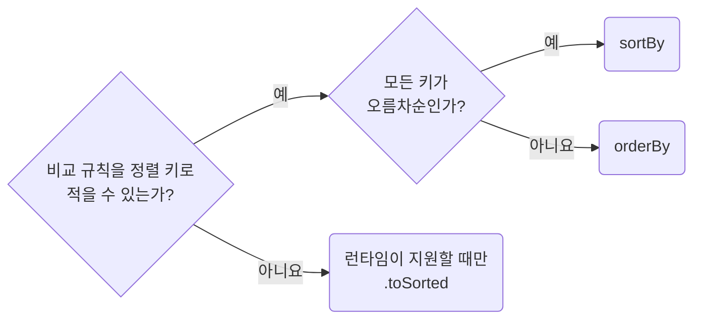

`localeCompare`가 정렬 키로 적을 수 없는 비교 규칙입니다.
같은 키의 항목도 입력 순서와 무관하게 정렬해야 하면 고유 식별자를 마지막 정렬 키로 더합니다.
새 배열도 원소 객체는 공유하므로 정렬 키를 계산하면서 원소를 수정하지 않습니다.
입력을 수정하지 않는 정렬 함수는 `readonly` 배열을 매개변수로 받습니다.
`.toSorted()`의 타입 선언만 추가해도 런타임 지원이 생기지는 않습니다.

**Incorrect 1 (매개변수로 받은 배열을 제자리에서 바꿉니다):**

```ts
const toSortedUsers = (users: User[]): User[] => {
	return users.sort((left, right) => left.age - right.age);
};
```

**Correct 1 (키 기준 정렬은 `sortBy`를 씁니다):**

```ts
import {sortBy} from "es-toolkit";

const toSortedUsers = (users: readonly User[]): User[] => {
	return sortBy(users, ["age"]);
};
```

**Correct (방향이 섞이면 `orderBy`를 씁니다):**

```ts
import {orderBy} from "es-toolkit";

const toSortedProducts = (products: readonly Product[]): Product[] => {
	return orderBy(products, ["category", "price"], ["asc", "desc"]);
};
```

**Correct (비교 규칙을 키로 적을 수 없으면 `.toSorted()`를 씁니다):**

```ts
const toSortedUsers = (users: readonly User[]): User[] => {
	return users.toSorted((left, right) => left.name.localeCompare(right.name));
};
```

### 4.2 Use Set and Map for Repeated Lookups

**Rule:** `T04-02` · `values-use-set-and-map-for-repeated-lookups`

**Applies when:** 같은 목록의 `includes`나 `find`를 루프, 배열 콜백 안에서 호출하도록 추가, 변경할 때. 같은 목록의 키 조회를 서로 다른 세 지점 이상에서 하도록 추가, 변경할 때. 제외: 조회하는 목록이 짧고 길이가 정해져 있는 경우.

**Impact: MEDIUM (반복 조회 구조를 한 번 만들어 목록 전체를 되풀이해 비교하는 비용을 줄입니다)**

### 반복 조회 바꾸기

같은 목록을 반복 조회하면 루프 밖에서 `Set`이나 `Map`을 한 번 만들고, 원본 목록이 바뀔 때 갱신합니다.
중첩된 `includes`, `find`는 최악의 경우 두 목록 길이의 곱만큼 비교합니다.

| 상황 | 처리 |
| --- | --- |
| 같은 목록을 루프나 `map`, `filter`, `some` 콜백 안에서 조회 | 포함 여부는 `Set.has`, 항목 조회는 `Map.get`으로 바꿉니다 |
| 같은 목록을 서로 다른 세 지점 이상에서 조회 | 한 번 만든 `Set`, `Map`을 공유합니다 |
| 위 조건에 해당하지 않거나 길이가 정해진 짧은 목록 | 기존 조회를 유지합니다 |
| 중복 제거, 차집합처럼 결과 목록을 만듦 | `uniq`, `difference`, `without`을 씁니다. 만든 뒤 `has`를 반복 호출할 때만 `Set`을 남깁니다 |

`Set`, `Map`도 생성 비용이 있으며 조회가 항상 상수 시간인 것은 아닙니다.
명세는 평균 조회 시간이 원소 수에 비례하는 시간보다 짧을 것만 요구합니다.
서버 응답이나 사용자 선택처럼 목록 길이를 통제하지 못할 때 반복 조회 비용이 커집니다.

### `Map`으로 바꾸기 전 확인

| `Map`으로 바꾸기 전 확인 | 이유와 처리 |
| --- | --- |
| `keyBy`의 객체를 조회용으로 쓰는지 | 프로토타입의 `constructor`, `toString` 키에 걸릴 수 있어 `Map`을 씁니다 |
| 없는 키를 타입이 드러내는지 | `noUncheckedIndexedAccess`가 꺼진 `Record<string, T>`와 달리 `Map.get()`은 항상 `T \| undefined`입니다 |
| 키가 중복되는지 | `find`는 첫 항목, `new Map(entries)`는 마지막 항목을 남깁니다. 첫 항목을 유지하려면 `uniqBy`를 먼저 적용합니다 |

`groupBy`, `keyBy`는 목록을 재구성할 때 씁니다.
목록 연산의 선택은 `values-use-es-toolkit-for-value-helpers`가 정합니다.

**Incorrect 1 (같은 배열을 반복 순회하며 포함 여부를 확인합니다):**

```ts
const visibleProducts = products.filter((product) => allowedProductIds.includes(product.id));
const disabledProducts = archivedProducts.filter((product) => allowedProductIds.includes(product.id));
```

**Correct 1 (반복 조회는 `Set`으로 처리합니다):**

```ts
const allowedProductIdSet = new Set(allowedProductIds);

const visibleProducts = products.filter((product) => allowedProductIdSet.has(product.id));
const disabledProducts = archivedProducts.filter((product) => allowedProductIdSet.has(product.id));
```

**Correct (반복 키 조회는 `Map`으로 처리합니다):**

```ts
// users는 서버 계약상 id가 고유하다
const userById = new Map(users.map((user) => [user.id, user]));

const owner = userById.get(ownerId);
const reviewer = userById.get(reviewerId);
const approver = userById.get(approverId);
```

**Correct (길이가 정해진 짧은 목록은 `includes`를 그대로 씁니다):**

```ts
const isEditableStatus = editable_order_statuses.includes(order.status);
```

### 4.3 Read Object Fields Through Chains, Not Destructuring

**Rule:** `T04-03` · `values-read-objects-through-chains`

**Applies when:** 구조분해로 객체에서 값을 꺼내는 줄을 추가, 변경할 때. 객체 필드를 별칭 `const`에 담아 그 이름으로 쓰려 할 때. 제외: 배열이나 튜플을 자리로 푸는 경우.

**Review with:** `functions-name-a-value-only-for-recompute-or-judgment`

**Impact: HIGH (값이 어느 객체에서 왔는지가 쓰는 자리마다 남아 이름만 보고 출처를 되짚지 않습니다)**

객체 필드는 구조분해나 별칭 없이 `product.title`처럼 체인으로 읽습니다.
쓰는 자리마다 값의 출처가 남아야 합니다.

| 형태, 상황 | 처리 |
| --- | --- |
| 객체 구조분해 | 체인으로 읽습니다. 이름을 바꿔 꺼내는 `{status: orderStatus}`도 같습니다 |
| 같은 필드에 이름만 붙인 지역 `const` | 제거합니다. 필드를 그대로 읽는 것은 계산이 아닙니다 |
| 짧은 함수, 좁은 스코프 | 예외를 두지 않습니다 |
| 배열, 튜플 구조분해 | 유지합니다. `useState`와 `Object.entries`처럼 위치로 꺼내는 값에는 지워질 필드 이름이 없습니다 |
| 깊어서 읽기 어려운 체인 | 값을 꺼내는 곳에서 별칭으로 끊지 않고, 그 형태를 만드는 곳을 검토합니다 |

계산 결과에 이름을 붙일지는 `functions-name-a-value-only-for-recompute-or-judgment`가 정합니다.

**Incorrect 1 (이름을 바꿔 꺼내 출처와 원래 이름이 함께 사라집니다):**

```ts
const {status: orderStatus, owner: orderOwner} = order;

if (orderStatus === "archived") {
	notify(orderOwner);
}
```

**Correct 1 (체인으로 읽어 출처가 쓰는 자리마다 남습니다):**

```ts
const toOrderLine = (input: OrderLineInput): OrderLine => {
	return {
		label: input.product.title,
		amount: input.product.unitPrice * input.quantity,
	};
};

const toOrderTotal = (lines: OrderLine[]): OrderTotal => {
	return {
		currency: pricing_default_currency,
		amount: sumBy(lines, (line) => line.amount),
	};
};

if (order.status === "archived") {
	notify(order.owner);
}
```

**Incorrect 2 (시그니처와 본문에서 구조분해해 출처가 사라집니다):**

```ts
const toOrderLine = ({product, quantity}: OrderLineInput): OrderLine => {
	const {title, unitPrice} = product;

	return {
		label: title,
		amount: unitPrice * quantity,
	};
};
```

**Correct 2 (배열과 튜플은 자리로 풀어도 됩니다):**

```ts
const [keyword, setKeyword] = useState("");

for (const [key, value] of Object.entries(target.searchParams)) {
	requestUrl.searchParams.set(key, value);
}
```

**Incorrect 3 (별칭 `const`로 끊어 이름만 남깁니다):**

```ts
const currency = pricing_default_currency;

const toOrderTotal = (lines: OrderLine[]): OrderTotal => {
	return {
		currency,
		amount: sumBy(lines, (line) => line.amount),
	};
};
```

**Correct 3 (필드 읽기가 아니라 계산한 결과라 이름을 붙입니다):**

```ts
const toOverdueLines = (order: Order): OrderLine[] => {
	// 콜백 안으로 옮기면 줄마다 다시 만든다
	const overdueIds = new Set(order.overdueLineIds);

	return order.lines.filter((line) => overdueIds.has(line.id));
};
```

### 4.4 Declare Meaningful Numbers Instead of Writing Them Inline

**Rule:** `T04-04` · `values-declare-meaningful-numbers`

**Applies when:** 비교, 계산, 호출 인자에 숫자 리터럴을 새로 적을 때. 제외: 관용값이나 배열 인덱스처럼 뜻이 없는 숫자를 쓰는 경우.

**Review with:** `absence-expose-optional-values-instead-of-silent-fallbacks`, `naming-place-project-constants-in-the-root-constant-folder`

**Impact: MEDIUM (숫자의 의미를 이름으로 드러내고 한곳에서 변경할 수 있습니다)**

제품 정책처럼 뜻이 있는 숫자는 상수로 선언하고, 사용처에서는 그 이름을 참조합니다.
`attempts > 42` 대신 `attempts > retry_max_attempts`로 씁니다.

| 숫자의 용도 | 처리 |
| --- | --- |
| 재시도 횟수 `3`, 페이지 크기 `20` 등 제품 정책 | 작거나 흔한 숫자여도 상수로 선언합니다 |
| 일반 연산의 `0`, `1`, 단위 변환의 `60` | 그대로 적습니다 |
| 배열 인덱스, 선언 초기값, 상수 선언 자신의 값 | 그대로 적습니다 |
| `??`, `\|\|` 오른쪽이나 기본 매개변수 | `absence-expose-optional-values-instead-of-silent-fallbacks`를 따릅니다 |
| 여러 숫자가 한 뜻을 이룸 | 배열 대신 `{first: 0x1100, last: 0x115f}`처럼 이름 있는 객체 필드로 둡니다 |

소유자를 지워도 남으면 루트 `constant`, 함께 사라지면 소유자의 `_constant`에 둡니다.
배치는 `naming-place-project-constants-in-the-root-constant-folder`가 정합니다.
같은 파일의 지역 `const`로 옮기는 것은 규칙을 충족하지 못합니다.
지역 변수에는 `functions-name-a-value-only-for-recompute-or-judgment`의 두 사유 중 하나가 필요합니다.
조회표를 둘지는 `values-avoid-lookup-tables-for-simple-choices`가 정합니다.

`tooling-configure-biome-to-enforce-these-rules`의 `style/noMagicNumbers`로 검사합니다.
테스트 파일에서는 리터럴 자체가 기대 계약일 수 있어 이 검사를 끕니다.

**Incorrect 1 (뜻이 있는 숫자를 쓰는 자리에 적거나 지역 `const`로 자리만 옮깁니다):**

```ts
// page/products/pg-products.tsx
const maxAttempts = 42;

const isOverRetryLimit = (attempts: number): boolean => {
	return attempts > maxAttempts;
};

const toPreviewRows = (rows: Row[]): Row[] => {
	return rows.slice(0, 37);
};
```

**Correct 1 (`constant` 폴더에 선언하고 쓰는 자리에서 이름을 가리킵니다):**

```ts
// constant/retry.ts
/**
 * 이 횟수를 넘으면 사용자에게 실패를 보여 준다
 */
export const retry_max_attempts = 42;

// constant/preview.ts
/**
 * 미리보기에 그릴 행 수. 서버가 한 번에 주는 최대치와 맞춘다
 */
export const preview_row_count = 37;

// page/products/pg-products.tsx
import {preview_row_count} from "@/constant/preview";
import {retry_max_attempts} from "@/constant/retry";

const isOverRetryLimit = (attempts: number): boolean => {
	return attempts > retry_max_attempts;
};

const toPreviewRows = (rows: Row[]): Row[] => {
	return rows.slice(0, preview_row_count);
};
```

**Incorrect 2 (뜻이 없는 숫자에까지 이름을 붙입니다):**

```ts
// constant/table.ts
export const table_first_row_index = 0;
export const table_page_step = 1;

// page/products/pg-products.tsx
import {table_first_row_index, table_page_step} from "@/constant/table";

const toFirstRow = (rows: Row[]): Row | undefined => {
	return rows[table_first_row_index];
};

const toNextPage = (page: number): number => {
	return page + table_page_step;
};
```

**Correct 2 (뜻이 없는 숫자는 그대로 둡니다):**

```ts
// page/products/pg-products.tsx
const toFirstRow = (rows: Row[]): Row | undefined => {
	return rows[0];
};

const toNextPage = (page: number): number => {
	return page + 1;
};
```

### 4.5 Avoid Lookup Tables for Simple Value Choices

**Rule:** `T04-05` · `values-avoid-lookup-tables-for-simple-choices`

**Applies when:** 상태나 `variant`에 따라 쓸 값 하나를 고르는 객체, Map을 추가, 변경할 때. 조회표의 키로 프롭이나 상태를 읽어 값을 넘기는 코드를 추가, 변경할 때.

**Requires selected:** `docs-justify-convention-exceptions-with-a-reason-comment` (함께 적용)

**Impact: HIGH (값과 선택 조건이 사용처에 함께 남아 선택 기준을 바로 읽을 수 있습니다)**

한 곳에서 쓸 값을 고르려고 객체나 `Map`으로 조회표를 만들지 않습니다.
같은 값은 그대로 넘기고 값이 달라질 때만 사용처에서 조건으로 고릅니다.

조회표는 여러 키의 대응 관계 자체가 도메인이나 외부 계약일 때만 둡니다.
선언 바로 위에는 어떤 계약의 대응 관계인지 확인할 수 있는 근거를 적습니다.

조회표를 둘지 정하는 차례입니다.

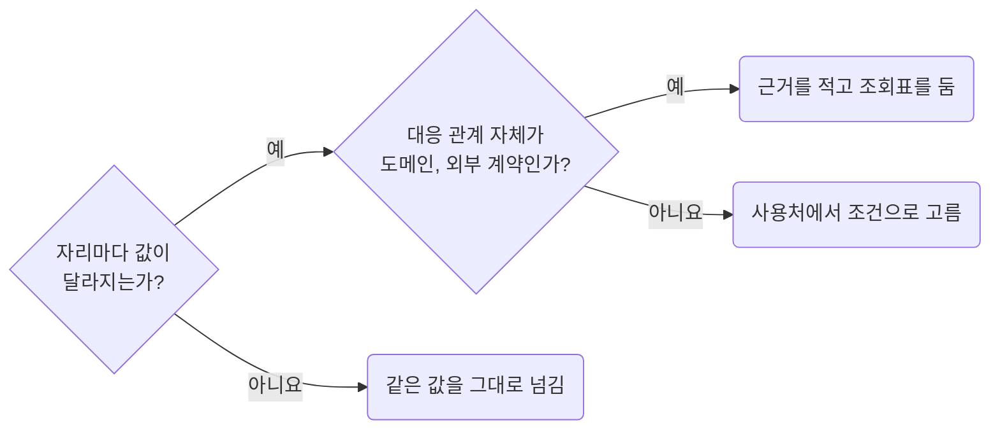

**Incorrect 1 (한 곳의 프롭 값을 고르려고 조회표를 만듭니다):**

```tsx
const chart_toolbar_variant_by_card_variant = {
	default: "default",
	fill: "default",
	dialog: "dialog",
} satisfies Record<UiChartCardProps["variant"], UiChartToolbarProps["variant"]>;

<UiChart.Toolbar variant={chart_toolbar_variant_by_card_variant[props.variant]} />;
```

**Correct 1 (값이 달라지는 조건을 사용처에 적습니다):**

```tsx
<UiChart.Toolbar variant={props.variant === "fill" ? "default" : props.variant} />;
```

**Incorrect 2 (계약 조회표를 근거 없이 둡니다):**

```ts
const order_status_by_api_code = {
	P: "pending",
	C: "completed",
	D: "cancelled",
} as const satisfies Record<OrderStatusCode, OrderStatus>;
```

**Correct 2 (외부 코드와 화면 상태의 대응 관계가 계약이면 이유를 남기고 조회표를 둡니다):**

```ts
/**
 * GET /orders의 P, C, D 코드를 화면의 주문 상태 어휘로 바꾸는 API 경계 계약이다
 */
const order_status_by_api_code = {
	P: "pending",
	C: "completed",
	D: "cancelled",
} as const satisfies Record<OrderStatusCode, OrderStatus>;
```

### 4.6 Use es-toolkit for Value Helpers

**Rule:** `T04-06` · `values-use-es-toolkit-for-value-helpers`

**Applies when:** 배열, 객체, 문자열, 숫자를 다루는 보조 코드를 추가, 변경할 때. `reduce`, `Object.entries`, `Array.from`, 정규식으로 값을 다시 짜는 코드를 쓸 때. 제외: 표준 메서드 하나로 끝나는 경우.

**Review with:** `values-handle-dates-with-dayjs`, `values-prefer-immutable-array-sorting`

**Impact: HIGH (중복 제거와 표기 변환을 파일마다 다르게 만들지 않고 검증된 구현 하나로 모읍니다)**

### 쓸 함수 고르기

값을 다루는 보조 함수는 `es-toolkit`을 기본으로 쓰고, `lodash`는 새로 들이지 않습니다.
빈 배열, 중복 키 같은 경계 처리를 통일하고, 배열을 인자로 펼칠 때의 호출 인자 한계도 피합니다.

| 작업 | 사용할 함수 |
| --- | --- |
| 중복 제거, 그룹, 색인 | `uniq`, `uniqBy`, `groupBy`, `keyBy` |
| 차집합, 교집합, 합집합, 값 제외, 토글 | `difference`, `intersection`, `union`, `without`, `xor` |
| 정렬, 분할, 조건 분류, 반복 범위 | `sortBy`, `orderBy`, `chunk`, `partition`, `range` |
| 객체 복사, 깊은 비교 | `clone`, `cloneDeep`, `isEqual` |
| 필드 선택, 제외, 값 변환 | `pick`, `omit`, `mapValues` |
| 문자열 표기, HTML 이스케이프 | `camelCase`, `snakeCase`, `kebabCase`, `pascalCase`, `capitalize`, `escape` |
| 호출 빈도, 횟수, 결과 저장 | `debounce`, `throttle`, `once`, `memoize` |
| 집계, 범위 제한, 최대, 최소 | `sum`, `sumBy`, `mean`, `clamp`, `maxBy`, `minBy` |
| 빈 값, 타입 검사 | `isNil`, `isNotNil`, `isEmptyObject`, `isPlainObject` |
| 비동기 지연, 시간 제한, 재시도 | `delay`, `withTimeout`, `retry` |

표에 없어도 문서에 같은 의미의 함수가 있으면 사용합니다.
다만 `map`, `filter`, `find`, `flat`, `at`, `Object.keys`처럼 표준 메서드 하나로 끝나면 그대로 둡니다.
공백 제거는 `value.trim()`, 제거할 문자 지정은 `trim(value, "_")`처럼 구분합니다.

### 교체 전 확인

| 교체 전 확인 | 지킬 계약 |
| --- | --- |
| 이름은 같지만 제거 대상이 다름 | `compact`는 falsy를 모두 제거합니다 |
| 중복 제거 후 남는 항목과 순서 | `Map`은 마지막 항목과 키의 최초 삽입 순서, `uniqBy`는 첫 항목을 남깁니다. 배열을 뒤집어 교체할 때도 남는 항목과 결과 순서가 같은지 확인합니다 |
| 빈 목록의 최소, 최대 | `minBy`, `maxBy` 결과의 `undefined`만 검사합니다. 사전 `length` 검사와 값 추출용 중간 `map`은 제거합니다 |
| 표준 메서드로 끝나지 않는 연산 | 직접 여러 줄로 구현하기 전에 `es-toolkit`에서 찾습니다 |

nullish만 제거하던 공개 계약은 `filter(isNotNil)` 등으로 보존하고 의미 차이를 검증하는 테스트를 남깁니다.

날짜는 `values-handle-dates-with-dayjs`, 정렬은 `values-prefer-immutable-array-sorting`을 따릅니다.
`groupBy`, `keyBy`는 목록 재구성에 쓰고, 반복 조회는
`values-use-set-and-map-for-repeated-lookups`에 따라 `Set`, `Map`으로 처리합니다.

**Incorrect 1 (`es-toolkit`에 있는 함수를 손으로 다시 씁니다):**

```ts
const uniqueOwnerIds = ownerIds.filter((ownerId, index) => ownerIds.indexOf(ownerId) === index);
const uniqueCategories = [...new Set(points.map((point) => point.x))];
const productsByCategory = products.reduce<Record<string, Product[]>>((grouped, product) => {
	grouped[product.category] = [...(grouped[product.category] ?? []), product];
	return grouped;
}, {});
const draftFilter = JSON.parse(JSON.stringify(savedFilter)) as ProductFilter;
const searchKey = rawKey.replace(/([A-Z])/g, "_$1").toLowerCase();
const tickTimes = Array.from({length: tick_count}, (_unused, tickIndex) => toTickTime(tickIndex));
```

**Correct 1 (`es-toolkit` 함수를 그대로 부릅니다):**

```ts
import {cloneDeep, groupBy, range, snakeCase, uniq} from "es-toolkit";

const uniqueOwnerIds = uniq(ownerIds);
const uniqueCategories = uniq(points.map((point) => point.x));
const productsByCategory = groupBy(products, (product) => product.category);
const draftFilter = cloneDeep(savedFilter);
const searchKey = snakeCase(rawKey);
const tickTimes = range(tick_count).map((tickIndex) => toTickTime(tickIndex));
```

**Incorrect 2 (빈 목록을 먼저 검사하고 중간 배열을 만들어 양 끝을 읽습니다):**

```ts
const toChartBounds = (points: readonly ChartPoint[]) => {
	const yValues = points.map((point) => point.y);

	if (yValues.length === 0) {
		return undefined;
	}

	return {min: Math.min(...yValues), max: Math.max(...yValues)};
};
```

**Correct 2 (빈 목록 판정을 `minBy`, `maxBy`의 결과로 합칩니다):**

```ts
import {maxBy, minBy} from "es-toolkit";

const toChartBounds = (points: readonly ChartPoint[]) => {
	const lowestPoint = minBy(points, (point) => point.y);
	const highestPoint = maxBy(points, (point) => point.y);

	if (lowestPoint === undefined || highestPoint === undefined) {
		return undefined;
	}

	return {min: lowestPoint.y, max: highestPoint.y};
};
```

**Correct (표준 메서드 하나로 끝나면 감싸지 않습니다):**

```ts
const activeProducts = products.filter((product) => product.isActive);
const trimmedKeyword = keyword.trim();
```

### 4.7 Handle Dates With dayjs

**Rule:** `T04-07` · `values-handle-dates-with-dayjs`

**Applies when:** 날짜를 파싱하거나 형식을 맞추거나 더하고 뺄 때. `new Date`, `getTime()`, `setDate()`, `toLocaleDateString()`을 쓸 때. 제외: 서버가 준 시각 문자열을 파싱 없이 그대로 보여주는 경우.

**Review with:** `naming-place-project-constants-in-the-root-constant-folder`, `values-use-es-toolkit-for-value-helpers`

**Impact: HIGH (날짜의 단위와 타임존을 드러내고 파싱과 표시 형식을 일관되게 유지합니다)**

### 작업별 기준

날짜는 `dayjs`로 다루고, `moment`는 새로 들이지 않습니다.
계산 단위, 입력 형식, 표시 타임존을 계약에 맞게 구분합니다.

날짜 문자열이 들어왔을 때 다루는 방법을 고르는 차례입니다.

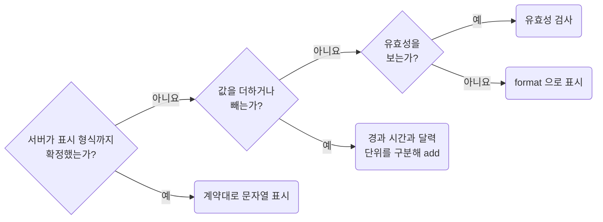

| 작업 | 기준 |
| --- | --- |
| 파싱, 유효성 검사 | `new Date(text)` 대신 `dayjs(text)`와 입력 형식에 맞는 검증을 사용합니다 |
| 경과 시간, 달력 날짜 계산 | `add`, `subtract`의 단위를 구분합니다. 정확히 24시간과 현지 다음 날은 서머타임 경계에서 다를 수 있습니다 |
| 밀리초, 월 계산 교체 | 밀리초 연산을 `add(..., "day")`로 일괄 치환하지 않습니다. 월 계산은 월말 처리 계약을 확인합니다 |
| 표시, 비교 | 수동 문자열 조합, `toLocaleDateString` 대신 `format`, `getTime` 비교 대신 `isBefore`, `isAfter`, `isSame`을 씁니다 |

### 입력, 표시 계약

| 입력, 표시 계약 | 처리 |
| --- | --- |
| 고정된 날짜 형식 | 파싱 후 같은 형식으로 되돌려 원문과 비교합니다. `2026-02-30`처럼 보정되는 날짜도 거릅니다 |
| 여러 입력 형식, 엄격한 형식 검증 | `CustomParseFormat`을 초기화하고 `dayjs(value, input_format, true).isValid()`로 검사합니다 |
| 시각과 오프셋이 포함된 문자열 | 날짜만 되돌리는 비교를 적용하지 않습니다 |
| UTC, 특정 지역 시간 | `utc`, `timezone` 플러그인을 초기화합니다. 기본 `dayjs(value)`는 실행 환경의 로컬 타임존을 사용합니다 |
| 타임존 기본값, 날짜 계산 | `dayjs.tz.setDefault()`는 일반 `dayjs(value)`를 바꾸지 않습니다. 서머타임 전후 현지 시각과 오프셋을 실제로 확인합니다 |
| 서버가 표시 타임존, 형식까지 확정한 문자열 | 그대로 표시할 때는 파싱하지 않습니다. 문자열 자르기가 표시 규칙이면 유지합니다 |
| UTC 시각을 사용자 타임존으로 표시 | 먼저 타임존을 변환합니다 |

형식 문자열은 상수로 선언하며 입력 형식과 화면 표시 형식은 별도 상수로 둡니다.
배치는 `naming-place-project-constants-in-the-root-constant-folder`를 따릅니다.

**Incorrect 1 (정해진 경과 시간을 밀리초로 더하고 자릿수를 손으로 채웁니다):**

```ts
// 만료 계약은 발급 시점으로부터 정확히 token_expiry_hours시간 뒤다
const expiresAt = new Date(issuedAt.getTime() + token_expiry_hours * 60 * 60 * 1000);
const expiresLabel = `${expiresAt.getFullYear()}.${toPaddedDatePart(expiresAt.getMonth() + 1)}`;
```

**Correct 1 (더하기와 형식은 `dayjs`, 형식 문자열은 상수로 둡니다):**

```ts
import dayjs from "dayjs";

import {date_expiry_month_format} from "@/constant/date";

// date_expiry_month_format은 원래 표시와 같은 YYYY.MM 형식이다
const expiresAt = dayjs(issuedAt).add(token_expiry_hours, "hour");
const expiresLabel = expiresAt.format(date_expiry_month_format);
```

**Incorrect 2 (형식만 보고 없는 날짜를 통과시킵니다):**

```ts
const isValidDateText = /^\d{4}-\d{2}-\d{2}$/.test(dateText);
```

**Correct 2 (라운드트립으로 없는 날짜를 거릅니다):**

```ts
import dayjs from "dayjs";

import {date_input_format} from "@/constant/date";

/**
 * 형식은 맞지만 존재하지 않는 2026-02-30 같은 날짜를 거른다
 */
export const parseEntryDateText = (dateText: string): string | undefined => {
	return dayjs(dateText).format(date_input_format) === dateText ? dateText : undefined;
};
```

**Correct (서버가 표시 형식까지 확정한 문자열은 필요한 부분만 자릅니다):**

```ts
// 서버가 이미 표시 타임존으로 준 고정 형식이다. 시각 변환 없이 분까지만 보여 준다
const compactDateTime = responseDateTime.slice(0, 16).replace("T", " ");
```

### 4.8 Decide Once and Carry the Result

**Rule:** `T04-08` · `values-decide-once-and-carry-the-result`

**Applies when:** 같은 입력에 같은 판정, 정규화, 포맷을 두 자리 이상에서 할 때. 포맷하거나 정리한 값을 소비처에서 다시 파싱하거나 정리할 때. 두 함수가 같은 판정 함수를 부르게 되어 공유 보조를 만들려 할 때.

**Review with:** `absence-resolve-defaults-at-the-boundary`, `functions-extract-helpers-only-when-the-boundary-is-real`

**Impact: HIGH (같은 판정을 반복하지 않고 소비처가 전달된 결과를 사용합니다)**

값이 들어오는 경계에서 한 번 판정하고, 결과를 데이터 필드로 전달합니다.
소비처는 같은 판정 함수를 다시 호출하거나 공유 보조 함수로 추출하지 않고 그 필드를 읽습니다.

| 반복되는 처리 | 변경 |
| --- | --- |
| 포맷한 문자열을 소비처가 다시 파싱, 포맷 | 경계에서 한 번 포맷하고 그대로 사용합니다 |
| 정리한 값을 소비처가 다시 `trim` | 경계에서 한 번 정리합니다 |
| 두 함수가 같은 판정 함수를 호출 | 항목에 판정 결과를 담고 두 함수가 읽습니다 |
| 전달된 결과 옆에 `?? 다시 판정` 폴백 | 폴백을 제거합니다 |

결과를 담을 필드가 없으면 소유자가 만드는 내부 항목 형태에 추가합니다.
외부 응답, 생성된 DTO, 공개 요청 계약을 바꾸거나 공유 캐시 원본을 직접 수정하지 않습니다.
시각, 권한, 로케일 등 판정 입력이 바뀌면 다시 계산하고, 입력이나 소비 목적이 다르면 판정을 합치지 않습니다.
경계의 선택 순서는 `absence-resolve-defaults-at-the-boundary`와 같습니다.

**Incorrect 1 (경계에서 포맷한 값을 소비처가 다시 파싱해 포맷합니다):**

```ts
// page/product-detail/pg-product-detail.tsx: ProductSummary 를 만들며 이미 포맷한다
const productSummary = {averageRate: formatPercent(responseProductSummarySuspense.data.changeRate)};
```

```ts
// page/product-detail/_function/to-report-content.ts: 문자열을 다시 숫자로 읽어 다시 포맷한다
const rows = [{id: "changeRate", value: formatPercent(productSummary.averageRate)}];
```

**Correct 1 (경계에서 한 번 포맷하고 소비처는 전달된 값을 그대로 씁니다):**

```ts
// page/product-detail/pg-product-detail.tsx: ProductSummary 를 만드는 경계에서 한 번 포맷한다
const productSummary = {averageRate: formatPercent(responseProductSummarySuspense.data.changeRate)};
```

```ts
// page/product-detail/_function/to-report-content.ts
const rows = [{id: "changeRate", value: productSummary.averageRate}];
```

**Incorrect 2 (같은 색 판정을 범례와 차트 둘에서 하고 폴백으로 한 번 더 합니다):**

```ts
// 범례
const legendSeries = seriesItems.map((series, seriesIndex) => ({
	id: series.id,
	colorToken: toSeriesColorToken(series.role, seriesIndex),
}));

// 차트 둘. 범례 팔레트를 읽고도 같은 판정을 다시 한다
const chartSeries = seriesItems.map((series, index) => ({
	id: series.id,
	colorToken: colorTokenById.get(series.id) ?? toSeriesColorToken(series.role, index),
}));
```

**Correct 2 (경계에서 한 번 정해 항목에 담고 차트는 읽기만 합니다):**

```ts
// 범례를 만드는 자리에서 색을 정해 항목에 싣는다
const comparisonSeries = seriesItems.map((series, seriesIndex) => ({
	...series,
	colorToken: toSeriesColorToken(series.role, seriesIndex),
}));

// 차트 둘은 같은 항목의 색을 그대로 읽는다
const chartSeries = comparisonSeries.map((series) => ({
	id: series.id,
	colorToken: series.colorToken,
}));
```

## 5. Absence and Fallback Handling

**Impact: HIGH**

값이 없을 수 있는 상태를 다루는 규칙을 모읍니다. 값이 없다는 사실은 임의의 기본값으로 감추지 않고 사용처까지 전달합니다. 타입이 이미 보장하는 것은 다시 검사하지 않습니다. 값이 들어오는 경계에서 한 번 검사하고, 중간 함수는 검증된 타입을 사용합니다.

### 5.1 Expose Optional Values Instead of Silent Fallbacks

**Rule:** `T05-01` · `absence-expose-optional-values-instead-of-silent-fallbacks`

**Applies when:** 선택 값을 읽거나 정규화하거나 넘기는 방식을 바꿀 때. `??`, `||`, 기본값, 빈 값 대체 분기를 추가, 변경할 때.

**Review with:** `absence-resolve-defaults-at-the-boundary`, `naming-place-owner-constants-in-the-owner-constant-folder`, `naming-place-project-constants-in-the-root-constant-folder`

**Impact: CRITICAL (기본값의 출처를 이름으로 드러내고 누락된 데이터의 처리 기준을 유지합니다)**

### 기본값 표현

`??`, `||` 오른쪽과 기본값에는 리터럴 대신 이미 선언된 이름을 참조합니다.
리터럴을 지역 `const`로 옮기거나 이유 주석을 붙이는 것만으로는 규칙을 충족하지 못합니다.

| 기본값 표현 | 판정 |
| --- | --- |
| `?? "help@example.com"`, `?? 0`, `?? []`, `\|\| "-"` | 위반 |
| `?? pagination_default_page_size`처럼 선언된 상수 | 통과 |
| 지역 `const fallback = "-"`로 리터럴만 옮김 | 위반 |
| 선언된 이름 둘을 합성한 파생값 | 통과 |
| `(size = 10) =>`, `{size = 10}` 같은 기본값 리터럴 | 위반 |
| `(size = pagination_default_page_size) =>` | 통과 |
| 삼항의 대체 리터럴 `value ? value : "-"`, `String(value ?? "")` | 위반 |

### 없음으로 취급할 값

| 대체하려는 값 | 연산자 |
| --- | --- |
| `null`, `undefined`만 없음으로 취급 | `??` |
| `0`, `false`, 빈 문자열까지 없음으로 취급하는 계약 | `\|\|` |

선언된 이름이어도 기본값의 의미가 맞아야 합니다. `0`, `false`가 유효하면 `??`를 씁니다.
상수는 소유자를 지워도 남으면 `naming-place-project-constants-in-the-root-constant-folder`,
함께 사라지면 `naming-place-owner-constants-in-the-owner-constant-folder`에 따라 배치합니다.
채우는 위치는 `absence-resolve-defaults-at-the-boundary`가 정합니다.
일반 숫자 리터럴은 `values-declare-meaningful-numbers`가 정하고, 여기서는 없는 값을 대체하는 자리만 봅니다.

**Incorrect 1 (`??`, `||`, 기본 매개변수 자리에 리터럴을 적습니다):**

```ts
const supportEmail = settings.supportEmail ?? "help@example.com";
const displayName = user.nickname || "-";
const toPageRequest = (size = 10): PageRequest => { /* … */ };
```

**Correct 1 (이미 선언된 이름만 가리킵니다):**

```ts
const supportEmail = settings.supportEmail ?? support_email_default;
const displayName = user.nickname || empty_display_text;
const toPageRequest = (size = pagination_default_page_size): PageRequest => { /* … */ };
```

### 5.2 Resolve Defaults Once at the Boundary

**Rule:** `T05-02` · `absence-resolve-defaults-at-the-boundary`

**Applies when:** 선택 값의 기본값을 어디서 채울지 정할 때. 같은 선택 값에 `??` 기본값 해소가 둘 이상의 사용처에 흩어질 때. search 스키마, 응답 매핑, 쿼리 `select`에 기본값 채움을 추가, 변경할 때.

**Review with:** `absence-expose-optional-values-instead-of-silent-fallbacks`, `functions-name-a-value-only-for-recompute-or-judgment`, `values-read-objects-through-chains`

**Impact: HIGH (기본값이 선언 한 곳에 남아 아래쪽 코드에서 `??`가 되풀이되지 않습니다)**

기본값은 필요한지 먼저 확인하고, 필요하면 값이 들어오는 경계에서 한 번 채웁니다.
기본값 표현은 `absence-expose-optional-values-instead-of-silent-fallbacks`를 따릅니다.

기본값을 채울 자리를 고르는 차례입니다.

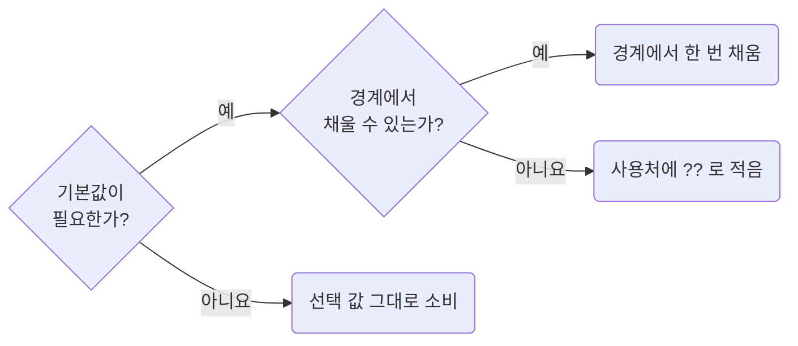

| 순서 | 판단과 처리 |
| --- | --- |
| 1. 기본값 없이 소비할 수 있는가 | `undefined`를 허용하면 `items?.map(…)`, 선택 값 비교는 `variant === "compact"`로 처리합니다 |
| 2. 경계에서 채울 수 있는가 | search 파라미터 파서의 `.withDefault(선언된 상수)`, 응답 매핑, 쿼리의 `select`에서 한 번 채웁니다. 아래에서는 선택 값과 `??`가 남지 않습니다 |
| 3. 경계에서 처리할 수 없는가 | 사용처에 `fetchProducts({pageSize: query.pageSize ?? pagination_default_page_size})`처럼 적습니다 |
| 4. 파생값에 이름이 필요한가 | `pageSize` 대신 `effectivePageSize`처럼 고른 결과임을 드러냅니다. 사용 횟수보다 표현식의 의미를 기준으로 판단합니다 |

배열이 필수인 API에는 반환 계약을 바꾸지 않고 선언된 기본값을 경계에서 채웁니다.
`a ?? b`는 실행 시 두 출처 중 하나를 고르는 계산이므로
`values-read-objects-through-chains`가 금지하는 단순 별칭에 해당하지 않습니다.
이름을 붙일지는 `functions-name-a-value-only-for-recompute-or-judgment`가 정합니다.

**Incorrect 1 (없어도 되는 값에 기본값을 채웁니다):**

```ts
const productIds = (response.data.rows ?? []).map((row) => row.id);
const isCompact = (variant ?? "default") === "compact";
```

**Correct 1 (그대로 비교하면 기본값이 필요 없습니다):**

```ts
const productIds = response.data.rows?.map((row) => row.id);
const isCompact = variant === "compact";
```

**Incorrect 2 (같은 기본값을 사용처마다 다시 채웁니다):**

```ts
fetchProducts({pageSize: query.pageSize ?? pagination_default_page_size});
setVisibleRowCount(query.pageSize ?? pagination_default_page_size);
```

**Correct 2 (값이 들어오는 경계에서 한 번 채워 이후 코드에서 기본값을 반복하지 않습니다):**

```ts
/**
 * product 목록 search 파라미터. pageSize는 여기서 채워져 화면에서는 선택 값이 아니다
 */
const productUrlParsers = {
	pageSize: parseAsInteger.withDefault(pagination_default_page_size),
};

const [query] = useQueryStates(productUrlParsers);

fetchProducts({pageSize: query.pageSize});
setVisibleRowCount(query.pageSize);
```

**Correct (경계에서 못 하면 쓰는 자리에 그대로 적습니다):**

```ts
fetchProducts({pageSize: query.pageSize ?? pagination_default_page_size});
```

**Correct (이름을 붙인다면 파생값임이 드러나게 짓습니다):**

```ts
const effectivePageSize = query.pageSize ?? pagination_default_page_size;

fetchProducts({pageSize: effectivePageSize});
setVisibleRowCount(effectivePageSize);
```

### 5.3 Do Not Guard What the Types Already Guarantee

**Rule:** `T05-03` · `absence-do-not-guard-what-types-guarantee`

**Applies when:** `isNil`, `typeof`, 옵셔널 체이닝으로 값을 검사하는 분기를 추가, 변경할 때. 선택 필드에 값을 넣으면서 `undefined`를 피하려고 조건부 스프레드를 쓸 때. 제외: `unknown`이나 앱 밖에서 온 값을 좁히는 경우.

**Review with:** `absence-check-once-at-the-boundary`, `absence-expose-optional-values-instead-of-silent-fallbacks`, `types-narrow-unknown-instead-of-asserting`

**Impact: HIGH (불필요한 검사를 줄이고 값이 실제로 없을 수 있는 경우만 확인합니다)**

### 다시 검사하지 않을 것

타입이 이미 보장하는 조건은 다시 검사하지 않습니다.
불필요한 검사를 제거해 실제로 값이 없을 수 있는 경우를 드러냅니다.

| 검사 대상 | 처리 |
| --- | --- |
| `string`의 `?.trim()`, `number`의 `typeof`, 필수 필드의 `isNil` | 타입이 보장하므로 제거합니다 |
| `string \| null`의 `isNil` | 값이 없을 수 있으므로 유지합니다 |
| `unknown`, 외부 입력 | `types-narrow-unknown-instead-of-asserting`에 따라 검증합니다 |
| 유한 수 여부 | `number`는 `NaN`, `Infinity`도 포함하므로 필요한 검사를 남깁니다 |
| 배열 인덱스, 열린 키 조회 | 컴파일러 옵션과 실제 길이에 따라 값이 없을 수 있으므로 필요한 검사를 남깁니다 |

### 선택 필드의 생략

선택 필드의 생략과 `undefined` 대입은 소비 계약에 맞춥니다.

| 소비 계약 | 객체 구성 |
| --- | --- |
| 두 상태를 구분하지 않고 타입도 허용 | `undefined`를 바로 넣어 불필요한 조건부 스프레드를 줄입니다 |
| `in`, `Object.hasOwn`, 객체 병합, 패치 등에서 구분 | 조건부 스프레드를 유지하고 생략이 필요한 계약을 이유 주석에 적습니다 |
| `exactOptionalPropertyTypes` 사용 | `value?: T`에 `undefined`를 쓸 수 있는지 확인합니다 |
| `value?: T \| undefined`처럼 명시적으로 허용 | 조건부 스프레드로 바꾸지 않습니다 |

없는 값을 무엇으로 대체할지는 `absence-expose-optional-values-instead-of-silent-fallbacks`가 정합니다.

**Incorrect 1 (타입이 `string`으로 보장한 값을 다시 검사합니다):**

```ts
const toRowLabel = (row: ProductRow): string => {
	if (isNil(row.name)) {
		return row.code;
	}

	return row.name.trim();
};
```

**Correct 1 (타입이 보장하는 조건은 다시 검사하지 않습니다):**

```ts
const toRowLabel = (row: ProductRow): string => {
	return row.name.trim();
};
```

**Incorrect 2 (생략과 `undefined`를 구분하지 않는 내부 계약에서 키를 조건부로 생략합니다):**

```ts
// 이 내부 표시 계약은 stockCount의 undefined 대입을 허용하고 키 존재 여부를 읽지 않는다
return {
	metrics,
	...(stockCount === undefined ? {} : {stockCount}),
};
```

**Correct 2 (생략과 같은 뜻이고 타입도 허용하면 `undefined`를 그대로 넣습니다):**

```ts
// 이 내부 표시 계약은 stockCount의 undefined 대입을 허용하고 키 존재 여부를 읽지 않는다
return {
	metrics,
	stockCount,
};
```

### 5.4 Check Absence Once at the Boundary

**Rule:** `T05-04` · `absence-check-once-at-the-boundary`

**Applies when:** `isNil`, `Number.isFinite` 같은 검사를 함수에 넣을 때. `null`, `undefined`, `unknown`을 매개변수, 반환 타입에 넣거나 뺄 때. 응답 매핑, 쿼리, search 스키마에서 없음, 유한 수 검사로 타입을 좁힐 때.

**Review with:** `absence-do-not-guard-what-types-guarantee`, `absence-resolve-defaults-at-the-boundary`, `values-decide-once-and-carry-the-result`

**Impact: HIGH (값이 들어오는 경계에서 검사해 중간 함수의 중복 검사를 줄입니다)**

### 경계가 정한 답

값의 없음 여부는 소유자 안으로 들어오는 경계에서 한 번 검사하고, 결과를 타입으로 전달합니다.
화면의 응답 매핑, `select`, `combine`, search 스키마나 컴포넌트가 프롭을 받는 자리가 경계입니다.

| 경계가 정한 답 | 전달 타입 | 소비처 |
| --- | --- | --- |
| 기본값이 있음 | `number` | `absence-resolve-defaults-at-the-boundary`에 따라 채운 값을 사용합니다 |
| 없음을 화면에 표시 | `number \| undefined` | 중간 함수는 그대로 전달하고 렌더링 위치에서 한 번 분기합니다 |

없을 때 다른 화면을 렌더하는 분기는 필요한 표시 상태이므로 유지합니다.
그 밖의 소비처가 없음 여부를 반복 판정한다면 경계에서 결과를 전달했는지 확인합니다.
판정 결과를 전달하는 방법은 `values-decide-once-and-carry-the-result`가 정합니다.

### 다시 검사가 필요한 때

| 다시 검사가 필요한가 | 기준 |
| --- | --- |
| 경계에서 이미 확인한 없음, 유한 수 조건 | 반복하지 않습니다 |
| 타입이 `number`라는 사실만 확인됨 | `NaN`, `Infinity`, 허용 범위까지 보장하지는 않습니다 |
| 새 계산, 외부 호출로 만든 값, 검증 후 변경, 외부 값 혼합 | 기존 보장이 적용되지 않는 조건을 해당 경계에서 확인합니다 |
| 여러 입력 경로가 각각 외부 값을 받음 | 각 경계에서 검증합니다 |

경계 아래 여러 함수가 `number | null | undefined`나 `unknown`을 받으면 경계의 처리 책임을 확인합니다.
`unknown`은 검증 책임이 있는 경계에서 받고, 공개 입력 계약을 내부 호출 하나에 맞춰 좁히지 않습니다.
타입 좁히기는 `types-narrow-unknown-instead-of-asserting`을 따릅니다.

**Incorrect 1 (경계가 타입을 좁히지 않아 아래 함수마다 같은 값을 다시 검사합니다):**

```ts
// page/detail/_function/to-badge/_to-signed-tone.ts
export const toSignedTone = (value: number | null | undefined): Tone => {
	if (isNil(value) || !Number.isFinite(value) || value === 0) {
		return "neutral";
	}
	return value > 0 ? "positive" : "negative";
};
```

```ts
// page/detail/_function/format-signed-percent.ts
export const formatSignedPercent = (value: number | null | undefined) => {
	if (isNil(value) || !Number.isFinite(value)) {
		return copy_empty_value_text;
	}
	return `${value > 0 ? "+" : ""}${value}%`;
};
```

**Correct 1 (경계가 좁힌 `number`를 받아 두 함수는 자기 판정만 남깁니다):**

```ts
// page/detail/_function/to-badge/_to-signed-tone.ts
/**
 * 부호 있는 변화율의 강조 tone. 0은 어느 쪽도 아니라 중립이다
 */
export const toSignedTone = (value: number): Tone => {
	if (value === 0) {
		return "neutral";
	}
	return value > 0 ? "positive" : "negative";
};
```

```ts
// page/detail/_function/format-signed-percent.ts
/**
 * 부호를 붙인 변화율 표시 문자열
 */
export const formatSignedPercent = (value: number) => {
	return `${value > 0 ? "+" : ""}${value}%`;
};
```

**Correct (경계인 `select`에서 없음과 유한 수를 한 번 검사해 타입을 좁힙니다):**

```tsx
// page/detail/pg-detail.tsx: 서버는 계산 전이면 null을 준다. 여기서 한 번 좁힌다
const responseSummarySuspense = useSuspenseQuery({
	...detailSummaryQueryOptions(productId),
	select: (response) => ({
		...response,
		changeRate:
			isNotNil(response.changeRate) && Number.isFinite(response.changeRate) ? response.changeRate : undefined,
	}),
});
```

**Correct (없음을 읽는 자리는 화면을 그리는 분기 하나입니다):**

```tsx
// page/detail/_pg-detail-summary.tsx: 없음을 읽는 곳은 그리는 분기 하나다
{isNotNil(summary.changeRate) && (
	<UiBadge tone={toSignedTone(summary.changeRate)}>{formatSignedPercent(summary.changeRate)}</UiBadge>
)}
```

## 6. JSDoc and Comment Conventions

**Impact: MEDIUM**

함수 본문 주석에는 의도와 긴 절차의 단계를 적고 코드 내용을 반복하지 않습니다. 선언 위 문서 주석은 어디에 붙일지, 어떤 형식으로 쓸지, 태그를 붙일지가 따로 정해져 있습니다. 본문은 한국어로 목적과 제약을 적고, 규칙이 허용한 예외에는 확인할 수 있는 이유를 남깁니다.

### 6.1 Keep Body Comments for Intent and Steps

**Rule:** `T06-01` · `docs-keep-body-comments-for-intent-and-steps`

**Applies when:** 함수 본문의 `//` 주석을 추가, 수정, 유지할 때. 도메인 규칙, 예외 방어, 외부 제약, 부수효과 순서, 긴 절차의 단계를 주석으로 설명할 때.

**Review with:** `docs-justify-convention-exceptions-with-a-reason-comment`, `docs-write-korean-comments-about-purpose-and-constraints`

**Impact: MEDIUM (코드를 옮겨 적은 주석은 막고 읽는 데 필요한 설명은 남깁니다)**

함수 본문에서 코드의 의도나 절차 단계를 설명할 때는 블록 주석 대신 `//`를 씁니다.
도메인 규칙, 예외 방지, 외부 API 제약, 부수효과 순서, 긴 절차의 단계 구분에 사용합니다.

| 위치 | 주석 형태 |
| --- | --- |
| 코드 한 줄, 절차 단계 | `//`. 긴 흐름을 한 함수에 유지할 때도 단계 구분을 남깁니다 |
| `docs-require-header-jsdoc-on-key-declarations`가 정한 선언 | `docs-write-doc-comments-as-multiline-blocks`에 따른 문서 블록 |
| 그 밖의 지역 선언 | 별도 주석을 달지 않습니다. 필요한 줄의 의도만 `//`로 적습니다 |
| JSX 자식 | `//`를 쓸 수 없으므로 프레임워크 규칙을 따릅니다 |

내용은 `docs-write-korean-comments-about-purpose-and-constraints`,
허용된 예외의 이유는 `docs-justify-convention-exceptions-with-a-reason-comment`가 정합니다.

**Incorrect 1 (지역 선언에 코드를 옮겨 적은 주석을 답니다):**

```ts
const toMatchedProducts = (products: Product[], keyword: string) => {
	// keyword를 소문자로 바꾼다.
	const lowerKeyword = keyword.trim().toLowerCase();

	return products.filter((product) => product.title.toLowerCase().includes(lowerKeyword));
};
```

**Correct 1 (선언 이름이 이미 말하는 주석은 지웁니다):**

```ts
const toMatchedProducts = (products: Product[], keyword: string) => {
	const lowerKeyword = keyword.trim().toLowerCase();

	return products.filter((product) => product.title.toLowerCase().includes(lowerKeyword));
};
```

**Incorrect 2 (지켜야 할 순서와 제약을 주석 없이 코드에만 둡니다):**

```ts
const submitProductDraft = async (draft: ProductDraft) => {
	if (!draft.title.trim()) {
		return;
	}

	const uploadedAttachments = await uploadAttachments(draft.attachments);
	const savedProduct = await saveProduct({title: draft.title, attachments: uploadedAttachments});

	await queryClient.invalidateQueries({queryKey: ["products"]});

	return savedProduct;
};
```

**Correct 2 (`//`로 제약과 단계를 적습니다):**

```ts
const submitProductDraft = async (draft: ProductDraft) => {
	// SDK가 빈 문자열을 허용하지 않아 trim 이후 값이 없으면 호출하지 않는다.
	if (!draft.title.trim()) {
		return;
	}

	// 1. 첨부를 먼저 올려야 본문 저장에서 참조 ID를 쓸 수 있다.
	const uploadedAttachments = await uploadAttachments(draft.attachments);

	// 2. 본문 저장
	const savedProduct = await saveProduct({title: draft.title, attachments: uploadedAttachments});

	// 3. 목록 캐시 무효화는 저장이 끝난 뒤에만 한다. 순서가 바뀌면 옛 목록이 다시 채워진다.
	await queryClient.invalidateQueries({queryKey: ["products"]});

	return savedProduct;
};
```

### 6.2 Require Header Doc Comments on Key Declarations

**Rule:** `T06-02` · `docs-require-header-jsdoc-on-key-declarations`

**Applies when:** 쿼리, 뮤테이션, 원격 함수, 커스텀 훅, 스토어, 포매터 선언을 추가, 변경할 때. 분기나 `await`나 두 개 이상의 동작이 있는 핸들러와 이펙트를 추가, 변경할 때. 다시 쓰거나 내보낸 보조 함수를 추가, 변경할 때.

**Requires selected:** `docs-write-doc-comments-as-multiline-blocks`, `docs-write-korean-comments-about-purpose-and-constraints` (함께 적용)

**Impact: MEDIUM (구현을 읽기 전에 중요한 경계를 찾고 설명할 수 있습니다)**

중요한 선언에는 구현을 읽기 전에 역할과 경계를 알 수 있도록 헤더 문서 주석을 씁니다.
빈 본문이나 영문 라벨만으로는 요구를 충족하지 못하며 실제 한국어 설명이 필요합니다.

| 헤더 문서 주석 대상 | 조건 |
| --- | --- |
| 이름 붙인 쿼리, 뮤테이션, 원격 함수, 커스텀 훅, 스토어 | 모두 작성합니다 |
| 포매터 | 표시 문자열을 만들 때 작성합니다 |
| 핸들러, 이펙트 | 본문에 분기, `await`, 두 개 이상의 동작 중 하나라도 있으면 작성합니다 |
| 보조 함수 | 재사용하거나 내보내면 작성합니다 |
| 커스텀 `type`, `interface` | 내보내기 여부와 무관하게 `types-document-custom-types-and-shapes`를 따릅니다 |

형식은 `docs-write-doc-comments-as-multiline-blocks`,
내용과 태그는 `docs-write-korean-comments-about-purpose-and-constraints`가 정합니다.

**Incorrect 1 (주요 선언에 헤더 설명이 없습니다):**

```ts
export const toSortedUserIds = (userIds: string[]): string[] => {
	return sortBy(uniq(userIds), [(userId) => userId]);
};
```

**Correct 1 (여러 줄 블록에 설명만 적습니다):**

```ts
/**
 * 선택 목록의 중복 ID를 제거하고 오름차순으로 고정해 요청 순서를 일정하게 유지한다
 */
export const toSortedUserIds = (userIds: string[]): string[] => {
	return sortBy(uniq(userIds), [(userId) => userId]);
};

/**
 * product 목록 조회. 로딩과 오류는 이 응답 객체로만 판단한다
 */
const responseProductList = useProductList();
```

### 6.3 Write Korean Comments About Purpose and Constraints

**Rule:** `T06-03` · `docs-write-korean-comments-about-purpose-and-constraints`

**Applies when:** TypeScript, TSX의 문서 주석이나 인라인 주석 문구를 추가, 수정, 번역하거나 검토할 때. 문서 주석에 태그를 붙이거나 뺄 때.

**Impact: HIGH (코드 동작을 옮겨 적지 않고 의도와 제약에 주석을 모읍니다)**

주석은 한국어로 목적, 제약, 부수효과를 설명합니다.
이름과 시그니처에 없는 정보가 없으면 지우고, 필요한 배경에 따라 한 문장이나 여러 문장으로 씁니다.

| 내용, 태그 | 판단 |
| --- | --- |
| 선언 이름만 번역하거나 코드를 한 줄씩 옮긴 설명 | 쓰지 않습니다 |
| 설명 없이 `@param`, `@returns`만 나열 | 쓰지 않습니다 |
| `@api`, `@helper`, `@field` | 이름과 문법이 드러내는 역할을 태그로 반복하지 않습니다 |
| `@schema` 같은 비표준 태그 | 새로 만들지 않습니다 |
| `@summary` | 헤더 첫 줄과 겹치므로 쓰지 않습니다 |
| `@deprecated`, `@example`, `@param`, `@returns` 등 TSDoc 태그 | 필요할 때만 씁니다 |
| 영어 기술 용어, 식별자 | 섞어 써도 됩니다. 본문 전체가 영어인 주석은 허용하지 않습니다 |

글자 수 제한은 두지 않습니다. 헤더가 영어뿐이면 필드 주석이 한국어여도 요구를 충족하지 못합니다.
선언 위 문서 주석은 `docs-write-doc-comments-as-multiline-blocks`,
본문 설명은 `docs-keep-body-comments-for-intent-and-steps`에 따라 `//`로 씁니다.

**Incorrect 1 (영문이거나 선언 이름을 옮겨 적기만 합니다):**

```ts
// util/array/to-sorted-product-refs.ts
/**
 * This function sorts product refs and returns the result.
 */
export const toSortedProductRefs = (refs: ProductRef[]): ProductRef[] => {
	return sortBy(uniq(refs), [(ref) => ref.id]);
};
```

```ts
// util/array/to-products-newest-first.ts
/**
 * 상품을 정렬하는 함수
 */
export const toProductsNewestFirst = (products: Product[]): Product[] => {
	return orderBy(products, ["updatedAt", "id"], ["desc", "asc"]);
};
```

```ts
// page/product-tree/_pg-product-tree.tsx
/**
 * route-local product tree props
 */
export interface PgProductTreeProps {
	categoryNodes: ProductCategoryNode[];
}
```

**Correct 1 (이름에 없는 정보를 더합니다):**

```ts
// util/array/to-sorted-product-refs.ts
/**
 * 같은 참조 객체의 중복을 제거하고 식별자순으로 정렬해 검토 목록의 순서를 고정한다.
 */
export const toSortedProductRefs = (refs: ProductRef[]): ProductRef[] => {
	return sortBy(uniq(refs), [(ref) => ref.id]);
};
```

```ts
// util/array/to-products-newest-first.ts
/**
 * 저장 응답의 정렬 순서를 그대로 믿지 않고 다시 정렬한다.
 *
 * 서버가 같은 updatedAt 인 항목의 순서를 보장하지 않아
 * 목록이 새로고침할 때마다 흔들리는 문제가 있었다.
 */
export const toProductsNewestFirst = (products: Product[]): Product[] => {
	return orderBy(products, ["updatedAt", "id"], ["desc", "asc"]);
};
```

```ts
// page/product-tree/_pg-product-tree.tsx
/**
 * route-local product 트리 입력 계약
 */
export interface PgProductTreeProps {
	/**
	 * 사이드바에 그릴 분류 노드 목록
	 */
	categoryNodes: ProductCategoryNode[];
}
```

**Incorrect 2 (역할 태그로 선언의 성격을 다시 적습니다):**

```ts
/**
 * @api product 목록. 조회 실패는 호출부가 처리한다
 */
export const fetchProductList = async (): Promise<Product[]> => {
	return await client.get("/products");
};
```

**Correct 2 (태그를 지우고 헤더 첫 줄이 하는 일을 말합니다):**

```ts
/**
 * product 목록. 조회 실패는 호출부가 처리한다
 */
export const fetchProductList = async (): Promise<Product[]> => {
	return await client.get("/products");
};
```

### 6.4 Write Doc Comments as Multiline Blocks

**Rule:** `T06-04` · `docs-write-doc-comments-as-multiline-blocks`

**Applies when:** 선언 위 문서 주석을 새로 쓰거나 형식을 바꿀 때. 한 줄 `/** … */`이나 `//`로 선언을 설명하려 할 때.

**Review with:** `docs-require-header-jsdoc-on-key-declarations`

**Impact: MEDIUM (선언 위 주석 형태가 파일마다 같아 주석을 검색하고 훑어보기 쉬워집니다)**

문서 주석은 `/**`, `*`, `*/`를 각각 다른 줄에 둔 여러 줄 블록으로 씁니다.

| 형태, 판단 | 기준 |
| --- | --- |
| `/** 한 줄 */` | 쓰지 않습니다 |
| 선언 설명을 `//`로 작성 | 쓰지 않습니다. 선언 위 `//`는 `docs-justify-convention-exceptions-with-a-reason-comment`의 예외 이유에 씁니다 |
| 문서화할 선언 선택 | `docs-require-header-jsdoc-on-key-declarations`를 따릅니다 |
| 태그 선택 | `docs-write-korean-comments-about-purpose-and-constraints`를 따릅니다 |

**Incorrect 1 (한 줄 블록과 `//`로 선언을 설명합니다):**

```ts
// service/product/fetch-product-list.ts
/** product 목록. 조회 실패는 호출부가 처리한다 */
export const fetchProductList = async (): Promise<Product[]> => {
	return await client.get("/products");
};
```

```ts
// service/product/save-product.ts
// product 저장 요청. 응답 본문이 없어 성공은 상태 코드로만 확인한다
export const saveProduct = async (product: Product): Promise<void> => {
	await client.post("/products", product);
};
```

**Correct 1 (같은 내용을 여러 줄 블록으로 고정합니다):**

```ts
// service/product/fetch-product-list.ts
/**
 * product 목록. 조회 실패는 호출부가 처리한다
 */
export const fetchProductList = async (): Promise<Product[]> => {
	return await client.get("/products");
};
```

```ts
// service/product/save-product.ts
/**
 * product 저장 요청. 응답 본문이 없어 성공은 상태 코드로만 확인한다
 */
export const saveProduct = async (product: Product): Promise<void> => {
	await client.post("/products", product);
};
```

### 6.5 Justify Convention Exceptions With a Checkable Reason Comment

**Rule:** `T06-05` · `docs-justify-convention-exceptions-with-a-reason-comment`

**Applies when:** 규칙이 허용한 예외를 코드에 남길 때. 이미 있는 예외 주석의 내용을 바꿀 때. 제외: 규칙이 요구하지 않은 일반 설명 주석인 경우.

**Review with:** `docs-write-korean-comments-about-purpose-and-constraints`

**Impact: MEDIUM (예외가 취향인지 근거가 있는지 코드에서 바로 드러납니다)**

### 확인할 수 있는 근거

규칙이 허용한 예외에는 다른 사람이 확인할 수 있는 근거를 주석으로 남깁니다.
“성능을 위해”, “안전하게”, “필요해서”처럼 확인할 수 없는 말은 예외의 근거가 되지 않습니다.

| 근거 | 적을 내용 |
| --- | --- |
| 외부 패키지, API 제약 | 어떤 API가 무엇을 요구하는지 |
| 측정 결과 | 측정 대상과 수치 |
| 제품 명세, 티켓 | 결정이 기록된 위치 |
| 상수 | `constant` 폴더에 선언된 이름 |

### 주석 자리

이유를 적을 자리를 고르는 차례입니다.

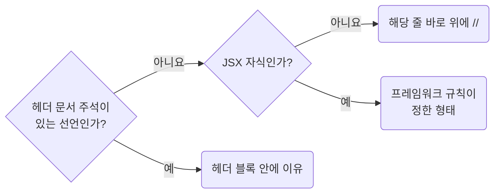

어투와 내용은 `docs-write-korean-comments-about-purpose-and-constraints`를 따릅니다.

**Incorrect 1 (확인할 수 없는 말로 예외를 정당화합니다):**

```ts
// 성능을 위해 메모이제이션
const columns = useMemo(() => {
	return toTableColumns(responseTableColumnsSuspense.data.columns);
}, [responseTableColumnsSuspense.data.columns]);
```

**Correct 1 (외부 패키지의 제약을 가리킵니다):**

```ts
// MUI Data Grid는 columns 참조가 바뀌면 열 너비나 순서를 잃을 수 있어 참조를 유지한다.
const columns = useMemo(() => {
	return toTableColumns(responseTableColumnsSuspense.data.columns);
}, [responseTableColumnsSuspense.data.columns]);
```

**Incorrect 2 (막연한 말이라 무엇을 재서 넣었는지 알 수 없습니다):**

```ts
// 안전하게 다시 계산하지 않도록
const filteredRows = useMemo(() => {
	return rows.filter((row) => matchRow(row, deferredKeyword));
}, [deferredKeyword, rows]);
```

**Correct 2 (측정 결과를 가리킵니다):**

```ts
// 행 5,000개에서 매 렌더 필터링이 120ms로 측정됐다. 지연한 검색어에만 다시 계산한다.
const filteredRows = useMemo(() => {
	return rows.filter((row) => matchRow(row, deferredKeyword));
}, [deferredKeyword, rows]);
```

## 7. Tooling

**Impact: MEDIUM**

자동 검사할 항목은 biome으로 설정하고, 도구가 판단하지 못하는 항목은 리뷰에서 확인합니다.

### 7.1 Configure Biome to Enforce the Mechanical Rules

**Rule:** `T07-01` · `tooling-configure-biome-to-enforce-these-rules`

**Applies when:** 프로젝트에 `biome` 설정을 처음 넣거나 lint 규칙을 바꿀 때. `biome.json`의 `linter.rules`에 항목을 추가, 삭제할 때.

**Impact: MEDIUM (자동 검사와 리뷰의 역할을 구분해 판단이 필요한 내용에 집중합니다)**

### 설정이 담당하는 것

기계적으로 판정할 수 있는 규칙은 아래 Biome 설정으로 검사하고, 의미 판단은 리뷰에서 확인합니다.

| Biome 규칙 | 담당 컨벤션 |
| --- | --- |
| `style/noEnum`, `style/useAsConstAssertion` | `typescript/types-replace-enum-with-as-const-objects` |
| `style/noRestrictedImports` | `typescript/naming-import-by-absolute-path`. 심볼 없는 상대경로 예외는 `./*.css` 패턴으로 근사합니다 |
| `style/useNamingConvention`, `style/useFilenamingConvention` | `typescript/naming-use-consistent-file-and-symbol-naming`의 심볼, 파일 표기 |
| `style/noParameterAssign`, `style/useConst`, `style/noNestedTernary` | `typescript/functions-avoid-imperative-assembly-in-wide-scopes`의 재할당, 중첩 삼항 제한 |
| `correctness/noUnusedFunctionParameters` | `typescript/types-mark-unused-parameters-with-underscore` |
| `complexity/useMaxParams` | `typescript/functions-use-named-object-params-for-complex-signatures`의 인자 세 개 기준 |
| `style/noMagicNumbers` | `typescript/values-declare-meaningful-numbers` |
| `suspicious/noExplicitAny`, `style/noNonNullAssertion` | `typescript/types-narrow-unknown-instead-of-asserting` |
| `plugins`의 GritQL 파일 | `typescript/absence-expose-optional-values-instead-of-silent-fallbacks`의 `??`, `\|\|` 오른쪽 리터럴 |

`typescript/naming-use-direct-imports-and-public-entry-points`의 가져오기, 이름 붙인 내보내기, 배럴 제한은
아래 규칙이 담당합니다.

- `style/useImportType`
- `style/noDefaultExport`
- `performance/noNamespaceImport`
- `performance/noBarrelFile`
- `performance/noReExportAll`

기본 매개변수와 삼항의 대체 리터럴은 GritQL 검사 밖이므로 리뷰합니다.

Biome 2.5.7의 `recommended`에는 `useConst`, `useImportType`, `noNonNullAssertion`,
`noUnusedFunctionParameters`, `noExplicitAny`가 포함됩니다. 담당 컨벤션을 드러내려고 설정에도 명시합니다.

### 리뷰가 담당하는 것

| 대상 | 도구 한계 | 처리 |
| --- | --- | --- |
| 모듈 `const`, 객체 키의 역할 | 허용된 `snake_case`는 불변 데이터 상수와 그 키에만 적용됨 | 함수, 스키마, 요청 객체와의 구분은 리뷰합니다 |
| 허용된 `PascalCase`의 용도 | 합성 컴포넌트의 `{Root, Header, Footer}`와 컴포넌트 선언 때문에 허용됨 | 일반 함수, 지역 변수의 `camelCase`는 리뷰합니다 |
| 폴더명 | 단수 `kebab-case`는 파일명 검사 대상이 아님 | 리뷰합니다 |
| `const` 화살표 선언, 이름 붙인 함수의 블록 본문 | `style/useConsistentArrowReturn`의 `style: "always"`는 예외까지 막음 | 켜지 않고 `typescript/functions-declare-functions-as-arrow-consts`를 리뷰합니다 |
| 넓은 스코프에서 `push`로 누적 | `useConst`는 재할당만 확인함 | 리뷰합니다 |
| 사용하지 않는 매개변수를 아예 생략 | 검사는 남겨 둔 매개변수만 봄 | 리뷰합니다 |
| `as`, `@ts-expect-error` | 의도를 구분하지 못함 | 위의 타입 좁히기 규칙에 따라 리뷰합니다 |
| 한 줄 문서 블록 `/** … */` | 대응 검사가 없음 | `typescript/docs-write-doc-comments-as-multiline-blocks`를 리뷰합니다 |
| `config/env.ts` 밖의 `import.meta.env`, `process.env` | 대응 검사가 없음 | `typescript/naming-read-environment-values-through-config-env`에 따라 리뷰합니다 |

`PascalCase`는 `objectLiteralProperty`, `const`, `variable`에만 허용합니다.
`import.meta.env`, `process.env`는 CI에서 문자열로 검색해도 됩니다.
`style/useConsistentArrowReturn`이 막는 것은 인라인 콜백과 커링 바깥 화살표 예외입니다.

### 설정 예외

| 설정 예외 | 적용 범위와 이유 |
| --- | --- |
| 테스트의 `noMagicNumbers` 해제 | 리터럴 자체가 기대 계약인 값에 적용합니다. 설정값끼리 비교하도록 바꾸지 않으며, 소스가 이미 이름 붙인 값은 테스트도 가져다 씁니다 |
| 도구 설정 파일의 `noDefaultExport` 해제 | `vite.config.ts`처럼 도구가 `default`를 요구하는 진입점에 적용합니다. 내보내기 규칙의 예외를 설정에 반영합니다 |
| `style/useFragmentSyntax` 비활성 | `recommended`에 없으며 별도로 켜지 않습니다. 프레임워크 규칙이 `<Fragment>`를 요구합니다 |

**Incorrect 1 (`recommended`만 켜고 컨벤션 항목을 리뷰에 맡깁니다):**

```json
{
	"linter": {
		"enabled": true,
		"rules": {"preset": "recommended"}
	}
}
```

**Correct 1 (컨벤션 항목을 설정으로 고정합니다):**

```json
{
	"linter": {
		"enabled": true,
		"rules": {
			"preset": "recommended",
			"complexity": {"useMaxParams": {"level": "error", "options": {"max": 3}}},
			"correctness": {"noUnusedFunctionParameters": "error"},
			"suspicious": {"noExplicitAny": "error"},
			"performance": {"noNamespaceImport": "error", "noBarrelFile": "error", "noReExportAll": "error"},
			"style": {
				"noDefaultExport": "error",
				"noEnum": "error",
				"noMagicNumbers": "error",
				"noNestedTernary": "error",
				"useAsConstAssertion": "error",
				"noNonNullAssertion": "error",
				"noParameterAssign": "error",
				"useConst": "error",
				"useImportType": "error",
				"useFilenamingConvention": {
					"level": "error",
					"options": {"filenameCases": ["kebab-case"]}
				},
				"noRestrictedImports": {
					"level": "error",
					"options": {
						"patterns": [
							{"group": ["../**", "./**", "!./*.css"], "message": "가져오기는 절대경로로 씁니다. 심볼 없이 파일만 불러오는 줄만 같은 폴더를 ./ 로 씁니다."}
						]
					}
				},
				"useNamingConvention": {
					"level": "error",
					"options": {
						"strictCase": false,
						"conventions": [
							{"selector": {"kind": "typeLike"}, "formats": ["PascalCase"]},
							{"selector": {"kind": "const", "scope": "global"}, "formats": ["camelCase", "PascalCase", "snake_case"]},
							{"selector": {"kind": "objectLiteralProperty"}, "formats": ["camelCase", "PascalCase", "snake_case"]},
							{"selector": {"kind": "typeProperty"}, "formats": ["camelCase"]},
							{"selector": {"kind": "variable"}, "formats": ["camelCase", "PascalCase"]}
						]
					}
				}
			}
		}
	},
	"overrides": [
		{
			"includes": ["**/*.test.ts"],
			"linter": {"rules": {"style": {"noMagicNumbers": "off"}}}
		},
		{
			"includes": ["**/*.config.ts", "**/*.config.js"],
			"linter": {"rules": {"style": {"noDefaultExport": "off"}}}
		}
	]
}
```

**Correct (`??`, `||` 오른쪽 리터럴은 GritQL 플러그인으로 잡습니다):**

```json
{
	"plugins": ["./no-literal-fallback.grit"]
}
```

```grit
language js

or {
	`$left ?? $right`,
	`$left || $right`
} where {
	$right <: or { string(), number(), `true`, `false`, `[]`, `{}` },
	register_diagnostic(span = $right, message = "??, || 오른쪽에 리터럴을 두지 않습니다. 선언된 이름을 참조합니다")
}
```

## 참고 자료

- https://www.typescriptlang.org/docs/
- https://jsdoc.app
