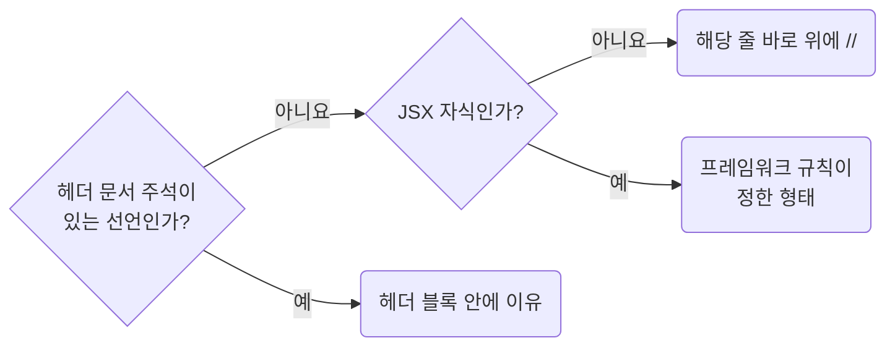

# Justify Convention Exceptions With a Checkable Reason Comment

**Impact: MEDIUM (예외가 취향인지 근거가 있는지 코드에서 바로 드러납니다)**

### 확인할 수 있는 근거

규칙이 허용한 예외에는 다른 사람이 확인할 수 있는 근거를 주석으로 남깁니다.
“성능을 위해”, “안전하게”, “필요해서”처럼 확인할 수 없는 말은 예외의 근거가 되지 않습니다.

| 근거 | 적을 내용 |
| --- | --- |
| 외부 패키지, API 제약 | 어떤 API가 무엇을 요구하는지 |
| 측정 결과 | 측정 대상과 수치 |
| 제품 명세, 티켓 | 결정이 기록된 위치 |
| 상수 | `constant` 폴더에 선언된 이름 |

### 주석 자리

이유를 적을 자리를 고르는 차례입니다.



어투와 내용은 `docs-write-korean-comments-about-purpose-and-constraints`를 따릅니다.

**Incorrect 1 (확인할 수 없는 말로 예외를 정당화합니다):**

```ts
// 성능을 위해 메모이제이션
const columns = useMemo(() => {
	return toTableColumns(responseTableColumnsSuspense.data.columns);
}, [responseTableColumnsSuspense.data.columns]);
```

**Correct 1 (외부 패키지의 제약을 가리킵니다):**

```ts
// MUI Data Grid는 columns 참조가 바뀌면 열 너비나 순서를 잃을 수 있어 참조를 유지한다.
const columns = useMemo(() => {
	return toTableColumns(responseTableColumnsSuspense.data.columns);
}, [responseTableColumnsSuspense.data.columns]);
```

> 나머지 예시와 예외는 [full rule](../rules/06-05-docs-justify-convention-exceptions-with-a-reason-comment.md)에 있습니다.
