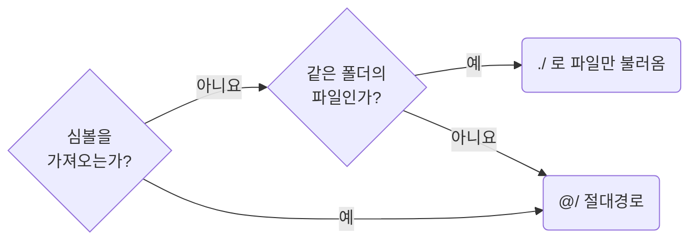

## Import by Absolute Path

**Impact: CRITICAL (가져오기 경로를 통일하고 가져오는 파일의 위치로 접근 범위를 판단합니다)**

### 경로 표기

심볼은 `@/` 절대경로로 가져옵니다. 편집기 자동 가져오기가 만드는 형식입니다.
심볼 없이 같은 폴더의 파일만 불러올 때는 `./`를 허용하며, `../`는 쓰지 않습니다.

경로 표기를 고르는 차례입니다.



이동, 이름 변경은 편집기의 경로 갱신을 사용합니다.
접근 가능한 소유 경계는 경로 표기가 아니라 가져오는 파일의 위치로 판단합니다.
가져오기 방향은 프레임워크 규칙을 따릅니다.
소유자 밖에서 쓴다는 이유로 루트에 올리지 않습니다.
배치는 `naming-place-project-constants-in-the-root-constant-folder`와
`functions-give-each-function-its-own-file`이 정합니다.

### `src` 아래 루트 폴더

| `src` 아래 루트 | 담는 것 |
| --- | --- |
| `component` | `component/ui`, `component/widget` |
| `page` | 라우트 폴더. 내부 파일은 그 라우트만, 진입 파일은 라우터만 가져옵니다 |
| `constant` | 프로젝트 전반의 상수 |
| `config` | 환경마다 달라지는 값 |
| `util` | 프로젝트 전반의 함수. 받는 값의 종류별 폴더로 묶습니다 |
| `type` | 프로젝트 전반의 계약 |
| `hook` | 여러 소유자가 쓰는 훅 |
| `store` | 여러 화면의 공유 상태. 파일명은 `use-<name>-store.ts`입니다 |
| `service` | 서버 통신 클라이언트 |
| `asset` | 아이콘 등 정적 자원 |

루트의 소유자는 프로젝트이며 `constant`, `util`, `type`, `hook`에도 소유자 아래 역할 폴더의 규칙을 적용합니다.

**Incorrect 1 (상대경로로 심볼을 가져옵니다):**

```ts
// page/detail/product-table-section/pg-product-table-section.tsx
import {PgReviewSection} from "./_pg-review-section";
import {toSummary} from "../_function/to-summary";
```

**Correct 1 (심볼은 `@/`, 같은 폴더의 CSS 파일만 `./`로 씁니다):**

```ts
// page/detail/product-table-section/pg-product-table-section.tsx
import {toSummary} from "@/page/detail/_function/to-summary";
import {PgReviewSection} from "@/page/detail/product-table-section/_pg-review-section";

import "./pg-product-table-section.css";
```
