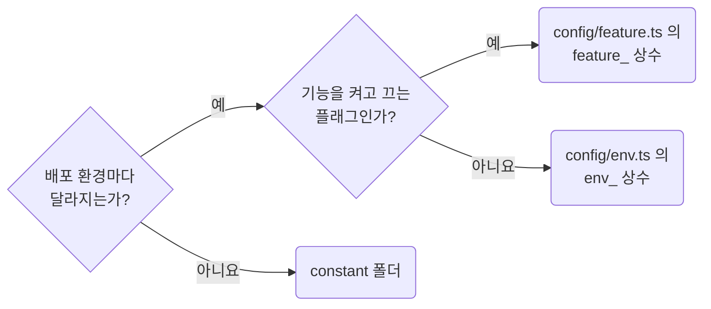

## Read Environment Values Through `config/env.ts`

**Impact: HIGH (환경마다 달라지는 값이 쓰는 파일로 흩어지지 않고 한 파일에서 읽힙니다)**

### 값의 자리

환경 값은 루트 `config/env.ts`에서만 읽고 `env_` 상수로 내보냅니다.
다른 파일은 그 이름을 쓰며 `import.meta.env`와 `process.env`를 직접 읽지 않습니다.

값이 바뀌는 때로 자리와 이름을 고르는 차례입니다.



`feature_` 상수는 `env_` 값에서 파생합니다.
배포 환경은 프로젝트 단위이므로 `config`는 루트에만 둡니다.
상수 파일과 이름의 형식은 `naming-place-project-constants-in-the-root-constant-folder`를 따릅니다.

### 읽을 때 확인할 것

| 읽을 때 확인할 것 | 처리 |
| --- | --- |
| 키가 없음 | 리터럴로 덮지 않고 `absence-expose-optional-values-instead-of-silent-fallbacks`에 따라 드러냅니다 |
| `VITE_` 등 외부 접두사 | 읽는 자리에서 내부 이름으로 바꿔 앱 안에 퍼지지 않게 합니다 |
| 비밀값 | 클라이언트에 노출되는 접두사로 읽지 않습니다. 해당 값은 브라우저에서 보입니다 |

**Incorrect 1 (쓰는 파일마다 직접 읽고 없을 때 리터럴로 덮습니다):**

```ts
// service/product-client.ts
const baseUrl = import.meta.env.VITE_API_BASE_URL ?? "http://localhost:3000";
```

```ts
// service/order-export-client.ts
// 다른 파일이 같은 키를 다시 읽고 같은 리터럴로 덮는다
const orderExportBaseUrl = import.meta.env.VITE_API_BASE_URL ?? "http://localhost:3000";
```

**Correct 1 (`config/env.ts`가 한 번 읽고 없으면 드러냅니다):**

```ts
// config/env.ts
if (!import.meta.env.VITE_API_BASE_URL) {
	throw new MissingEnvironmentValueError("VITE_API_BASE_URL");
}

/**
 * API 서버 주소. 배포 환경마다 다르다
 */
export const env_api_base_url = import.meta.env.VITE_API_BASE_URL;
```

```ts
// service/product-client.ts
import {env_api_base_url} from "@/config/env";

const productClient = createClient({baseUrl: env_api_base_url});
```
