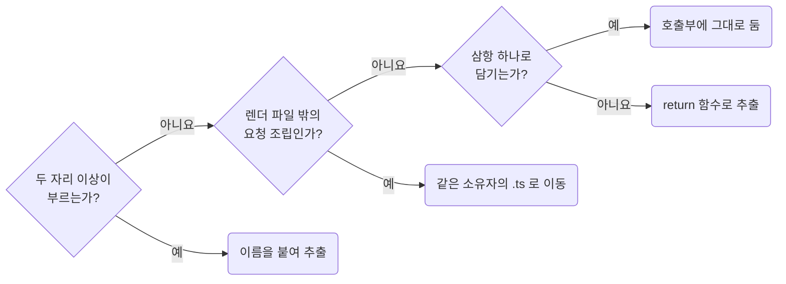

## Extract Support Functions Only When the Boundary Is Real

**Impact: HIGH (불필요한 함수 분리를 줄여 호출부에서 처리 흐름을 읽을 수 있습니다)**

### 이름을 붙이는 사유

한 곳에서만 쓰는 단계는 호출부에 둡니다.
다음 사유가 있을 때만 보조 함수에 이름을 붙입니다.
추출한 함수는 바깥 변수, 훅, 컴포넌트 상태 없이도 뜻이 통해야 합니다.

이름을 붙일지 정하는 차례입니다.



| 허용 사유 | 조건 |
| --- | --- |
| 실제 재사용 | 변경 후 코드에서 두 자리 이상이 부름. 한 줄 함수도 같음 |
| 요청 조립을 렌더 파일 밖으로 이동 | `.tsx`에서 순수 요청 · 저장 payload를 조립함. 한 곳에서만 써도 같음 |
| 함수 형태가 필수 | 삼항 하나로 표현할 수 없는 판정 · `value is T` 타입 가드 · 재귀 |

요청 조립은 같은 소유자의 `.ts`로 옮깁니다. 표시용 가공이나 기존 `.ts`는 해당하지 않습니다.

### 추출을 검토할 때

| 추출을 검토하는 이유 | 처리 |
| --- | --- |
| 한 번 쓰는 단계가 길거나 나중에 재사용할 것 같음 | 호출부에 두고 `docs-keep-body-comments-for-intent-and-steps`의 단계 주석으로 나눕니다 |
| `.map()` 콜백 하나에서만 쓰는 변환 | 그 콜백에 둡니다 |
| 값이 두 분기로 갈림 | 호출부에서 삼항 하나로 씁니다 |
| 값이 세 분기 이상으로 갈림 | 함수로 추출하고 분기마다 `return`으로 끝냅니다 |

추출 전에 값 검사를 `absence-check-once-at-the-boundary`의 경계로 보내 분기를 줄일 수 있는지 확인합니다.
같은 판정이 반복되면 `values-decide-once-and-carry-the-result`에 따라 결과를 전달할지도 먼저 봅니다.
함수 배치는 `functions-give-each-function-its-own-file`,
루트 승격은 `functions-promote-owner-free-functions-to-root-util`이 정합니다.

**Incorrect 1 (한 자리에서만 쓰는 단계를 함수로 떼어 내 흐름이 파일 안에서 흩어집니다):**

```txt
page/report/_function/to-report-content.ts
  toReportContent    내보낸 함수. 본문은 세 줄이고 나머지는 아래 함수로 갔다
  toComparisonRows   toReportContent 만 부름
  toStatusGroups     toReportContent 만 부름
  toStockCard        toReportContent 만 부름
  formatAmount       toComparisonRows 와 toStatusGroups 가 부름
```

```ts
// page/report/_function/to-report-content.ts
/**
 * 상품 보고서 영역의 표시 데이터. 상품 상세에서만 재고 카드가 온다
 */
export const toReportContent = (params: ToReportContentParams): ReportContent => {
	return {
		metrics: toComparisonRows(params),
		statusGroups: toStatusGroups(params),
		stockCount: toStockCard(params),
	};
};
```

**Correct 1 (한 번 쓰는 단계는 호출부에 두고 재사용하는 계산은 함수로 추출합니다):**

```txt
page/report/_function/to-report-content/
├── to-report-content.ts   본문 안에 // 1. 비교 행  // 2. 상태 그룹  // 3. 재고 카드
└── _format-amount.ts      비교 행과 상태 그룹 두 자리가 부름
```

```ts
// page/report/_function/to-report-content/to-report-content.ts
/**
 * 상품 보고서 영역의 표시 데이터. 상품 상세에서만 재고 카드가 온다
 */
export const toReportContent = (params: ToReportContentParams): ReportContent => {
	// 1. 고른 기간 기준으로 갱신되는 비교 수치 행
	const metrics = [
		{id: "orderAmount", label: "주문 금액", value: formatAmount(params.productSummary.orderAmount)},
		{id: "orderCount", label: "주문 건수", value: params.productSummary.orderCount},
	];

	// 2. 상품 상태 그룹. 설명이 비면 그룹 제목만 남긴다
	const statusGroups = [
		{
			id: "product-status",
			title: "상품 상태",
			description: params.productSummary.statusDescription,
			total: formatAmount(params.productSummary.totalAmount),
			rows: metrics,
		},
	];

	// 3. 재고 카드. 상품 상세에서만 온다
	return {metrics, statusGroups, stockCount: params.stockCount};
};
```

**Incorrect 2 (한 번만 쓰는 한 줄 계산을 파일로 떼어 내 호출부가 가져옵니다):**

```tsx
// page/profile/pg-profile.tsx
// (previous + 1) % pageCount 한 줄을 page/profile/_function/get-next-page.ts 로 옮겼다
import {getNextPage} from "@/page/profile/_function/get-next-page";

const handleNextClick = () => {
	setPage((previous) => getNextPage(previous, pageCount));
};
```

**Correct 2 (작은 계산은 쓰는 자리에 그대로 둡니다):**

```tsx
// page/profile/pg-profile.tsx
const handleNextClick = () => {
	setPage((previous) => (previous + 1) % pageCount);
};
```

**Correct (서로 다른 파일 둘이 이미 부르는 순수 함수를 뺍니다):**

```ts
// page/profile/_function/to-profile-save-request.ts
/**
 * profile 저장 payload 조립. 서버가 앞뒤 공백이 붙은 displayName을 거부한다
 */
export const toProfileSaveRequest = (formValues: ProfileFormValues) => {
	return {
		displayName: formValues.displayName.trim(),
	};
};
```

```tsx
// page/profile/_pg-profile-form.tsx와 page/profile/_pg-profile-drawer.tsx가 함께 부른다
import {toProfileSaveRequest} from "@/page/profile/_function/to-profile-save-request";
```

**Correct (`.tsx` 안의 순수 조립 함수는 사용처가 하나여도 같은 소유자의 `.ts`로 옮깁니다):**

```ts
// page/products/_function/to-product-save-request.ts
/**
 * product 저장 요청 조립. 업로드가 끝난 첨부만 넘겨야 attachmentIds가 채워진다
 */
export const toProductSaveRequest = (formValues: ProductFormValues) => {
	return {
		title: formValues.title.trim(),
		categoryId: formValues.categoryId,
		attachmentIds: formValues.attachments.map((attachment) => attachment.id),
	};
};
```

```tsx
// page/products/pg-products.tsx 하나만 부르지만 훅도 JSX도 쓰지 않는 계산이다
import {toProductSaveRequest} from "@/page/products/_function/to-product-save-request";
```

**Correct (삼항 하나에 담기지 않는 판정은 사용처가 하나여도 함수로 추출하고 분기마다 `return`으로 끝냅니다):**

```ts
// page/detail/_function/to-status-tone.ts
/**
 * 상태 문자열의 강조 tone. API가 상태를 자유 문자열로 주어 값 포함으로 판정한다
 */
export const toStatusTone = (status: string): Tone => {
	const normalizedStatus = status.trim().toLowerCase();
	if (status_positive_values.some((value) => normalizedStatus.includes(value))) {
		return "positive";
	}
	if (status_negative_values.some((value) => normalizedStatus.includes(value))) {
		return "negative";
	}
	return "neutral";
};
```
