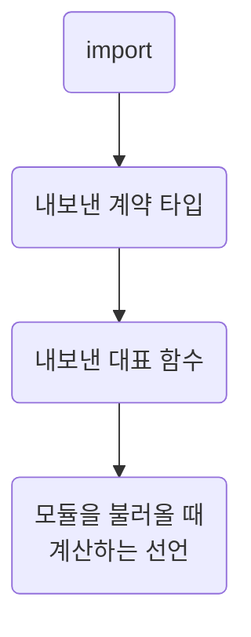

## Order Declarations Top Down

**Impact: HIGH (파일을 열면 내보낸 함수가 먼저 보이고 호출부에서 호출 대상으로 이어집니다)**

내보낸 계약과 대표 함수를 먼저 보여 주되, 모듈 초기화 시 필요한 선언 순서를 지킵니다.

파일 위에서 아래로 놓는 차례입니다.



함수 본문 참조는 호출 시점에 읽으므로 모듈 초기화가 끝난 뒤 부르면 참조 대상이 아래에 있어도 됩니다.
즉시 계산하는 선언은 자기가 부르는 선언 뒤에 둡니다.
컴포넌트 본문의 훅, 핸들러, 이펙트 순서는 프레임워크 컨벤션이 정합니다.

**Incorrect 1 (내보낸 계약 타입이 함수 아래에 있어 시그니처를 읽으려면 파일을 끝까지 내려가야 합니다):**

```ts
// page/report/_function/to-summary-rows.ts
export const toSummaryRows = (params: ToSummaryRowsParams): SummaryRow[] => {
	return params.response.items.map((item) => ({id: item.id, label: item.name.trim() || item.code}));
};

/**
 * 요약 표 행을 만들 때 필요한 입력
 */
export interface ToSummaryRowsParams {
	/**
	 * 요약 조회 응답
	 */
	response: OrderSummaryResponse;
}
```

**Correct 1 (내보낸 계약 타입이 먼저, 그 계약을 받는 함수가 바로 아래에 옵니다):**

```ts
// page/report/_function/to-summary-rows.ts
/**
 * 요약 표 행을 만들 때 필요한 입력
 */
export interface ToSummaryRowsParams {
	/**
	 * 요약 조회 응답
	 */
	response: OrderSummaryResponse;
}

/**
 * 요약 표가 그리는 행 목록. 이름이 비면 코드로 표시한다
 */
export const toSummaryRows = (params: ToSummaryRowsParams): SummaryRow[] => {
	return params.response.items.map((item) => ({id: item.id, label: item.name.trim() || item.code}));
};
```

**Incorrect 2 (모듈을 불러올 때 계산되는 선언이 자기가 부르는 선언보다 위에 있습니다):**

```ts
const selectedLocaleSupported = isSupportedLocale(selectedLocale);

/**
 * 짧고 고정된 지원 로케일 목록을 기준으로 판정한다
 */
export const isSupportedLocale = (locale: string): boolean => {
	return locale_supported_values.includes(locale);
};
```

**Correct 2 (모듈을 불러올 때 계산되는 선언은 자기가 부르는 선언 뒤에 둡니다):**

```ts
/**
 * 짧고 고정된 지원 로케일 목록을 기준으로 판정한다
 */
export const isSupportedLocale = (locale: string): boolean => {
	return locale_supported_values.includes(locale);
};

const selectedLocaleSupported = isSupportedLocale(selectedLocale);
```
