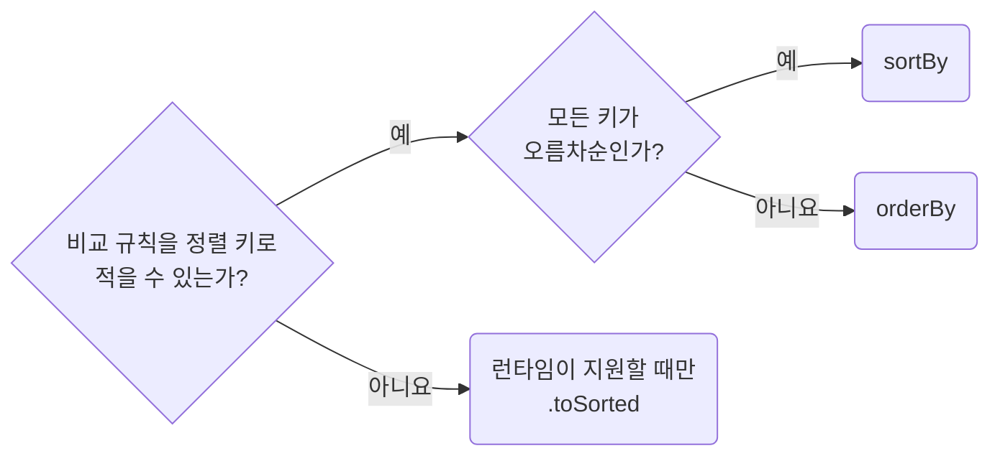

## Prefer Immutable Array Sorting

**Impact: HIGH (프롭스, 상태, 모듈 상수에서 온 배열을 정렬할 때 원본이 바뀌는 버그를 피합니다)**

정렬은 새 배열을 반환하는 `es-toolkit` 함수로 합니다. 원본을 바꾸는 `.sort()`는 쓰지 않습니다.
프롭스, 상태, 매개변수, 모듈 상수로 받은 배열도 같은 기준을 따릅니다.

정렬 함수를 고르는 차례입니다.



`localeCompare`가 정렬 키로 적을 수 없는 비교 규칙입니다.
같은 키의 항목도 입력 순서와 무관하게 정렬해야 하면 고유 식별자를 마지막 정렬 키로 더합니다.
새 배열도 원소 객체는 공유하므로 정렬 키를 계산하면서 원소를 수정하지 않습니다.
입력을 수정하지 않는 정렬 함수는 `readonly` 배열을 매개변수로 받습니다.
`.toSorted()`의 타입 선언만 추가해도 런타임 지원이 생기지는 않습니다.

**Incorrect 1 (매개변수로 받은 배열을 제자리에서 바꿉니다):**

```ts
const toSortedUsers = (users: User[]): User[] => {
	return users.sort((left, right) => left.age - right.age);
};
```

**Correct 1 (키 기준 정렬은 `sortBy`를 씁니다):**

```ts
import {sortBy} from "es-toolkit";

const toSortedUsers = (users: readonly User[]): User[] => {
	return sortBy(users, ["age"]);
};
```

**Correct (방향이 섞이면 `orderBy`를 씁니다):**

```ts
import {orderBy} from "es-toolkit";

const toSortedProducts = (products: readonly Product[]): Product[] => {
	return orderBy(products, ["category", "price"], ["asc", "desc"]);
};
```

**Correct (비교 규칙을 키로 적을 수 없으면 `.toSorted()`를 씁니다):**

```ts
const toSortedUsers = (users: readonly User[]): User[] => {
	return users.toSorted((left, right) => left.name.localeCompare(right.name));
};
```
